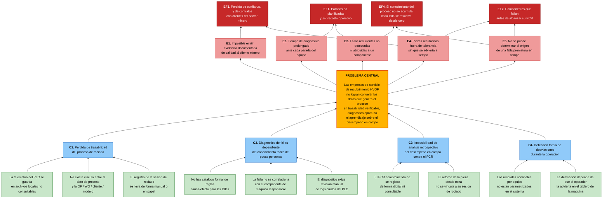



 

# UNIVERSIDAD PERUANA DE CIENCIAS APLICADAS
**Facultad de Ingeniería**  
***Carrera de Ingeniería de Software***  
*5to ciclo*  
**1ASI0730**  
**Desarrollo de Aplicaciones Open Source**  
NRC: 16712  
Docente: Sanchez Seña, Alberto Wilmer
## **"Informe del Trabajo Final"**
#### *WebRunners*
#### *EdgeWatch*

**Integrantes**

| Código     | Apellidos         | Nombres          |
|------------|-------------------|------------------| 
| u20241b962 | Navarro Aldoradin | Carolina Celeste |
|            |                   |                  |
|            |                   |                  |
|            |                   |                  |
|            |                   |                  |

*Setiembre, 2026*

# Registro de Versiones del Informe
| Versión | Fecha | Autor | Descripción de modificación |
|---------|-------|-------|-----------------------------|
|         |       |       |                             |

# Project Report Collaboration Insights

El URL del repositorio para el Project Report en la organización de github es el siguiente:
[https://github.com/upc-pre-202620-1asi0729-7753-innovacorp/reliant-report](https://github.com/upc-pre-202620-1asi0729-7753-innovacorp/reliant-report)

# Contenido
- [Registro de Versiones del Informe](#registro-de-versiones-del-informe)
- [Project Report Collaboration Insights](#project-report-collaboration-insights)
- [Contenido](#contenido)
- [Student Outcome](#student-outcome)
- [Capítulo I: Introducción](#capítulo-i-introducción)
- [1.1. Startup Profile](#11-startup-profile)
- [1.1.1. Descripción de la Startup](#111-descripción-de-la-startup)
- [1.1.2. Perfiles de integrantes del equipo](#112-perfiles-de-integrantes-del-equipo)
- [1.2. Solution Profile](#12-solution-profile)
- [1.2.1 Antecedentes y problemática](#121-antecedentes-y-problemática)
- [1.2.2 Lean UX Process.](#122-lean-ux-process)
- [1.2.2.1. Lean UX Problem Statements.](#1221-lean-ux-problem-statements)
- [1.2.2.2. Lean UX Assumptions.](#1222-lean-ux-assumptions)
- [1.2.2.3. Lean UX Hypothesis Statements.](#1223-lean-ux-hypothesis-statements)
- [1.2.2.4. Lean UX Canvas.](#1224-lean-ux-canvas)
- [1.3. Segmentos objetivo.](#13-segmentos-objetivo)

- [Capítulo II: Requirements Elicitation & Analysis](#capítulo-ii-requirements-elicitation--analysis)
- [2.1. Competidores.](#21-competidores)
- [2.1.1. Análisis competitivo.](#211-análisis-competitivo)
- [2.1.2. Estrategias y tácticas frente a competidores.](#212-estrategias-y-tácticas-frente-a-competidores)
- [2.2. Entrevistas.](#22-entrevistas)
- [2.2.1. Diseño de entrevistas.](#221-diseño-de-entrevistas)
- [2.2.2. Registro de entrevistas.](#222-registro-de-entrevistas)
- [2.2.3. Análisis de entrevistas.](#223-análisis-de-entrevistas)
- [2.3. Needfinding.](#23-needfinding)
- [2.3.1. User Personas.](#231-user-personas)
- [2.3.2. User Task Matrix.](#232-user-task-matrix)
- [2.3.3. User Journey Mapping.](#233-user-journey-mapping)
- [2.3.4. Empathy Mapping.](#234-empathy-mapping)
- [2.4. Big Picture Event Storming.](#24-big-picture-event-storming)
- [2.5. Ubiquitous Language.](#25-ubiquitous-language)

- [Capítulo III: Requirements Specification](#capítulo-iii-requirements-specification)
- [3.1. User Stories.](#31-user-stories)
- [3.2. Impact Mapping.](#32-impact-mapping)
- [3.3. Product Backlog](#33-product-backlog)

- [Capítulo IV: Product Design](#capítulo-iv-product-design)
- [4.1. Style Guidelines.](#41-style-guidelines)
- [4.1.1. General Style Guidelines.](#411-general-style-guidelines)
- [4.1.2. Web Style Guidelines.](#412-web-style-guidelines)
- [4.2. Information Architecture.](#42-information-architecture)
- [4.2.1. Organization Systems. ](#421-organization-systems)
- [4.2.2. Labeling Systems.](#422-labeling-systems)
- [4.2.3. SEO Tags and Meta Tags](#423-seo-tags-and-meta-tags)
- [4.2.4. Searching Systems.](#424-searching-systems)
- [4.2.5. Navigation Systems.](#425-navigation-systems)
- [4.3. Landing Page UI Design.](#43-landing-page-ui-design)
- [4.3.1. Landing Page Wireframe.](#431-landing-page-wireframe)
- [4.3.2. Landing Page Mock-up.](#432-landing-page-mock-up)
- [4.4. Web Applications UX/UI Design.](#44-web-applications-uxui-design)
- [4.4.1. Web Applications Wireframes.](#441-web-applications-wireframes)
- [4.4.2. Web Applications Wireflow Diagrams.](#442-web-applications-wireflow-diagrams)
- [4.4.2. Web Applications Mock-ups.](#442-web-applications-mock-ups)
- [4.4.3. Web Applications User Flow Diagrams.](#443-web-applications-user-flow-diagrams)
- [4.5. Web Applications Prototyping.](#45-web-applications-prototyping)
- [4.6. Domain-Driven Software Architecture.](#46-domain-driven-software-architecture)
- [4.6.1. Design-Level Event Storming.](#461-design-level-event-storming)
- [4.6.2. Software Architecture Context Diagram.](#462-software-architecture-context-diagram)
- [4.6.3. Software Architecture Container Diagrams.](#463-software-architecture-container-diagrams)
- [4.6.4. Software Architecture Components Diagrams.](#464-software-architecture-components-diagrams)
- [4.7. Software Object-Oriented Design.](#47-software-object-oriented-design)
- [4.7.1. Class Diagrams.](#471-class-diagrams)
- [4.8. Database Design.](#48-database-design)
- [4.8.1. Database Diagrams.](#481-database-diagrams)
- [Capítulo V: Product Implementation, Validation & Deployment](#capítulo-v-product-implementation-validation--deployment)
- [5.1. Software Configuration Management.](#51-software-configuration-management)
- [5.1.1. Software Development Environment Configuration.](#511-software-development-environment-configuration)
- [5.1.2. Source Code Management.](#512-source-code-management)
- [5.1.3. Source Code Style Guide & Conventions.](#513-source-code-style-guide--conventions)
- [5.1.4. Software Deployment Configuration.](#514-software-deployment-configuration)
- [5.2. Landing Page, Services & Applications Implementation.](#52-landing-page-services--applications-implementation)
- [5.2.X. Sprint n](#52x-sprint-n)
- [5.2.X.1. Sprint Planning n.](#52x1-sprint-planning-n)
- [5.2.X.2. Aspect Leaders and Collaborators.](#52x2-aspect-leaders-and-collaborators)
- [5.2.X.3. Sprint Backlog n.](#52x3-sprint-backlog-n)
- [5.2.X.4. Development Evidence for Sprint Review.](#52x4-development-evidence-for-sprint-review)
- [5.2.X.5. Execution Evidence for Sprint Review.](#52x5-execution-evidence-for-sprint-review)
- [5.2.X.6. Services Documentation Evidence for Sprint Review.](#52x6-services-documentation-evidence-for-sprint-review)
- [5.2.X.7. Software Deployment Evidence for Sprint Review.](#52x7-software-deployment-evidence-for-sprint-review)
- [5.2.X.8. Team Collaboration Insights during Sprint.](#52x8-team-collaboration-insights-during-sprint)
- [5.3. Validation Interviews.](#53-validation-interviews)
- [5.3.1. Diseño de Entrevistas.](#531-diseño-de-entrevistas)
- [5.3.2. Registro de Entrevistas.](#532-registro-de-entrevistas)
- [5.3.3. Evaluaciones según heurísticas.](#533-evaluaciones-según-heurísticas)
- [5.4. Video About-the-Product.](#54-video-about-the-product)
- [Conclusiones](#conclusiones)
- [Conclusiones y recomendaciones.](#conclusiones-y-recomendaciones)
- [Video About-the-Team.](#video-about-the-team)
- [Bibliografía](#bibliografía)
- [Anexos](#anexos)

# Student Outcome

# Capítulo I: Introducción
## 1.1. Startup Profile
### 1.1.1. Descripción de la Startup
**WebRunners** es una startup tecnológica peruana enfocada en resolver problemas de grandes organizaciones, especialmente del sector Minero e Industrial, de manera ágil e innovadora. Nace de la experiencia directa en planta, donde identificamos que procesos críticos de alta especialización siguen operando con información dispersa, registros manuales y diagnósticos que dependen del conocimiento tácito de pocas personas. Combinamos conocimiento de procesos industriales con desarrollo de software moderno para convertir datos que hoy se pierden en decisiones que evitan fallas y paradas no programadas.

*Misión*
Nuestra misión es brindar a las empresas del sector minero e industrial soluciones tecnológicas que transformen los datos de sus procesos productivos en información accionable, permitiéndoles anticipar fallas, garantizar la trazabilidad de sus operaciones y sostener con evidencia la calidad que sus clientes exigen. Buscamos que ninguna organización dependa del conocimiento tácito ni de registros manuales para tomar decisiones críticas sobre sus procesos.

*Visión*
Ser la plataforma de referencia en Latinoamérica para el monitoreo y la trazabilidad de procesos industriales de alta especialización, reconocida por acercar la analítica de datos a operaciones que históricamente han quedado fuera de la transformación digital, y por convertir cada proceso ejecutado en conocimiento que mejora el siguiente.

### 1.1.2. Perfiles de integrantes del equipo
| Foto de participante                                                    | Nombres y apellidos                | Código de estudiante  | Descripción de carrera                                            | Principales conocimiento técnicos y habilidades                                                                                                                                           |
|:------------------------------------------------------------------------|------------------------------------|-----------------------|-------------------------------------------------------------------|-------------------------------------------------------------------------------------------------------------------------------------------------------------------------------------------|
|   | Carolina Celeste Navarro Aldoradin | u20241b962            | Ingeniería de Software, Universidad Peruana de Ciencias Aplicadas | Cuento con conocimiento del lenguaje Java, C#, C++, Javascript, Python y Ladder. Asimismo, cuento con experiencia en proyectos de integración, monitoreo e IoT en entornos industriales.  |
|                                                                         |                                    |                       |                                                                   |                                                                                                                                                                                           |

## 1.2. Solution Profile

### 1.2.1 Antecedentes y problemática
La minería constituye el principal motor exportador de la economía peruana. Según el Boletín Estadístico Minero del Ministerio de Energía y Minas, las exportaciones de productos mineros totalizaron US$ 62,848 millones durante 2025, un crecimiento de 27.2 % respecto al año anterior, y representaron alrededor del 67.5 % del valor total exportado por el país. Esta magnitud implica que cualquier interrupción en la cadena de operación minera tiene un impacto directo sobre la economía nacional.

Para sostener esa operación, las mineras dependen de componentes sometidos a desgaste abrasivo severo: ejes de bombas de lodo, rodillos, válvulas e impulsores. Una de las tecnologías más empleadas para extender la vida útil de estas piezas es el recubrimiento por proyección térmica de alta velocidad (HVOF, High Velocity Oxygen Fuel), que deposita capas metálicas de alta densidad y resistencia al desgaste. En el Perú, este servicio no lo ejecuta la minera directamente, sino empresas especializadas que operan como proveedores del sector.

La calidad del recubrimiento depende críticamente de los parámetros de proceso. Khan, Shah y Shamim (2019) establecieron que la calidad del recubrimiento HVOF depende en gran medida de las condiciones operativas seleccionadas durante la aplicación, y estudios posteriores confirman que variables como la tasa de alimentación de polvo, la distancia de proyección, la relación combustible-oxígeno y el flujo total de gases inciden directamente sobre propiedades clave como porosidad, dureza y resistencia al desgaste. Fabricantes de equipos advierten que estas variables deben tratarse como parámetros de proceso con valores y tolerancias formalmente definidos, ya que sin ese control la calidad del recubrimiento puede verse afectada de formas inesperadas y costosas.

Pese a ello, el monitoreo en tiempo real del proceso sigue siendo un desafío técnico. Malamousi, Delibasis y Kamnis (2024) señalan que la proyección térmica es difícil de monitorear en tiempo real debido a las altas velocidades y temperaturas involucradas y al movimiento continuo de la pistola o de la pieza, y que los equipos de monitoreo estáticos existentes no logran seguir la antorcha, lo que dificulta asegurar parámetros óptimos de proceso. En paralelo, la literatura reciente sobre Industria 4.0 aplicada a proyección térmica plantea la necesidad de implementar un control de proceso más inteligente que integre datos de sensores con parámetros de máquina, características del material de aporte y métricas de calidad posteriores a la deposición, para cumplir requisitos de confiabilidad y repetibilidad.

En el contexto peruano, las empresas de servicio de recubrimiento HVOF enfrentan tres problemas concurrentes.

Primero, pérdida de trazabilidad del proceso. Los parámetros de operación se generan en el PLC de la máquina, pero se conservan en registros locales o en formatos no consultables. Cuando el cliente exige evidencia de que un lote fue recubierto dentro de tolerancias, la empresa carece de un respaldo estructurado que vincule la orden de fabricación (OF) y la orden de trabajo (WO) con las condiciones reales de la sesión de rociado. Esta dependencia de registros dispersos es un problema documentado en la industria: los procesos basados en papel introducen riesgos de lectura errónea, registro inconsistente e información fragmentada, que retrasan la detección y resolución de incidencias.

Segundo, diagnóstico de fallas dependiente de conocimiento tácito. Cuando el equipo se detiene por una falla, como bloqueo del alimentador, sobrepresión de tolva, paro por temporizador, la identificación de la causa raíz depende de la experiencia de pocos técnicos y de la revisión manual de registros crudos. No existe un mecanismo que correlacione automáticamente la falla con el componente de máquina responsable, lo que prolonga el tiempo de diagnóstico y dificulta detectar patrones recurrentes.

Tercero, imposibilidad de análisis retrospectivo contra el PCR. Las piezas recubiertas se entregan con una expectativa de vida útil formalizada en el Planned Component Replacement (PCR). Cuando una pieza retorna del campo antes de alcanzar ese objetivo, no es posible reconstruir con qué parámetros fue recubierta ni determinar si la falla prematura tuvo origen en el proceso de recubrimiento, en el material, o en las condiciones de operación en mina.

El costo de esta brecha de información es significativo. El reporte True Cost of Downtime de Siemens estima que las 500 mayores empresas del mundo pierden alrededor del 11 % de sus ingresos por paradas no planificadas, equivalente a USD 1.4 billones anuales, y la falla de componentes críticos representa el 45 % de los casos reportados de downtime. En el sector minero específicamente, estimaciones de la industria sitúan el costo promedio de una parada de equipo en torno a US$ 180,000 por incidente.

En síntesis, existe una desconexión entre los datos que la máquina HVOF ya genera y la capacidad de la organización para convertirlos en trazabilidad verificable, diagnóstico oportuno y aprendizaje sobre el desempeño en campo. Reliant se propone cerrar esa brecha mediante una plataforma que capture la telemetría del proceso, la vincule a la orden de trabajo y a la pieza del cliente, correlacione las fallas con el componente de máquina implicado, y permita contrastar el desempeño real en operación contra el PCR comprometido.

A continuación, se muestra un árbol de problemas que ordena visualmente las causas y efectos del problema mencionados anteriormente.

### 1.2.2 Lean UX Process.

El Lean UX Process permite a WebRunners validar de forma temprana las creencias que sustentan EdgeWatch, evitando construir funcionalidad sobre supuestos no verificados. El proceso parte de un enunciado único del problema para todo el proyecto, del cual se derivan los assumptions organizados en cinco categorías, y de estos, específicamente de los feature assumptions, se formulan los hypothesis statements que el equipo someterá a validación durante los sprints. Se aplica la versión del template Brand new initiative, dado que EdgeWatch no constituye la evolución de un producto existente sino una iniciativa nueva.

#### 1.2.2.1. Lean UX Problem Statements.

Siguiendo la indicación del enunciado, se elabora un único Problem Statement para todo el proyecto, considerando en él ambos segmentos objetivo.

***The current state of*** *the industrial thermal spray coating market (HVOF) has focused mainly on delivering the coating as a physical service to mining and heavy-industry clients, on operator expertise as the primary mechanism for detecting process deviations, and on workflows where process parameters generated by the machine PLC remain in local logs that are never linked to the work order, the client component, or its expected service life.*

***What existing products/services fail to address is*** *the gap between the telemetry the HVOF equipment already produces and the organization's ability to turn it into verifiable traceability, timely fault diagnosis pointing to a specific machine part, and retrospective learning about how coated components actually perform in the field against their Planned Component Replacement (PCR) target.*

***Our product/service will address this gap by*** *providing a web platform that ingests spray process telemetry in real time through a RESTful API, links every spray session to its manufacturing order (OF), work order (WO), client and component model, raises alerts when parameters fall outside the equipment's nominal ranges, applies a configurable cause-effect rule catalog to identify the suspect machine part, and records field service life to compare actual performance against the committed PCR.*

***Our initial focus will be*** *specialized HVOF coating service providers operating in Peru that serve mining clients and are required to demonstrate process quality, and secondarily industrial plants that operate an in-house thermal spray line.*

***We'll know we are successful when we see*** *coating service providers issuing quality evidence generated by the platform for at least 80% of their delivered work orders, a reduction of at least 40% in the time required to determine the probable cause of an equipment stoppage, and at least 60% of returned components having their field service life recorded and compared against their PCR target within the platform.*

#### 1.2.2.2. Lean UX Assumptions.

A continuación se enumeran las creencias resultantes de la sesión de discusión del equipo, organizadas según los cinco tipos de assumptions establecidos en Lean UX. Estos enunciados constituyen creencias, no preguntas de discusión.

**Business Assumptions**

1. Creemos que existe en el Perú un número suficiente de empresas de servicio especializado en recubrimiento HVOF y de plantas industriales con línea propia como para sostener un modelo de suscripción B2B.
2. Creemos que la presión por trazabilidad proviene del cliente final (minera) y se transfiere contractualmente al proveedor de recubrimiento, lo que convierte la evidencia de proceso en un requisito comercial y no en una mejora opcional.
3. Creemos que las empresas del segmento están dispuestas a pagar una suscripción mensual por equipo monitoreado, siempre que el costo sea marginal frente al costo de una parada no planificada.
4. Creemos que WebRunners puede construir y operar la plataforma con tecnologías open source (Spring Boot, Angular, PostgreSQL) sin incurrir en costos de licenciamiento que comprometan el margen.
5. Creemos que la integración con el equipo HVOF puede realizarse mediante un gateway que exponga la telemetría vía API REST, sin requerir modificar el PLC ni el software del fabricante del equipo.
6. Creemos que el conocimiento del dominio industrial que posee el equipo constituye una barrera de entrada frente a competidores de software genérico de mantenimiento.

**Business Outcome Assumptions**
1. Creemos que el éxito se evidenciará en la cantidad de órdenes de trabajo cerradas en la plataforma con certificado de calidad emitido.
2. Creemos que el éxito se evidenciará en la reducción del tiempo promedio entre la ocurrencia de una falla y la identificación de su causa probable.
3. Creemos que el éxito se evidenciará en la tasa de renovación de la suscripción al término del primer año.
4. Creemos que el éxito se evidenciará en el número de componentes retornados de campo cuyo desempeño real fue registrado y contrastado contra su PCR.
5. Creemos que el éxito se evidenciará en la cantidad de sesiones de rociado registradas por mes y por equipo, como indicador de adopción sostenida.
6. Creemos que el éxito se evidenciará en la reducción del número de reclamos de clientes por fallas prematuras que no pudieron ser explicadas.

### 1.2.2.3. Lean UX Hypothesis Statements.
### 1.2.2.4. Lean UX Canvas.
## 1.3. Segmentos objetivo.

# Capítulo II: Requirements Elicitation & Analysis
## 2.1. Competidores.
### 2.1.1. Análisis competitivo.
### 2.1.2. Estrategias y tácticas frente a competidores.
## 2.2. Entrevistas.
### 2.2.1. Diseño de entrevistas.
### 2.2.2. Registro de entrevistas.
### 2.2.3. Análisis de entrevistas.
## 2.3. Needfinding.
### 2.3.1. User Personas.
### 2.3.2. User Task Matrix.
### 2.3.3. User Journey Mapping.
### 2.3.4. Empathy Mapping.
## 2.4. Big Picture Event Storming.
## 2.5. Ubiquitous Language.

# Capítulo III: Requirements Specification
## 3.1. User Stories.
## 3.2. Impact Mapping.
## 3.3. Product Backlog

# Capítulo IV: Product Design
## 4.1. Style Guidelines.
### 4.1.1. General Style Guidelines.
### 4.1.2. Web Style Guidelines.
## 4.2. Information Architecture.
### 4.2.1. Organization Systems.
### 4.2.2. Labeling Systems.
### 4.2.3. SEO Tags and Meta Tags
### 4.2.4. Searching Systems.
### 4.2.5. Navigation Systems.
## 4.3. Landing Page UI Design.
### 4.3.1. Landing Page Wireframe.
### 4.3.2. Landing Page Mock-up.
## 4.4. Web Applications UX/UI Design.
### 4.4.1. Web Applications Wireframes.
### 4.4.2. Web Applications Wireflow Diagrams.
### 4.4.2. Web Applications Mock-ups.
### 4.4.3. Web Applications User Flow Diagrams.
## 4.5. Web Applications Prototyping.
## 4.6. Domain-Driven Software Architecture.
### 4.6.1. Design-Level Event Storming.
### 4.6.2. Software Architecture Context Diagram.
### 4.6.3. Software Architecture Container Diagrams.
### 4.6.4. Software Architecture Components Diagrams.
## 4.7. Software Object-Oriented Design.
### 4.7.1. Class Diagrams.
## 4.8. Database Design.
### 4.8.1. Database Diagrams.

# Capítulo V: Product Implementation, Validation & Deployment
## 5.1. Software Configuration Management.
### 5.1.1. Software Development Environment Configuration.
### 5.1.2. Source Code Management.
### 5.1.3. Source Code Style Guide & Conventions.
### 5.1.4. Software Deployment Configuration.
## 5.2. Landing Page, Services & Applications Implementation.
### 5.2.X. Sprint n
#### 5.2.X.1. Sprint Planning n.
#### 5.2.X.2. Aspect Leaders and Collaborators.
#### 5.2.X.3. Sprint Backlog n.
#### 5.2.X.4. Development Evidence for Sprint Review.
#### 5.2.X.5. Execution Evidence for Sprint Review.
#### 5.2.X.6. Services Documentation Evidence for Sprint Review.
#### 5.2.X.7. Software Deployment Evidence for Sprint Review.
#### 5.2.X.8. Team Collaboration Insights during Sprint.
## 5.3. Validation Interviews.
### 5.3.1. Diseño de Entrevistas.
### 5.3.2. Registro de Entrevistas.
### 5.3.3. Evaluaciones según heurísticas.
## 5.4. Video About-the-Product.
# Conclusiones
## Conclusiones y recomendaciones.
## Video About-the-Team.

# Bibliografía
- Automation World. (2025). *How to solve the hidden risks of paper manufacturing on the factory floor*. https://www.automationworld.com/control/article/55378030/how-to-solve-the-hidden-risks-of-paper-manufacturing-on-the-factory-floor

- Innovapptive. (2024, 26 de febrero). *Overcoming equipment maintenance challenges in mining industry*. https://www.innovapptive.com/blog/overcoming-equipment-maintenance-challenges-in-mining-industry

- Khan, M. N., Shah, S., & Shamim, T. (2019). *Investigation of operating parameters on high-velocity oxyfuel thermal spray coating quality for aerospace applications. The International Journal of Advanced Manufacturing Technology*, 103, 2677–2690. https://doi.org/10.1007/s00170-019-03696-0

- Malamousi, K., Delibasis, K., & Kamnis, S. (2024). Real-time thermal spray process monitoring using convolution neural network deep learning architectures. *Journal of Thermal Spray Technology*, 33(1), 17–32. https://doi.org/10.1007/s11666-024-01713-7

- Mauer, G. (2022). Process diagnostics and control in thermal spray. *Journal of Thermal Spray Technology*, 31(4), 818–828.

- Ministerio de Energía y Minas. (2026). *Boletín Estadístico Minero: Balance anual 2025*. [Citado en Revista Tecnología Minera]. https://tecnologiaminera.com/noticia/minem-peru-alcanza-us-62848-millones-en-exportaciones-en-2025-1774388279

- Oerlikon Metco. (2025). *Thermal spray process parameters*. https://www.oerlikon.com/metco/en/solutions-technologies/what-is-thermal-spray/thermal-spray-process-parameters/

- Siemens. (2022). *The true cost of downtime 2022*. https://assets.new.siemens.com/siemens/assets/api/uuid:3d606495-dbe0-43e4-80b1-d04e27ada920/dics-b10153-00-7600truecostofdowntime2022-144.pdf

- Springer Nature. (2025). Outlook of Industry 4.0 integrated technologies in thermal spray processes and applications. *Journal of Thermal Spray Technology*. https://doi.org/10.1007/s11666-025-02096-z

# Anexos