<div align="center">
 

# UNIVERSIDAD PERUANA DE CIENCIAS APLICADAS
**Facultad de Ingeniería**  
***Carrera de Ingeniería de Software***  
*5to ciclo*  
**1ASI0730**  
**Desarrollo de Aplicaciones Open Source**  
NRC: 16712  
Docente: Sanchez Seña, Alberto Wilmer
## **"Informe del Trabajo Final"**
#### *WebRunners*
#### *EdgeWatch*

**Integrantes**

| Código     | Apellidos         | Nombres          |
|------------|-------------------|------------------| 
| u20241b962 | Navarro Aldoradin | Carolina Celeste |
| u202315628 |    Alvarez Falen  | Esteban Valentino|
|            |                   |                  |
|            |                   |                  |
|            |                   |                  |


*Setiembre, 2026*

</div>


<div style="page-break-after: always"></div>

# Registro de Versiones del Informe
| Versión | Fecha | Autor | Descripción de modificación |
|---------|-------|-------|-----------------------------|
|         |       |       |                             |


# Project Report Collaboration Insights

El URL del repositorio para el Project Report en la organización de github es el siguiente:
[https://github.com/upc-pre-202620-1asi0730-16712-wrunners/edgewatch-report](https://github.com/upc-pre-202620-1asi0730-16712-wrunners/edgewatch-report)

# Contenido
- [Registro de Versiones del Informe](#registro-de-versiones-del-informe)
- [Project Report Collaboration Insights](#project-report-collaboration-insights)
- [Contenido](#contenido)
- [Student Outcome](#student-outcome)
- [Capítulo I: Introducción](#capítulo-i-introducción)
- [1.1. Startup Profile](#11-startup-profile)
- [1.1.1. Descripción de la Startup](#111-descripción-de-la-startup)
- [1.1.2. Perfiles de integrantes del equipo](#112-perfiles-de-integrantes-del-equipo)
- [1.2. Solution Profile](#12-solution-profile)
- [1.2.1 Antecedentes y problemática](#121-antecedentes-y-problemática)
- [1.2.2 Lean UX Process.](#122-lean-ux-process)
- [1.2.2.1. Lean UX Problem Statements.](#1221-lean-ux-problem-statements)
- [1.2.2.2. Lean UX Assumptions.](#1222-lean-ux-assumptions)
- [1.2.2.3. Lean UX Hypothesis Statements.](#1223-lean-ux-hypothesis-statements)
- [1.2.2.4. Lean UX Canvas.](#1224-lean-ux-canvas)
- [1.3. Segmentos objetivo.](#13-segmentos-objetivo)

- [Capítulo II: Requirements Elicitation & Analysis](#capítulo-ii-requirements-elicitation--analysis)
- [2.1. Competidores.](#21-competidores)
- [2.1.1. Análisis competitivo.](#211-análisis-competitivo)
- [2.1.2. Estrategias y tácticas frente a competidores.](#212-estrategias-y-tácticas-frente-a-competidores)
- [2.2. Entrevistas.](#22-entrevistas)
- [2.2.1. Diseño de entrevistas.](#221-diseño-de-entrevistas)
- [2.2.2. Registro de entrevistas.](#222-registro-de-entrevistas)
- [2.2.3. Análisis de entrevistas.](#223-análisis-de-entrevistas)
- [2.3. Needfinding.](#23-needfinding)
- [2.3.1. User Personas.](#231-user-personas)
- [2.3.2. User Task Matrix.](#232-user-task-matrix)
- [2.3.3. User Journey Mapping.](#233-user-journey-mapping)
- [2.3.4. Empathy Mapping.](#234-empathy-mapping)
- [2.4. Big Picture Event Storming.](#24-big-picture-event-storming)
- [2.5. Ubiquitous Language.](#25-ubiquitous-language)

- [Capítulo III: Requirements Specification](#capítulo-iii-requirements-specification)
- [3.1. User Stories.](#31-user-stories)
- [3.2. Impact Mapping.](#32-impact-mapping)
- [3.3. Product Backlog](#33-product-backlog)

- [Capítulo IV: Product Design](#capítulo-iv-product-design)
- [4.1. Style Guidelines.](#41-style-guidelines)
- [4.1.1. General Style Guidelines.](#411-general-style-guidelines)
- [4.1.2. Web Style Guidelines.](#412-web-style-guidelines)
- [4.2. Information Architecture.](#42-information-architecture)
- [4.2.1. Organization Systems. ](#421-organization-systems)
- [4.2.2. Labeling Systems.](#422-labeling-systems)
- [4.2.3. SEO Tags and Meta Tags](#423-seo-tags-and-meta-tags)
- [4.2.4. Searching Systems.](#424-searching-systems)
- [4.2.5. Navigation Systems.](#425-navigation-systems)
- [4.3. Landing Page UI Design.](#43-landing-page-ui-design)
- [4.3.1. Landing Page Wireframe.](#431-landing-page-wireframe)
- [4.3.2. Landing Page Mock-up.](#432-landing-page-mock-up)
- [4.4. Web Applications UX/UI Design.](#44-web-applications-uxui-design)
- [4.4.1. Web Applications Wireframes.](#441-web-applications-wireframes)
- [4.4.2. Web Applications Wireflow Diagrams.](#442-web-applications-wireflow-diagrams)
- [4.4.3. Web Applications Mock-ups.](#443-web-applications-mock-ups)
- [4.4.4. Web Applications User Flow Diagrams.](#444-web-applications-user-flow-diagrams)
- [4.5. Web Applications Prototyping.](#45-web-applications-prototyping)
- [4.6. Domain-Driven Software Architecture.](#46-domain-driven-software-architecture)
- [4.6.1. Design-Level Event Storming.](#461-design-level-event-storming)
- [4.6.2. Software Architecture Context Diagram.](#462-software-architecture-context-diagram)
- [4.6.3. Software Architecture Container Diagrams.](#463-software-architecture-container-diagrams)
- [4.6.4. Software Architecture Components Diagrams.](#464-software-architecture-components-diagrams)
- [4.7. Software Object-Oriented Design.](#47-software-object-oriented-design)
- [4.7.1. Class Diagrams.](#471-class-diagrams)
- [4.8. Database Design.](#48-database-design)
- [4.8.1. Database Diagrams.](#481-database-diagrams)
- [Capítulo V: Product Implementation, Validation & Deployment](#capítulo-v-product-implementation-validation--deployment)
- [5.1. Software Configuration Management.](#51-software-configuration-management)
- [5.1.1. Software Development Environment Configuration.](#511-software-development-environment-configuration)
- [5.1.2. Source Code Management.](#512-source-code-management)
- [5.1.3. Source Code Style Guide & Conventions.](#513-source-code-style-guide--conventions)
- [5.1.4. Software Deployment Configuration.](#514-software-deployment-configuration)
- [5.2. Landing Page, Services & Applications Implementation.](#52-landing-page-services--applications-implementation)
- [5.2.X. Sprint n](#52x-sprint-n)
- [5.2.X.1. Sprint Planning n.](#52x1-sprint-planning-n)
- [5.2.X.2. Aspect Leaders and Collaborators.](#52x2-aspect-leaders-and-collaborators)
- [5.2.X.3. Sprint Backlog n.](#52x3-sprint-backlog-n)
- [5.2.X.4. Development Evidence for Sprint Review.](#52x4-development-evidence-for-sprint-review)
- [5.2.X.5. Execution Evidence for Sprint Review.](#52x5-execution-evidence-for-sprint-review)
- [5.2.X.6. Services Documentation Evidence for Sprint Review.](#52x6-services-documentation-evidence-for-sprint-review)
- [5.2.X.7. Software Deployment Evidence for Sprint Review.](#52x7-software-deployment-evidence-for-sprint-review)
- [5.2.X.8. Team Collaboration Insights during Sprint.](#52x8-team-collaboration-insights-during-sprint)
- [5.3. Validation Interviews.](#53-validation-interviews)
- [5.3.1. Diseño de Entrevistas.](#531-diseño-de-entrevistas)
- [5.3.2. Registro de Entrevistas.](#532-registro-de-entrevistas)
- [5.3.3. Evaluaciones según heurísticas.](#533-evaluaciones-según-heurísticas)
- [5.4. Video About-the-Product.](#54-video-about-the-product)
- [Conclusiones](#conclusiones)
- [Conclusiones y recomendaciones.](#conclusiones-y-recomendaciones)
- [Video About-the-Team.](#video-about-the-team)
- [Bibliografía](#bibliografía)
- [Anexos](#anexos)


# Student Outcome

El curso contribuye al cumplimiento del Student Outcome ABET: ABET – EAC - Student Outcome 5 Criterio: La capacidad de funcionar efectivamente en un equipo cuyos miembros juntos proporcionan liderazgo, crean un entorno de colaboración e inclusivo, establecen objetivos, planifican tareas y cumplen objetivos. En el siguiente cuadro se describe las acciones realizadas y enunciados de conclusiones por parte del grupo, que permiten sustentar el haber alcanzado el logro del ABET – EAC - Student Outcome 5.

| Criterio específico                                                                             | Acciones realizadas | Conclusiones |
|:-----------------------------------------------------------------------------------------------:|:-------------------:|:------------:|
| Trabaja en equipo para proporcionar liderazgo en forma conjunta                                 |                     |              |
| Crea un entorno colaborativo e inclusivo, establece metas, planifica tareas y cumple objetivos. |                     |              |

# Capítulo I: Introducción
## 1.1. Startup Profile
### 1.1.1. Descripción de la Startup
**WebRunners** es una startup tecnológica peruana enfocada en resolver problemas de grandes organizaciones, especialmente del sector Minero e Industrial, de manera ágil e innovadora. Nace de la experiencia directa en planta, donde identificamos que procesos críticos de alta especialización siguen operando con información dispersa, registros manuales y diagnósticos que dependen del conocimiento tácito de pocas personas. Combinamos conocimiento de procesos industriales con desarrollo de software moderno para convertir datos que hoy se pierden en decisiones que evitan fallas y paradas no programadas.

*Misión*
Nuestra misión es brindar a las empresas del sector minero e industrial soluciones tecnológicas que transformen los datos de sus procesos productivos en información accionable, permitiéndoles anticipar fallas, garantizar la trazabilidad de sus operaciones y sostener con evidencia la calidad que sus clientes exigen. Buscamos que ninguna organización dependa del conocimiento tácito ni de registros manuales para tomar decisiones críticas sobre sus procesos.

*Visión*
Ser la plataforma de referencia en Latinoamérica para el monitoreo y la trazabilidad de procesos industriales de alta especialización, reconocida por acercar la analítica de datos a operaciones que históricamente han quedado fuera de la transformación digital, y por convertir cada proceso ejecutado en conocimiento que mejora el siguiente.


### 1.1.2. Perfiles de integrantes del equipo

| Foto de participante | Nombres y apellidos | Código de estudiante | Descripción de carrera | Principales conocimiento técnicos y habilidades |
|:---|:---|:---|:---|:---|
|  | Carolina Celeste Navarro Aldoradin | u20241b962 | Ingeniería de Software, Universidad Peruana de Ciencias Aplicadas | Cuento con conocimiento del lenguaje Java, C#, C++, Javascript, Python y Ladder. Asimismo, cuento con experiencia en proyectos de integración, monitoreo e IoT en entornos industriales. |
|  | Esteban Valentino Alvarez Falen | U202315628 | Ingeniería de Software, Universidad Peruana de Ciencias Aplicadas | Soy un estudiante de la carrera de Ingeniería de Software, estoy en la universidad UPC. No cuento con experiencia laboral en programas, sin embargo a lo largo de mi carrera estoy realizando proyectos para mejorar en código, trabajo en equipo y organización de proyectos. Soy una persona que le gusta pensar en soluciones y encontrar motivaciones para innovar e implementar. |
|  | Jhon Deyner Catacora Tupa | U202425159 | Ingeniería de Software, Universidad Peruana de Ciencias Aplicadas | Estudiante de la carrera de Ingeniería de software, me considero una persona colaborativa, con facilidad para comunicar ideas y trabajar en equipo, además de mantener siempre una actitud abierta al aprendizaje y la mejora continua. Estas cualidades me han permitido aportar soluciones innovadoras y crecer tanto en lo técnico como en lo personal. |


## 1.2. Solution Profile

### 1.2.1 Antecedentes y problemática
La minería constituye el principal motor exportador de la economía peruana. Según el Boletín Estadístico Minero del Ministerio de Energía y Minas, las exportaciones de productos mineros totalizaron US$ 62,848 millones durante 2025, un crecimiento de 27.2 % respecto al año anterior, y representaron alrededor del 67.5 % del valor total exportado por el país. Esta magnitud implica que cualquier interrupción en la cadena de operación minera tiene un impacto directo sobre la economía nacional.

Para sostener esa operación, las mineras dependen de componentes sometidos a desgaste abrasivo severo: ejes de bombas de lodo, rodillos, válvulas e impulsores. Una de las tecnologías más empleadas para extender la vida útil de estas piezas es el recubrimiento por proyección térmica de alta velocidad (HVOF, High Velocity Oxygen Fuel), que deposita capas metálicas de alta densidad y resistencia al desgaste. En el Perú, este servicio no lo ejecuta la minera directamente, sino empresas especializadas que operan como proveedores del sector.

La calidad del recubrimiento depende críticamente de los parámetros de proceso. Khan, Shah y Shamim (2019) establecieron que la calidad del recubrimiento HVOF depende en gran medida de las condiciones operativas seleccionadas durante la aplicación, y estudios posteriores confirman que variables como la tasa de alimentación de polvo, la distancia de proyección, la relación combustible-oxígeno y el flujo total de gases inciden directamente sobre propiedades clave como porosidad, dureza y resistencia al desgaste. Fabricantes de equipos advierten que estas variables deben tratarse como parámetros de proceso con valores y tolerancias formalmente definidos, ya que sin ese control la calidad del recubrimiento puede verse afectada de formas inesperadas y costosas.

Pese a ello, el monitoreo en tiempo real del proceso sigue siendo un desafío técnico. Malamousi, Delibasis y Kamnis (2024) señalan que la proyección térmica es difícil de monitorear en tiempo real debido a las altas velocidades y temperaturas involucradas y al movimiento continuo de la pistola o de la pieza, y que los equipos de monitoreo estáticos existentes no logran seguir la antorcha, lo que dificulta asegurar parámetros óptimos de proceso. En paralelo, la literatura reciente sobre Industria 4.0 aplicada a proyección térmica plantea la necesidad de implementar un control de proceso más inteligente que integre datos de sensores con parámetros de máquina, características del material de aporte y métricas de calidad posteriores a la deposición, para cumplir requisitos de confiabilidad y repetibilidad.

En el contexto peruano, las empresas de servicio de recubrimiento HVOF enfrentan tres problemas concurrentes.

Primero, pérdida de trazabilidad del proceso. Los parámetros de operación se generan en el PLC de la máquina, pero se conservan en registros locales o en formatos no consultables. Cuando el cliente exige evidencia de que un lote fue recubierto dentro de tolerancias, la empresa carece de un respaldo estructurado que vincule la orden de fabricación (OF) y la orden de trabajo (WO) con las condiciones reales de la sesión de rociado. Esta dependencia de registros dispersos es un problema documentado en la industria: los procesos basados en papel introducen riesgos de lectura errónea, registro inconsistente e información fragmentada, que retrasan la detección y resolución de incidencias.

Segundo, diagnóstico de fallas dependiente de conocimiento tácito. Cuando el equipo se detiene por una falla, como bloqueo del alimentador, sobrepresión de tolva, paro por temporizador, la identificación de la causa raíz depende de la experiencia de pocos técnicos y de la revisión manual de registros crudos. No existe un mecanismo que correlacione automáticamente la falla con el componente de máquina responsable, lo que prolonga el tiempo de diagnóstico y dificulta detectar patrones recurrentes.

Tercero, imposibilidad de análisis retrospectivo contra el PCR. Las piezas recubiertas se entregan con una expectativa de vida útil formalizada en el Planned Component Replacement (PCR). Cuando una pieza retorna del campo antes de alcanzar ese objetivo, no es posible reconstruir con qué parámetros fue recubierta ni determinar si la falla prematura tuvo origen en el proceso de recubrimiento, en el material, o en las condiciones de operación en mina.

El costo de esta brecha de información es significativo. El reporte True Cost of Downtime de Siemens estima que las 500 mayores empresas del mundo pierden alrededor del 11 % de sus ingresos por paradas no planificadas, equivalente a USD 1.4 billones anuales, y la falla de componentes críticos representa el 45 % de los casos reportados de downtime. En el sector minero específicamente, estimaciones de la industria sitúan el costo promedio de una parada de equipo en torno a US$ 180,000 por incidente.

En síntesis, existe una desconexión entre los datos que la máquina HVOF ya genera y la capacidad de la organización para convertirlos en trazabilidad verificable, diagnóstico oportuno y aprendizaje sobre el desempeño en campo. EdgeWatch se propone cerrar esa brecha mediante una plataforma que capture la telemetría del proceso, la vincule a la orden de trabajo y a la pieza del cliente, correlacione las fallas con el componente de máquina implicado, y permita contrastar el desempeño real en operación contra el PCR comprometido.

A continuación, se muestra un árbol de problemas que ordena visualmente las causas y efectos del problema mencionados anteriormente.

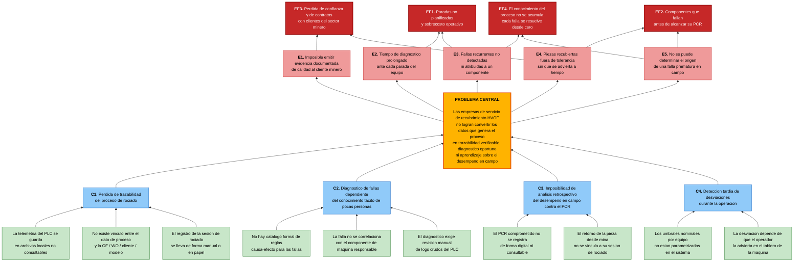

### 1.2.2 Lean UX Process.

El Lean UX Process permite a WebRunners validar de forma temprana las creencias que sustentan EdgeWatch, evitando construir funcionalidad sobre supuestos no verificados. El proceso parte de un enunciado único del problema para todo el proyecto, del cual se derivan los assumptions organizados en cinco categorías, y de estos, específicamente de los feature assumptions, se formulan los hypothesis statements que el equipo someterá a validación durante los sprints. Se aplica la versión del template Brand new initiative, dado que EdgeWatch no constituye la evolución de un producto existente sino una iniciativa nueva.

#### 1.2.2.1. Lean UX Problem Statements.

Siguiendo la indicación del enunciado, se elabora un único Problem Statement para todo el proyecto, considerando en él ambos segmentos objetivo.

***The current state of*** *the industrial thermal spray coating market (HVOF) has focused mainly on delivering the coating as a physical service to mining and heavy-industry clients, on operator expertise as the primary mechanism for detecting process deviations, and on workflows where process parameters generated by the machine PLC remain in local logs that are never linked to the work order, the client component, or its expected service life.*

***What existing products/services fail to address is*** *the gap between the telemetry the HVOF equipment already produces and the organization's ability to turn it into verifiable traceability, timely fault diagnosis pointing to a specific machine part, and retrospective learning about how coated components actually perform in the field against their Planned Component Replacement (PCR) target.*

***Our product/service will address this gap by*** *providing a web platform that ingests spray process telemetry in real time through a RESTful API, links every spray session to its manufacturing order (OF), work order (WO), client and component model, raises alerts when parameters fall outside the equipment's nominal ranges, applies a configurable cause-effect rule catalog to identify the suspect machine part, and records field service life to compare actual performance against the committed PCR.*

***Our initial focus will be*** *specialized HVOF coating service providers operating in Peru that serve mining clients and are required to demonstrate process quality, and secondarily industrial plants that operate an in-house thermal spray line.*

***We'll know we are successful when we see*** *coating service providers issuing quality evidence generated by the platform for at least 80% of their delivered work orders, a reduction of at least 40% in the time required to determine the probable cause of an equipment stoppage, and at least 60% of returned components having their field service life recorded and compared against their PCR target within the platform.*

#### 1.2.2.2. Lean UX Assumptions.

A continuación se enumeran las creencias resultantes de la sesión de discusión del equipo, organizadas según los cinco tipos de assumptions establecidos en Lean UX. Estos enunciados constituyen creencias, no preguntas de discusión.

**Business Assumptions**

1. Creemos que existe en el Perú un número suficiente de empresas de servicio especializado en recubrimiento HVOF y de plantas industriales con línea propia como para sostener un modelo de suscripción B2B.
2. Creemos que la presión por trazabilidad proviene del cliente final (minera) y se transfiere contractualmente al proveedor de recubrimiento, lo que convierte la evidencia de proceso en un requisito comercial y no en una mejora opcional.
3. Creemos que las empresas del segmento están dispuestas a pagar una suscripción mensual por equipo monitoreado, siempre que el costo sea marginal frente al costo de una parada no planificada.
4. Creemos que WebRunners puede construir y operar la plataforma con tecnologías open source (Spring Boot, Angular, PostgreSQL) sin incurrir en costos de licenciamiento que comprometan el margen.
5. Creemos que la integración con el equipo HVOF puede realizarse mediante un gateway que exponga la telemetría vía API REST, sin requerir modificar el PLC ni el software del fabricante del equipo.
6. Creemos que el conocimiento del dominio industrial que posee el equipo constituye una barrera de entrada frente a competidores de software genérico de mantenimiento.

**Business Outcome Assumptions**
1. Creemos que el éxito se evidenciará en la cantidad de órdenes de trabajo cerradas en la plataforma con certificado de calidad emitido.
2. Creemos que el éxito se evidenciará en la reducción del tiempo promedio entre la ocurrencia de una falla y la identificación de su causa probable.
3. Creemos que el éxito se evidenciará en la tasa de renovación de la suscripción al término del primer año.
4. Creemos que el éxito se evidenciará en el número de componentes retornados de campo cuyo desempeño real fue registrado y contrastado contra su PCR.
5. Creemos que el éxito se evidenciará en la cantidad de sesiones de rociado registradas por mes y por equipo, como indicador de adopción sostenida.
6. Creemos que el éxito se evidenciará en la reducción del número de reclamos de clientes por fallas prematuras que no pudieron ser explicadas.

**User Assumptions**
1. Creemos que el usuario principal del segmento de empresas de servicio es el Ingeniero de Calidad o Jefe de Procesos, responsable de que el recubrimiento cumpla las especificaciones acordadas con el cliente.
2. Creemos que el usuario principal del segmento de plantas con línea in-house es el Jefe o Supervisor de Mantenimiento, responsable de la disponibilidad del equipo de recubrimiento.
3. Creemos que el operador de la cabina de rociado es un usuario secundario que interactúa con la plataforma principalmente para iniciar y cerrar sesiones, y para atender alertas.
4. Creemos que ambos perfiles poseen alta competencia en el dominio industrial pero competencia media en herramientas de software, por lo que la curva de aprendizaje debe ser mínima.
5. Creemos que estos usuarios acceden a la plataforma principalmente desde computadores de escritorio en oficina o taller, y de forma secundaria desde dispositivos móviles para consultar alertas.
6. Creemos que el técnico de mantenimiento no requiere que el sistema le indique qué hacer, sino dónde mirar: qué componente de máquina está implicado en la falla.

**User Outcome and Benefit Assumptions**
1. Creemos que el Ingeniero de Calidad busca poder respaldar ante su cliente que un lote fue recubierto dentro de tolerancias, sin depender de reconstruir información desde registros dispersos.
2. Creemos que el Jefe de Mantenimiento busca reducir el tiempo que dedica a determinar por qué se detuvo el equipo.
3. Creemos que ambos perfiles buscan anticipar fallas recurrentes antes de que impacten una ventana de producción comprometida.
4. Creemos que el usuario obtiene valor al poder responder, frente a una falla prematura en campo, si el origen estuvo en el proceso de recubrimiento o fue ajeno a él.
5. Creemos que el usuario valora que el conocimiento sobre fallas quede registrado en el sistema y no dependa de la permanencia de un especialista en la organización.
6. Creemos que el operador obtiene valor al ser advertido de una desviación mientras la sesión está en curso, y no al finalizarla.

**Feature Assumptions**
1. Creemos que un endpoint REST de ingesta de telemetría que registre las lecturas de proceso durante la sesión de rociado permitirá conservar el dato que hoy se pierde.
2. Creemos que vincular cada sesión de rociado con su OF, WO, cliente y modelo de componente permitirá reconstruir la historia completa de cualquier pieza.
3. Creemos que permitir la configuración de rangos nominales por equipo y la detección automática de desviaciones permitirá identificar condiciones fuera de tolerancia sin depender de la vigilancia del operador.
4. Creemos que un módulo de alertas en tiempo real notificará al responsable en el momento en que la desviación ocurre.
5. Creemos que un catálogo configurable de reglas causa-efecto que identifique el componente de máquina sospechoso reducirá el tiempo de diagnóstico.
6. Creemos que la detección de patrones recurrentes de falla por componente permitirá anticipar problemas antes de que provoquen una parada mayor.
7. Creemos que la generación exportable de certificados de calidad por orden de trabajo permitirá entregar evidencia documentada al cliente.
8. Creemos que el registro de vida útil en campo contrastado contra el PCR comprometido permitirá evaluar el desempeño real del recubrimiento a lo largo del tiempo.
9. Creemos que reportes de tasa de falla agrupados por cliente y por modelo de componente revelarán patrones que hoy no son visibles para la organización.

### 1.2.2.3. Lean UX Hypothesis Statements.
Se formula un hypothesis statement por cada feature assumption enunciado en la sección anterior, siguiendo el template establecido.  

---
**Hypothesis Statement 01. Ingesta de telemetría de proceso**

**We believe we will achieve** an increase in the number of spray sessions with complete process records stored in the platform  
**If** Quality Engineers at HVOF coating service providers and Maintenance Supervisors at in-house coating plants  
**Attain** a permanent, queryable record of the conditions under which every spray session was executed  
**With** a RESTful telemetry ingestion endpoint that registers process readings throughout the spray session.

---
**Hypothesis Statement 02. Vinculación de la sesión con OF, WO, cliente y modelo**

**We believe we will achieve** an increase in the percentage of work orders that can be fully traced from client to process conditions  
**If** Quality Engineers at HVOF coating service providers  
**Attain** the ability to reconstruct the complete history of any coated component on demand  
**With** the linking of every spray session to its manufacturing order, work order, client and component model.  
---
**Hypothesis Statement 03. Rangos nominales y detección de desviaciones**  

**We believe we will achieve** a reduction in the number of components coated outside specification without detection  
**If** Quality Engineers and spray booth Operators  
**Attain** automatic identification of out-of-tolerance conditions without depending on continuous manual supervision  
**With** per-equipment nominal parameter range configuration and automatic deviation detection.  
---
**Hypothesis Statement 04. Alertas en tiempo real**  

**We believe we will achieve** a reduction in the average time between a process deviation and the response of the responsible person  
**If** spray booth Operators and Maintenance Supervisors  
**Attain** awareness of a deviation while the session is still running rather than after it ends  
**With** a real-time alerting module that notifies the responsible user when a deviation or fault is detected.  
---
**Hypothesis Statement 05. Diagnóstico asistido por reglas causa-efecto**  

**We believe we will achieve** a reduction of at least 40% in the time required to determine the probable cause of an equipment stoppage  
**If** Maintenance Supervisors and maintenance technicians  
**Attain** a diagnosis that points to the specific machine part involved instead of a raw fault code  
**With** a configurable cause-effect rule catalog that correlates the fault with a suspect machine part.
---
**Hypothesis Statement 06. Detección de patrones recurrentes de falla**  

**We believe we will** achieve a reduction in unplanned stoppages during committed production windows    
**If** Maintenance Supervisors at both coating service providers and in-house coating plants  
**Attain** early visibility of machine parts that are failing repeatedly  
**With** automatic detection of recurring fault patterns grouped by machine part and equipment.  
---
**Hypothesis Statement 07. Certificados de calidad por orden de trabajo**  

**We believe we will achieve** quality evidence generated by the platform for at least 80% of delivered work orders  
**If** Quality Engineers at HVOF coating service providers  
**Attain** the ability to hand their mining clients documented proof that the batch was coated within tolerance  
**With** exportable quality certificate generation per work order.  
---
**Hypothesis Statement 08. Registro de vida útil contra PCR**  

**We believe we will achieve** field service life recorded and compared against PCR for at least 60% of returned components  
**If** Quality Engineers and Maintenance Supervisors  
**Attain** the ability to determine whether a premature field failure originated in the coating process or elsewhere  
**With** field service life recording contrasted against the committed Planned Component Replacement target.  
--- 

**Hypothesis Statement 09. Reportes de tasa de falla por cliente y modelo**  

**We believe we will achieve** an increase in the number of process improvement decisions supported by historical evidence  
**If** Quality Engineers and Plant Managers  
**Attain** visibility of failure patterns that are not observable from individual work orders  
**With** failure rate reports grouped by client and by component model.
---

### 1.2.2.4. Lean UX Canvas.
A continuación se presenta el Lean UX Canvas (versión 2, Jeff Gothelf) elaborado por el equipo, el cual consolida en un solo artefacto el problema de negocio, los resultados esperados, los usuarios, las soluciones propuestas y las hipótesis derivadas de las secciones anteriores. Los cuadros 7 y 8 establecen la prioridad de aprendizaje del equipo para el primer ciclo de validación.


## 1.3. Segmentos objetivo.

EdgeWatch se dirige a organizaciones que **operan** un proceso de recubrimiento térmico HVOF, no a quienes consumen sus resultados. Esta distinción es determinante: las empresas mineras son las que exigen la garantía de vida útil y las que sufren el costo de una falla prematura, pero no operan equipos HVOF ni serían las usuarias directas de la plataforma. Actúan como la fuente de presión contractual que motiva la adquisición del producto, no como segmento de usuario. En consecuencia, se han definido dos segmentos objetivo diferenciados por el **tipo de operación** que realizan y no por su tamaño, ya que es el tipo de operación—servicio a terceros frente a operación interna— el que genera necesidades y motivaciones de compra distintas.

### Contexto de mercado

La minería constituye el principal motor exportador de la economía peruana. Según el Boletín Estadístico Minero del Ministerio de Energía y Minas, las exportaciones de productos mineros totalizaron **US$ 62,848 millones durante 2025**, un crecimiento de **27.2 %** respecto al año anterior, y representaron alrededor del **67.5 %** del valor total exportado por el país (MINEM, 2026). A octubre de 2025 existían en el Perú **19,151 titulares mineros** con derechos sobre **55,783 concesiones** (CooperAcción, 2025), lo que dimensiona la escala de la actividad que demanda servicios de mantenimiento y recuperación de componentes.

El ecosistema de proveedores que atiende a este sector tiene además una trayectoria de crecimiento proyectada. De acuerdo con estimaciones de la Sociedad Nacional de Industrias, el aporte de los proveedores mineros al PBI nacional se sitúa actualmente entre **3.5 % y 3.8 %**, y podría alcanzar hasta el **12 % para 2030** si se ejecuta la cartera de proyectos mineros estimada en **US$ 52,000 millones** (Energiminas, 2025).

El costo del problema que EdgeWatch atiende también está documentado. El reporte *True Cost of Downtime* de Siemens estima que las 500 mayores empresas del mundo pierden alrededor del **11 % de sus ingresos** por paradas no planificadas, y la falla de componentes críticos representa el **45 %** de los casos reportados de downtime. En el sector minero específicamente, estimaciones de la industria sitúan el costo promedio de una parada de equipo en torno a **US$ 180,000 por incidente** (Innovapptive, 2024).

---

### Segmento 1: Empresas de servicio especializado en recubrimiento HVOF

**Descripción**

Empresas que ofrecen recubrimiento térmico HVOF como servicio a terceros, operando una o más cabinas de rociado y atendiendo simultáneamente a varios clientes industriales, principalmente del sector minero. Su negocio depende de la capacidad de demostrar que el recubrimiento se ejecutó dentro de las especificaciones acordadas, ya que el cliente vincula la vida útil esperada de la pieza (PCR) a la calidad del proceso. En el mercado peruano este segmento es reducido y altamente especializado, lo que lo convierte en un nicho de alta concentración: pocos actores, contratos de alto valor y fuerte dependencia de la reputación técnica.

**Características demográficas y organizacionales**

| Variable | Descripción |
|---|---|
| Tipo de organización | Empresa de servicios industriales / metalmecánica especializada |
| Tamaño | Mediana empresa; entre 50 y 500 colaboradores |
| Ubicación | Lima Metropolitana y Callao (zonas industriales), con presencia comercial en regiones mineras (Arequipa, Cajamarca, Áncash, Junín) |
| Sector económico | Servicios de mantenimiento y recuperación de componentes industriales |
| Clientes principales | Empresas mineras de gran y mediana minería, oil & gas, generación eléctrica |
| Antigüedad | Organizaciones consolidadas, típicamente con más de 10 años de operación |
| Nivel de digitalización | Medio; cuentan con ERP administrativo, pero los datos de proceso permanecen en registros locales o en papel |

**Perfil del usuario dentro de la organización**

| Variable | Descripción |
|---|---|
| Rol principal | Ingeniero de Calidad / Jefe de Procesos |
| Rol secundario | Supervisor de Mantenimiento, Operador de cabina de rociado |
| Edad | 28 a 50 años |
| Formación | Ingeniería Mecánica, Metalúrgica, Industrial o de Materiales |
| Competencia en el dominio | Alta |
| Competencia digital | Media; usuario habitual de hojas de cálculo y ERP, no de herramientas analíticas |
| Dispositivo de preferencia | Computador de escritorio o laptop en oficina y taller; móvil para consulta de alertas |
| Idioma de trabajo | Español, con manejo de terminología técnica en inglés |

**Motivación de compra**

Este segmento adquiere EdgeWatch porque **sin trazabilidad no puede sostener la garantía que sus clientes le exigen**. La presión es comercial antes que operativa: la incapacidad de entregar evidencia documentada del proceso compromete la renovación de contratos con clientes mineros que auditan a sus proveedores.

---

### Segmento 2: Plantas industriales con línea de recubrimiento in-house

**Descripción**

Organizaciones cuyo negocio principal no es el recubrimiento, pero que operan una cabina de thermal spray dentro de sus instalaciones para recuperar sus propios componentes críticos. El recubrimiento es para ellos un proceso de soporte al mantenimiento, no un producto. Su preocupación central es la disponibilidad del equipo: una falla de la cabina durante una ventana de parada programada compromete todo el cronograma de mantenimiento de la planta. En el Perú este segmento es menos frecuente que el primero y se concentra en operaciones de gran escala; su presencia es considerablemente mayor en mercados como Chile, Brasil, Estados Unidos y Europa, lo que lo posiciona como vía natural de expansión regional.

**Características demográficas y organizacionales**

| Variable | Descripción |
|---|---|
| Tipo de organización | Planta industrial de gran escala con taller de mantenimiento propio |
| Tamaño | Gran empresa; más de 500 colaboradores |
| Ubicación | Regiones mineras e industriales del Perú (Áncash, Arequipa, Cajamarca, Moquegua, Ica) y mercados regionales de expansión |
| Sector económico | Minería, oil & gas, generación eléctrica, cemento, siderurgia |
| Cliente del proceso | Interno (áreas de operación y mantenimiento de la propia planta) |
| Nivel de digitalización | Medio-alto; cuentan con CMMS o SAP PM para gestión de mantenimiento, sin integración con datos de proceso del equipo de spray |

**Perfil del usuario dentro de la organización**

| Variable | Descripción |
|---|---|
| Rol principal | Jefe o Supervisor de Mantenimiento |
| Rol secundario | Ingeniero de Confiabilidad, Técnico de mantenimiento, Planner |
| Edad | 30 a 55 años |
| Formación | Ingeniería Mecánica o Industrial; personal técnico con formación en institutos tecnológicos |
| Competencia en el dominio del spray | Media; son especialistas en mantenimiento general, no en thermal spray específicamente |
| Competencia digital | Media-alta; usuarios habituales de CMMS y sistemas de gestión de activos |
| Dispositivo de preferencia | Computador de escritorio en oficina de mantenimiento; móvil o tablet en planta |
| Idioma de trabajo | Español, con manejo de terminología técnica en inglés |

**Motivación de compra**

Este segmento adquiere EdgeWatch porque **no puede permitirse que el equipo de recubrimiento falle durante una ventana crítica**. La presión es operativa: dado que sus técnicos no son especialistas en thermal spray, el diagnóstico asistido compensa la brecha de expertise y reduce la dependencia de asistencia técnica externa del fabricante del equipo.

---

### Síntesis comparativa

| Criterio | Segmento 1: Servicio especializado | Segmento 2: Línea in-house |
|---|---|---|
| Naturaleza del proceso | Negocio principal | Proceso de soporte |
| Quién decide la compra | Gerencia General / Gerencia Comercial | Jefatura de Planta / Gerencia de Mantenimiento |
| Dolor principal | Pérdida de contratos por falta de evidencia de calidad | Parada no programada durante ventana crítica |
| Usuario primario | Ingeniero de Calidad | Jefe de Mantenimiento |
| Prioridad de features | Trazabilidad OF/WO, certificados de calidad, análisis PCR | Alertas en tiempo real, diagnóstico por componente, patrones recurrentes |
| Presencia en Perú | Nicho concentrado, pocos actores | Reducida; mayor en mercados regionales |
| Rol en la estrategia | Segmento de foco inicial | Segmento de expansión |

Ambos segmentos comparten el núcleo funcional de la plataforma: ingesta de telemetría, detección de desviaciones y diagnóstico de fallas, pero difieren en el peso relativo que asignan a cada capacidad. Esta convergencia funcional con divergencia de prioridades permite a WebRunners sostener un único producto atendiendo a dos motivaciones de compra distintas, y justifica el enfoque inicial en el Segmento 1, cuyo dolor es más agudo y cuyo ciclo de venta es más corto en el mercado peruano.

# Capítulo II: Requirements Elicitation & Analysis
## 2.1. Competidores.

El dominio del monitoreo de procesos de recubrimiento térmico presenta una particularidad competitiva relevante: **no existe actualmente un producto de software SaaS que cubra de extremo a extremo la trazabilidad del proceso HVOF vinculada a la orden de trabajo y al desempeño en campo del componente**. La oferta existente se concentra en dos extremos del espectro. Por un lado, fabricantes de sensórica industrial especializada que resuelven la medición del proceso con hardware propietario de alto costo, sin capa de gestión ni trazabilidad documental. Por otro, plataformas genéricas de MES, QMS y CMMS que resuelven la trazabilidad y la gestión de mantenimiento, pero desconocen por completo el dominio del thermal spray y no interpretan sus parámetros ni sus modos de falla.

EdgeWatch se ubica deliberadamente en el espacio intermedio. Por ello, el análisis considera dos competidores directos —empresas que ofrecen monitoreo específico de procesos de thermal spray— y un competidor indirecto —plataforma de trazabilidad industrial genérica con oferta parcialmente similar—, conforme a lo establecido en el enunciado del proyecto.

| # | Competidor | Tipo | Origen | Naturaleza de la oferta |
|---|---|---|---|---|
| C1 | **Tecnar Automation** (Accuraspray 4.0 / DPV evolution) | Directo | Canadá | Sensórica en línea para monitoreo de pluma y partículas en vuelo |
| C2 | **Oerlikon Metco** (sistemas de control de proceso) | Directo | Suiza | Fabricante de equipos HVOF con software de control y hojas de parámetros |
| C3 | **DELMIAWorks** (Dassault Systèmes) | Indirecto | Francia / EE. UU. | MES/QMS con trazabilidad de manufactura genérica |


### 2.1.1. Análisis competitivo.

#### Competitive Analysis Landscape

**¿Por qué llevar a cabo este análisis?**

> Determinar si existe en el mercado una solución que resuelva simultáneamente la trazabilidad del proceso HVOF vinculada a la orden de trabajo, el diagnóstico de fallas orientado al componente de máquina y el contraste del desempeño en campo contra el PCR; e identificar en qué medida las alternativas actuales resultan accesibles para empresas de recubrimiento peruanas de tamaño mediano. El objetivo es validar que existe un espacio no atendido y establecer sobre qué dimensiones EdgeWatch puede sostener una ventaja competitiva defendible.

| | **WebRunners — EdgeWatch**                                                                                                                                                                                         | **C1. Tecnar Automation** | **C2. Oerlikon Metco** | **C3. DELMIAWorks** |
|---|------------------------------------------------------------------------------------------------------------------------------------------------------------------------------------------------------------------------------|---|---|---|
| **PERFIL** |                                                                                                                                                                                                                              | | | |
| Overview | Startup peruana que ofrece una plataforma web SaaS para monitoreo, trazabilidad y diagnóstico de procesos HVOF, construida sobre tecnologías open source y desplegada en cloud.                                              | Fabricante canadiense de sensores en línea para procesos de proyección térmica. Su producto Accuraspray 4.0 mide temperatura, velocidad, dimensión y estabilidad de la pluma de rociado. | Fabricante suizo líder mundial de equipos y consumibles para thermal spray. Provee pistolas, polvos y sistemas de control de proceso propietarios asociados a sus equipos. | División de Dassault Systèmes que ofrece un MES/ERP con módulos de gestión de calidad y trazabilidad de manufactura para industria discreta. |
| Ventaja competitiva / ¿Qué valor ofrece a los clientes? | Conecta el dato de proceso con la orden de trabajo, el cliente y el desempeño real de la pieza en campo. Conocimiento profundo del dominio HVOF en contexto minero peruano. Costo de entrada bajo, sin hardware propietario. | Precisión metrológica certificada y calibración trazable a NIST. Es el estándar de facto para caracterización de pluma en investigación y desarrollo de parámetros. | Integración nativa con su propio equipo. Respaldo de marca global y soporte técnico especializado en toda la cadena (equipo, consumible, parámetro). | Cobertura funcional muy amplia: trazabilidad de lote, control de calidad, planificación y ejecución de manufactura en una sola plataforma. |
| **PERFIL DE MARKETING** |                                                                                                                                                                                                                              | | | |
| Mercado objetivo | Empresas de servicio especializado en recubrimiento HVOF y plantas industriales con línea in-house, en Perú y Latinoamérica.                                                                                                 | Talleres de thermal spray, centros de investigación y fabricantes aeroespaciales a nivel global. | Compradores de equipos HVOF a nivel global; industria aeroespacial, energía, automotriz y petróleo y gas. | Manufactura discreta de mediano y gran tamaño a nivel global; automotriz, plásticos, dispositivos médicos. |
| Estrategias de marketing | Venta consultiva directa, apoyada en conocimiento de dominio y casos reales de diagnóstico de fallas. Presencia en ferias del sector minero y proveedores mineros. Landing page orientada a cada segmento.                   | Marketing técnico basado en publicaciones científicas, presencia en conferencias internacionales de thermal spray y red de distribuidores por región. | Marketing de ecosistema: el software se posiciona como complemento del equipo. Fuerte inversión en contenido técnico y capacitación. | Marketing de plataforma empresarial: casos de éxito, webinars, red de partners e integradores. |
| **PERFIL DE PRODUCTO** |                                                                                                                                                                                                                              | | | |
| Productos y servicios | Plataforma web SaaS con Landing Page, Web Application y RESTful API. Ingesta de telemetría, alertas, diagnóstico asistido, certificados de calidad y análisis PCR.                                                           | Sensores de hardware (Accuraspray 4.0, DPV evolution, Shotmeter) con software de visualización asociado. | Equipos HVOF, consumibles, hojas de parámetros y sistemas de control de proceso. Servicios de ingeniería. | Suite MES/ERP modular con trazabilidad, QMS y APQP. Se despliega on-premise o en cloud. |
| Precios y costos | Modelo de suscripción mensual por equipo monitoreado. Sin costo de hardware propietario. Orientado a ser marginal frente al costo de una parada.                                                                             | Inversión de capital elevada por sensor, más mantenimiento y calibración periódica. Barrera de entrada alta para empresas medianas. | Costo elevado, generalmente asociado a la compra o actualización del equipo completo. | Licenciamiento empresarial de costo alto, con proyecto de implementación e integración prolongado. |
| Canales de distribución (Web y/o Móvil) | Web responsive (Landing Page + Web Application), accesible desde escritorio y móvil. Distribución 100 % digital.                                                                                                             | Venta directa y distribuidores. El software opera localmente junto al sensor; sin experiencia web multiusuario. | Venta directa y red global de representantes. Software vinculado al equipo, sin acceso web abierto. | Venta directa y partners de implementación. Interfaz web y cliente de escritorio. |


### 2.1.2. Estrategias y tácticas frente a competidores.

A partir del análisis anterior, WebRunners establece cuatro estrategias con sus tácticas asociadas, orientadas a aprovechar las debilidades identificadas en los competidores y a mitigar las amenazas sobre la propia posición.

- **Estrategia 1. Especialización de dominio frente a plataformas genéricas**  
    Frente a la amplitud funcional de DELMIAWorks y otras plataformas MES/QMS, EdgeWatch compite por profundidad y no por cobertura. La ventaja no consiste en tener más módulos, sino en que el sistema entiende qué significa un feedrate en cero o una sobrepresión de tolva.  
    **Tácticas**: incorporar en el producto un catálogo de reglas causa-efecto construido a partir de fallas reales documentadas en operación; emplear en toda la interfaz el ubiquitous language del dominio (OF, WO, PCR, sesión de rociado) en lugar de terminología genérica de manufactura; y sustentar la propuesta comercial mostrando un diagnóstico concreto que una plataforma genérica no podría producir.  


- **Estrategia 2. Costo de entrada bajo frente a soluciones intensivas en hardware**  
  Frente a Tecnar y Oerlikon Metco, cuyas soluciones exigen inversión de capital significativa, EdgeWatch
- compite por accesibilidad, aprovechando la telemetría que el PLC del equipo ya genera.
  **Tácticas**: adoptar un modelo de suscripción mensual por equipo monitoreado, sin inversión inicial en hardware; ofrecer un periodo de prueba operando sobre datos históricos del propio cliente; e integrarse mediante un gateway con API REST que no requiere modificar el PLC ni el software del fabricante del equipo.


- **Estrategia 3. Neutralidad frente al fabricante del equipo**
  Frente a Oerlikon Metco, cuyo software está vinculado a su propio parque de equipos, EdgeWatch compite por independencia: los talleres de recubrimiento suelen operar equipos de distintas marcas y generaciones.  
  Tácticas: diseñar el contrato de ingesta de telemetría de forma agnóstica al fabricante, con mapeo configurable de tags por equipo; permitir la configuración de rangos nominales por equipo en lugar de asumir un modelo único; y posicionar comercialmente la neutralidad como argumento frente a talleres con parque mixto.


- **Estrategia 4. Cierre del ciclo hacia el desempeño en campo**
  Ningún competidor identificado conecta el proceso de recubrimiento con lo que ocurre después con la pieza. Esta es la dimensión donde EdgeWatch no tiene competencia directa y donde concentra su diferenciación.   
  Tácticas: hacer del análisis PCR el eje del discurso comercial y del Landing Page; construir reportes de tasa de falla por cliente y por modelo de componente que ningún otro actor puede ofrecer; y desarrollar casos documentados en los que la plataforma permita explicar el origen de una falla prematura en campo.

**Mitigación de amenazas identificadas**

Ante la falta de trayectoria de la startup, la táctica consiste en apoyarse en evidencia técnica verificable —casos reales de diagnóstico— en lugar de en referencias comerciales inexistentes. Ante la sensibilidad de las empresas respecto de sus parámetros de proceso, se incorporarán desde el inicio términos y condiciones explícitos sobre titularidad y confidencialidad de los datos, expuestos en el footer del Landing Page y de la aplicación. Ante la resistencia cultural al registro digital, el diseño priorizará una curva de aprendizaje mínima y flujos que reduzcan el número de pasos frente al registro manual actual.

---

## 2.2. Entrevistas.
### 2.2.1. Diseño de entrevistas.
### 2.2.2. Registro de entrevistas.
### 2.2.3. Análisis de entrevistas.
## 2.3. Needfinding.
### 2.3.1. User Personas.

#### Ficha de User Persona 1 — Segmento 1: Empresas de servicio especializado en recubrimiento HVOF


---

#### Ficha de User Persona 2 — Segmento 2: Plantas industriales con línea de recubrimiento in-house


### 2.3.2. User Task Matrix.

| Tarea | Rosa — Frecuencia | Rosa — Importancia | Jorge — Frecuencia | Jorge — Importancia |
|---|---|---|---|---|
| Ejecutar y supervisar una sesión de recubrimiento en la cabina | Baja | Media | Baja | Media |
| Verificar que los parámetros de proceso se mantengan dentro de especificación | Alta | Alta | Media | Alta |
| Registrar a qué pieza, cliente y orden corresponde cada sesión ejecutada | Alta | Alta | Baja | Media |
| Sustentar ante el cliente que un lote fue recubierto dentro de tolerancias | Alta | Alta | N/A | N/A |
| Determinar la causa de una parada o falla del equipo | Baja | Media | Alta | Alta |
| Decidir qué componente de la máquina requiere mantenimiento o repuesto | Baja | Media | Alta | Alta |
| Anticipar fallas recurrentes del equipo | Media | Media | Alta | Alta |
| Verificar el desempeño de una pieza recubierta cuando retorna de campo | Alta | Alta | Media | Media |
| Reportar métricas de calidad o de disponibilidad a la gerencia | Media | Alta | Media | Alta |
| Transferir el conocimiento del proceso entre operadores y técnicos | Media | Media | Media | Alta |

**Tareas con mayor frecuencia e importancia.** Para Rosa, las tareas de mayor peso son sustentar ante el cliente que un lote fue recubierto dentro de tolerancias y registrar la correspondencia entre sesión, pieza, cliente y orden: ambas son diarias y determinan directamente la continuidad del contrato con el cliente minero. Para Jorge, las tareas de mayor peso son determinar la causa de una parada y decidir qué componente atender, dado que de ellas depende la disponibilidad del equipo y el cumplimiento de la ventana de mantenimiento.

**Coincidencias.** Ambos roles comparten como tarea de alta importancia verificar que los parámetros de proceso se mantengan dentro de especificación y reportar métricas a la gerencia, lo que confirma que la trazabilidad del proceso es una necesidad transversal a los dos segmentos, aunque motivada por razones distintas (evidencia comercial en un caso, disponibilidad operativa en el otro).

**Diferencias.** Rosa realiza con alta frecuencia tareas orientadas a documentar y sustentar el proceso ante un tercero externo (el cliente minero), mientras que Jorge realiza con alta frecuencia tareas orientadas a diagnosticar y decidir sobre el propio equipo, sin que un cliente externo participe en esa decisión. Esta diferencia es consistente con la distinción establecida en la sección 1.3 entre el recubrimiento como negocio principal (Segmento 1) y como proceso de soporte al mantenimiento (Segmento 2).

### 2.3.3. User Journey Mapping.

#### Journey Map 1 — Rosa Miranda: sustentar ante el cliente minero que un lote fue recubierto dentro de tolerancias

| Fase | Acciones | Pensamientos | Emociones | Puntos de dolor |
|---|---|---|---|---|
| Solicitud del cliente | Recibe el pedido de sustento y ubica la OF/WO | "Espero que esta vez el registro esté completo" | Neutral, con algo de incertidumbre | No sabe de antemano si el dato existe o está completo |
| Búsqueda de evidencia | Revisa archivos del PLC y bitácoras en papel, consulta al supervisor | "¿Dónde quedó el registro de esa fecha exacta?" | Tensión creciente | Información dispersa entre PLC, papel y memoria del personal |
| Reconstrucción manual | Arma el reporte cruzando fuentes manualmente | "Esto me toma horas que no tengo" | Frustración | Alto esfuerzo manual y riesgo de error humano al cruzar datos |
| Entrega | Envía el reporte, a veces fuera de plazo | "Espero que esto no afecte la renovación del contrato" | Ansiedad | Retraso percibido por el cliente como falta de control de proceso |

#### Journey Map 2 — Jorge Salinas: diagnosticar una parada no programada del equipo HVOF 

| Fase | Acciones | Pensamientos | Emociones | Puntos de dolor |
|---|---|---|---|---|
| Detección | El operador reporta la parada; Jorge revisa el código de falla | "¿Es la misma falla del mes pasado?" | Alerta, preocupación | El código de falla del PLC no indica el componente responsable |
| Diagnóstico | Revisa bitácora en papel, llama al técnico senior, escala al fabricante | "Ojalá el técnico que sabe de esto esté disponible" | Impaciencia | El diagnóstico depende del conocimiento tácito de pocas personas |
| Intervención | Interviene el componente señalado y verifica la operación | "Vamos a ver si esto realmente era el problema" | Incertidumbre | Sin correlación automática, la intervención es prueba y error |
| Registro y aprendizaje | Documenta la solución de forma informal | "Espero acordarme la próxima vez que pase esto" | Resignación | El aprendizaje no queda registrado ni es consultable por otros |

### 2.3.4. Empathy Mapping.

#### Empathy Map — Rosa Miranda (Segmento 1)

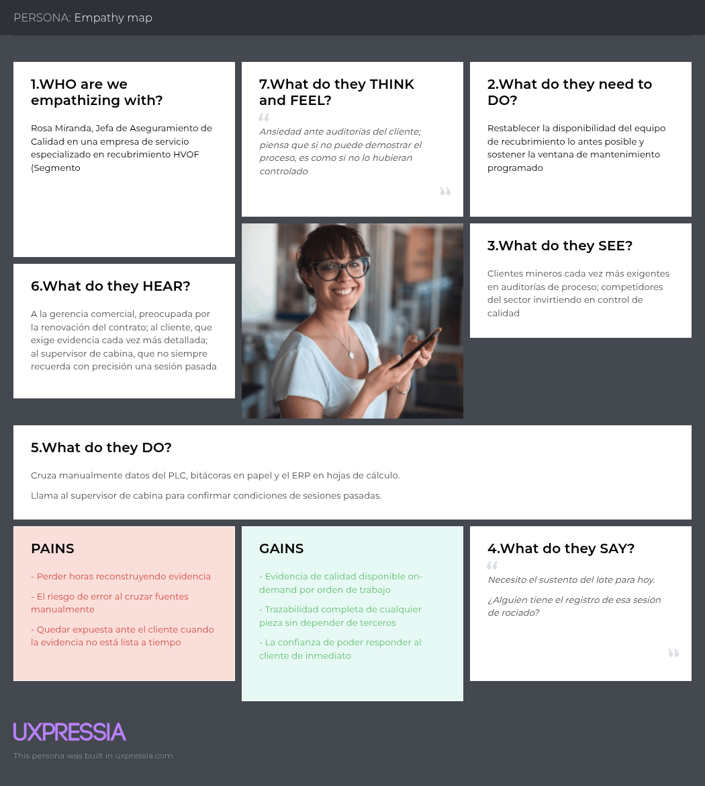

#### Empathy Map — Jorge Salinas (Segmento 2)

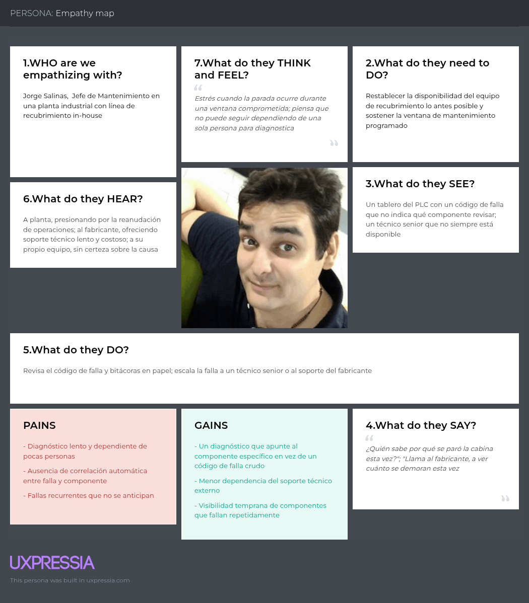

## 2.4. Big Picture Event Storming.

En esta sección se introduce y resume el proceso realizado por nuestro equipo, presentando las evidencias y explicaciones de las etapas del Big Picture Event Storming. En una sesión colaborativa, nuestro equipo se enfocó en entender el dominio del negocio en general, plasmando los eventos significativos y sus relaciones. Es una primera aproximación visual de alto nivel que explora el landscape del negocio, identificando procesos clave, exponiendo potenciales problemas u oportunidades del procesos de recuperación de componentes mediante recubrimiento HVOF, desde la recepción de la pieza del cliente hasta la evaluación de su desempeño en campo. La sesión siguió la guía paso a paso del Event Storming Journal (Bourgau, 2022) y fue documentada con diagramas Mermaid, alternativa permitida por el enunciado del proyecto para Diagram-as-Code. Se conservó la convención de colores del método: naranja para Domain Events, amarillo para Actors, azul para External Systems y rosado para Problems (hotspots).

### Paso 1. Preparación del tablero

Dado que la sesión se realizó de forma remota, la "sala" fue un tablero compartido. El equipo preparó con anticipación:

- El espacio de diseño dividido en tres zonas, siguiendo la guía: *Open* (generación libre), *Explore* (ordenamiento y enriquecimiento) y *Close* (resultados).
- La agenda visual con los nueve pasos de la guía.
- La leyenda de colores.
- Un Domain Event inicial preparado por la facilitadora (*SpraySessionStarted*), siguiendo el truco de Alberto Brandolini de "encender" la sesión con un evento ya colocado en el centro del tablero.

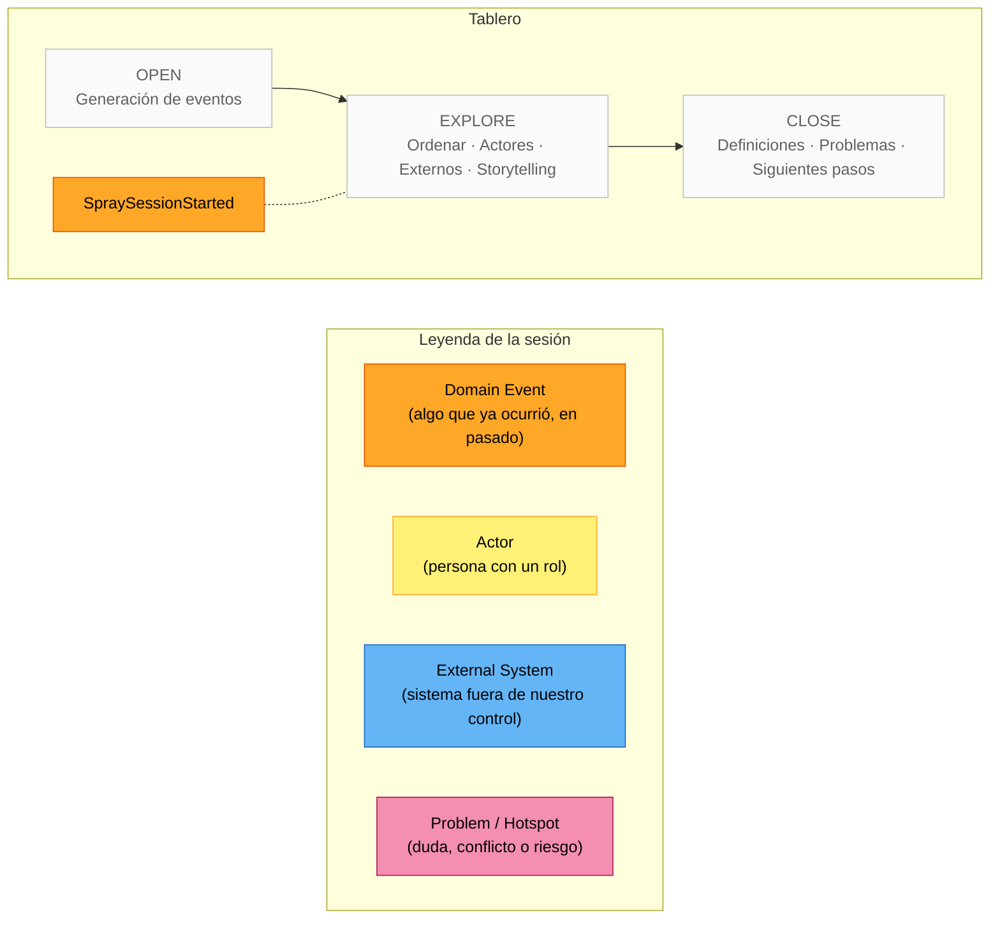
### Paso 2. Energizante

La sesión inició con una dinámica breve de cinco minutos en la que cada integrante describió, en una frase y sin usar términos técnicos, qué pasa con una pieza minera desde que se desgasta hasta que vuelve a operar. El ejercicio sirvió para nivelar el vocabulario entre los integrantes con experiencia en planta y los que no la tenían, y para dejar claro desde el inicio que el tablero se llenaría con hechos del negocio y no con funciones de software.

### Paso 3. Briefing y agenda

La facilitadora (Carolina) presentó el objetivo, el alcance y los casos de uso de la sesión:

| Elemento | Definición acordada |
|---|---|
| Objetivo | Entender de extremo a extremo cómo un componente pasa por el proceso de recuperación HVOF y cómo se conoce su resultado en campo |
| Alcance | Desde la recepción del componente del cliente hasta el registro de su retorno de campo y la evaluación contra el PCR. Incluye la operación de la celda HVOF y el diagnóstico de sus fallas. Excluye la gestión de mantenimiento correctivo/preventivo de la celda |
| Casos de uso guía | (1) Recuperar un front rod de un cliente minero y entregarlo con evidencia de calidad. (2) Diagnosticar por qué la celda se detuvo durante una corrida. (3) Determinar si una pieza que falló en mina antes de su PCR fue mal recubierta |
| Convenciones | Eventos en inglés, en pasado, en PascalCase. Un evento por post-it. Se permite duplicar; se depura al ordenar |

### Paso 4. Generación de Domain Events

Durante veinticinco minutos cada integrante colocó, de forma individual y sin discutir, todos los eventos que recordaba del dominio. La tasa de generación decayó hacia el minuto veinte, señal de pasar al siguiente paso. Se obtuvieron sesenta y ocho post-its, incluidos duplicados y eventos que después se reformularon. El tablero, tal como quedó antes de ordenar:

```mermaid
flowchart TB
    classDef evento fill:#FFA726,stroke:#E65100,color:#000

    subgraph W["Tablero — zona OPEN (sin orden)"]
        direction TB
        subgraph R1[" "]
            direction LR
            a1["ComponentReceived"]:::evento
            a2["QualityCertificateIssued"]:::evento
            a3["FeederZeroFeedrateAborted"]:::evento
            a4["SpraySessionStarted"]:::evento
            a5["ComponentReturnedFromField"]:::evento
            a6["RoleAssigned"]:::evento
            a7["PlcTagFileImported"]:::evento
            a8["AlertAcknowledged"]:::evento
        end
        subgraph R2[" "]
            direction LR
            b1["HvofCellRegistered"]:::evento
            b2["PrematureFailureDetected"]:::evento
            b3["ParameterOutOfRangeDetected"]:::evento
            b4["RecuperationCreated"]:::evento
            b5["RootCauseConfirmed"]:::evento
            b6["SubscriptionActivated"]:::evento
            b7["HopperOverpressureBlocked"]:::evento
            b8["PcrComplianceReportGenerated"]:::evento
        end
        subgraph R3[" "]
            direction LR
            c1["TelemetryBatchIngested"]:::evento
            c2["OrganizationRegistered"]:::evento
            c3["SuspectPartIdentified"]:::evento
            c4["ComponentDelivered"]:::evento
            c5["NominalRangesConfigured"]:::evento
            c6["CriticalFaultAlertRaised"]:::evento
            c7["ServiceLifeRecorded"]:::evento
            c8["SpraySessionCompleted"]:::evento
        end
        subgraph R4[" "]
            direction LR
            d1["FaultCaseOpened"]:::evento
            d2["CustomerRegistered"]:::evento
            d3["TagMappingConfirmed"]:::evento
            d4["SpindleRotationFaulted"]:::evento
            d5["PcrTargetDefined"]:::evento
            d6["OutOfRangeAlertRaised"]:::evento
            d7["RecuperationClosed"]:::evento
            d8["DiagnosticRulesApplied"]:::evento
        end
        subgraph R5[" "]
            direction LR
            e1["PlanSelected"]:::evento
            e2["RecurringFaultPatternDetected"]:::evento
            e3["ProcessReadingRecorded"]:::evento
            e4["TimedShutdownFaultTriggered"]:::evento
            e5["SessionReportGenerated"]:::evento
            e6["HvofCellPartRegistered"]:::evento
            e7["ProbableCauseSuggested"]:::evento
            e8["UserAuthenticated"]:::evento
        end
        subgraph R6[" "]
            direction LR
            f1["SpraySessionAborted"]:::evento
            f2["TagMappingProposed"]:::evento
            f3["PcrTargetMet"]:::evento
            f4["FaultCaseClosed"]:::evento
            f5["EvidenceExported"]:::evento
            f6["AlertDelivered"]:::evento
            f7["TelemetryStreamInterrupted"]:::evento
            f8["DustHouseOverloaded"]:::evento
        end
        subgraph R7[" "]
            direction LR
            g1["FaultFlagActivated"]:::evento
            g2["PrematureFailureCorrelatedWithSession"]:::evento
            g3["DiagnosticRuleCreated"]:::evento
            g4["HvofCellStatusChanged"]:::evento
            g5["FaultFrequencyReportGenerated"]:::evento
            g6["AlertEscalated"]:::evento
            g7["VisitorSubscribedToNewsletter"]:::evento
            g8["ManualDiagnosisRequired"]:::evento
        end
        subgraph R8[" "]
            direction LR
            h1["SubscriptionExpired"]:::evento
            h2["NotificationPreferenceUpdated"]:::evento
            h3["FaultSymptomsRecorded"]:::evento
            h4["XAxisMotionFaulted"]:::evento
            h5["AccessDenied"]:::evento
            h6["FlameTemperatureOutOfRange"]:::evento
            h7["HourmeterAtDeliveryRecorded"]:::evento
            h8["ComponentMarkedInProcess"]:::evento
        end
        R1 ~~~ R2 ~~~ R3 ~~~ R4 ~~~ R5 ~~~ R6 ~~~ R7 ~~~ R8
    end
```

Durante la depuración se tomaron dos decisiones que quedaron registradas para el paso siguiente:

- Los eventos de falla específicos del PLC (*FeederZeroFeedrateAborted*, *HopperOverpressureBlocked*, *SpindleRotationFaulted*, *XAxisMotionFaulted*, *TimedShutdownFaultTriggered*, *DustHouseOverloaded*) se agruparon bajo un evento genérico *FaultFlagActivated* con el tipo de falla como atributo. Esto evita que el tablero tenga un post-it por cada uno de los más de treinta tags de falla del PLC y refleja cómo lo procesa el sistema: el tag mapeado como indicador de falla se activa, y eso abre el caso.
- *FlameTemperatureOutOfRange* se absorbió en *ParameterOutOfRangeDetected*, por la misma razón.

### Paso 5. Ordenamiento cronológico

Aquí comenzó la discusión. El equipo ordenó los eventos de izquierda a derecha y, al hacerlo, aparecieron dos flujos concurrentes que se representaron como carriles: mientras la sesión de rociado registra lecturas, en paralelo pueden abrirse casos de falla y generarse alertas. También apareció un flujo alternativo: la sesión puede terminar completada o abortada.

```mermaid
flowchart LR
    classDef evento fill:#FFA726,stroke:#E65100,color:#000
    classDef fase fill:#FAFAFA,stroke:#BDBDBD,color:#616161

    subgraph F0["0. Configuración"]
        direction TB
        OrganizationRegistered:::evento --> PlanSelected:::evento --> SubscriptionActivated:::evento --> RoleAssigned:::evento
        HvofCellRegistered:::evento --> HvofCellPartRegistered:::evento --> PlcTagFileImported:::evento --> TagMappingProposed:::evento --> TagMappingConfirmed:::evento --> NominalRangesConfigured:::evento
        CustomerRegistered:::evento --> PcrTargetDefined:::evento
        DiagnosticRuleCreated:::evento
    end

    subgraph F1["1. Recepción"]
        direction TB
        ComponentReceived:::evento --> RecuperationCreated:::evento --> ComponentMarkedInProcess:::evento
    end

    subgraph F2["2. Corrida de rociado"]
        direction TB
        SpraySessionStarted:::evento --> TelemetryBatchIngested:::evento --> ProcessReadingRecorded:::evento
        ProcessReadingRecorded --> SpraySessionCompleted:::evento
        ProcessReadingRecorded --> SpraySessionAborted:::evento
    end

    subgraph F2B["2b. Carril concurrente — Desviaciones y fallas"]
        direction TB
        ParameterOutOfRangeDetected:::evento --> OutOfRangeAlertRaised:::evento --> AlertDelivered:::evento --> AlertAcknowledged:::evento
        FaultFlagActivated:::evento --> FaultCaseOpened:::evento --> FaultSymptomsRecorded:::evento --> DiagnosticRulesApplied:::evento
        DiagnosticRulesApplied --> ProbableCauseSuggested:::evento --> SuspectPartIdentified:::evento --> CriticalFaultAlertRaised:::evento
        DiagnosticRulesApplied --> ManualDiagnosisRequired:::evento
        SuspectPartIdentified --> RootCauseConfirmed:::evento --> FaultCaseClosed:::evento
        ManualDiagnosisRequired --> RootCauseConfirmed
        FaultCaseClosed --> RecurringFaultPatternDetected:::evento
        TelemetryStreamInterrupted:::evento
    end

    subgraph F3["3. Cierre y entrega"]
        direction TB
        RecuperationClosed:::evento --> HourmeterAtDeliveryRecorded:::evento --> QualityCertificateIssued:::evento --> ComponentDelivered:::evento
        SessionReportGenerated:::evento
    end

    subgraph F4["4. Campo y PCR"]
        direction TB
        ComponentReturnedFromField:::evento --> ServiceLifeRecorded:::evento
        ServiceLifeRecorded --> PcrTargetMet:::evento
        ServiceLifeRecorded --> PrematureFailureDetected:::evento --> PrematureFailureCorrelatedWithSession:::evento
    end

    subgraph F5["5. Reportes"]
        direction TB
        EvidenceExported:::evento
        FaultFrequencyReportGenerated:::evento
        PcrComplianceReportGenerated:::evento
    end

    F0 --> F1 --> F2 --> F3 --> F4 --> F5
    ProcessReadingRecorded -. dispara .-> ParameterOutOfRangeDetected
    ProcessReadingRecorded -. dispara .-> FaultFlagActivated
    SpraySessionCompleted --> RecuperationClosed
    SpraySessionAborted -. requiere nueva corrida .-> SpraySessionStarted
```

Al ordenar, el equipo hizo explícitas tres cosas que estaban implícitas:

- *HourmeterAtDeliveryRecorded* no existía en la generación inicial de todos; apareció cuando se preguntó "¿contra qué se compara el horómetro de retorno?". Sin ese dato, *ServiceLifeRecorded* no puede calcular horas logradas.
- *ManualDiagnosisRequired* apareció al preguntar "¿y si ninguna regla coincide?". Es el flujo alternativo de *DiagnosticRulesApplied*.
- *SpraySessionAborted* no cierra la orden: obliga a una nueva corrida. Por eso la flecha punteada regresa a *SpraySessionStarted*.

### Paso 6. Actores y sistemas externos

Con la historia ya ordenada, el equipo identificó quién dispara cada cadena de eventos (post-its amarillos) y qué sistemas fuera de la plataforma participan (post-its azules). Siguiendo la guía, se colocó un actor al inicio de cada cadena y no en cada evento.

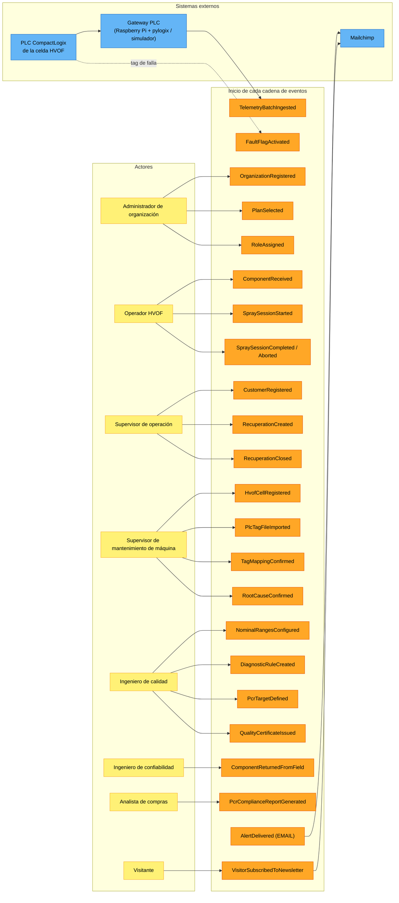

Dos decisiones surgieron en este paso:

- El **PLC** y el **gateway** se modelaron como dos sistemas externos distintos. El PLC es la fuente del dato; el gateway es quien lo lee vía EtherNet/IP y lo envía a la plataforma por REST. Para la demostración del curso, el gateway será un simulador que expone el mismo contrato, de modo que la plataforma no distingue si el origen es hardware real o simulado.
- El **ingeniero de confiabilidad** de la minera (Asset Owner) es quien dispara *ComponentReturnedFromField*, no el proveedor. Es el único que sabe cuántas horas trabajó la pieza en mina. Esta observación fue la que consolidó a la minera como segundo segmento pagante.

### Paso 7. Storytelling

Un integrante narró la historia completa recorriendo el tablero de izquierda a derecha, usando el caso de uso guía del front rod. La audiencia interrumpió cuando algo no cuadraba. Las incoherencias que no se pudieron resolver en la sesión se estacionaron como post-its rosados (hotspots).

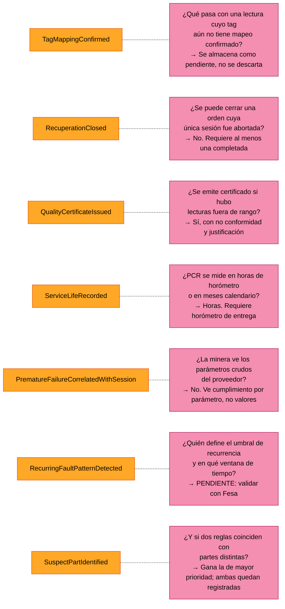

Seis de los siete hotspots se resolvieron en la sesión y sus decisiones se trasladaron directamente a los criterios de aceptación de las User Stories (US11, US18, US35, US40, US41 y US26 respectivamente). El hotspot P6 quedó pendiente de validación con el supervisor de mantenimiento durante las entrevistas de la sección 2.2.

Durante la narración se capturaron también las primeras definiciones del lenguaje ubicuo, que se desarrollan en la sección 2.5:

| Término | Definición capturada en la sesión |
|---|---|
| Component | Pieza del cliente que se recupera (front rod, cylinder block). No confundir con las partes de la celda |
| HVOF Cell Part | Parte de la máquina HVOF (feeder, hopper, spindle, ejes, dust collector) |
| Recuperation | Orden de recuperación identificada por OF y WO; es el trabajo sobre un componente |
| Spray Session | Una corrida de rociado sobre un componente en una celda. Una orden puede tener varias |
| PCR Target | Horas de operación esperadas para el componente recuperado (Planned Component Replacement) |
| Fault Case | Caso abierto cuando un tag de falla se activa; se diagnostica, se confirma y se cierra |
| Suspect Part | Parte de la celda que las reglas señalan como probable responsable de la falla |

### Paso 8. Reverse storytelling

Como fase opcional, el equipo tomó el evento de mayor valor de negocio, *PrematureFailureDetected*, y recorrió la historia hacia atrás preguntando repetidamente "¿qué tuvo que ocurrir antes para que esto pasara?". El ejercicio confirmó la cadena de trazabilidad completa y reveló un evento que faltaba.

```mermaid
flowchart RL
    classDef evento fill:#FFA726,stroke:#E65100,color:#000
    classDef nuevo fill:#FFA726,stroke:#AD1457,stroke-width:3px,color:#000

    A["PrematureFailureDetected"]:::evento
    B["ServiceLifeRecorded"]:::evento
    C["ComponentReturnedFromField"]:::evento
    D["ComponentDelivered"]:::evento
    E["HourmeterAtDeliveryRecorded"]:::evento
    F["QualityCertificateIssued"]:::evento
    G["RecuperationClosed"]:::evento
    H["SpraySessionCompleted"]:::evento
    I["ProcessReadingRecorded"]:::evento
    J["SpraySessionStarted"]:::evento
    K["RecuperationCreated"]:::evento
    L["ComponentReceived"]:::evento
    M["PcrTargetDefined"]:::evento
    N["CustomerLinkedToAssetOwnerOrganization"]:::nuevo

    A -->|"¿qué lo disparó?"| B -->|"¿qué lo disparó?"| C
    C -->|"¿qué debió existir?"| D --> E --> F --> G --> H --> I --> J --> K --> L
    B -->|"¿contra qué se comparó?"| M
    C -->|"¿quién pudo registrarlo?"| N
```

El evento descubierto, *CustomerLinkedToAssetOwnerOrganization*, resuelve una pregunta que nadie había hecho: ¿cómo puede un ingeniero de confiabilidad de la minera registrar el retorno de una pieza si la minera fue registrada como *Customer* por Fesa y no tiene cuenta propia? La respuesta es que cuando una organización Asset Owner se suscribe con el mismo RUC que un cliente ya registrado por un proveedor, ambos registros se vinculan. Este evento dio origen al segundo escenario de la US13.

### Paso 9. Cierre

Al terminar la sesión el equipo evaluó los resultados contra los tres criterios que propone la guía:

**Entendimiento compartido del dominio.** Los integrantes sin experiencia en planta pudieron narrar la historia completa del front rod sin ayuda al final de la sesión. La distinción entre *Component* (pieza del cliente) y *HVOF Cell Part* (parte de la máquina), que había generado confusión en reuniones previas, quedó resuelta.

**Problemas identificados.** Siete hotspots, seis resueltos en sesión y uno pendiente de validación externa. Las decisiones tomadas se convirtieron en criterios de aceptación, lo que evitó que las ambigüedades llegaran a la implementación.

**Primeras definiciones del lenguaje ubicuo.** Siete términos capturados, que constituyen el punto de partida del glosario de la sección 2.5.

**Trazabilidad hacia las User Stories.** Los eventos ordenados en el Paso 5 se distribuyen en las épicas del Capítulo III de la siguiente forma:

| Fase del tablero | Eventos | Épica | User Stories |
|---|---|---|---|
| 0. Configuración | OrganizationRegistered, RoleAssigned, PlanSelected, SubscriptionActivated | E01, E02 | US01–US06 |
| 0. Configuración | HvofCellRegistered … NominalRangesConfigured, DiagnosticRuleCreated | E03, E06 | US07–US12, US28 |
| 0. Configuración | CustomerRegistered, PcrTargetDefined | E04 | US13, US16 |
| 1. Recepción | ComponentReceived, RecuperationCreated | E04 | US14, US15 |
| 2. Corrida | SpraySessionStarted … SpraySessionCompleted/Aborted | E05 | US19–US24 |
| 2b. Desviaciones | ParameterOutOfRangeDetected, OutOfRangeAlertRaised, AlertDelivered | E05, E07 | US21, US31–US34 |
| 2b. Fallas | FaultFlagActivated … RecurringFaultPatternDetected | E06 | US25–US30 |
| 3. Cierre y entrega | RecuperationClosed, QualityCertificateIssued, ComponentDelivered | E04, E08 | US17, US18, US35, US36 |
| 4. Campo y PCR | ComponentReturnedFromField … PrematureFailureCorrelatedWithSession | E09 | US39–US43 |
| 5. Reportes | EvidenceExported, FaultFrequencyReportGenerated, PcrComplianceReportGenerated | E08, E09 | US37, US38, US42 |
| Externos | AlertDelivered (EMAIL), VisitorSubscribedToNewsletter | E11, E10 | US49, US51, US52 |


## 2.5. Ubiquitous Language.

# Capítulo III: Requirements Specification
## 3.1. User Stories.
## 3.2. Impact Mapping.
## 3.3. Product Backlog

# Capítulo IV: Product Design

## 4.1. Style Guidelines.

### 4.1.1. General Style Guidelines.

**Identidad de marca**

| Atributo | Definición |
|---|---|
| Nombre de producto | EdgeWatch |
| Nombre de la startup | WebRunners |
| Tagline | *"El dato de su proceso, convertido en trazabilidad y diagnóstico."* |
| Personalidad de marca | Confiable · Preciso · Claro · Técnico sin ser frío |
| Territorio visual | Industrial-tecnológico: se apoya en la estética de sala de control y tablero de proceso, no en la estética "startup SaaS" genérica |

**Logotipo**

El logotipo combina un isotipo (aguja de medición/gauge que traza un arco, en referencia a la lectura continua de parámetros de proceso) con el logotype "EdgeWatch" en tipografía de marca. Reglas de uso:

| Regla | Especificación |
|---|---|
| Área de resguardo | Espacio libre mínimo alrededor del isotipo equivalente a la altura de la "E" del logotype |
| Tamaño mínimo digital | 24 px de alto |
| Versiones | Positiva (isotipo + texto en Navy `#0B2545` sobre fondo claro), negativa (blanco sobre fondo Navy o fotografía oscura), monocromática (para impresión de certificados en blanco y negro) |
| Usos no permitidos | No rotar, no aplicar degradados ajenos a la paleta, no distorsionar la proporción, no ubicar sobre fondos con contraste insuficiente (ver tabla de contraste en 4.1.2) |

**Paleta de colores**

La paleta reutiliza deliberadamente los colores ya empleados en el árbol de problemas del Capítulo I (sección 1.2.1) para los estados de causa/efecto, de modo que el mismo código cromático que se usó para diagnosticar el problema se convierte en el sistema de estados del producto que lo resuelve.

| Rol | Color | Hex | Uso |
|---|---|---|---|
| Primario — Industrial Navy | 🟦 | `#0B2545` | Header, navegación, fondos de secciones destacadas, texto de marca |
| Primario oscuro | 🟦 | `#071A33` | Footer, secciones de máximo contraste |
| Secundario — Thermal Amber | 🟧 | `#FF7A00` | Botón primario / CTA, acentos, hover de enlaces |
| Acento — Data Teal | 🟦 | `#00B4D8` | Enlaces en cuerpo de texto, series de datos en gráficos de telemetría |
| Éxito / Nominal | 🟩 | `#2E7D32` (tinte `#C8E6C9`) | Parámetro dentro de rango, sesión sin desviaciones |
| Advertencia / Alerta | 🟨 | `#FFB300` (tinte `#FFECB3`) | Desviación detectada, estado "En revisión" |
| Crítico / Falla | 🟥 | `#C62828` (tinte `#EF9A9A`) | Parada de equipo, parámetro fuera de tolerancia, falla prematura en campo |
| Información / En proceso | 🟦 | `#1565C0` (tinte `#90CAF9`) | Sesión en curso, estado neutro informativo |
| Neutro 900 (texto) | ⬛ | `#1B1F27` | Texto principal |
| Neutro 600 (texto secundario) | ⬜ | `#5B6472` | Metadatos, etiquetas, texto de apoyo |
| Neutro 200 (bordes) | ⬜ | `#E2E6EB` | Bordes de tarjetas, separadores, tablas |
| Neutro 50 (fondo) | ⬜ | `#F5F7FA` | Fondo de página, fondo de tabla alternado |

**Tipografía**

| Uso | Familia | Justificación |
|---|---|---|
| Titulares (H1–H3) | Poppins (SemiBold/Bold) | Geométrica, técnica y confiada; funciona bien en tamaños grandes del Landing Page |
| Cuerpo e interfaz | Inter (Regular/Medium) | Alta legibilidad en tamaños pequeños, óptima para tablas densas de la Web Application |
| Valores numéricos y de proceso | JetBrains Mono | Alinea dígitos en columnas de telemetría y códigos (OF, WO, tags de parámetro) |

Escala tipográfica (tamaño/interlineado en px): H1 40/48 · H2 32/40 · H3 24/32 · H4 20/28 · Body Large 18/28 · Body 16/24 · Small 14/20 · Micro 12/16.

**Iconografía**

Set de íconos de línea, grilla de 24×24 px, trazo de 2 px con puntas redondeadas (estilo consistente con librerías como Phosphor Icons, peso *regular*). Variante rellena reservada exclusivamente para indicar estado activo/seleccionado, nunca para decoración.

**Fotografía e imágenes**

Fotografía real de planta, cabina HVOF y componentes recubiertos (no stock genérico de oficinas). Tratamiento dúotono Navy `#0B2545` / Amber `#FF7A00` en imágenes de héroe, y overlay Navy al 60 % sobre fotografía de planta cuando lleva texto superpuesto, para garantizar contraste legible.

**Voz y tono**

Directa, técnica-accesible y basada en evidencia: el copy prioriza métricas concretas (tiempo de diagnóstico, % de OF con certificado emitido) frente a adjetivos vacíos ("innovador", "revolucionario"). Se conserva el ubiquitous language del dominio (OF, WO, PCR, sesión de rociado) en lugar de traducirlo o genericarlo, tanto en el Landing Page como en la Web Application, para que el vocabulario de venta sea el mismo que el vocabulario de uso.

### 4.1.2. Web Style Guidelines.

**Sistema de grid y espaciado**

| Propiedad | Valor |
|---|---|
| Columnas | 12 |
| Gutter | 24 px |
| Margen lateral | 24 px (mobile) / 64 px (desktop) |
| Ancho máximo de contenido | 1280 px |
| Unidad base de espaciado | 8 px (escala: 4·8·16·24·32·48·64·96) |

**Breakpoints**

| Nombre | Ancho | Uso principal |
|---|---|---|
| sm | 375 px | Consulta móvil de alertas (Operador, Jefe de Mantenimiento en planta) |
| md | 768 px | Tablet en taller |
| lg | 1024 px | Web Application en escritorio |
| xl | 1280 px | Landing Page y dashboards |
| xxl | 1440 px+ | Monitores de sala de control |

**Componentes**

| Componente | Especificación |
|---|---|
| Botón primario | Fondo `#FF7A00`, texto blanco, radio 6 px; hover oscurece 10 %; disabled en Neutro 200/600; estado *loading* con spinner y bloqueo de doble envío |
| Botón secundario | Borde `#0B2545` 1.5 px, fondo transparente, texto `#0B2545` |
| Badge de estado | Píldora con ícono + etiqueta, nunca solo color: **Nominal** (verde), **Alerta** (ámbar), **Crítico** (rojo), **En sesión** (azul info), **Cerrado** (gris) |
| Tarjeta (Session Card, Alert Card, KPI Card) | Radio 8 px, borde `#E2E6EB` 1 px, sombra sutil en hover, encabezado con el badge de estado |
| Formularios | Etiqueta encima del campo, texto de 16 px (evita zoom automático en iOS), validación inline en rojo crítico bajo el campo, asterisco para campos obligatorios |
| Tablas de datos | Encabezado *sticky*, filas alternadas sobre Neutro 50, columnas numéricas en JetBrains Mono alineadas a la derecha |
| Navegación | Top nav *sticky* con fondo transparente que pasa a sólido al hacer scroll (Landing Page); sidebar colapsable agrupado por módulo (Web Application) |
| Gráficos de telemetría | Línea/área con banda sombreada representando el rango nominal configurado; el trazo cambia de color (verde→ámbar→rojo) al cruzar el umbral |

**Accesibilidad**

Cumplimiento WCAG 2.1 nivel AA: contraste mínimo 4.5:1 en texto de cuerpo y 3:1 en texto grande/íconos; área táctil mínima de 44×44 px; foco de teclado visible con contorno ámbar de 2 px; **el estado de un parámetro o alerta nunca se comunica solo por color**, siempre se acompaña de ícono y etiqueta textual, dado que parte de la audiencia opera en condiciones de iluminación de planta industrial y puede incluir usuarios con daltonismo.

**Motion**

Transiciones de 150–200 ms *ease-out* para hover, menús y acordeones. Las alertas críticas se muestran de forma **instantánea, sin animación de entrada**, dado que retrasar la percepción de una desviación de proceso por una transición decorativa contradice el propósito del producto. Se respeta `prefers-reduced-motion`.

## 4.2. Information Architecture.

### 4.2.1. Organization Systems.

EdgeWatch adopta un esquema **híbrido**, distinto para cada superficie porque atienden objetivos distintos:

| Superficie | Esquema de organización | Justificación |
|---|---|---|
| Landing Page | Por tema (topic-based), estructura tipo hub-and-spoke de una sola página con anclas | El visitante no conoce aún el producto; necesita recorrer Problema → Solución → Cómo funciona → Segmento propio → Contacto en un flujo lineal de persuasión |
| Web Application | Por tarea (task-based), agrupado por módulo funcional (Sesiones, Alertas, Diagnóstico, Certificados, PCR) | El usuario ya conoce el dominio y llega con una tarea concreta (ver 2.3.2 User Task Matrix); necesita llegar directo al módulo, no explorar |
| Historial de sesiones y telemetría | Cronológico, con filtro por OF/WO/cliente/equipo | Las lecturas de proceso son intrínsecamente temporales y se auditan por fecha de ejecución |
| Catálogo de reglas causa-efecto y componentes de máquina | Jerárquico (Equipo → Componente → Regla) | Refleja la estructura física real del equipo HVOF, consistente con el Ubiquitous Language |

**Mapa del sitio**

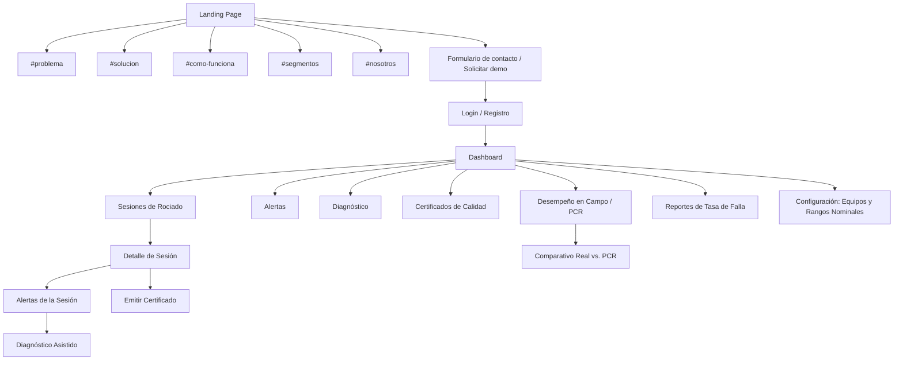

### 4.2.2. Labeling Systems.

| Etiqueta en interfaz | Término de dominio | Justificación |
|---|---|---|
| Sesiones | Sesión de rociado | Término usado por Rosa y Jorge en las entrevistas; "proceso" o "trabajo" sería ambiguo |
| OF | Orden de Fabricación | Se mantiene el acrónimo tal como lo usa la organización cliente, no se expande en la interfaz cotidiana |
| WO | Work Order / Orden de Trabajo | Idem; convive con OF porque ambos códigos son consultados en simultáneo |
| Alertas | Desviación de parámetro / Falla de equipo | "Notificaciones" se descarta por ser un término genérico de producto SaaS, no del dominio |
| Diagnóstico | Componente de máquina sospechoso | Se prioriza el resultado ("qué componente mirar") sobre el mecanismo ("regla causa-efecto") en la etiqueta visible al usuario |
| Certificado de Calidad | Evidencia documentada de proceso dentro de tolerancia | Coincide textualmente con lo que Rosa debe "sustentar ante el cliente" (Journey Map 1) |
| PCR | Planned Component Replacement | Se mantiene en inglés/acrónimo porque así lo usa la industria minera peruana en los contratos |
| Rangos Nominales | Umbral por parámetro y equipo | Evita el término genérico "configuración" |

### 4.2.3. SEO Tags and Meta Tags

```html
<title>EdgeWatch | Trazabilidad y diagnóstico de procesos HVOF en tiempo real</title>
<meta name="description" content="Plataforma que convierte la telemetría de su cabina HVOF en trazabilidad OF/WO, alertas en tiempo real, diagnóstico por componente y evidencia de calidad para sus clientes mineros.">
<meta name="keywords" content="monitoreo HVOF, trazabilidad recubrimiento térmico, software mantenimiento minero, PCR componentes, diagnóstico de fallas industrial, certificado de calidad recubrimiento">
<link rel="canonical" href="https://edgewatch.pe/">

<meta property="og:type" content="website">
<meta property="og:site_name" content="EdgeWatch">
<meta property="og:title" content="EdgeWatch | Trazabilidad y diagnóstico de procesos HVOF en tiempo real">
<meta property="og:description" content="De la telemetría del PLC a la evidencia de calidad: trazabilidad, alertas y diagnóstico para servicios de recubrimiento HVOF.">
<meta property="og:image" content="https://edgewatch.pe/assets/og/edgewatch-cover.jpg">
<meta property="og:locale" content="es_PE">

<meta name="twitter:card" content="summary_large_image">
<meta name="twitter:title" content="EdgeWatch | Trazabilidad y diagnóstico HVOF">
<meta name="twitter:description" content="Convierta la telemetría de su cabina HVOF en trazabilidad, alertas y diagnóstico accionable.">

<script type="application/ld+json">
{
  "@context": "https://schema.org",
  "@type": "SoftwareApplication",
  "name": "EdgeWatch",
  "applicationCategory": "BusinessApplication",
  "operatingSystem": "Web",
  "offers": {
    "@type": "Offer",
    "priceCurrency": "PEN",
    "price": "Consultar"
  },
  "provider": {
    "@type": "Organization",
    "name": "WebRunners"
  }
}
</script>
```

Cada ancla de sección (`#problema`, `#solucion`, `#segmentos`) se refleja como *heading* semántico (`h2`) para reforzar la indexación temática, y las imágenes del héroe y de segmentos incluyen atributo `alt` descriptivo (p. ej. `alt="Cabina de recubrimiento HVOF con sensores conectados a EdgeWatch"`) en lugar de texto vacío.

### 4.2.4. Searching Systems.

| Superficie | Sistema de búsqueda | Detalle |
|---|---|---|
| Landing Page | No aplica | Sitio de una sola página con navegación por anclas; el volumen de contenido no justifica un buscador interno |
| Web Application — Sesiones/OF/WO | Búsqueda con autocompletado | Campo único que resuelve por código de OF, código de WO, cliente o tag de equipo, con sugerencias mientras se escribe |
| Web Application — Historial | Filtros facetados combinables | Estado (Nominal / Alerta / Crítico / Cerrado), rango de fechas, cliente, modelo de componente, equipo |
| Web Application — Catálogo de fallas | Filtro jerárquico | Por equipo → componente de máquina → código de falla |
| General | Filtros guardados | El usuario recurrente (Rosa, Jorge) puede guardar una combinación de filtros usada con frecuencia (p. ej. "Mis OF abiertas") |

### 4.2.5. Navigation Systems.

| Tipo | Ubicación | Contenido |
|---|---|---|
| Global | Top nav del Landing Page | Producto · Cómo funciona · Segmentos · Nosotros · **Solicitar demo** (CTA destacado) |
| Global | Sidebar de la Web Application | Dashboard · Sesiones · Alertas · Diagnóstico · Certificados · PCR · Reportes · Configuración, agrupados por frecuencia de uso según la User Task Matrix (2.3.2) |
| Local / contextual | Breadcrumb dentro de un módulo | `Cliente > OF > WO > Sesión`, permite retroceder sin perder el contexto del caso que se está resolviendo |
| Contextual | Panel de alerta activa | Enlace directo "Ver diagnóstico sugerido" que salta del módulo de Alertas al de Diagnóstico sin pasar por el dashboard |
| Suplementaria | Footer del Landing Page | Mapa de enlaces, política de privacidad y confidencialidad de datos de proceso (mitigación de amenaza descrita en 2.1.2), datos de contacto, enlaces a redes |
| De cortesía | Ambas superficies | Botón "volver arriba" en el Landing Page; acceso a ayuda contextual (?) junto a campos técnicos poco frecuentes en la Web Application |

## 4.3. Landing Page UI Design.

### 4.3.1. Landing Page Wireframe.

### 4.3.2. Landing Page Mock-up.

## 4.4. Web Applications UX/UI Design.

### 4.4.1. Web Applications Wireframes.

### 4.4.2. Web Applications Wireflow Diagrams.

### 4.4.3. Web Applications Mock-ups.

### 4.4.4. Web Applications User Flow Diagrams.

## 4.5. Web Applications Prototyping.

## 4.6. Domain-Driven Software Architecture.

### 4.6.1. Design-Level Event Storming.

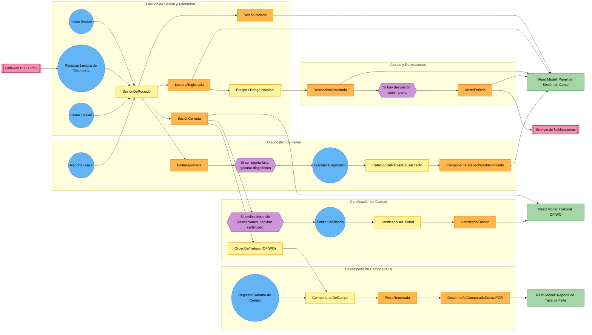

### 4.6.2. Software Architecture Context Diagram.

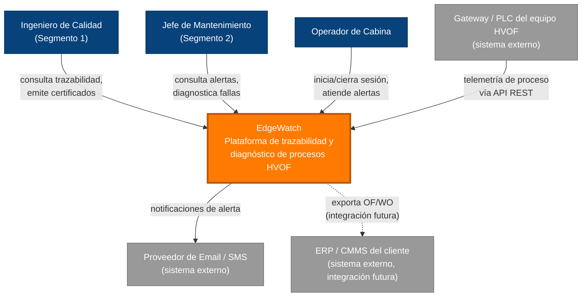

### 4.6.3. Software Architecture Container Diagrams.

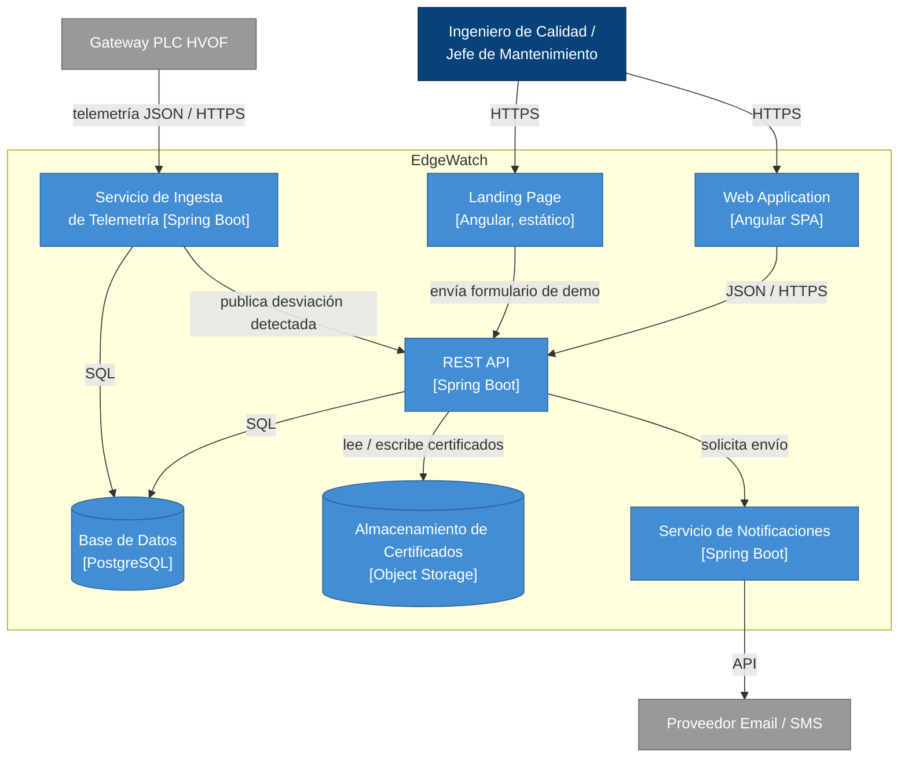

### 4.6.4. Software Architecture Components Diagrams.

Detalle de componentes internos del contenedor **REST API**, responsable de la lógica de negocio central.

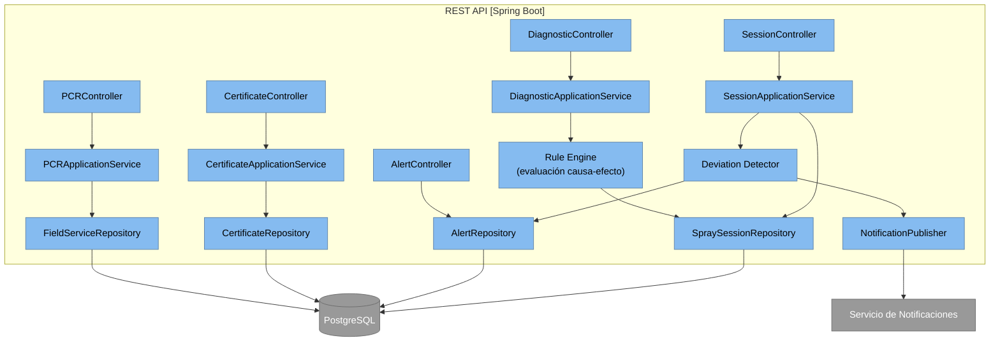

## 4.7. Software Object-Oriented Design.

### 4.7.1. Class Diagrams.

El diagrama de clases traduce los agregados del Event Storming (4.6.1) al modelo de objetos que sustentará la implementación en el Capítulo V.

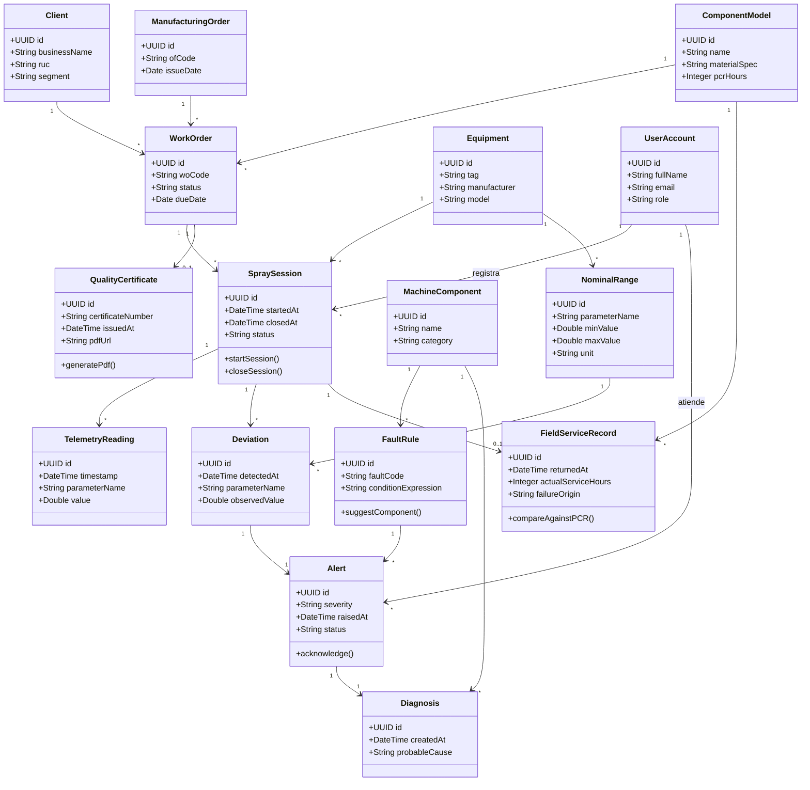

## 4.8. Database Design.

### 4.8.1. Database Diagrams.

El modelo relacional se despliega sobre PostgreSQL y refleja de forma directa el diagrama de clases de 4.7.1, con tablas puente derivadas de las relaciones muchos-a-muchos implícitas en el dominio.

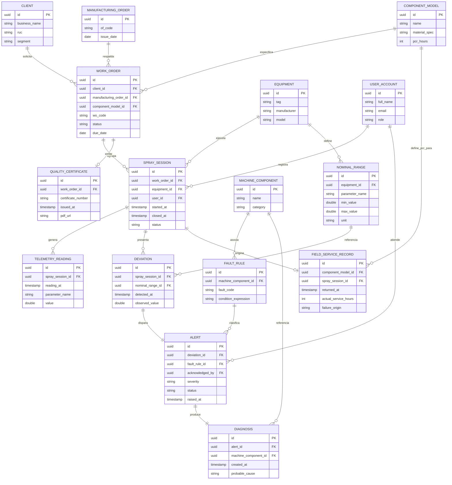

# Capítulo V: Product Implementation, Validation & Deployment
## 5.1. Software Configuration Management.
### 5.1.1. Software Development Environment Configuration.
### 5.1.2. Source Code Management.
### 5.1.3. Source Code Style Guide & Conventions.
### 5.1.4. Software Deployment Configuration.
## 5.2. Landing Page, Services & Applications Implementation.
### 5.2.X. Sprint n
#### 5.2.X.1. Sprint Planning n.
#### 5.2.X.2. Aspect Leaders and Collaborators.
#### 5.2.X.3. Sprint Backlog n.
#### 5.2.X.4. Development Evidence for Sprint Review.
#### 5.2.X.5. Execution Evidence for Sprint Review.
#### 5.2.X.6. Services Documentation Evidence for Sprint Review.
#### 5.2.X.7. Software Deployment Evidence for Sprint Review.
#### 5.2.X.8. Team Collaboration Insights during Sprint.
## 5.3. Validation Interviews.
### 5.3.1. Diseño de Entrevistas.
### 5.3.2. Registro de Entrevistas.
### 5.3.3. Evaluaciones según heurísticas.
## 5.4. Video About-the-Product.
# Conclusiones
## Conclusiones y recomendaciones.
## Video About-the-Team.

# Bibliografía
- Automation World. (2025). *How to solve the hidden risks of paper manufacturing on the factory floor*. https://www.automationworld.com/control/article/55378030/how-to-solve-the-hidden-risks-of-paper-manufacturing-on-the-factory-floor

- Innovapptive. (2024, 26 de febrero). *Overcoming equipment maintenance challenges in mining industry*. https://www.innovapptive.com/blog/overcoming-equipment-maintenance-challenges-in-mining-industry

- Khan, M. N., Shah, S., & Shamim, T. (2019). *Investigation of operating parameters on high-velocity oxyfuel thermal spray coating quality for aerospace applications. The International Journal of Advanced Manufacturing Technology*, 103, 2677–2690. https://doi.org/10.1007/s00170-019-03696-0

- Malamousi, K., Delibasis, K., & Kamnis, S. (2024). Real-time thermal spray process monitoring using convolution neural network deep learning architectures. *Journal of Thermal Spray Technology*, 33(1), 17–32. https://doi.org/10.1007/s11666-024-01713-7

- Mauer, G. (2022). Process diagnostics and control in thermal spray. *Journal of Thermal Spray Technology*, 31(4), 818–828.

- Ministerio de Energía y Minas. (2026). *Boletín Estadístico Minero: Balance anual 2025*. [Citado en Revista Tecnología Minera]. https://tecnologiaminera.com/noticia/minem-peru-alcanza-us-62848-millones-en-exportaciones-en-2025-1774388279

- Oerlikon Metco. (2025). *Thermal spray process parameters*. https://www.oerlikon.com/metco/en/solutions-technologies/what-is-thermal-spray/thermal-spray-process-parameters/

- Siemens. (2022). *The true cost of downtime 2022*. https://assets.new.siemens.com/siemens/assets/api/uuid:3d606495-dbe0-43e4-80b1-d04e27ada920/dics-b10153-00-7600truecostofdowntime2022-144.pdf

- Springer Nature. (2025). Outlook of Industry 4.0 integrated technologies in thermal spray processes and applications. *Journal of Thermal Spray Technology*. https://doi.org/10.1007/s11666-025-02096-z


# Anexos