<div align="center">
 

# UNIVERSIDAD PERUANA DE CIENCIAS APLICADAS
**Facultad de Ingeniería**  
***Carrera de Ingeniería de Software***  
*5to ciclo*  
**1ASI0730**  
**Desarrollo de Aplicaciones Open Source**  
NRC: 16712  
Docente: Sanchez Seña, Alberto Wilmer
## **"Informe del Trabajo Final"**
#### *WebRunners*
#### *EdgeWatch*

**Integrantes**

| Código     | Apellidos         | Nombres           |
|------------|-------------------|-------------------| 
| U20241b962 | Navarro Aldoradin | Carolina Celeste  |
| U202315628 | Alvarez Falen     | Esteban Valentino |
| U202425159 | Catacora Tupa     | Jhon Deyner       |
| U20221B734 | Vasquez Laos      | Sebastian Andrews |
| U202410376 | Yopla Romero      | Jonathan Alberto  |


*Setiembre, 2026*

</div>


<div style="page-break-after: always"></div>

# Registro de Versiones del Informe
| Versión | Fecha | Autor | Descripción de modificación |
|---------|-------|-------|-----------------------------|
|         |       |       |                             |


# Project Report Collaboration Insights

El URL del repositorio para el Project Report en la organización de github es el siguiente:
[https://github.com/upc-pre-202620-1asi0730-16712-wrunners/edgewatch-report](https://github.com/upc-pre-202620-1asi0730-16712-wrunners/edgewatch-report)

# Contenido
- [Registro de Versiones del Informe](#registro-de-versiones-del-informe)
- [Project Report Collaboration Insights](#project-report-collaboration-insights)
- [Contenido](#contenido)
- [Student Outcome](#student-outcome)
- [Capítulo I: Introducción](#capítulo-i-introducción)
- [1.1. Startup Profile](#11-startup-profile)
- [1.1.1. Descripción de la Startup](#111-descripción-de-la-startup)
- [1.1.2. Perfiles de integrantes del equipo](#112-perfiles-de-integrantes-del-equipo)
- [1.2. Solution Profile](#12-solution-profile)
- [1.2.1 Antecedentes y problemática](#121-antecedentes-y-problemática)
- [1.2.2 Lean UX Process.](#122-lean-ux-process)
- [1.2.2.1. Lean UX Problem Statements.](#1221-lean-ux-problem-statements)
- [1.2.2.2. Lean UX Assumptions.](#1222-lean-ux-assumptions)
- [1.2.2.3. Lean UX Hypothesis Statements.](#1223-lean-ux-hypothesis-statements)
- [1.2.2.4. Lean UX Canvas.](#1224-lean-ux-canvas)
- [1.3. Segmentos objetivo.](#13-segmentos-objetivo)

- [Capítulo II: Requirements Elicitation & Analysis](#capítulo-ii-requirements-elicitation--analysis)
- [2.1. Competidores.](#21-competidores)
- [2.1.1. Análisis competitivo.](#211-análisis-competitivo)
- [2.1.2. Estrategias y tácticas frente a competidores.](#212-estrategias-y-tácticas-frente-a-competidores)
- [2.2. Entrevistas.](#22-entrevistas)
- [2.2.1. Diseño de entrevistas.](#221-diseño-de-entrevistas)
- [2.2.2. Registro de entrevistas.](#222-registro-de-entrevistas)
- [2.2.3. Análisis de entrevistas.](#223-análisis-de-entrevistas)
- [2.3. Needfinding.](#23-needfinding)
- [2.3.1. User Personas.](#231-user-personas)
- [2.3.2. User Task Matrix.](#232-user-task-matrix)
- [2.3.3. User Journey Mapping.](#233-user-journey-mapping)
- [2.3.4. Empathy Mapping.](#234-empathy-mapping)
- [2.4. Big Picture Event Storming.](#24-big-picture-event-storming)
- [2.5. Ubiquitous Language.](#25-ubiquitous-language)

- [Capítulo III: Requirements Specification](#capítulo-iii-requirements-specification)
- [3.1. User Stories.](#31-user-stories)
- [3.2. Impact Mapping.](#32-impact-mapping)
- [3.3. Product Backlog](#33-product-backlog)

- [Capítulo IV: Product Design](#capítulo-iv-product-design)
- [4.1. Style Guidelines.](#41-style-guidelines)
- [4.1.1. General Style Guidelines.](#411-general-style-guidelines)
- [4.1.2. Web Style Guidelines.](#412-web-style-guidelines)
- [4.2. Information Architecture.](#42-information-architecture)
- [4.2.1. Organization Systems. ](#421-organization-systems)
- [4.2.2. Labeling Systems.](#422-labeling-systems)
- [4.2.3. SEO Tags and Meta Tags](#423-seo-tags-and-meta-tags)
- [4.2.4. Searching Systems.](#424-searching-systems)
- [4.2.5. Navigation Systems.](#425-navigation-systems)
- [4.3. Landing Page UI Design.](#43-landing-page-ui-design)
- [4.3.1. Landing Page Wireframe.](#431-landing-page-wireframe)
- [4.3.2. Landing Page Mock-up.](#432-landing-page-mock-up)
- [4.4. Web Applications UX/UI Design.](#44-web-applications-uxui-design)
- [4.4.1. Web Applications Wireframes.](#441-web-applications-wireframes)
- [4.4.2. Web Applications Wireflow Diagrams.](#442-web-applications-wireflow-diagrams)
- [4.4.3. Web Applications Mock-ups.](#443-web-applications-mock-ups)
- [4.4.4. Web Applications User Flow Diagrams.](#444-web-applications-user-flow-diagrams)
- [4.5. Web Applications Prototyping.](#45-web-applications-prototyping)
- [4.6. Domain-Driven Software Architecture.](#46-domain-driven-software-architecture)
- [4.6.1. Design-Level Event Storming.](#461-design-level-event-storming)
- [4.6.2. Software Architecture Context Diagram.](#462-software-architecture-context-diagram)
- [4.6.3. Software Architecture Container Diagrams.](#463-software-architecture-container-diagrams)
- [4.6.4. Software Architecture Components Diagrams.](#464-software-architecture-components-diagrams)
- [4.7. Software Object-Oriented Design.](#47-software-object-oriented-design)
- [4.7.1. Class Diagrams.](#471-class-diagrams)
- [4.8. Database Design.](#48-database-design)
- [4.8.1. Database Diagrams.](#481-database-diagrams)
- [Capítulo V: Product Implementation, Validation & Deployment](#capítulo-v-product-implementation-validation--deployment)
- [5.1. Software Configuration Management.](#51-software-configuration-management)
- [5.1.1. Software Development Environment Configuration.](#511-software-development-environment-configuration)
- [5.1.2. Source Code Management.](#512-source-code-management)
- [5.1.3. Source Code Style Guide & Conventions.](#513-source-code-style-guide--conventions)
- [5.1.4. Software Deployment Configuration.](#514-software-deployment-configuration)
- [5.2. Landing Page, Services & Applications Implementation.](#52-landing-page-services--applications-implementation)
- [5.2.X. Sprint n](#52x-sprint-n)
- [5.2.X.1. Sprint Planning n.](#52x1-sprint-planning-n)
- [5.2.X.2. Aspect Leaders and Collaborators.](#52x2-aspect-leaders-and-collaborators)
- [5.2.X.3. Sprint Backlog n.](#52x3-sprint-backlog-n)
- [5.2.X.4. Development Evidence for Sprint Review.](#52x4-development-evidence-for-sprint-review)
- [5.2.X.5. Execution Evidence for Sprint Review.](#52x5-execution-evidence-for-sprint-review)
- [5.2.X.6. Services Documentation Evidence for Sprint Review.](#52x6-services-documentation-evidence-for-sprint-review)
- [5.2.X.7. Software Deployment Evidence for Sprint Review.](#52x7-software-deployment-evidence-for-sprint-review)
- [5.2.X.8. Team Collaboration Insights during Sprint.](#52x8-team-collaboration-insights-during-sprint)
- [5.3. Validation Interviews.](#53-validation-interviews)
- [5.3.1. Diseño de Entrevistas.](#531-diseño-de-entrevistas)
- [5.3.2. Registro de Entrevistas.](#532-registro-de-entrevistas)
- [5.3.3. Evaluaciones según heurísticas.](#533-evaluaciones-según-heurísticas)
- [5.4. Video About-the-Product.](#54-video-about-the-product)
- [Conclusiones](#conclusiones)
- [Conclusiones y recomendaciones.](#conclusiones-y-recomendaciones)
- [Video About-the-Team.](#video-about-the-team)
- [Bibliografía](#bibliografía)
- [Anexos](#anexos)


# Student Outcome

El curso contribuye al cumplimiento del Student Outcome ABET: ABET – EAC - Student Outcome 5 Criterio: La capacidad de funcionar efectivamente en un equipo cuyos miembros juntos proporcionan liderazgo, crean un entorno de colaboración e inclusivo, establecen objetivos, planifican tareas y cumplen objetivos. En el siguiente cuadro se describe las acciones realizadas y enunciados de conclusiones por parte del grupo, que permiten sustentar el haber alcanzado el logro del ABET – EAC - Student Outcome 5.

| Nombre | Aportes en el proyecto | Cumplió a tiempo |
|--------|--------------------------|:---:|
| *Esteban Valentino Alvarez Falen* | - Descripción de la Startup<br>- Perfiles de integrantes del equipo<br>- Lean UX Problem Statements<br>- Análisis competitivo<br>- Style Guidelines (General)<br>- Style Guidelines (Web)<br>- SEO Tags and Meta Tags | Sí |
| *Jhon Deyner Catacora Tupa* | - Perfiles de integrantes del equipo<br>- Lean UX Assumptions<br>- Segmentos objetivo<br>- Registro de entrevistas<br>- User Personas<br>- Organization Systems<br>- Labeling Systems<br>- Searching Systems<br>- Navigation Systems | Sí |
| *Carolina Celeste Navarro Aldoradin* | - Startup Profile<br>- Solution Profile<br>- Antecedentes y problemática<br>- Impact Mapping<br>- User Stories<br>- Interviews Design<br>- Big Picture Event Storming<br>- Product Backlog from Trello<br>- Diagramas de Clase<br>- Diagramas de Base de Datos | Sí |
| *Sebastian Andrews Vasquez Laos* | - Lean UX Hypothesis Statements<br>- Lean UX Canvas<br>- Diseño de entrevistas<br>- Registro de entrevistas<br>- Análisis de entrevistas<br>- Design-Level Event Storming<br>- Software Architecture Context Diagram<br>- Software Architecture Container Diagrams<br>- Software Architecture Components Diagrams<br>- Software Configuration Management | Sí |
| *Jonathan Alberto Yopla Romero* | - Estrategias y tácticas frente a competidores<br>- Segmentos objetivo<br>- Análisis de entrevistas<br>- User Task Matrix<br>- User Journey Mapping<br>- Empathy Mapping<br>- Ubiquitous Language<br>- Landing Page UI Design<br>- Web Applications UX/UI Design<br>- Web Applications Prototyping<br>- Sprint Planning 1<br>- Aspect Leaders and Collaborators<br>- Sprint Backlog 1<br>- Development Evidence for Sprint Review | Sí |

# Capítulo I: Introducción
## 1.1. Startup Profile
### 1.1.1. Descripción de la Startup
**WebRunners** es una startup tecnológica peruana enfocada en resolver problemas de grandes organizaciones, especialmente del sector Minero e Industrial, de manera ágil e innovadora. Nace de la experiencia directa en planta, donde identificamos que procesos críticos de alta especialización siguen operando con información dispersa, registros manuales y diagnósticos que dependen del conocimiento tácito de pocas personas. Combinamos conocimiento de procesos industriales con desarrollo de software moderno para convertir datos que hoy se pierden en decisiones que evitan fallas y paradas no programadas.

*Misión*
Nuestra misión es brindar a las empresas del sector minero e industrial soluciones tecnológicas que transformen los datos de sus procesos productivos en información accionable, permitiéndoles anticipar fallas, garantizar la trazabilidad de sus operaciones y sostener con evidencia la calidad que sus clientes exigen. Buscamos que ninguna organización dependa del conocimiento tácito ni de registros manuales para tomar decisiones críticas sobre sus procesos.

*Visión*
Ser la plataforma de referencia en Latinoamérica para el monitoreo y la trazabilidad de procesos industriales de alta especialización, reconocida por acercar la analítica de datos a operaciones que históricamente han quedado fuera de la transformación digital, y por convertir cada proceso ejecutado en conocimiento que mejora el siguiente.


### 1.1.2. Perfiles de integrantes del equipo

| Foto de participante | Nombres y apellidos | Código de estudiante | Descripción de carrera | Principales conocimiento técnicos y habilidades |
|:---|:---|:---|:---|:---|
|  | Carolina Celeste Navarro Aldoradin | u20241b962 | Ingeniería de Software, Universidad Peruana de Ciencias Aplicadas | Cuento con conocimiento del lenguaje Java, C#, C++, Javascript, Python y Ladder. Asimismo, cuento con experiencia en proyectos de integración, monitoreo e IoT en entornos industriales. |
|  | Esteban Valentino Alvarez Falen | U202315628 | Ingeniería de Software, Universidad Peruana de Ciencias Aplicadas | Soy un estudiante de la carrera de Ingeniería de Software, estoy en la universidad UPC. No cuento con experiencia laboral en programas, sin embargo a lo largo de mi carrera estoy realizando proyectos para mejorar en código, trabajo en equipo y organización de proyectos. Soy una persona que le gusta pensar en soluciones y encontrar motivaciones para innovar e implementar. |
|  | Jonathan Alberto Yopla Romero | U202410376 | Ingeniería de Software, Universidad Peruana de Ciencias Aplicadas | Estudiante de Ingeniería de Software. Cuento con experiencia programando en diversos lenguajes como C++ y Javascript, así como en el desarrollo web. Además, domino el inglés. |
|  | Sebastian Andrews Vasquez Laos | U20221B734 | Ingeniería de Software, Universidad Peruana de Ciencias Aplicadas | Soy estudiante de la carrera de Ingeniería de Software en la Universidad Peruana de Ciencias Aplicadas. Cuento con conocimientos en programación, desarrollo de software y resolución de problemas adquiridos durante mi formación académica. Me interesa el trabajo en equipo, el aprendizaje continuo y la aplicación de la tecnología para desarrollar soluciones innovadoras y eficientes que generen valor en distintos entornos. |

## 1.2. Solution Profile

### 1.2.1 Antecedentes y problemática
La minería constituye el principal motor exportador de la economía peruana. Según el Boletín Estadístico Minero del Ministerio de Energía y Minas, las exportaciones de productos mineros totalizaron US$ 62,848 millones durante 2025, un crecimiento de 27.2 % respecto al año anterior, y representaron alrededor del 67.5 % del valor total exportado por el país. Esta magnitud implica que cualquier interrupción en la cadena de operación minera tiene un impacto directo sobre la economía nacional.

Para sostener esa operación, las mineras dependen de componentes sometidos a desgaste abrasivo severo: ejes de bombas de lodo, rodillos, válvulas e impulsores. Una de las tecnologías más empleadas para extender la vida útil de estas piezas es el recubrimiento por proyección térmica de alta velocidad (HVOF, High Velocity Oxygen Fuel), que deposita capas metálicas de alta densidad y resistencia al desgaste. En el Perú, este servicio no lo ejecuta la minera directamente, sino empresas especializadas que operan como proveedores del sector.

La calidad del recubrimiento depende críticamente de los parámetros de proceso. Khan, Shah y Shamim (2019) establecieron que la calidad del recubrimiento HVOF depende en gran medida de las condiciones operativas seleccionadas durante la aplicación, y estudios posteriores confirman que variables como la tasa de alimentación de polvo, la distancia de proyección, la relación combustible-oxígeno y el flujo total de gases inciden directamente sobre propiedades clave como porosidad, dureza y resistencia al desgaste. Fabricantes de equipos advierten que estas variables deben tratarse como parámetros de proceso con valores y tolerancias formalmente definidos, ya que sin ese control la calidad del recubrimiento puede verse afectada de formas inesperadas y costosas.

Pese a ello, el monitoreo en tiempo real del proceso sigue siendo un desafío técnico. Malamousi, Delibasis y Kamnis (2024) señalan que la proyección térmica es difícil de monitorear en tiempo real debido a las altas velocidades y temperaturas involucradas y al movimiento continuo de la pistola o de la pieza, y que los equipos de monitoreo estáticos existentes no logran seguir la antorcha, lo que dificulta asegurar parámetros óptimos de proceso. En paralelo, la literatura reciente sobre Industria 4.0 aplicada a proyección térmica plantea la necesidad de implementar un control de proceso más inteligente que integre datos de sensores con parámetros de máquina, características del material de aporte y métricas de calidad posteriores a la deposición, para cumplir requisitos de confiabilidad y repetibilidad.

En el contexto peruano, las empresas de servicio de recubrimiento HVOF enfrentan tres problemas concurrentes.

Primero, pérdida de trazabilidad del proceso. Los parámetros de operación se generan en el PLC de la máquina, pero se conservan en registros locales o en formatos no consultables. Cuando el cliente exige evidencia de que un lote fue recubierto dentro de tolerancias, la empresa carece de un respaldo estructurado que vincule la orden de fabricación (OF) y la orden de trabajo (WO) con las condiciones reales de la sesión de rociado. Esta dependencia de registros dispersos es un problema documentado en la industria: los procesos basados en papel introducen riesgos de lectura errónea, registro inconsistente e información fragmentada, que retrasan la detección y resolución de incidencias.

Segundo, diagnóstico de fallas dependiente de conocimiento tácito. Cuando el equipo se detiene por una falla, como bloqueo del alimentador, sobrepresión de tolva, paro por temporizador, la identificación de la causa raíz depende de la experiencia de pocos técnicos y de la revisión manual de registros crudos. No existe un mecanismo que correlacione automáticamente la falla con el componente de máquina responsable, lo que prolonga el tiempo de diagnóstico y dificulta detectar patrones recurrentes.

Tercero, imposibilidad de análisis retrospectivo contra el PCR. Las piezas recubiertas se entregan con una expectativa de vida útil formalizada en el Planned Component Replacement (PCR). Cuando una pieza retorna del campo antes de alcanzar ese objetivo, no es posible reconstruir con qué parámetros fue recubierta ni determinar si la falla prematura tuvo origen en el proceso de recubrimiento, en el material, o en las condiciones de operación en mina.

El costo de esta brecha de información es significativo. El reporte True Cost of Downtime de Siemens estima que las 500 mayores empresas del mundo pierden alrededor del 11 % de sus ingresos por paradas no planificadas, equivalente a USD 1.4 billones anuales, y la falla de componentes críticos representa el 45 % de los casos reportados de downtime. En el sector minero específicamente, estimaciones de la industria sitúan el costo promedio de una parada de equipo en torno a US$ 180,000 por incidente.

En síntesis, existe una desconexión entre los datos que la máquina HVOF ya genera y la capacidad de la organización para convertirlos en trazabilidad verificable, diagnóstico oportuno y aprendizaje sobre el desempeño en campo. EdgeWatch se propone cerrar esa brecha mediante una plataforma que capture la telemetría del proceso, la vincule a la orden de trabajo y a la pieza del cliente, correlacione las fallas con el componente de máquina implicado, y permita contrastar el desempeño real en operación contra el PCR comprometido.

A continuación, se muestra un árbol de problemas que ordena visualmente las causas y efectos del problema mencionados anteriormente.

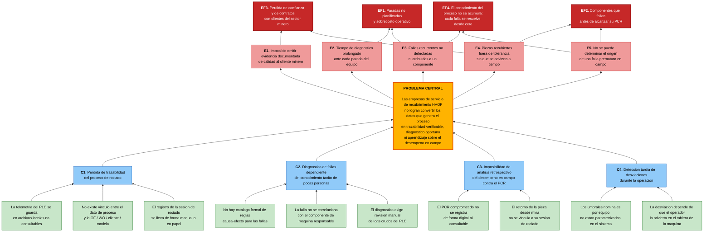
```mermaid
flowchart BT

classDef efectoFinal fill:#C62828,stroke:#8E0000,stroke-width:2px,color:#FFFFFF
classDef efectoDirecto fill:#EF9A9A,stroke:#C62828,stroke-width:1px,color:#000000
classDef central fill:#FFB300,stroke:#E65100,stroke-width:3px,color:#000000
classDef causaDirecta fill:#90CAF9,stroke:#1565C0,stroke-width:1px,color:#000000
classDef causaRaiz fill:#C8E6C9,stroke:#2E7D32,stroke-width:1px,color:#000000

PC["<b>PROBLEMA CENTRAL</b><br/><br/>Las empresas de servicio de recubrimiento HVOF<br/>no logran convertir los datos que genera el proceso<br/>en trazabilidad verificable, diagnostico oportuno<br/>ni aprendizaje sobre el desempeno en campo"]

CR1["La telemetria del PLC se guarda<br/>en archivos locales no consultables"]
CR2["No existe vinculo entre el dato de proceso<br/>y la OF / WO / cliente / modelo"]
CR3["El registro de la sesion de rociado<br/>se lleva de forma manual o en papel"]

CR4["No hay catalogo formal de reglas<br/>causa-efecto para las fallas"]
CR5["La falla no se correlaciona<br/>con el componente de maquina responsable"]
CR6["El diagnostico exige revision manual<br/>de logs crudos del PLC"]

CR7["El PCR comprometido no se registra<br/>de forma digital ni consultable"]
CR8["El retorno de la pieza desde mina<br/>no se vincula a su sesion de rociado"]

CR9["Los umbrales nominales por equipo<br/>no estan parametrizados en el sistema"]
CR10["La desviacion depende de que el operador<br/>la advierta en el tablero de la maquina"]

CD1["<b>C1.</b> Perdida de trazabilidad<br/>del proceso de rociado"]
CD2["<b>C2.</b> Diagnostico de fallas dependiente<br/>del conocimiento tacito de pocas personas"]
CD3["<b>C3.</b> Imposibilidad de analisis retrospectivo<br/>del desempeno en campo contra el PCR"]
CD4["<b>C4.</b> Deteccion tardia de desviaciones<br/>durante la operacion"]

ED1["<b>E1.</b> Imposible emitir evidencia documentada<br/>de calidad al cliente minero"]
ED2["<b>E2.</b> Tiempo de diagnostico prolongado<br/>ante cada parada del equipo"]
ED3["<b>E3.</b> Fallas recurrentes no detectadas<br/>ni atribuidas a un componente"]
ED4["<b>E4.</b> Piezas recubiertas fuera de tolerancia<br/>sin que se advierta a tiempo"]
ED5["<b>E5.</b> No se puede determinar el origen<br/>de una falla prematura en campo"]

EF1["<b>EF1.</b> Paradas no planificadas<br/>y sobrecosto operativo"]
EF2["<b>EF2.</b> Componentes que fallan<br/>antes de alcanzar su PCR"]
EF3["<b>EF3.</b> Perdida de confianza y de contratos<br/>con clientes del sector minero"]
EF4["<b>EF4.</b> El conocimiento del proceso no se acumula:<br/>cada falla se resuelve desde cero"]

CR1 --> CD1
CR2 --> CD1
CR3 --> CD1

CR4 --> CD2
CR5 --> CD2
CR6 --> CD2

CR7 --> CD3
CR8 --> CD3

CR9 --> CD4
CR10 --> CD4

CD1 --> PC
CD2 --> PC
CD3 --> PC
CD4 --> PC

%% Main problem

PC --> ED1
PC --> ED2
PC --> ED3
PC --> ED4
PC --> ED5

ED1 --> EF3
ED2 --> EF1
ED3 --> EF1
ED3 --> EF4
ED4 --> EF2
ED5 --> EF2
ED5 --> EF4
ED4 --> EF3

%% Styles

class PC central
class CD1,CD2,CD3,CD4 causaDirecta
class CR1,CR2,CR3,CR4,CR5,CR6,CR7,CR8,CR9,CR10 causaRaiz
class ED1,ED2,ED3,ED4,ED5 efectoDirecto
class EF1,EF2,EF3,EF4 efectoFinal
```

### 1.2.2 Lean UX Process.

El Lean UX Process permite a WebRunners validar de forma temprana las creencias que sustentan EdgeWatch, evitando construir funcionalidad sobre supuestos no verificados. El proceso parte de un enunciado único del problema para todo el proyecto, del cual se derivan los assumptions organizados en cinco categorías, y de estos, específicamente de los feature assumptions, se formulan los hypothesis statements que el equipo someterá a validación durante los sprints. Se aplica la versión del template Brand new initiative, dado que EdgeWatch no constituye la evolución de un producto existente sino una iniciativa nueva.

#### 1.2.2.1. Lean UX Problem Statements.

***El estado actual del*** *mercado de recubrimiento por proyección térmica industrial (HVOF) se ha centrado principalmente en la entrega del recubrimiento como un servicio físico a clientes de minería e industria pesada, en la experiencia del operador como el mecanismo principal para detectar desviaciones en el proceso, y en flujos de trabajo donde los parámetros de proceso generados por el PLC de la máquina permanecen en registros locales que nunca se vinculan a la orden de trabajo, al componente del cliente ni a su vida útil esperada.*

***Lo que los productos/servicios existentes no logran abordar es*** *la brecha entre la telemetría que el equipo HVOF ya genera y la capacidad de la organización para convertirla en trazabilidad verificable, diagnósticos oportunos de fallas que apunten a una pieza específica de la máquina, y aprendizaje retrospectivo sobre el desempeño real en campo de los componentes recubiertos frente a su objetivo de Reemplazo Planificado de Componentes (PCR).*

***Nuestro producto/servicio abordará esta brecha al*** *proporcionar una plataforma web que ingesta telemetría del proceso de rociado en tiempo real a través de una API RESTful, vincula cada sesión de rociado con su orden de fabricación (OF), orden de trabajo (WO), cliente y modelo de componente, genera alertas cuando los parámetros se encuentran fuera de los rangos nominales del equipo, aplica un catálogo configurable de reglas causa-efecto para identificar la pieza de la máquina sospechosa, y registra la vida útil en campo para contrastar el desempeño real frente al PCR comprometido.*

***Nuestro enfoque inicial estará en*** *proveedores especializados de servicios de recubrimiento HVOF que operan en el Perú, que atienden a clientes de minería y tienen la exigencia de demostrar la calidad del proceso, y de forma secundaria en plantas industriales que operan una línea de proyección térmica propia (in-house).*

***Sabremos que tenemos éxito cuando veamos*** *a los proveedores de servicios de recubrimiento emitir evidencia de calidad generada por la plataforma para al menos el 80% de sus órdenes de trabajo entregadas, una reducción de al menos el 40% en el tiempo necesario para determinar la causa probable de una parada de equipo, y al menos el 60% de los componentes retornados con su vida útil en campo registrada y contrastada contra su objetivo de PCR dentro de la plataforma.*


#### 1.2.2.2. Lean UX Assumptions.

A continuación se enumeran las creencias resultantes de la sesión de discusión del equipo, organizadas según los cinco tipos de assumptions establecidos en Lean UX. Estos enunciados constituyen creencias, no preguntas de discusión.

**Business Assumptions**

1. Creemos que existe en el Perú un número suficiente de empresas de servicio especializado en recubrimiento HVOF y de plantas industriales con línea propia como para sostener un modelo de suscripción B2B.
2. Creemos que la presión por trazabilidad proviene del cliente final (minera) y se transfiere contractualmente al proveedor de recubrimiento, lo que convierte la evidencia de proceso en un requisito comercial y no en una mejora opcional.
3. Creemos que las empresas del segmento están dispuestas a pagar una suscripción mensual por equipo monitoreado, siempre que el costo sea marginal frente al costo de una parada no planificada.
4. Creemos que WebRunners puede construir y operar la plataforma con tecnologías open source (.NET, Vue, MySQL) sin incurrir en costos de licenciamiento que comprometan el margen.
5. Creemos que la integración con el equipo HVOF puede realizarse mediante un gateway que exponga la telemetría vía API REST, sin requerir modificar el PLC ni el software del fabricante del equipo.
6. Creemos que el conocimiento del dominio industrial que posee el equipo constituye una barrera de entrada frente a competidores de software genérico de mantenimiento.

**Business Outcome Assumptions**
1. Creemos que el éxito se evidenciará en la cantidad de órdenes de trabajo cerradas en la plataforma con certificado de calidad emitido.
2. Creemos que el éxito se evidenciará en la reducción del tiempo promedio entre la ocurrencia de una falla y la identificación de su causa probable.
3. Creemos que el éxito se evidenciará en la tasa de renovación de la suscripción al término del primer año.
4. Creemos que el éxito se evidenciará en el número de componentes retornados de campo cuyo desempeño real fue registrado y contrastado contra su PCR.
5. Creemos que el éxito se evidenciará en la cantidad de sesiones de rociado registradas por mes y por equipo, como indicador de adopción sostenida.
6. Creemos que el éxito se evidenciará en la reducción del número de reclamos de clientes por fallas prematuras que no pudieron ser explicadas.

**User Assumptions**
1. Creemos que el usuario principal del segmento de empresas de servicio es el Ingeniero de Calidad o Jefe de Procesos, responsable de que el recubrimiento cumpla las especificaciones acordadas con el cliente.
2. Creemos que el usuario principal del segmento de plantas con línea in-house es el Jefe o Supervisor de Mantenimiento, responsable de la disponibilidad del equipo de recubrimiento.
3. Creemos que el operador de la cabina de rociado es un usuario secundario que interactúa con la plataforma principalmente para iniciar y cerrar sesiones, y para atender alertas.
4. Creemos que ambos perfiles poseen alta competencia en el dominio industrial pero competencia media en herramientas de software, por lo que la curva de aprendizaje debe ser mínima.
5. Creemos que estos usuarios acceden a la plataforma principalmente desde computadores de escritorio en oficina o taller, y de forma secundaria desde dispositivos móviles para consultar alertas.
6. Creemos que el técnico de mantenimiento no requiere que el sistema le indique qué hacer, sino dónde mirar: qué componente de máquina está implicado en la falla.

**User Outcome and Benefit Assumptions**
1. Creemos que el Ingeniero de Calidad busca poder respaldar ante su cliente que un lote fue recubierto dentro de tolerancias, sin depender de reconstruir información desde registros dispersos.
2. Creemos que el Jefe de Mantenimiento busca reducir el tiempo que dedica a determinar por qué se detuvo el equipo.
3. Creemos que ambos perfiles buscan anticipar fallas recurrentes antes de que impacten una ventana de producción comprometida.
4. Creemos que el usuario obtiene valor al poder responder, frente a una falla prematura en campo, si el origen estuvo en el proceso de recubrimiento o fue ajeno a él.
5. Creemos que el usuario valora que el conocimiento sobre fallas quede registrado en el sistema y no dependa de la permanencia de un especialista en la organización.
6. Creemos que el operador obtiene valor al ser advertido de una desviación mientras la sesión está en curso, y no al finalizarla.

**Feature Assumptions**
1. Creemos que un endpoint REST de ingesta de telemetría que registre las lecturas de proceso durante la sesión de rociado permitirá conservar el dato que hoy se pierde.
2. Creemos que vincular cada sesión de rociado con su OF, WO, cliente y modelo de componente permitirá reconstruir la historia completa de cualquier pieza.
3. Creemos que permitir la configuración de rangos nominales por equipo y la detección automática de desviaciones permitirá identificar condiciones fuera de tolerancia sin depender de la vigilancia del operador.
4. Creemos que un módulo de alertas en tiempo real notificará al responsable en el momento en que la desviación ocurre.
5. Creemos que un catálogo configurable de reglas causa-efecto que identifique el componente de máquina sospechoso reducirá el tiempo de diagnóstico.
6. Creemos que la detección de patrones recurrentes de falla por componente permitirá anticipar problemas antes de que provoquen una parada mayor.
7. Creemos que la generación exportable de certificados de calidad por orden de trabajo permitirá entregar evidencia documentada al cliente.
8. Creemos que el registro de vida útil en campo contrastado contra el PCR comprometido permitirá evaluar el desempeño real del recubrimiento a lo largo del tiempo.
9. Creemos que reportes de tasa de falla agrupados por cliente y por modelo de componente revelarán patrones que hoy no son visibles para la organización.

### 1.2.2.3. Lean UX Hypothesis Statements.
Se formula un hypothesis statement por cada feature assumption enunciado en la sección anterior, siguiendo el template establecido.  

---
**Hypothesis Statement 01. Ingesta de telemetría de proceso**

**Creemos que lograremos** un incremento en la cantidad de sesiones de rociado con registros completos de proceso almacenados en la plataforma  
**Si** los Ingenieros de Calidad en empresas de servicio de recubrimiento HVOF y los Supervisores de Mantenimiento en plantas de recubrimiento in-house  
**Obtienen** un registro permanente y consultable de las condiciones bajo las cuales se ejecutó cada sesión de rociado  
**Con** un endpoint RESTful de ingesta de telemetría que registre las lecturas de proceso durante toda la sesión de rociado.

---
**Hypothesis Statement 02. Vinculación de la sesión con OF, WO, cliente y modelo**

**Creemos que lograremos** un incremento en el porcentaje de órdenes de trabajo que pueden ser completamente trazadas desde el cliente hasta las condiciones de proceso  
**Si** los Ingenieros de Calidad en empresas de servicio de recubrimiento HVOF  
**Obtienen** la capacidad de reconstruir la historia completa de cualquier componente recubierto a demanda  
**Con** la vinculación de cada sesión de rociado con su orden de fabricación, orden de trabajo, cliente y modelo de componente.  
---
**Hypothesis Statement 03. Rangos nominales y detección de desviaciones**  

**Creemos que lograremos** una reducción en la cantidad de componentes recubiertos fuera de especificación sin ser detectados  
**Si** los Ingenieros de Calidad y los Operadores de cabina de rociado  
**Obtienen** la identificación automática de condiciones fuera de tolerancia sin depender de una supervisión manual continua  
**Con** la configuración de rangos nominales de parámetros por equipo y la detección automática de desviaciones.  
---
**Hypothesis Statement 04. Alertas en tiempo real**  

**Creemos que lograremos** una reducción en el tiempo promedio entre una desviación del proceso y la respuesta del responsable  
**Si** los Operadores de cabina de rociado y los Supervisores de Mantenimiento  
**Obtienen** conocimiento oportuno de una desviación mientras la sesión aún está en curso y no después de que finalice  
**Con** un módulo de alertas en tiempo real que notifique al usuario responsable cuando se detecte una desviación o falla.  
---
**Hypothesis Statement 05. Diagnóstico asistido por reglas causa-efecto**  

**Creemos que lograremos** una reducción de al menos el 40% en el tiempo requerido para determinar la causa probable de una parada de equipo  
**Si** los Supervisores de Mantenimiento y los técnicos de mantenimiento  
**Obtienen** un diagnóstico que señale la pieza específica de la máquina involucrada en lugar de un código de falla sin procesar  
**Con** un catálogo configurable de reglas causa-efecto que correlacione la falla con una pieza de máquina sospechosa.
---
**Hypothesis Statement 06. Detección de patrones recurrentes de falla**  

**Creemos que lograremos** una reducción en las paradas no planificadas durante las ventanas de producción comprometidas  
**Si** los Supervisores de Mantenimiento tanto en empresas de servicio de recubrimiento como en plantas con línea in-house  
**Obtienen** visibilidad temprana de las piezas de máquina que están fallando reiteradamente  
**Con** la detección automática de patrones recurrentes de falla agrupados por pieza de máquina y por equipo.  
---
**Hypothesis Statement 07. Certificados de calidad por orden de trabajo**  

**Creemos que lograremos** evidencia de calidad generada por la plataforma para al menos el 80% de las órdenes de trabajo entregadas  
**Si** los Ingenieros de Calidad en empresas de servicio de recubrimiento HVOF  
**Obtienen** la capacidad de entregar a sus clientes mineros un respaldo documentado de que el lote fue recubierto dentro de las tolerancias  
**Con** la generación exportable de certificados de calidad por orden de trabajo.  
---
**Hypothesis Statement 08. Registro de vida útil contra PCR**  

**Creemos que lograremos** que la vida útil en campo sea registrada y contrastada contra el PCR para al menos el 60% de los componentes retornados  
**Si** los Ingenieros de Calidad y los Supervisores de Mantenimiento  
**Obtienen** la capacidad de determinar si una falla prematura en campo se originó en el proceso de recubrimiento o por una causa externa  
**Con** el registro de vida útil en campo contrastado contra el objetivo de Reemplazo Planificado de Componentes (PCR) comprometido.  
--- 

**Hypothesis Statement 09. Reportes de tasa de falla por cliente y modelo**  

**Creemos que lograremos** un incremento en la cantidad de decisiones de mejora de procesos respaldadas por evidencia histórica  
**Si** los Ingenieros de Calidad y los Jefes de Planta  
**Obtienen** visibilidad sobre patrones de falla que no son observables a partir de órdenes de trabajo individuales  
**Con** reportes de tasa de fallas agrupados por cliente y por modelo de componente.
---

### 1.2.2.4. Lean UX Canvas.
A continuación se presenta el Lean UX Canvas (versión 2, Jeff Gothelf) elaborado por el equipo, el cual consolida en un solo artefacto el problema de negocio, los resultados esperados, los usuarios, las soluciones propuestas y las hipótesis derivadas de las secciones anteriores. Los cuadros 7 y 8 establecen la prioridad de aprendizaje del equipo para el primer ciclo de validación.


## 1.3. Segmentos objetivo.

EdgeWatch se dirige a organizaciones que **operan** un proceso de recubrimiento térmico HVOF, no a quienes consumen sus resultados. Esta distinción es determinante: las empresas mineras son las que exigen la garantía de vida útil y las que sufren el costo de una falla prematura, pero no operan equipos HVOF ni serían las usuarias directas de la plataforma. Actúan como la fuente de presión contractual que motiva la adquisición del producto, no como segmento de usuario. En consecuencia, se han definido dos segmentos objetivo diferenciados por el **tipo de operación** que realizan y no por su tamaño, ya que es el tipo de operación—servicio a terceros frente a operación interna, el que genera necesidades y motivaciones de compra distintas.

### Contexto de mercado

La minería constituye el principal motor exportador de la economía peruana. Según el Boletín Estadístico Minero del Ministerio de Energía y Minas, las exportaciones de productos mineros totalizaron **US$ 62,848 millones durante 2025**, un crecimiento de **27.2 %** respecto al año anterior, y representaron alrededor del **67.5 %** del valor total exportado por el país (MINEM, 2026). A octubre de 2025 existían en el Perú **19,151 titulares mineros** con derechos sobre **55,783 concesiones** (CooperAcción, 2025), lo que dimensiona la escala de la actividad que demanda servicios de mantenimiento y recuperación de componentes.

El ecosistema de proveedores que atiende a este sector tiene además una trayectoria de crecimiento proyectada. De acuerdo con estimaciones de la Sociedad Nacional de Industrias, el aporte de los proveedores mineros al PBI nacional se sitúa actualmente entre **3.5 % y 3.8 %**, y podría alcanzar hasta el **12 % para 2030** si se ejecuta la cartera de proyectos mineros estimada en **US$ 52,000 millones** (Energiminas, 2025).

El costo del problema que EdgeWatch atiende también está documentado. El reporte *True Cost of Downtime* de Siemens estima que las 500 mayores empresas del mundo pierden alrededor del **11 % de sus ingresos** por paradas no planificadas, y la falla de componentes críticos representa el **45 %** de los casos reportados de downtime. En el sector minero específicamente, estimaciones de la industria sitúan el costo promedio de una parada de equipo en torno a **US$ 180,000 por incidente** (Innovapptive, 2024).

---

### Segmento 1: Empresas de servicio especializado en recubrimiento HVOF

**Descripción**

Empresas que ofrecen recubrimiento térmico HVOF como servicio a terceros, operando una o más cabinas de rociado y atendiendo simultáneamente a varios clientes industriales, principalmente del sector minero. Su negocio depende de la capacidad de demostrar que el recubrimiento se ejecutó dentro de las especificaciones acordadas, ya que el cliente vincula la vida útil esperada de la pieza (PCR) a la calidad del proceso. En el mercado peruano este segmento es reducido y altamente especializado, lo que lo convierte en un nicho de alta concentración: pocos actores, contratos de alto valor y fuerte dependencia de la reputación técnica.

**Características demográficas y organizacionales**

| Variable | Descripción |
|---|---|
| Tipo de organización | Empresa de servicios industriales / metalmecánica especializada |
| Tamaño | Mediana empresa; entre 50 y 500 colaboradores |
| Ubicación | Lima Metropolitana y Callao (zonas industriales), con presencia comercial en regiones mineras (Arequipa, Cajamarca, Áncash, Junín) |
| Sector económico | Servicios de mantenimiento y recuperación de componentes industriales |
| Clientes principales | Empresas mineras de gran y mediana minería, oil & gas, generación eléctrica |
| Antigüedad | Organizaciones consolidadas, típicamente con más de 10 años de operación |
| Nivel de digitalización | Medio; cuentan con ERP administrativo, pero los datos de proceso permanecen en registros locales o en papel |

**Perfil del usuario dentro de la organización**

| Variable | Descripción |
|---|---|
| Rol principal | Ingeniero de Calidad / Jefe de Procesos |
| Rol secundario | Supervisor de Mantenimiento, Operador de cabina de rociado |
| Edad | 28 a 50 años |
| Formación | Ingeniería Mecánica, Metalúrgica, Industrial o de Materiales |
| Competencia en el dominio | Alta |
| Competencia digital | Media; usuario habitual de hojas de cálculo y ERP, no de herramientas analíticas |
| Dispositivo de preferencia | Computador de escritorio o laptop en oficina y taller; móvil para consulta de alertas |
| Idioma de trabajo | Español, con manejo de terminología técnica en inglés |

**Motivación de compra**

Este segmento adquiere EdgeWatch porque **sin trazabilidad no puede sostener la garantía que sus clientes le exigen**. La presión es comercial antes que operativa: la incapacidad de entregar evidencia documentada del proceso compromete la renovación de contratos con clientes mineros que auditan a sus proveedores.

---

### Segmento 2: Plantas industriales con línea de recubrimiento in-house

**Descripción**

Organizaciones cuyo negocio principal no es el recubrimiento, pero que operan una cabina de thermal spray dentro de sus instalaciones para recuperar sus propios componentes críticos. El recubrimiento es para ellos un proceso de soporte al mantenimiento, no un producto. Su preocupación central es la disponibilidad del equipo: una falla de la cabina durante una ventana de parada programada compromete todo el cronograma de mantenimiento de la planta. En el Perú este segmento es menos frecuente que el primero y se concentra en operaciones de gran escala; su presencia es considerablemente mayor en mercados como Chile, Brasil, Estados Unidos y Europa, lo que lo posiciona como vía natural de expansión regional.

**Características demográficas y organizacionales**

| Variable | Descripción |
|---|---|
| Tipo de organización | Planta industrial de gran escala con taller de mantenimiento propio |
| Tamaño | Gran empresa; más de 500 colaboradores |
| Ubicación | Regiones mineras e industriales del Perú (Áncash, Arequipa, Cajamarca, Moquegua, Ica) y mercados regionales de expansión |
| Sector económico | Minería, oil & gas, generación eléctrica, cemento, siderurgia |
| Cliente del proceso | Interno (áreas de operación y mantenimiento de la propia planta) |
| Nivel de digitalización | Medio-alto; cuentan con CMMS o SAP PM para gestión de mantenimiento, sin integración con datos de proceso del equipo de spray |

**Perfil del usuario dentro de la organización**

| Variable | Descripción |
|---|---|
| Rol principal | Jefe o Supervisor de Mantenimiento |
| Rol secundario | Ingeniero de Confiabilidad, Técnico de mantenimiento, Planner |
| Edad | 30 a 55 años |
| Formación | Ingeniería Mecánica o Industrial; personal técnico con formación en institutos tecnológicos |
| Competencia en el dominio del spray | Media; son especialistas en mantenimiento general, no en thermal spray específicamente |
| Competencia digital | Media-alta; usuarios habituales de CMMS y sistemas de gestión de activos |
| Dispositivo de preferencia | Computador de escritorio en oficina de mantenimiento; móvil o tablet en planta |
| Idioma de trabajo | Español, con manejo de terminología técnica en inglés |

**Motivación de compra**

Este segmento adquiere EdgeWatch porque **no puede permitirse que el equipo de recubrimiento falle durante una ventana crítica**. La presión es operativa: dado que sus técnicos no son especialistas en thermal spray, el diagnóstico asistido compensa la brecha de expertise y reduce la dependencia de asistencia técnica externa del fabricante del equipo.

---

### Síntesis comparativa

| Criterio | Segmento 1: Servicio especializado | Segmento 2: Línea in-house |
|---|---|---|
| Naturaleza del proceso | Negocio principal | Proceso de soporte |
| Quién decide la compra | Gerencia General / Gerencia Comercial | Jefatura de Planta / Gerencia de Mantenimiento |
| Dolor principal | Pérdida de contratos por falta de evidencia de calidad | Parada no programada durante ventana crítica |
| Usuario primario | Ingeniero de Calidad | Jefe de Mantenimiento |
| Prioridad de features | Trazabilidad OF/WO, certificados de calidad, análisis PCR | Alertas en tiempo real, diagnóstico por componente, patrones recurrentes |
| Presencia en Perú | Nicho concentrado, pocos actores | Reducida; mayor en mercados regionales |
| Rol en la estrategia | Segmento de foco inicial | Segmento de expansión |

Ambos segmentos comparten el núcleo funcional de la plataforma: ingesta de telemetría, detección de desviaciones y diagnóstico de fallas, pero difieren en el peso relativo que asignan a cada capacidad. Esta convergencia funcional con divergencia de prioridades permite a WebRunners sostener un único producto atendiendo a dos motivaciones de compra distintas, y justifica el enfoque inicial en el Segmento 1, cuyo dolor es más agudo y cuyo ciclo de venta es más corto en el mercado peruano.

# Capítulo II: Requirements Elicitation & Analysis
## 2.1. Competidores.

El dominio del monitoreo de procesos de recubrimiento térmico presenta una particularidad competitiva relevante: **no existe actualmente un producto de software SaaS que cubra de extremo a extremo la trazabilidad del proceso HVOF vinculada a la orden de trabajo y al desempeño en campo del componente**. La oferta existente se concentra en dos extremos del espectro. Por un lado, fabricantes de sensórica industrial especializada que resuelven la medición del proceso con hardware propietario de alto costo, sin capa de gestión ni trazabilidad documental. Por otro, plataformas genéricas de MES, QMS y CMMS que resuelven la trazabilidad y la gestión de mantenimiento, pero desconocen por completo el dominio del thermal spray y no interpretan sus parámetros ni sus modos de falla.

EdgeWatch se ubica deliberadamente en el espacio intermedio. Por ello, el análisis considera dos competidores directos —empresas que ofrecen monitoreo específico de procesos de thermal spray, y un competidor indirecto, plataforma de trazabilidad industrial genérica con oferta parcialmente similar—, conforme a lo establecido en el enunciado del proyecto.

| # | Competidor | Tipo | Origen | Naturaleza de la oferta |
|---|---|---|---|---|
| C1 | **Tecnar Automation** (Accuraspray 4.0 / DPV evolution) | Directo | Canadá | Sensórica en línea para monitoreo de pluma y partículas en vuelo |
| C2 | **Oerlikon Metco** (sistemas de control de proceso) | Directo | Suiza | Fabricante de equipos HVOF con software de control y hojas de parámetros |
| C3 | **DELMIAWorks** (Dassault Systèmes) | Indirecto | Francia / EE. UU. | MES/QMS con trazabilidad de manufactura genérica |


### 2.1.1. Análisis competitivo.

#### Competitive Analysis Landscape

**¿Por qué llevar a cabo este análisis?**

> Determinar si existe en el mercado una solución que resuelva simultáneamente la trazabilidad del proceso HVOF vinculada a la orden de trabajo, el diagnóstico de fallas orientado al componente de máquina y el contraste del desempeño en campo contra el PCR; e identificar en qué medida las alternativas actuales resultan accesibles para empresas de recubrimiento peruanas de tamaño mediano. El objetivo es validar que existe un espacio no atendido y establecer sobre qué dimensiones EdgeWatch puede sostener una ventaja competitiva defendible.

| | **WebRunners — EdgeWatch**                                                                                                                                                                                         | **C1. Tecnar Automation** | **C2. Oerlikon Metco** | **C3. DELMIAWorks** |
|---|------------------------------------------------------------------------------------------------------------------------------------------------------------------------------------------------------------------------------|---|---|---|
| **PERFIL** |                                                                                                                                                                                                                              | | | |
| Overview | Startup peruana que ofrece una plataforma web SaaS para monitoreo, trazabilidad y diagnóstico de procesos HVOF, construida sobre tecnologías open source y desplegada en cloud.                                              | Fabricante canadiense de sensores en línea para procesos de proyección térmica. Su producto Accuraspray 4.0 mide temperatura, velocidad, dimensión y estabilidad de la pluma de rociado. | Fabricante suizo líder mundial de equipos y consumibles para thermal spray. Provee pistolas, polvos y sistemas de control de proceso propietarios asociados a sus equipos. | División de Dassault Systèmes que ofrece un MES/ERP con módulos de gestión de calidad y trazabilidad de manufactura para industria discreta. |
| Ventaja competitiva / ¿Qué valor ofrece a los clientes? | Conecta el dato de proceso con la orden de trabajo, el cliente y el desempeño real de la pieza en campo. Conocimiento profundo del dominio HVOF en contexto minero peruano. Costo de entrada bajo, sin hardware propietario. | Precisión metrológica certificada y calibración trazable a NIST. Es el estándar de facto para caracterización de pluma en investigación y desarrollo de parámetros. | Integración nativa con su propio equipo. Respaldo de marca global y soporte técnico especializado en toda la cadena (equipo, consumible, parámetro). | Cobertura funcional muy amplia: trazabilidad de lote, control de calidad, planificación y ejecución de manufactura en una sola plataforma. |
| **PERFIL DE MARKETING** |                                                                                                                                                                                                                              | | | |
| Mercado objetivo | Empresas de servicio especializado en recubrimiento HVOF y plantas industriales con línea in-house, en Perú y Latinoamérica.                                                                                                 | Talleres de thermal spray, centros de investigación y fabricantes aeroespaciales a nivel global. | Compradores de equipos HVOF a nivel global; industria aeroespacial, energía, automotriz y petróleo y gas. | Manufactura discreta de mediano y gran tamaño a nivel global; automotriz, plásticos, dispositivos médicos. |
| Estrategias de marketing | Venta consultiva directa, apoyada en conocimiento de dominio y casos reales de diagnóstico de fallas. Presencia en ferias del sector minero y proveedores mineros. Landing page orientada a cada segmento.                   | Marketing técnico basado en publicaciones científicas, presencia en conferencias internacionales de thermal spray y red de distribuidores por región. | Marketing de ecosistema: el software se posiciona como complemento del equipo. Fuerte inversión en contenido técnico y capacitación. | Marketing de plataforma empresarial: casos de éxito, webinars, red de partners e integradores. |
| **PERFIL DE PRODUCTO** |                                                                                                                                                                                                                              | | | |
| Productos y servicios | Plataforma web SaaS con Landing Page, Web Application y RESTful API. Ingesta de telemetría, alertas, diagnóstico asistido, certificados de calidad y análisis PCR.                                                           | Sensores de hardware (Accuraspray 4.0, DPV evolution, Shotmeter) con software de visualización asociado. | Equipos HVOF, consumibles, hojas de parámetros y sistemas de control de proceso. Servicios de ingeniería. | Suite MES/ERP modular con trazabilidad, QMS y APQP. Se despliega on-premise o en cloud. |
| Precios y costos | Modelo de suscripción mensual por equipo monitoreado. Sin costo de hardware propietario. Orientado a ser marginal frente al costo de una parada.                                                                             | Inversión de capital elevada por sensor, más mantenimiento y calibración periódica. Barrera de entrada alta para empresas medianas. | Costo elevado, generalmente asociado a la compra o actualización del equipo completo. | Licenciamiento empresarial de costo alto, con proyecto de implementación e integración prolongado. |
| Canales de distribución (Web y/o Móvil) | Web responsive (Landing Page + Web Application), accesible desde escritorio y móvil. Distribución 100 % digital.                                                                                                             | Venta directa y distribuidores. El software opera localmente junto al sensor; sin experiencia web multiusuario. | Venta directa y red global de representantes. Software vinculado al equipo, sin acceso web abierto. | Venta directa y partners de implementación. Interfaz web y cliente de escritorio. |


### 2.1.2. Estrategias y tácticas frente a competidores.

A partir del análisis anterior, WebRunners establece cuatro estrategias con sus tácticas asociadas, orientadas a aprovechar las debilidades identificadas en los competidores y a mitigar las amenazas sobre la propia posición.

- **Estrategia 1. Especialización de dominio frente a plataformas genéricas**  
    Frente a la amplitud funcional de DELMIAWorks y otras plataformas MES/QMS, EdgeWatch compite por profundidad y no por cobertura. La ventaja no consiste en tener más módulos, sino en que el sistema entiende qué significa un feedrate en cero o una sobrepresión de tolva.  
    **Tácticas**: incorporar en el producto un catálogo de reglas causa-efecto construido a partir de fallas reales documentadas en operación; emplear en toda la interfaz el ubiquitous language del dominio (OF, WO, PCR, sesión de rociado) en lugar de terminología genérica de manufactura; y sustentar la propuesta comercial mostrando un diagnóstico concreto que una plataforma genérica no podría producir.  


- **Estrategia 2. Costo de entrada bajo frente a soluciones intensivas en hardware**  
  Frente a Tecnar y Oerlikon Metco, cuyas soluciones exigen inversión de capital significativa, EdgeWatch compite por accesibilidad, aprovechando la telemetría que el PLC del equipo ya genera.  
  **Tácticas**: adoptar un modelo de suscripción mensual por equipo monitoreado, sin inversión inicial en hardware; ofrecer un periodo de prueba operando sobre datos históricos del propio cliente; e integrarse mediante un gateway con API REST que no requiere modificar el PLC ni el software del fabricante del equipo.


- **Estrategia 3. Neutralidad frente al fabricante del equipo**
  Frente a Oerlikon Metco, cuyo software está vinculado a su propio parque de equipos, EdgeWatch compite por independencia: los talleres de recubrimiento suelen operar equipos de distintas marcas y generaciones.  
  Tácticas: diseñar el contrato de ingesta de telemetría de forma agnóstica al fabricante, con mapeo configurable de tags por equipo; permitir la configuración de rangos nominales por equipo en lugar de asumir un modelo único; y posicionar comercialmente la neutralidad como argumento frente a talleres con parque mixto.


- **Estrategia 4. Cierre del ciclo hacia el desempeño en campo**
  Ningún competidor identificado conecta el proceso de recubrimiento con lo que ocurre después con la pieza. Esta es la dimensión donde EdgeWatch no tiene competencia directa y donde concentra su diferenciación.   
  Tácticas: hacer del análisis PCR el eje del discurso comercial y del Landing Page; construir reportes de tasa de falla por cliente y por modelo de componente que ningún otro actor puede ofrecer; y desarrollar casos documentados en los que la plataforma permita explicar el origen de una falla prematura en campo.

**Mitigación de amenazas identificadas**

Ante la falta de trayectoria de la startup, la táctica consiste en apoyarse en evidencia técnica verificable, casos reales de diagnóstico, en lugar de en referencias comerciales inexistentes. Ante la sensibilidad de las empresas respecto de sus parámetros de proceso, se incorporarán desde el inicio términos y condiciones explícitos sobre titularidad y confidencialidad de los datos, expuestos en el footer del Landing Page y de la aplicación. Ante la resistencia cultural al registro digital, el diseño priorizará una curva de aprendizaje mínima y flujos que reduzcan el número de pasos frente al registro manual actual.

## 2.2. Entrevistas.

Esta sección presenta el proceso de investigación primaria realizado con representantes de los dos segmentos objetivo definidos en la sección 1.3: Recuperation Supplier y Asset Owner. Las entrevistas constituyen la fuente de información a partir de la cual se construyen los User Personas, el User Task Matrix, los User Journey Maps y los Empathy Maps del proceso de Needfinding (sección 2.3), y permiten contrastar los assumptions e hypothesis statements formulados en el Lean UX Process (sección 1.2.2) con el comportamiento real de los segmentos.

### 2.2.1. Diseño de entrevistas.

#### Objetivos del diseño

El diseño de las entrevistas persigue dos propósitos simultáneos. El primero es recolectar la información objetiva y subjetiva necesaria para construir arquetipos verosímiles de cada segmento: características demográficas, personalidad, habilidades, marcas e influencias, dispositivos y canales digitales de preferencia, objetivos, frustraciones y trayectoria profesional. El segundo es comprender el estado actual del proceso de recuperación de componentes desde la perspectiva de cada segmento, sin condicionar las respuestas con la solución propuesta, a fin de validar o refutar las hipótesis de mayor riesgo identificadas en el Lean UX Canvas.

#### Buenas prácticas aplicadas

| Práctica | Aplicación en el diseño |
|---|---|
| Formato semiestructurado | Se definió un conjunto fijo de preguntas principales para garantizar comparabilidad entre entrevistados, con preguntas complementarias que permiten profundizar en hallazgos no anticipados. |
| Preguntas abiertas y no inductivas | Ninguna pregunta sugiere la respuesta esperada ni menciona la solución. Los términos "software", "plataforma" y "sistema" se evitan hasta el bloque de cierre. |
| Preguntas sobre episodios reales | Se privilegia la fórmula "cuénteme la última vez que…" sobre preguntas hipotéticas del tipo "¿usaría usted…?", dado que las declaraciones sobre conducta futura tienen bajo valor predictivo. |
| Orden de los bloques | El perfil personal se aborda primero, en tono conversacional, para establecer confianza antes de tratar temas operativos que pueden resultar sensibles (fallas, reclamos de clientes, auditorías). |
| Captura del lenguaje del dominio | El entrevistador anota los términos propios que utiliza el entrevistado (nombres de documentos, códigos, siglas, fallas), los cuales alimentan el Ubiquitous Language de la sección 2.5. |
| Consentimiento informado | Al inicio de cada sesión se informa al entrevistado sobre la grabación en video y su uso académico, y se solicita su consentimiento explícito. |
| Duración | Entre 20 y 25 minutos por entrevista, editadas posteriormente a segmentos de 3 a 5 minutos para el video consolidado de evidencia. |

#### Información a recolectar para la construcción de arquetipos

De acuerdo con lo requerido para la elaboración de User Personas, cada entrevista recolecta la siguiente información, común a ambos segmentos:

| Categoría | Información principal | Información complementaria |
|---|---|---|
| Demográfica | Nombre, edad, género, distrito de residencia | Régimen de trabajo (en el caso de personal de mina), modalidad de traslado |
| Familiar | Estado civil, personas con quienes vive | Familia a su cargo, impacto del horario laboral en la vida personal |
| Profesional | Formación, cargo actual, antigüedad, línea de reporte | Trayectoria hasta el puesto, certificaciones posteriores |
| Personalidad y habilidades | Estilo de trabajo (planificación vs. resolución sobre la marcha, individual vs. en equipo) | Fortalezas y dificultades en el desempeño del rol |
| Tecnología | Dispositivos de trabajo, navegador, lugar de acceso (oficina o planta) | Herramientas de software de uso cotidiano, percepción sobre ellas |
| Canales digitales | Medio de comunicación habitual con el equipo | Medio preferido para asuntos urgentes |
| Marcas e influencias | Fuentes de actualización profesional | Marcas, proveedores o referentes del sector que considera confiables |
| Objetivos y frustraciones | Aspectos más satisfactorios del trabajo | Aspectos más frustrantes del trabajo |

#### Estructura de la entrevista

La guía se organiza en tres bloques. El Bloque A es común a ambos segmentos y recolecta el perfil del entrevistado. El Bloque B contiene las preguntas específicas de cada segmento sobre su proceso actual y sus problemas. El Bloque C cierra la entrevista abriendo la conversación hacia necesidades no cubiertas y toma de decisiones.

**Bloque A — Perfil del entrevistado (ambos segmentos, 5 minutos)**

| # | Dato requerido | Pregunta principal | Pregunta complementaria |
|---|---|---|---|
| A1 | Nombre, edad, género | ¿Podría presentarse? | — |
| A2 | Distrito, traslado | ¿Dónde vive y cómo llega al trabajo? | En el caso de personal de mina: ¿qué régimen tiene? |
| A3 | Estado civil, familia | ¿Con quién vive? | ¿Tiene familia a su cargo? |
| A4 | Formación, background | ¿Qué estudió? | ¿Cómo llegó a su puesto actual? |
| A5 | Ocupación, cargo | ¿Cuál es su cargo? | ¿Hace cuánto lo ocupa? ¿A quién reporta? |
| A6 | Personalidad | ¿Es más de planificar o de resolver sobre la marcha? | ¿Trabaja mejor solo o en equipo? |
| A7 | Habilidades | ¿Qué es lo que mejor sabe hacer en su trabajo? | ¿Qué le cuesta más? |
| A8 | Dispositivos, browser | ¿Desde qué dispositivo trabaja? | ¿Qué navegador usa? ¿Desde oficina o planta? |
| A9 | Canales digitales | ¿Por qué medio se comunica con su equipo? | ¿Y en urgencias? |
| A10 | Marcas e influencias | ¿Cómo se mantiene actualizado? | ¿Qué marcas o referentes del sector respeta? |
| A11 | Objetivos, frustraciones | ¿Qué le gusta más de su trabajo? | ¿Qué le frustra? |

**Bloque B1 — Segmento Recuperation Supplier (15 minutos)**

Perfiles entrevistados: operador HVOF, supervisor de operación, supervisor de mantenimiento de máquina, ingeniero de investigación y calidad.

| # | Pregunta principal | Preguntas complementarias | Propósito |
|---|---|---|---|
| B1.1 | Cuénteme qué pasa desde que llega una pieza del cliente hasta que sale recuperada. | ¿Cómo la identifican en el taller? ¿Qué documento la acompaña? | Comprender el journey actual (As-Is) y el sistema de identificación de piezas |
| B1.2 | Durante una corrida de rociado, ¿qué información queda guardada y dónde? | ¿Quién la revisa después? ¿Alguna vez buscó una corrida antigua? | Validar el assumption sobre pérdida de trazabilidad del proceso |
| B1.3 | ¿Qué le pide el cliente cuando le entregan el trabajo? | ¿Certificado, informe? ¿Le han hecho auditoría? | Validar H-07: aceptación de evidencia documentada por el cliente |
| B1.4 | Cuénteme la última vez que un cliente cuestionó la calidad de algo entregado. | ¿Qué tuvo que reunir? ¿Cuánto demoró? ¿Tuvo consecuencias? | Cuantificar el impacto de la falta de evidencia |
| B1.5 | ¿Existe un compromiso sobre cuánto debe durar la pieza recuperada? | ¿Cómo lo llaman? ¿Quién lo define? | Confirmar el término PCR en el lenguaje del entrevistado |
| B1.6 | Cuénteme la última vez que la máquina se detuvo sin esperarlo. | ¿Cómo hallaron la causa? ¿Qué parte falló? ¿Cuánto demoró? | Validar H-05: tiempo de diagnóstico y atribución a parte de máquina |
| B1.7 | ¿Hay fallas que se repiten? | ¿Cómo lo saben? ¿Está anotado en algún lado? | Validar H-06: detección de patrones recurrentes |
| B1.8 | Cuando una pieza suya falla en el cliente, ¿cómo se enteran? | ¿Pueden saber si fue el recubrimiento? ¿Qué les faltaría? | Validar H-08: análisis retrospectivo contra PCR |

**Bloque B2 — Segmento Asset Owner (15 minutos)**

Perfiles entrevistados: ingeniero de confiabilidad, planner de mantenimiento, supervisor de mantenimiento, analista de contratos y compras.

| # | Pregunta principal | Preguntas complementarias | Propósito |
|---|---|---|---|
| B2.1 | Cuénteme cómo funciona la recuperación de componentes en su operación. | ¿Qué piezas? ¿Con cuántos proveedores trabajan? | Comprender el contexto y confirmar el escenario multi-proveedor |
| B2.2 | ¿Manejan una expectativa de cuánto debe durar un componente recuperado? | ¿Cómo lo llaman? ¿Cómo le hacen seguimiento? | Confirmar el término PCR y su seguimiento actual |
| B2.3 | Cuénteme la última vez que un componente recuperado falló antes de lo previsto. | ¿Qué pasó en la operación? ¿Cuánto costó? ¿Supieron por qué? | Cuantificar el impacto de la falla prematura; validar H-08 |
| B2.4 | ¿Qué le entrega el proveedor junto con la pieza? | ¿Quién lo revisa? ¿Dónde se guarda? ¿Le sirvió alguna vez después? | Validar H-07 desde el lado del cliente |
| B2.5 | ¿Cómo evalúan a un proveedor de recuperación? | ¿Con qué datos? ¿Han cambiado de proveedor? ¿Por qué? | Validar H-09: evaluación de proveedores con datos |
| B2.6 | ¿Dónde registran la información de los componentes recuperados? | ¿SAP, CMMS, Excel? ¿Está todo en un solo lugar? | Identificar sistemas actuales y competencia indirecta |
| B2.7 | Si quisiera comparar qué proveedor entrega piezas que duran más, ¿cómo lo haría hoy? | ¿Lo ha intentado? ¿Cuánto le tomó? | Sustentar el valor de la vista consolidada (plan Asset Owner) |
| B2.8 | ¿Auditan a sus proveedores? | ¿Qué revisan? ¿Qué les piden que demuestren? | Identificar los requisitos de evidencia que se trasladan al proveedor |

**Bloque C — Cierre (ambos segmentos, 3 minutos)**

| # | Pregunta principal | Pregunta complementaria | Propósito |
|---|---|---|---|
| C1 | De todo esto, ¿qué es lo que más tiempo o dolor de cabeza le genera? | ¿Por qué eso? | Priorizar pain points para el Empathy Map |
| C2 | ¿Qué información le gustaría tener y hoy no tiene? | ¿Qué haría con ella? | Identificar necesidades no anticipadas |
| C3 | ¿Quién decidiría en su empresa adoptar una nueva herramienta? | ¿Qué tendría que demostrarle? | Identificar al decisor de compra para cada segmento |
| C4 | ¿Algo que no le pregunté y debería saber? | — | Cierre abierto |

### 2.2.2. Registro de entrevistas.

**Segmento Recuperation Supplier**

Entrevistado #1

| Campo | Información |
|-------|--------------|
| **Nombre del entrevistado** | Aaron Ramirez |
| **Edad** | 30 años |
| **Screenshot de la entrevista** |   |
| **Link de la entrevista** | [[Enlace entrevista]](https://upcedupe-my.sharepoint.com/:v:/g/personal/u202410376_upc_edu_pe/IQBs-1FmG7h4TKP8ZA-_jbPCAc8dBNia7aRvxhqm3WRkjfE?e=PJEVaj&nav=eyJyZWZlcnJhbEluZm8iOnsicmVmZXJyYWxBcHAiOiJTdHJlYW1XZWJBcHAiLCJyZWZlcnJhbFZpZXciOiJTaGFyZURpYWxvZy1MaW5rIiwicmVmZXJyYWxBcHBQbGF0Zm9ybSI6IldlYiIsInJlZmVycmFsTW9kZSI6InZpZXcifX0%3D) |
| **Tiempo de inicio y duración** | 00:00 - 7:58 |

| Campo | Información |
|-------|--------------|
| **Resumen** | Aaron Ramirez es especialista de Gestión y Desarrollo, con experiencia en la coordinación y seguimiento de iniciativas enfocadas en optimizar procesos y fortalecer el desempeño de los equipos. Actualmente trabaja en Lima y tiene aproximadamente dos años de experiencia en su posición. Entre sus principales responsabilidades se encuentran gestionar información de distintas áreas, realizar seguimiento a actividades y proyectos, coordinar con equipos multidisciplinarios y detectar oportunidades de mejora dentro de la organización.

Para desarrollar sus actividades utiliza herramientas como SAP, Excel, Microsoft Teams, correo corporativo y WhatsApp, principalmente para organizar información, hacer seguimiento de tareas y mantener una comunicación constante con diferentes equipos y áreas.

Durante la entrevista, comentó que uno de los principales retos en su trabajo es encontrar información que se encuentra distribuida entre distintos sistemas, documentos y canales de comunicación. Esta dispersión dificulta reunir antecedentes, hacer seguimiento de manera oportuna y obtener una visión integral de los procesos al momento de tomar decisiones. También indicó que parte de la información necesaria para sus funciones está almacenada en sistemas corporativos, correos electrónicos, carpetas compartidas y registros históricos, lo que implica invertir tiempo adicional en buscar y revisar. |
| **Frustraciones identificadas** | - Información distribuida entre diferentes sistemas, archivos y canales de comunicación.<br>- Dificultad para consolidar información de distintas áreas de manera rápida.<br>- Tiempo elevado buscando antecedentes y registros históricos.<br>- Procesos manuales para recopilar, validar y comparar información.<br>- Elaboración de reportes requiere consultar múltiples fuentes y documentos.<br>- Falta de una vista centralizada que facilite el seguimiento de iniciativas y resultados. |
| **Objetivos identificados** | - Centralizar y organizar la información relevante para la gestión.<br>- Acceder rápidamente a antecedentes y registros históricos.<br>- Facilitar el seguimiento de iniciativas, actividades y resultados.<br>- Mejorar la coordinación y comunicación entre diferentes áreas.<br>- Agilizar el análisis de información para apoyar la toma de decisiones.<br>- Reducir el tiempo destinado a buscar, consolidar y validar información. |
| **Herramientas utilizadas** | Laptop, teléfono móvil, Google Chrome, SAP, Excel, Microsoft Teams, correo corporativo y WhatsApp. |

Entrevistado #2

| Campo | Información |
|-------|--------------|
| **Nombre del entrevistado** | Christian Rimac |
| **Edad** | 30 años |
| **Screenshot de la entrevista** |   |
| **Link de la entrevista** | [[Enlace entrevista]](https://upcedupe-my.sharepoint.com/:v:/g/personal/u202410376_upc_edu_pe/IQBs-1FmG7h4TKP8ZA-_jbPCAc8dBNia7aRvxhqm3WRkjfE?e=PJEVaj&nav=eyJyZWZlcnJhbEluZm8iOnsicmVmZXJyYWxBcHAiOiJTdHJlYW1XZWJBcHAiLCJyZWZlcnJhbFZpZXciOiJTaGFyZURpYWxvZy1MaW5rIiwicmVmZXJyYWxBcHBQbGF0Zm9ybSI6IldlYiIsInJlZmVycmFsTW9kZSI6InZpZXcifX0%3D) |
| **Tiempo de inicio y duración** | 7:58 - 20:44 |

| Campo | Información |
|-------|--------------|
| **Resumen** | Christian Rimac es especialista de Gestión y Desarrollo, con experiencia en la coordinación y seguimiento de iniciativas enfocadas en optimizar procesos y mejorar el desempeño de los equipos. Actualmente trabaja en Lima y cuenta con aproximadamente dos años de experiencia en su posición. Entre sus principales funciones se encuentran gestionar información de diferentes áreas, realizar seguimiento a actividades y proyectos, coordinar con equipos multidisciplinarios y apoyar en la identificación de oportunidades de mejora.
En sus actividades utiliza herramientas como SAP, Excel, Microsoft Teams, correo corporativo y WhatsApp para organizar información, monitorear avances y mantener una comunicación fluida con las distintas áreas de la organización.
Durante la entrevista, comentó que uno de los principales retos que encuentra en su trabajo es la información distribuida en distintas plataformas, documentos y medios de comunicación. Esta situación hace más complejo consolidar antecedentes, realizar seguimientos oportunos y obtener una visión integral de los procesos para responder rápidamente ante diferentes situaciones. Asimismo, señaló que parte de la información que necesita se encuentra repartida entre sistemas corporativos, correos electrónicos, carpetas compartidas y registros históricos, generando tiempo adicional para localizar, revisar y ordenar los datos.
Christian manifestó interés en disponer de una solución centralizada que facilite la consulta y organización de información relevante, integrando antecedentes, registros y documentación provenientes de diversas fuentes. Una herramienta de este tipo le permitiría reducir el tiempo empleado en la búsqueda de información, facilitar el seguimiento de iniciativas y contar con una visión más completa para apoyar la gestión y el desarrollo de los equipos y procesos. |
| **Objetivos identificados** | - Centralizar y organizar la información relevante para la gestión.<br>- Acceder rápidamente a antecedentes y registros históricos.<br>- Facilitar el seguimiento de iniciativas, actividades y resultados.<br>- Mejorar la coordinación y comunicación entre diferentes áreas.<br>- Agilizar el análisis de información para apoyar la toma de decisiones.<br>- Reducir el tiempo destinado a buscar, consolidar y validar información. |
| **Herramientas utilizadas** | Laptop, teléfono móvil, Google Chrome, SAP, Excel, Microsoft Teams, correo corporativo y WhatsApp. |

Entrevistado #3

| Campo | Información |
|-------|--------------|
| **Nombre del entrevistado** | Carlos Velasquez |
| **Edad** | 43 años |
| **Screenshot de la entrevista** | 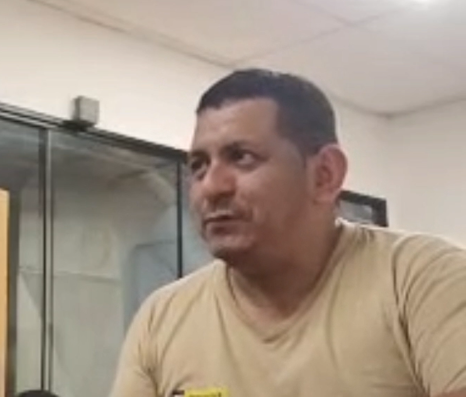  |
| **Link de la entrevista** | [[Enlace entrevista]](https://upcedupe-my.sharepoint.com/:v:/g/personal/u202410376_upc_edu_pe/IQBs-1FmG7h4TKP8ZA-_jbPCAc8dBNia7aRvxhqm3WRkjfE?e=PJEVaj&nav=eyJyZWZlcnJhbEluZm8iOnsicmVmZXJyYWxBcHAiOiJTdHJlYW1XZWJBcHAiLCJyZWZlcnJhbFZpZXciOiJTaGFyZURpYWxvZy1MaW5rIiwicmVmZXJyYWxBcHBQbGF0Zm9ybSI6IldlYiIsInJlZmVycmFsTW9kZSI6InZpZXcifX0%3D) |
| **Tiempo de inicio y duración** | 20:44 - 37:14 |

| Campo | Información |
|-------|--------------|
| **Resumen** | Carlos Velasquez es especialista de Gestión y Desarrollo, con experiencia en la coordinación y seguimiento de iniciativas enfocadas en optimizar procesos y fortalecer el desempeño de los equipos. Actualmente trabaja en Lima y cuenta con aproximadamente dos años de experiencia en su posición. Entre sus principales responsabilidades se encuentran gestionar información de diferentes áreas, hacer seguimiento a actividades y proyectos, coordinar con equipos multidisciplinarios y participar en la identificación de oportunidades de mejora.
En su día a día utiliza herramientas como SAP, Excel, Microsoft Teams, correo corporativo y WhatsApp para organizar información, monitorear avances y mantener una comunicación constante con las distintas áreas y equipos de la organización.
Durante la entrevista, señaló que uno de los principales desafíos que encuentra en su trabajo es la información dispersa entre diversas plataformas, documentos y canales de comunicación. Esta situación dificulta reunir antecedentes de manera rápida, realizar un seguimiento adecuado y obtener una visión general de los procesos cuando se requiere tomar decisiones con agilidad. También mencionó que información importante para sus actividades se encuentra distribuida entre sistemas corporativos, correos electrónicos, carpetas compartidas y registros históricos, lo que demanda tiempo adicional para encontrar, revisar y consolidar los datos.
Carlos manifestó interés en disponer de una solución centralizada que permita acceder y consultar de manera más eficiente la información relevante, integrando antecedentes, registros y documentación provenientes de diferentes fuentes. Una herramienta de este tipo podría ayudarle a disminuir el tiempo invertido en la búsqueda de información, mejorar el seguimiento de iniciativas y disponer de una visión más completa para contribuir a la gestión y desarrollo de los equipos y procesos. |
| **Frustraciones identificadas** | - Información distribuida entre diferentes sistemas, archivos y canales de comunicación.<br>- Dificultad para consolidar información de distintas áreas de manera rápida.<br>- Tiempo elevado buscando antecedentes y registros históricos.<br>- Procesos manuales para recopilar, validar y comparar información.<br>- Elaboración de reportes requiere consultar múltiples fuentes y documentos.<br>- Falta de una vista centralizada que facilite el seguimiento de iniciativas y resultados. |
| **Objetivos identificados** | - Centralizar y organizar la información relevante para la gestión.<br>- Acceder rápidamente a antecedentes y registros históricos.<br>- Facilitar el seguimiento de iniciativas, actividades y resultados.<br>- Mejorar la coordinación y comunicación entre diferentes áreas.<br>- Agilizar el análisis de información para apoyar la toma de decisiones.<br>- Reducir el tiempo destinado a buscar, consolidar y validar información. |
| **Herramientas utilizadas** | Laptop, teléfono móvil, Google Chrome, SAP, Excel, Microsoft Teams, correo corporativo y WhatsApp. |

Entrevistado #4

| Campo | Información |
|-------|--------------|
| **Nombre del entrevistado** | David Morales |
| **Edad** | 24 años |
| **Screenshot de la entrevista** |   |
| **Link de la entrevista** | [[Enlace a entrevista]](https://upcedupe-my.sharepoint.com/:v:/g/personal/u20221b734_upc_edu_pe/IQCApSWsPon_RLsgnBkGd3c3AVApScEenb4n1Ws12sFWqSw?e=SgQJDg&nav=eyJyZWZlcnJhbEluZm8iOnsicmVmZXJyYWxBcHAiOiJTdHJlYW1XZWJBcHAiLCJyZWZlcnJhbFZpZXciOiJTaGFyZURpYWxvZy1MaW5rIiwicmVmZXJyYWxBcHBQbGF0Zm9ybSI6IldlYiIsInJlZmVycmFsTW9kZSI6InZpZXcifX0%3D) |
| **Tiempo de inicio y duración** | 00:00 - 11:46 |

| Campo | Información |
|-------|--------------|
| **Resumen** | David Morales es supervisor de mantenimiento y cuenta con formación en Ingeniería Industrial. Actualmente trabaja en Lima y tiene aproximadamente dos años desempeñándose en su cargo. Sus principales responsabilidades consisten en coordinar equipos de trabajo, priorizar actividades de mantenimiento y asegurar la continuidad operativa de los equipos. Utiliza herramientas como SAP, Excel, Teams, correo corporativo y WhatsApp para gestionar información y comunicarse con distintas áreas. Durante la entrevista señaló que uno de los mayores problemas en su trabajo es la dispersión de la información en múltiples sistemas y documentos, lo que dificulta la toma rápida de decisiones y el análisis de fallas. También indicó que la recuperación de componentes involucra distintos proveedores, registros históricos y documentación técnica que muchas veces se encuentra distribuida entre SAP, correos electrónicos y carpetas compartidas. Esta situación genera retrasos al momento de investigar fallas, comparar proveedores o elaborar reportes. David manifestó que le gustaría contar con una solución centralizada que le permita acceder de forma rápida al historial de componentes, proveedores, reparaciones y resultados de mantenimiento para mejorar la eficiencia de su trabajo y reducir el tiempo invertido en la búsqueda de información. |
| **Frustraciones identificadas** | - Información dispersa en múltiples sistemas.<br>- Dificultad para tomar decisiones rápidas ante imprevistos.<br>- Tiempo excesivo buscando registros históricos.<br>- Procesos manuales para comparar desempeño de proveedores.<br>- Elaboración de informes requiere recopilar información de diversas fuentes. |
| **Objetivos identificados** | - Mejorar la organización de la información de mantenimiento.<br>- Acceder rápidamente al historial de componentes recuperados.<br>- Facilitar el seguimiento de proveedores y reparaciones.<br>- Optimizar la toma de decisiones en situaciones críticas.<br>- Reducir tiempos de búsqueda y análisis de información. |
| **Herramientas utilizadas** | Laptop, teléfono móvil, Google Chrome, SAP, Excel, Microsoft Teams, correo corporativo y WhatsApp. |

**Segmento Asset Owner**

Entrevistado #5

| Campo | Información |
|-------|--------------|
| **Nombre del entrevistado** | Belisa Romero |
| **Edad** | 63 años |
| **Screenshot de la entrevista** |   |
| **Link de la entrevista** | [[Enlace a entrevista]](https://upcedupe-my.sharepoint.com/:v:/g/personal/u202410376_upc_edu_pe/IQBs-1FmG7h4TKP8ZA-_jbPCAc8dBNia7aRvxhqm3WRkjfE?e=PJEVaj&nav=eyJyZWZlcnJhbEluZm8iOnsicmVmZXJyYWxBcHAiOiJTdHJlYW1XZWJBcHAiLCJyZWZlcnJhbFZpZXciOiJTaGFyZURpYWxvZy1MaW5rIiwicmVmZXJyYWxBcHBQbGF0Zm9ybSI6IldlYiIsInJlZmVycmFsTW9kZSI6InZpZXcifX0%3D) |
| **Tiempo de inicio y duración** | 37:14 - 54:18 |

| Campo | Información |
|-------|--------------|
| **Resumen** | Belisa Romero es supervisora de mantenimiento y cuenta con formación en Ingeniería Industrial. Actualmente trabaja en Lima y tiene aproximadamente dos años de experiencia desempeñándose en su cargo. Entre sus principales responsabilidades se encuentran coordinar equipos de trabajo, organizar y priorizar actividades de mantenimiento y asegurar la continuidad operativa de los equipos.
Para desarrollar sus funciones utiliza herramientas como SAP, Excel, Microsoft Teams, correo corporativo y WhatsApp, principalmente para gestionar información, realizar seguimiento a las actividades y mantener comunicación con las diferentes áreas involucradas.
Durante la entrevista, comentó que uno de los principales inconvenientes que enfrenta es la información distribuida entre diferentes sistemas y documentos, lo que puede dificultar la toma de decisiones oportunas y el análisis de las fallas. Asimismo, señaló que los procesos relacionados con la recuperación de componentes requieren consultar información de distintos proveedores, registros históricos y documentación técnica, la cual suele encontrarse repartida entre SAP, correos electrónicos y carpetas compartidas.
Esta dispersión de información genera demoras al momento de investigar el origen de una falla, revisar antecedentes de componentes, comparar alternativas de proveedores o preparar reportes. Belisa expresó interés en contar con una solución centralizada que le permita consultar rápidamente el historial de componentes, proveedores, reparaciones y resultados de mantenimiento, con el objetivo de agilizar sus actividades y disminuir el tiempo dedicado a localizar y consolidar información. |
| **Frustraciones identificadas** | - Información dispersa en múltiples sistemas.<br>- Dificultad para tomar decisiones rápidas ante imprevistos.<br>- Tiempo excesivo buscando registros históricos.<br>- Procesos manuales para comparar desempeño de proveedores.<br>- Elaboración de informes requiere recopilar información de diversas fuentes. |
| **Objetivos identificados** | - Mejorar la organización de la información de mantenimiento.<br>- Acceder rápidamente al historial de componentes recuperados.<br>- Facilitar el seguimiento de proveedores y reparaciones.<br>- Optimizar la toma de decisiones en situaciones críticas.<br>- Reducir tiempos de búsqueda y análisis de información. |
| **Herramientas utilizadas** | Laptop, teléfono móvil, Google Chrome, SAP, Excel, Microsoft Teams, correo corporativo y WhatsApp. |


Entrevistado #6

| Campo | Información |
|-------|--------------|
| **Nombre del entrevistado** | Leonardo Palomino |
| **Edad** | 25 años |
| **Screenshot de la entrevista** |   |
| **Link de la entrevista** | [[Enlace a entrevista]](https://upcedupe-my.sharepoint.com/:v:/g/personal/u202410376_upc_edu_pe/IQBs-1FmG7h4TKP8ZA-_jbPCAc8dBNia7aRvxhqm3WRkjfE?e=PJEVaj&nav=eyJyZWZlcnJhbEluZm8iOnsicmVmZXJyYWxBcHAiOiJTdHJlYW1XZWJBcHAiLCJyZWZlcnJhbFZpZXciOiJTaGFyZURpYWxvZy1MaW5rIiwicmVmZXJyYWxBcHBQbGF0Zm9ybSI6IldlYiIsInJlZmVycmFsTW9kZSI6InZpZXcifX0%3D) |
| **Tiempo de inicio y duración** | 54:18 - 57:06 |

| Campo | Información |
|-------|--------------|
| **Resumen** | Leonardo Palomino es supervisor de mantenimiento y cuenta con formación en Ingeniería Industrial. Actualmente trabaja en Lima y tiene aproximadamente dos años de experiencia en su cargo. Sus principales responsabilidades incluyen coordinar equipos de trabajo, organizar y priorizar las actividades de mantenimiento y velar por la continuidad operativa de los equipos.
En sus labores utiliza herramientas como SAP, Excel, Microsoft Teams, correo corporativo y WhatsApp para gestionar información, hacer seguimiento a las tareas y comunicarse con las distintas áreas involucradas en las operaciones.
Durante la entrevista, indicó que uno de los principales retos que enfrenta es la información dispersa entre diversos sistemas, documentos y canales. |
| **Frustraciones identificadas** | - Información dispersa en múltiples sistemas.<br>- Dificultad para tomar decisiones rápidas ante imprevistos.<br>- Tiempo excesivo buscando registros históricos.<br>- Procesos manuales para comparar desempeño de proveedores.<br>- Elaboración de informes requiere recopilar información de diversas fuentes. |
| **Objetivos identificados** | - Mejorar la organización de la información de mantenimiento.<br>- Acceder rápidamente al historial de componentes recuperados.<br>- Facilitar el seguimiento de proveedores y reparaciones.<br>- Optimizar la toma de decisiones en situaciones críticas.<br>- Reducir tiempos de búsqueda y análisis de información. |
| **Herramientas utilizadas** | Laptop, teléfono móvil, Google Chrome, SAP, Excel, Microsoft Teams, correo corporativo y WhatsApp. |


Entrevistado #7

| Campo | Información |
|-------|--------------|
| **Nombre del entrevistado** | Felix Zagarra |
| **Edad** | 30 años |
| **Screenshot de la entrevista** |   |
| **Link de la entrevista** | [[Enlace a entrevista]](https://upcedupe-my.sharepoint.com/:v:/g/personal/u202410376_upc_edu_pe/IQBs-1FmG7h4TKP8ZA-_jbPCAc8dBNia7aRvxhqm3WRkjfE?e=PJEVaj&nav=eyJyZWZlcnJhbEluZm8iOnsicmVmZXJyYWxBcHAiOiJTdHJlYW1XZWJBcHAiLCJyZWZlcnJhbFZpZXciOiJTaGFyZURpYWxvZy1MaW5rIiwicmVmZXJyYWxBcHBQbGF0Zm9ybSI6IldlYiIsInJlZmVycmFsTW9kZSI6InZpZXcifX0%3D) |
| **Tiempo de inicio y duración** | 57:06 - 68:52 |

| Campo | Información |
|-------|--------------|
| **Resumen** | Feliz Zegarra es supervisor de mantenimiento y cuenta con formación en Ingeniería Industrial. Actualmente trabaja en Lima y tiene aproximadamente dos años de experiencia en el cargo. Entre sus principales responsabilidades se encuentran coordinar equipos de trabajo, definir prioridades dentro de las actividades de mantenimiento y asegurar que los equipos mantengan su continuidad operativa.
Para realizar sus funciones utiliza herramientas como SAP, Excel, Microsoft Teams, correo corporativo y WhatsApp, que le permiten gestionar información, dar seguimiento a las actividades y mantener comunicación con las diferentes áreas involucradas.
Durante la entrevista, señaló que uno de los principales inconvenientes en su trabajo es la información distribuida en distintos sistemas y documentos. Esta situación dificulta acceder rápidamente a los antecedentes necesarios, tomar decisiones oportunas y realizar un análisis adecuado de las fallas. Asimismo, mencionó que la recuperación de componentes requiere consultar información de diversos proveedores, registros históricos y documentación técnica, la cual suele encontrarse repartida entre SAP, correos electrónicos y carpetas compartidas.
Esta dispersión de información puede generar retrasos al investigar fallas, revisar el historial de componentes, comparar proveedores o preparar reportes. Feliz manifestó interés en contar con una solución centralizada que le permita acceder de manera rápida al historial de componentes, proveedores, reparaciones y resultados de mantenimiento. Una herramienta de este tipo le ayudaría a agilizar sus actividades, facilitar el análisis de información y reducir el tiempo empleado en la búsqueda y consolidación de datos. |
| **Frustraciones identificadas** | - Información dispersa en múltiples sistemas.<br>- Dificultad para tomar decisiones rápidas ante imprevistos.<br>- Tiempo excesivo buscando registros históricos.<br>- Procesos manuales para comparar desempeño de proveedores.<br>- Elaboración de informes requiere recopilar información de diversas fuentes. |
| **Objetivos identificados** | - Mejorar la organización de la información de mantenimiento.<br>- Acceder rápidamente al historial de componentes recuperados.<br>- Facilitar el seguimiento de proveedores y reparaciones.<br>- Optimizar la toma de decisiones en situaciones críticas.<br>- Reducir tiempos de búsqueda y análisis de información. |
| **Herramientas utilizadas** | Laptop, teléfono móvil, Google Chrome, SAP, Excel, Microsoft Teams, correo corporativo y WhatsApp. |


### 2.2.3. Análisis de entrevistas.
## 2.3. Needfinding.
### 2.3.1. User Personas.

#### Ficha de User Persona 1 — Segmento 1: Empresas de servicio especializado en recubrimiento HVOF

{width=80%}

---

#### Ficha de User Persona 2 — Segmento 2: Plantas industriales con línea de recubrimiento in-house

{width=80%}

### 2.3.2. User Task Matrix.

| Tarea | Rosa — Frecuencia | Rosa — Importancia | Jorge — Frecuencia | Jorge — Importancia |
|---|---|---|---|---|
| Ejecutar y supervisar una sesión de recubrimiento en la cabina | Baja | Media | Baja | Media |
| Verificar que los parámetros de proceso se mantengan dentro de especificación | Alta | Alta | Media | Alta |
| Registrar a qué pieza, cliente y orden corresponde cada sesión ejecutada | Alta | Alta | Baja | Media |
| Sustentar ante el cliente que un lote fue recubierto dentro de tolerancias | Alta | Alta | N/A | N/A |
| Determinar la causa de una parada o falla del equipo | Baja | Media | Alta | Alta |
| Decidir qué componente de la máquina requiere mantenimiento o repuesto | Baja | Media | Alta | Alta |
| Anticipar fallas recurrentes del equipo | Media | Media | Alta | Alta |
| Verificar el desempeño de una pieza recubierta cuando retorna de campo | Alta | Alta | Media | Media |
| Reportar métricas de calidad o de disponibilidad a la gerencia | Media | Alta | Media | Alta |
| Transferir el conocimiento del proceso entre operadores y técnicos | Media | Media | Media | Alta |

**Tareas con mayor frecuencia e importancia.** Para Rosa, las tareas de mayor peso son sustentar ante el cliente que un lote fue recubierto dentro de tolerancias y registrar la correspondencia entre sesión, pieza, cliente y orden: ambas son diarias y determinan directamente la continuidad del contrato con el cliente minero. Para Jorge, las tareas de mayor peso son determinar la causa de una parada y decidir qué componente atender, dado que de ellas depende la disponibilidad del equipo y el cumplimiento de la ventana de mantenimiento.

**Coincidencias.** Ambos roles comparten como tarea de alta importancia verificar que los parámetros de proceso se mantengan dentro de especificación y reportar métricas a la gerencia, lo que confirma que la trazabilidad del proceso es una necesidad transversal a los dos segmentos, aunque motivada por razones distintas (evidencia comercial en un caso, disponibilidad operativa en el otro).

**Diferencias.** Rosa realiza con alta frecuencia tareas orientadas a documentar y sustentar el proceso ante un tercero externo (el cliente minero), mientras que Jorge realiza con alta frecuencia tareas orientadas a diagnosticar y decidir sobre el propio equipo, sin que un cliente externo participe en esa decisión. Esta diferencia es consistente con la distinción establecida en la sección 1.3 entre el recubrimiento como negocio principal (Segmento 1) y como proceso de soporte al mantenimiento (Segmento 2).

### 2.3.3. User Journey Mapping.

#### Journey Map 1 — Rosa Miranda: sustentar ante el cliente minero que un lote fue recubierto dentro de tolerancias

| Fase | Acciones | Pensamientos | Emociones | Puntos de dolor |
|---|---|---|---|---|
| Solicitud del cliente | Recibe el pedido de sustento y ubica la OF/WO | "Espero que esta vez el registro esté completo" | Neutral, con algo de incertidumbre | No sabe de antemano si el dato existe o está completo |
| Búsqueda de evidencia | Revisa archivos del PLC y bitácoras en papel, consulta al supervisor | "¿Dónde quedó el registro de esa fecha exacta?" | Tensión creciente | Información dispersa entre PLC, papel y memoria del personal |
| Reconstrucción manual | Arma el reporte cruzando fuentes manualmente | "Esto me toma horas que no tengo" | Frustración | Alto esfuerzo manual y riesgo de error humano al cruzar datos |
| Entrega | Envía el reporte, a veces fuera de plazo | "Espero que esto no afecte la renovación del contrato" | Ansiedad | Retraso percibido por el cliente como falta de control de proceso |

#### Journey Map 2 — Jorge Salinas: diagnosticar una parada no programada del equipo HVOF 

| Fase | Acciones | Pensamientos | Emociones | Puntos de dolor |
|---|---|---|---|---|
| Detección | El operador reporta la parada; Jorge revisa el código de falla | "¿Es la misma falla del mes pasado?" | Alerta, preocupación | El código de falla del PLC no indica el componente responsable |
| Diagnóstico | Revisa bitácora en papel, llama al técnico senior, escala al fabricante | "Ojalá el técnico que sabe de esto esté disponible" | Impaciencia | El diagnóstico depende del conocimiento tácito de pocas personas |
| Intervención | Interviene el componente señalado y verifica la operación | "Vamos a ver si esto realmente era el problema" | Incertidumbre | Sin correlación automática, la intervención es prueba y error |
| Registro y aprendizaje | Documenta la solución de forma informal | "Espero acordarme la próxima vez que pase esto" | Resignación | El aprendizaje no queda registrado ni es consultable por otros |

### 2.3.4. Empathy Mapping.

#### Empathy Map — Rosa Miranda (Segmento 1)

{width=80%}

#### Empathy Map — Jorge Salinas (Segmento 2)

{width=80%}

## 2.4. Big Picture Event Storming.

En esta sección se introduce y resume el proceso realizado por nuestro equipo, presentando las evidencias y explicaciones de las etapas del Big Picture Event Storming. En una sesión colaborativa, nuestro equipo se enfocó en entender el dominio del negocio en general, plasmando los eventos significativos y sus relaciones. Es una primera aproximación visual de alto nivel que explora el landscape del negocio, identificando procesos clave, exponiendo potenciales problemas u oportunidades del procesos de recuperación de componentes mediante recubrimiento HVOF, desde la recepción de la pieza del cliente hasta la evaluación de su desempeño en campo. La sesión siguió la guía paso a paso del Event Storming Journal (Bourgau, 2022) y fue documentada con diagramas Mermaid, alternativa permitida por el enunciado del proyecto para Diagram-as-Code. Se conservó la convención de colores del método: naranja para Domain Events, amarillo para Actors, azul para External Systems y rosado para Problems (hotspots).

### Paso 1. Preparación del tablero

Dado que la sesión se realizó de forma remota, la "sala" fue un tablero compartido. El equipo preparó con anticipación:

- El espacio de diseño dividido en tres zonas, siguiendo la guía: *Open* (generación libre), *Explore* (ordenamiento y enriquecimiento) y *Close* (resultados).
- La agenda visual con los nueve pasos de la guía.
- La leyenda de colores.
- Un Domain Event inicial preparado por la facilitadora (*SpraySessionStarted*), siguiendo el truco de Alberto Brandolini de "encender" la sesión con un evento ya colocado en el centro del tablero.

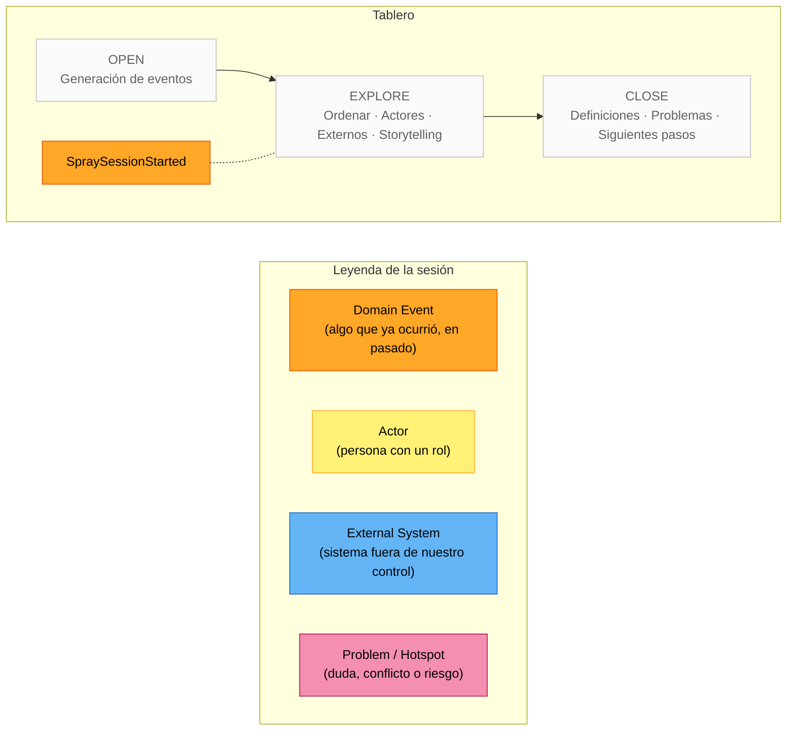
```mermaid
flowchart LR
    classDef evento fill:#FFA726,stroke:#E65100,color:#000
    classDef actor fill:#FFF176,stroke:#F9A825,color:#000
    classDef externo fill:#64B5F6,stroke:#1565C0,color:#000
    classDef problema fill:#F48FB1,stroke:#AD1457,color:#000
    classDef zona fill:#FAFAFA,stroke:#BDBDBD,color:#616161

    subgraph L["Leyenda de la sesión"]
        direction LR
        E["Domain Event<br/>(algo que ya ocurrió, en pasado)"]:::evento
        A["Actor<br/>(persona con un rol)"]:::actor
        X["External System<br/>(sistema fuera de nuestro control)"]:::externo
        P["Problem / Hotspot<br/>(duda, conflicto o riesgo)"]:::problema
    end

    subgraph T["Tablero"]
        direction LR
        O["OPEN<br/>Generación de eventos"]:::zona
        EX["EXPLORE<br/>Ordenar · Actores · Externos · Storytelling"]:::zona
        C["CLOSE<br/>Definiciones · Problemas · Siguientes pasos"]:::zona
        S0["SpraySessionStarted"]:::evento
        O --> EX --> C
        S0 -.- EX
    end
```
### Paso 2. Energizante

La sesión inició con una dinámica breve de cinco minutos en la que cada integrante describió, en una frase y sin usar términos técnicos, qué pasa con una pieza minera desde que se desgasta hasta que vuelve a operar. El ejercicio sirvió para nivelar el vocabulario entre los integrantes con experiencia en planta y los que no la tenían, y para dejar claro desde el inicio que el tablero se llenaría con hechos del negocio y no con funciones de software.

### Paso 3. Briefing y agenda

La facilitadora (Carolina) presentó el objetivo, el alcance y los casos de uso de la sesión:

| Elemento | Definición acordada |
|---|---|
| Objetivo | Entender de extremo a extremo cómo un componente pasa por el proceso de recuperación HVOF y cómo se conoce su resultado en campo |
| Alcance | Desde la recepción del componente del cliente hasta el registro de su retorno de campo y la evaluación contra el PCR. Incluye la operación de la celda HVOF y el diagnóstico de sus fallas. Excluye la gestión de mantenimiento correctivo/preventivo de la celda |
| Casos de uso guía | (1) Recuperar un front rod de un cliente minero y entregarlo con evidencia de calidad. (2) Diagnosticar por qué la celda se detuvo durante una corrida. (3) Determinar si una pieza que falló en mina antes de su PCR fue mal recubierta |
| Convenciones | Eventos en inglés, en pasado, en PascalCase. Un evento por post-it. Se permite duplicar; se depura al ordenar |

### Paso 4. Generación de Domain Events

Durante veinticinco minutos cada integrante colocó, de forma individual y sin discutir, todos los eventos que recordaba del dominio. La tasa de generación decayó hacia el minuto veinte, señal de pasar al siguiente paso. Se obtuvieron sesenta y ocho post-its, incluidos duplicados y eventos que después se reformularon. El tablero, tal como quedó antes de ordenar:


```mermaid
flowchart TB
    classDef evento fill:#FFA726,stroke:#E65100,color:#000

    subgraph W["Tablero — zona OPEN (sin orden)"]
        direction TB
        subgraph R1[" "]
            direction LR
            a1["ComponentReceived"]:::evento
            a2["QualityCertificateIssued"]:::evento
            a3["FeederZeroFeedrateAborted"]:::evento
            a4["SpraySessionStarted"]:::evento
            a5["ComponentReturnedFromField"]:::evento
            a6["RoleAssigned"]:::evento
            a7["PlcTagFileImported"]:::evento
            a8["AlertAcknowledged"]:::evento
        end
        subgraph R2[" "]
            direction LR
            b1["HvofCellRegistered"]:::evento
            b2["PrematureFailureDetected"]:::evento
            b3["ParameterOutOfRangeDetected"]:::evento
            b4["RecuperationCreated"]:::evento
            b5["RootCauseConfirmed"]:::evento
            b6["SubscriptionActivated"]:::evento
            b7["HopperOverpressureBlocked"]:::evento
            b8["PcrComplianceReportGenerated"]:::evento
        end
        subgraph R3[" "]
            direction LR
            c1["TelemetryBatchIngested"]:::evento
            c2["OrganizationRegistered"]:::evento
            c3["SuspectPartIdentified"]:::evento
            c4["ComponentDelivered"]:::evento
            c5["NominalRangesConfigured"]:::evento
            c6["CriticalFaultAlertRaised"]:::evento
            c7["ServiceLifeRecorded"]:::evento
            c8["SpraySessionCompleted"]:::evento
        end
        subgraph R4[" "]
            direction LR
            d1["FaultCaseOpened"]:::evento
            d2["CustomerRegistered"]:::evento
            d3["TagMappingConfirmed"]:::evento
            d4["SpindleRotationFaulted"]:::evento
            d5["PcrTargetDefined"]:::evento
            d6["OutOfRangeAlertRaised"]:::evento
            d7["RecuperationClosed"]:::evento
            d8["DiagnosticRulesApplied"]:::evento
        end
        subgraph R5[" "]
            direction LR
            e1["PlanSelected"]:::evento
            e2["RecurringFaultPatternDetected"]:::evento
            e3["ProcessReadingRecorded"]:::evento
            e4["TimedShutdownFaultTriggered"]:::evento
            e5["SessionReportGenerated"]:::evento
            e6["HvofCellPartRegistered"]:::evento
            e7["ProbableCauseSuggested"]:::evento
            e8["UserAuthenticated"]:::evento
        end
        subgraph R6[" "]
            direction LR
            f1["SpraySessionAborted"]:::evento
            f2["TagMappingProposed"]:::evento
            f3["PcrTargetMet"]:::evento
            f4["FaultCaseClosed"]:::evento
            f5["EvidenceExported"]:::evento
            f6["AlertDelivered"]:::evento
            f7["TelemetryStreamInterrupted"]:::evento
            f8["DustHouseOverloaded"]:::evento
        end
        subgraph R7[" "]
            direction LR
            g1["FaultFlagActivated"]:::evento
            g2["PrematureFailureCorrelatedWithSession"]:::evento
            g3["DiagnosticRuleCreated"]:::evento
            g4["HvofCellStatusChanged"]:::evento
            g5["FaultFrequencyReportGenerated"]:::evento
            g6["AlertEscalated"]:::evento
            g7["VisitorSubscribedToNewsletter"]:::evento
            g8["ManualDiagnosisRequired"]:::evento
        end
        subgraph R8[" "]
            direction LR
            h1["SubscriptionExpired"]:::evento
            h2["NotificationPreferenceUpdated"]:::evento
            h3["FaultSymptomsRecorded"]:::evento
            h4["XAxisMotionFaulted"]:::evento
            h5["AccessDenied"]:::evento
            h6["FlameTemperatureOutOfRange"]:::evento
            h7["HourmeterAtDeliveryRecorded"]:::evento
            h8["ComponentMarkedInProcess"]:::evento
        end
        R1 ~~~ R2 ~~~ R3 ~~~ R4 ~~~ R5 ~~~ R6 ~~~ R7 ~~~ R8
    end
```

Durante la depuración se tomaron dos decisiones que quedaron registradas para el paso siguiente:

- Los eventos de falla específicos del PLC (*FeederZeroFeedrateAborted*, *HopperOverpressureBlocked*, *SpindleRotationFaulted*, *XAxisMotionFaulted*, *TimedShutdownFaultTriggered*, *DustHouseOverloaded*) se agruparon bajo un evento genérico *FaultFlagActivated* con el tipo de falla como atributo. Esto evita que el tablero tenga un post-it por cada uno de los más de treinta tags de falla del PLC y refleja cómo lo procesa el sistema: el tag mapeado como indicador de falla se activa, y eso abre el caso.
- *FlameTemperatureOutOfRange* se absorbió en *ParameterOutOfRangeDetected*, por la misma razón.

### Paso 5. Ordenamiento cronológico

Aquí comenzó la discusión. El equipo ordenó los eventos de izquierda a derecha y, al hacerlo, aparecieron dos flujos concurrentes que se representaron como carriles: mientras la sesión de rociado registra lecturas, en paralelo pueden abrirse casos de falla y generarse alertas. También apareció un flujo alternativo: la sesión puede terminar completada o abortada.


```mermaid
flowchart LR
    classDef evento fill:#FFA726,stroke:#E65100,color:#000
    classDef fase fill:#FAFAFA,stroke:#BDBDBD,color:#616161

    subgraph F0["0. Configuración"]
        direction TB
        OrganizationRegistered:::evento --> PlanSelected:::evento --> SubscriptionActivated:::evento --> RoleAssigned:::evento
        HvofCellRegistered:::evento --> HvofCellPartRegistered:::evento --> PlcTagFileImported:::evento --> TagMappingProposed:::evento --> TagMappingConfirmed:::evento --> NominalRangesConfigured:::evento
        CustomerRegistered:::evento --> PcrTargetDefined:::evento
        DiagnosticRuleCreated:::evento
    end

    subgraph F1["1. Recepción"]
        direction TB
        ComponentReceived:::evento --> RecuperationCreated:::evento --> ComponentMarkedInProcess:::evento
    end

    subgraph F2["2. Corrida de rociado"]
        direction TB
        SpraySessionStarted:::evento --> TelemetryBatchIngested:::evento --> ProcessReadingRecorded:::evento
        ProcessReadingRecorded --> SpraySessionCompleted:::evento
        ProcessReadingRecorded --> SpraySessionAborted:::evento
    end

    subgraph F2B["2b. Carril concurrente — Desviaciones y fallas"]
        direction TB
        ParameterOutOfRangeDetected:::evento --> OutOfRangeAlertRaised:::evento --> AlertDelivered:::evento --> AlertAcknowledged:::evento
        FaultFlagActivated:::evento --> FaultCaseOpened:::evento --> FaultSymptomsRecorded:::evento --> DiagnosticRulesApplied:::evento
        DiagnosticRulesApplied --> ProbableCauseSuggested:::evento --> SuspectPartIdentified:::evento --> CriticalFaultAlertRaised:::evento
        DiagnosticRulesApplied --> ManualDiagnosisRequired:::evento
        SuspectPartIdentified --> RootCauseConfirmed:::evento --> FaultCaseClosed:::evento
        ManualDiagnosisRequired --> RootCauseConfirmed
        FaultCaseClosed --> RecurringFaultPatternDetected:::evento
        TelemetryStreamInterrupted:::evento
    end

    subgraph F3["3. Cierre y entrega"]
        direction TB
        RecuperationClosed:::evento --> HourmeterAtDeliveryRecorded:::evento --> QualityCertificateIssued:::evento --> ComponentDelivered:::evento
        SessionReportGenerated:::evento
    end

    subgraph F4["4. Campo y PCR"]
        direction TB
        ComponentReturnedFromField:::evento --> ServiceLifeRecorded:::evento
        ServiceLifeRecorded --> PcrTargetMet:::evento
        ServiceLifeRecorded --> PrematureFailureDetected:::evento --> PrematureFailureCorrelatedWithSession:::evento
    end

    subgraph F5["5. Reportes"]
        direction TB
        EvidenceExported:::evento
        FaultFrequencyReportGenerated:::evento
        PcrComplianceReportGenerated:::evento
    end

    F0 --> F1 --> F2 --> F3 --> F4 --> F5
    ProcessReadingRecorded -. dispara .-> ParameterOutOfRangeDetected
    ProcessReadingRecorded -. dispara .-> FaultFlagActivated
    SpraySessionCompleted --> RecuperationClosed
    SpraySessionAborted -. requiere nueva corrida .-> SpraySessionStarted
```

Al ordenar, el equipo hizo explícitas tres cosas que estaban implícitas:

- *HourmeterAtDeliveryRecorded* no existía en la generación inicial de todos; apareció cuando se preguntó "¿contra qué se compara el horómetro de retorno?". Sin ese dato, *ServiceLifeRecorded* no puede calcular horas logradas.
- *ManualDiagnosisRequired* apareció al preguntar "¿y si ninguna regla coincide?". Es el flujo alternativo de *DiagnosticRulesApplied*.
- *SpraySessionAborted* no cierra la orden: obliga a una nueva corrida. Por eso la flecha punteada regresa a *SpraySessionStarted*.

### Paso 6. Actores y sistemas externos

Con la historia ya ordenada, el equipo identificó quién dispara cada cadena de eventos (post-its amarillos) y qué sistemas fuera de la plataforma participan (post-its azules). Siguiendo la guía, se colocó un actor al inicio de cada cadena y no en cada evento.

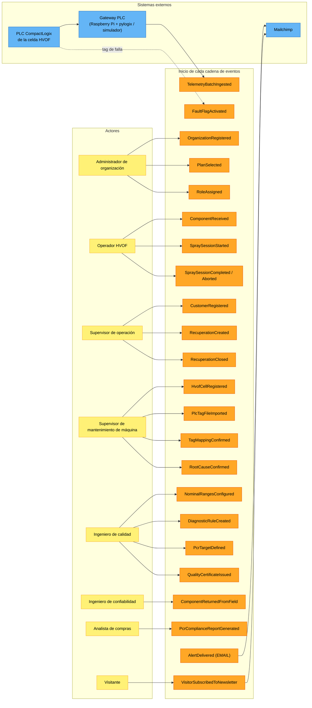
```mermaid
flowchart LR
    classDef evento fill:#FFA726,stroke:#E65100,color:#000
    classDef actor fill:#FFF176,stroke:#F9A825,color:#000
    classDef externo fill:#64B5F6,stroke:#1565C0,color:#000

    subgraph AC["Actores"]
        direction TB
        Adm["Administrador de organización"]:::actor
        Op["Operador HVOF"]:::actor
        SupOp["Supervisor de operación"]:::actor
        SupMant["Supervisor de mantenimiento de máquina"]:::actor
        IngCal["Ingeniero de calidad"]:::actor
        IngConf["Ingeniero de confiabilidad"]:::actor
        Compras["Analista de compras"]:::actor
        Vis["Visitante"]:::actor
    end

    subgraph EX["Sistemas externos"]
        direction TB
        Gw["Gateway PLC<br/>(Raspberry Pi + pylogix / simulador)"]:::externo
        Plc["PLC CompactLogix<br/>de la celda HVOF"]:::externo
        Mc["Mailchimp"]:::externo
    end

    subgraph EV["Inicio de cada cadena de eventos"]
        direction TB
        e1["OrganizationRegistered"]:::evento
        e2["PlanSelected"]:::evento
        e3["RoleAssigned"]:::evento
        e4["HvofCellRegistered"]:::evento
        e5["PlcTagFileImported"]:::evento
        e6["TagMappingConfirmed"]:::evento
        e7["NominalRangesConfigured"]:::evento
        e8["DiagnosticRuleCreated"]:::evento
        e9["CustomerRegistered"]:::evento
        e10["PcrTargetDefined"]:::evento
        e11["ComponentReceived"]:::evento
        e12["RecuperationCreated"]:::evento
        e13["SpraySessionStarted"]:::evento
        e14["TelemetryBatchIngested"]:::evento
        e15["FaultFlagActivated"]:::evento
        e16["RootCauseConfirmed"]:::evento
        e17["SpraySessionCompleted / Aborted"]:::evento
        e18["RecuperationClosed"]:::evento
        e19["QualityCertificateIssued"]:::evento
        e20["ComponentReturnedFromField"]:::evento
        e21["PcrComplianceReportGenerated"]:::evento
        e22["AlertDelivered (EMAIL)"]:::evento
        e23["VisitorSubscribedToNewsletter"]:::evento
    end

    Adm --> e1 & e2 & e3
    SupMant --> e4 & e5 & e6 & e16
    IngCal --> e7 & e8 & e10 & e19
    SupOp --> e9 & e12 & e18
    Op --> e11 & e13 & e17
    IngConf --> e20
    Compras --> e21
    Vis --> e23

    Plc --> Gw --> e14
    Plc -. tag de falla .-> e15
    e22 --> Mc
    e23 --> Mc
```

Dos decisiones surgieron en este paso:

- El **PLC** y el **gateway** se modelaron como dos sistemas externos distintos. El PLC es la fuente del dato; el gateway es quien lo lee vía EtherNet/IP y lo envía a la plataforma por REST. Para la demostración del curso, el gateway será un simulador que expone el mismo contrato, de modo que la plataforma no distingue si el origen es hardware real o simulado.
- El **ingeniero de confiabilidad** de la minera (Asset Owner) es quien dispara *ComponentReturnedFromField*, no el proveedor. Es el único que sabe cuántas horas trabajó la pieza en mina. Esta observación fue la que consolidó a la minera como segundo segmento pagante.

### Paso 7. Storytelling

Un integrante narró la historia completa recorriendo el tablero de izquierda a derecha, usando el caso de uso guía del front rod. La audiencia interrumpió cuando algo no cuadraba. Las incoherencias que no se pudieron resolver en la sesión se estacionaron como post-its rosados (hotspots).

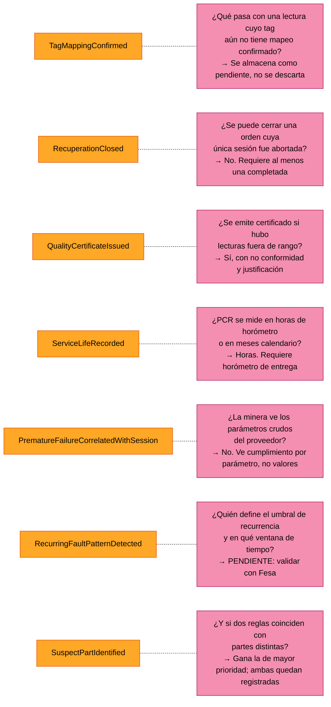
```mermaid
flowchart LR
    classDef evento fill:#FFA726,stroke:#E65100,color:#000
    classDef problema fill:#F48FB1,stroke:#AD1457,color:#000

    TagMappingConfirmed:::evento
    P1["¿Qué pasa con una lectura cuyo tag<br/>aún no tiene mapeo confirmado?<br/>→ Se almacena como pendiente, no se descarta"]:::problema
    TagMappingConfirmed -.- P1

    RecuperationClosed:::evento
    P2["¿Se puede cerrar una orden cuya<br/>única sesión fue abortada?<br/>→ No. Requiere al menos una completada"]:::problema
    RecuperationClosed -.- P2

    QualityCertificateIssued:::evento
    P3["¿Se emite certificado si hubo<br/>lecturas fuera de rango?<br/>→ Sí, con no conformidad y justificación"]:::problema
    QualityCertificateIssued -.- P3

    ServiceLifeRecorded:::evento
    P4["¿PCR se mide en horas de horómetro<br/>o en meses calendario?<br/>→ Horas. Requiere horómetro de entrega"]:::problema
    ServiceLifeRecorded -.- P4

    PrematureFailureCorrelatedWithSession:::evento
    P5["¿La minera ve los parámetros crudos<br/>del proveedor?<br/>→ No. Ve cumplimiento por parámetro, no valores"]:::problema
    PrematureFailureCorrelatedWithSession -.- P5

    RecurringFaultPatternDetected:::evento
    P6["¿Quién define el umbral de recurrencia<br/>y en qué ventana de tiempo?<br/>→ PENDIENTE: validar con Fesa"]:::problema
    RecurringFaultPatternDetected -.- P6

    SuspectPartIdentified:::evento
    P7["¿Y si dos reglas coinciden con<br/>partes distintas?<br/>→ Gana la de mayor prioridad; ambas quedan registradas"]:::problema
    SuspectPartIdentified -.- P7
```

Seis de los siete hotspots se resolvieron en la sesión y sus decisiones se trasladaron directamente a los criterios de aceptación de las User Stories (US11, US18, US35, US40, US41 y US26 respectivamente). El hotspot P6 quedó pendiente de validación con el supervisor de mantenimiento durante las entrevistas de la sección 2.2.

Durante la narración se capturaron también las primeras definiciones del lenguaje ubicuo, que se desarrollan en la sección 2.5:

| Término | Definición capturada en la sesión |
|---|---|
| Component | Pieza del cliente que se recupera (front rod, cylinder block). No confundir con las partes de la celda |
| HVOF Cell Part | Parte de la máquina HVOF (feeder, hopper, spindle, ejes, dust collector) |
| Recuperation | Orden de recuperación identificada por OF y WO; es el trabajo sobre un componente |
| Spray Session | Una corrida de rociado sobre un componente en una celda. Una orden puede tener varias |
| PCR Target | Horas de operación esperadas para el componente recuperado (Planned Component Replacement) |
| Fault Case | Caso abierto cuando un tag de falla se activa; se diagnostica, se confirma y se cierra |
| Suspect Part | Parte de la celda que las reglas señalan como probable responsable de la falla |

### Paso 8. Reverse storytelling

Como fase opcional, el equipo tomó el evento de mayor valor de negocio, *PrematureFailureDetected*, y recorrió la historia hacia atrás preguntando repetidamente "¿qué tuvo que ocurrir antes para que esto pasara?". El ejercicio confirmó la cadena de trazabilidad completa y reveló un evento que faltaba.


```mermaid
flowchart RL
    classDef evento fill:#FFA726,stroke:#E65100,color:#000
    classDef nuevo fill:#FFA726,stroke:#AD1457,stroke-width:3px,color:#000

    A["PrematureFailureDetected"]:::evento
    B["ServiceLifeRecorded"]:::evento
    C["ComponentReturnedFromField"]:::evento
    D["ComponentDelivered"]:::evento
    E["HourmeterAtDeliveryRecorded"]:::evento
    F["QualityCertificateIssued"]:::evento
    G["RecuperationClosed"]:::evento
    H["SpraySessionCompleted"]:::evento
    I["ProcessReadingRecorded"]:::evento
    J["SpraySessionStarted"]:::evento
    K["RecuperationCreated"]:::evento
    L["ComponentReceived"]:::evento
    M["PcrTargetDefined"]:::evento
    N["CustomerLinkedToAssetOwnerOrganization"]:::nuevo

    A -->|"¿qué lo disparó?"| B -->|"¿qué lo disparó?"| C
    C -->|"¿qué debió existir?"| D --> E --> F --> G --> H --> I --> J --> K --> L
    B -->|"¿contra qué se comparó?"| M
    C -->|"¿quién pudo registrarlo?"| N
```

El evento descubierto, *CustomerLinkedToAssetOwnerOrganization*, resuelve una pregunta que nadie había hecho: ¿cómo puede un ingeniero de confiabilidad de la minera registrar el retorno de una pieza si la minera fue registrada como *Customer* por Fesa y no tiene cuenta propia? La respuesta es que cuando una organización Asset Owner se suscribe con el mismo RUC que un cliente ya registrado por un proveedor, ambos registros se vinculan. Este evento dio origen al segundo escenario de la US13.

### Paso 9. Cierre

Al terminar la sesión el equipo evaluó los resultados contra los tres criterios que propone la guía:

**Entendimiento compartido del dominio.** Los integrantes sin experiencia en planta pudieron narrar la historia completa del front rod sin ayuda al final de la sesión. La distinción entre *Component* (pieza del cliente) y *HVOF Cell Part* (parte de la máquina), que había generado confusión en reuniones previas, quedó resuelta.

**Problemas identificados.** Siete hotspots, seis resueltos en sesión y uno pendiente de validación externa. Las decisiones tomadas se convirtieron en criterios de aceptación, lo que evitó que las ambigüedades llegaran a la implementación.

**Primeras definiciones del lenguaje ubicuo.** Siete términos capturados, que constituyen el punto de partida del glosario de la sección 2.5.

**Trazabilidad hacia las User Stories.** Los eventos ordenados en el Paso 5 se distribuyen en las épicas del Capítulo III de la siguiente forma:

| Fase del tablero | Eventos | Épica | User Stories |
|---|---|---|---|
| 0. Configuración | OrganizationRegistered, RoleAssigned, PlanSelected, SubscriptionActivated | E01, E02 | US01–US06 |
| 0. Configuración | HvofCellRegistered … NominalRangesConfigured, DiagnosticRuleCreated | E03, E06 | US07–US12, US28 |
| 0. Configuración | CustomerRegistered, PcrTargetDefined | E04 | US13, US16 |
| 1. Recepción | ComponentReceived, RecuperationCreated | E04 | US14, US15 |
| 2. Corrida | SpraySessionStarted … SpraySessionCompleted/Aborted | E05 | US19–US24 |
| 2b. Desviaciones | ParameterOutOfRangeDetected, OutOfRangeAlertRaised, AlertDelivered | E05, E07 | US21, US31–US34 |
| 2b. Fallas | FaultFlagActivated … RecurringFaultPatternDetected | E06 | US25–US30 |
| 3. Cierre y entrega | RecuperationClosed, QualityCertificateIssued, ComponentDelivered | E04, E08 | US17, US18, US35, US36 |
| 4. Campo y PCR | ComponentReturnedFromField … PrematureFailureCorrelatedWithSession | E09 | US39–US43 |
| 5. Reportes | EvidenceExported, FaultFrequencyReportGenerated, PcrComplianceReportGenerated | E08, E09 | US37, US38, US42 |
| Externos | AlertDelivered (EMAIL), VisitorSubscribedToNewsletter | E11, E10 | US49, US51, US52 |


## 2.5. Ubiquitous Language.

El siguiente glosario reúne los términos del dominio de recuperación de componentes mediante recubrimiento HVOF, tal como los utilizan los especialistas de las empresas de servicio y los responsables de mantenimiento y confiabilidad de las mineras. Su propósito es que todos los integrantes del equipo y los stakeholders se refieran a cada concepto con una sola palabra y un solo significado, y que ese mismo vocabulario se refleje en las User Stories, los diagramas y el código. Se excluyen deliberadamente términos de ingeniería de software; solo se incluyen conceptos del negocio.

Los términos se presentan en inglés, con su equivalente en español entre paréntesis cuando difiere, y agrupados por área del dominio. Las primeras definiciones fueron capturadas durante el Big Picture Event Storming (sección 2.4) y refinadas a partir de las entrevistas con los segmentos objetivo.

Las definiciones de proceso y recubrimiento se basan en el glosario de proyección térmica de Gordon England (s.f.), en la guía de parámetros de proceso de Oerlikon Metco (2025) y en la literatura sobre control de calidad HVOF (Khan et al., 2019; Mauer, 2022). Los términos de control industrial y comunicación con el PLC se toman de la documentación de Rockwell Automation (2019, 2025) y de ODVA (2015, 2020). Los conceptos de alarma y gestión de alarmas siguen la norma ANSI/ISA-18.2 (International Society of Automation, 2016). Los términos de reemplazo planificado de componentes se basan en la documentación de gestión de equipos mineros de Caterpillar (2017) y en la literatura de gestión de activos (AMS, 2025). Los términos propios de la operación del proveedor (OF, WO, segmento, operación, nomenclatura de tags) provienen del conocimiento directo de planta del equipo y de las entrevistas de needfinding (sección 2.2).

### 2.5.1. Organizaciones y roles

| Término | Definición |
|---|---|
| **Recuperation Supplier** (Proveedor de recuperación) | Empresa que ofrece el servicio de recuperación de componentes mediante recubrimiento HVOF a terceros. Opera una o más celdas HVOF y atiende a varios clientes. Es el primer segmento objetivo. |
| **Asset Owner** (Propietario de activos) | Empresa, típicamente minera, dueña de los componentes que se envían a recuperar. Recibe la pieza recuperada, la pone en operación y conoce su desempeño real en campo. Es el segundo segmento objetivo. |
| **Organization** (Organización) | Empresa registrada en la plataforma, ya sea como Recuperation Supplier o como Asset Owner. Cada organización tiene sus propios usuarios, celdas, componentes y suscripción. |
| **Customer** (Cliente) | Empresa a la que un Recuperation Supplier le presta el servicio. Un Customer puede existir sin tener cuenta en la plataforma; cuando la misma empresa se registra como Asset Owner, ambos registros se vinculan por RUC. |
| **HVOF Operator** (Operador HVOF) | Técnico que opera la celda HVOF: inicia y finaliza las corridas, monta la pieza y atiende las alertas durante la operación. |
| **Operation Supervisor** (Supervisor de operación) | Responsable del flujo de trabajo del taller: registra clientes y órdenes de recuperación, cierra las órdenes y valida los reportes de sesión. |
| **Machine Maintenance Supervisor** (Supervisor de mantenimiento de máquina) | Responsable de la disponibilidad de la celda HVOF: registra la celda y sus partes, carga y confirma el mapeo de tags del PLC, y confirma la causa raíz de los casos de falla. |
| **Quality Engineer** (Ingeniero de calidad) | Responsable de que el recubrimiento cumpla la especificación: define rangos nominales, PCR objetivo y reglas de diagnóstico, y emite los certificados de calidad. |
| **Reliability Engineer** (Ingeniero de confiabilidad) | Especialista del Asset Owner que da seguimiento a la vida útil de los componentes en operación y registra su retorno de campo. |
| **Procurement Analyst** (Analista de compras) | Responsable del Asset Owner que evalúa el desempeño de los proveedores de recuperación para sustentar decisiones contractuales. |
| **Plan** | Modalidad de suscripción a la plataforma. El plan **Operator** está dirigido a Recuperation Suppliers y se cobra por celda monitoreada; el plan **Asset Owner** está dirigido a propietarios de activos y se cobra por volumen de componentes bajo seguimiento. |
| **Subscription** (Suscripción) | Vínculo vigente entre una organización y un plan, con fecha de inicio y fin. Determina qué capacidades de la plataforma están habilitadas. |

### 2.5.2. Componentes y trazabilidad

| Término | Definición |
|---|---|
| **Component** (Componente / Pieza) | Pieza física del cliente que se somete al proceso de recuperación: front rod, cylinder block, rod assembly, rear cylinder. Se identifica por número de serie y part number. **No debe confundirse con HVOF Cell Part.** |
| **Component Type** (Tipo de componente) | Clasificación funcional del componente según su forma y aplicación (por ejemplo, front rod o cylinder block). Junto con el modelo de máquina, define el PCR objetivo. |
| **Machine Model** (Modelo de máquina) | Modelo del equipo minero al que pertenece el componente (por ejemplo, Caterpillar 797F o 793D). Un mismo tipo de componente tiene distinto PCR según el modelo. |
| **Part Number** | Código del fabricante que identifica el diseño del componente. Dos componentes con el mismo part number son intercambiables. |
| **Serial Number** (Número de serie) | Identificador único de una unidad física de componente. Dos componentes con el mismo part number tienen distinto número de serie. |
| **Recuperation** (Recuperación / Orden de recuperación) | Trabajo de recubrimiento realizado sobre un componente, identificado por su OF y su WO. Registra el horómetro de ingreso, el peso, el lote de polvo y las sesiones de rociado ejecutadas. Una recuperación puede requerir más de una sesión. |
| **Manufacturing Order — OF** (Orden de fabricación) | Identificador que el proveedor asigna al trabajo en su sistema de planta. Es el código con el que la pieza circula por el taller. |
| **Work Order — WO** (Orden de trabajo) | Identificador del servicio acordado con el cliente. Es el código con el que el cliente reconoce el trabajo. Una recuperación tiene exactamente una OF y una WO. |
| **Hourmeter** (Horómetro) | Contador de horas de operación acumuladas de un componente. Se registra al ingreso al taller y al momento de la entrega, y sirve como referencia para calcular la vida útil lograda en campo. |
| **Powder Lot** (Lote de polvo) | Identificación del material de aporte utilizado en el recubrimiento: proveedor, número de lote y composición química. Se vincula a la recuperación para trazabilidad del material. |
| **Delivery** (Entrega) | Momento en que el componente recuperado sale del taller hacia el cliente. Marca el inicio de su periodo de operación en campo. |

### 2.5.3. Vida útil y desempeño en campo

| Término | Definición |
|---|---|
| **PCR — Planned Component Replacement** (Reemplazo planificado de componentes) | Práctica de las mineras de reemplazar componentes críticos en un momento planificado, antes de que fallen, según una vida útil esperada. |
| **PCR Target** (PCR objetivo) | Cantidad de horas de operación que un componente recuperado debería alcanzar antes de su siguiente reemplazo planificado. Se define por tipo de componente y modelo de máquina. Es el estándar contra el cual se evalúa el desempeño real. |
| **Field Return** (Retorno de campo) | Momento en que un componente que estaba en operación en la mina regresa al proveedor, ya sea porque alcanzó su PCR o porque falló antes. Lo registra el Asset Owner, que es quien conoce el horómetro real. |
| **Service Life** (Vida útil lograda) | Horas de operación efectivamente alcanzadas por un componente recuperado, calculadas como la diferencia entre el horómetro al retorno y el horómetro a la entrega. |
| **PCR Met** (PCR alcanzado) | Condición en la que la vida útil lograda es igual o superior al PCR objetivo. Indica que el recubrimiento cumplió su propósito. |
| **Premature Failure** (Falla prematura) | Condición en la que un componente retorna de campo con una vida útil lograda inferior al PCR objetivo. Es el evento de mayor valor analítico del dominio, porque obliga a revisar si el origen estuvo en el proceso de recubrimiento. |
| **PCR Compliance Rate** (Tasa de cumplimiento de PCR) | Proporción de componentes que alcanzaron su PCR sobre el total de componentes retornados en un periodo. Puede calcularse por proveedor, por modelo de máquina o por tipo de componente. |
| **Supplier Performance** (Desempeño de proveedor) | Evaluación que hace el Asset Owner de un Recuperation Supplier en función de la tasa de cumplimiento de PCR de los componentes que este recuperó. |

### 2.5.4. Celda HVOF y sus partes

| Término | Definición |
|---|---|
| **HVOF — High Velocity Oxygen Fuel** | Proceso de proyección térmica en el que un polvo metálico es fundido y proyectado a alta velocidad mediante la combustión de oxígeno y combustible, para depositar una capa protectora sobre la superficie de un componente. |
| **Thermal Spray** (Proyección térmica) | Familia de procesos de recubrimiento a la que pertenece HVOF. En este dominio se usa como sinónimo del proceso de recuperación. |
| **HVOF Cell** (Celda HVOF) | Unidad completa de equipo que ejecuta el proceso: pistola, alimentador, sistema de gases, manipulador de ejes, colector de polvo y PLC de control. Es el activo que el Recuperation Supplier opera y que la plataforma monitorea. |
| **HVOF Cell Part** (Parte de la celda) | Componente físico de la celda HVOF que puede ser origen de una falla: feeder, hopper, spindle, ejes, dust collector, nozzle, unidad de enfriamiento. **No debe confundirse con Component**, que es la pieza del cliente. |
| **Powder Feeder** (Alimentador de polvo) | Parte que dosifica el polvo metálico hacia la pistola a una tasa controlada. Su falla más frecuente es la detención por feedrate cero. |
| **Hopper** (Tolva) | Depósito de polvo que alimenta al feeder. Una sobrepresión en la tolva indica bloqueo aguas abajo. |
| **Spindle** (Husillo) | Eje rotatorio que hace girar el componente durante el rociado para lograr un recubrimiento uniforme. |
| **X Axis / Z Axis** (Ejes X / Z) | Ejes del manipulador que desplazan la pistola a lo largo y en profundidad respecto al componente. |
| **Dust Collector / Dust House** (Colector de polvo) | Sistema de extracción que captura el polvo no adherido. Su sobrecarga afecta la calidad del recubrimiento. |
| **Nozzle** (Boquilla) | Extremo de la pistola por donde sale el chorro de partículas. Es una parte de desgaste. |
| **Equipment Status** (Estado de la celda) | Condición operativa de la celda: activa, en mantenimiento o fuera de servicio. Solo una celda activa puede iniciar sesiones de rociado. |

### 2.5.5. Proceso de rociado y monitoreo

| Término | Definición |
|---|---|
| **Spray Session** (Sesión de rociado / Corrida) | Ejecución continua del proceso de rociado sobre un componente en una celda, con inicio y fin definidos. Pertenece a una recuperación y es operada por un operador HVOF. Termina completada o abortada. |
| **Process Parameter** (Parámetro de proceso) | Magnitud física que caracteriza el proceso y cuyo valor determina la calidad del recubrimiento: presión de oxígeno, presión de combustible, presión de gas portador, temperatura de llama, feedrate, presión de tolva, velocidad del spindle, posición de ejes. |
| **Nominal Range** (Rango nominal) | Intervalo de valores mínimo y máximo dentro del cual un parámetro de proceso se considera correcto para una celda determinada. Lo define el ingeniero de calidad. |
| **Process Reading** (Lectura de proceso) | Valor de un parámetro en un instante determinado durante una sesión de rociado, con su marca de tiempo y su unidad. |
| **Telemetry** (Telemetría) | Flujo de lecturas de proceso que llega automáticamente desde el PLC de la celda a la plataforma durante una sesión. |
| **Deviation** (Desviación) | Lectura de proceso cuyo valor está fuera del rango nominal de su parámetro. Genera una alerta al operador. |
| **PLC — Programmable Logic Controller** (Controlador lógico programable) | Controlador industrial de la celda HVOF que gobierna el proceso y expone en tiempo real los valores de los parámetros y los indicadores de falla. |
| **PLC Tag** | Variable nombrada dentro del PLC que contiene un valor del proceso o un indicador de estado o falla. Cada celda tiene su propio conjunto de tags con nombres definidos por el integrador. |
| **Tag Mapping** (Mapeo de tags) | Asociación entre un tag del PLC y la parte de la celda y el parámetro de proceso que representa. La plataforma lo propone automáticamente a partir del nombre del tag y el supervisor lo confirma. |
| **Fault Flag** (Indicador de falla) | Tag del PLC de tipo booleano que se activa cuando ocurre una condición de falla en una parte de la celda. Su activación abre un caso de falla. |
| **Gateway** | Dispositivo o software que lee los tags del PLC y los envía a la plataforma. En operación real es un equipo conectado a la red industrial; en la demostración, un simulador que expone el mismo contrato. |

### 2.5.6. Fallas y diagnóstico

| Término | Definición |
|---|---|
| **Fault Case** (Caso de falla) | Registro que se abre automáticamente cuando un indicador de falla se activa durante una sesión. Agrupa los síntomas, la causa probable sugerida, la parte sospechosa y la causa raíz confirmada. Pasa por los estados abierto, diagnosticado, confirmado y cerrado. |
| **Fault Type** (Tipo de falla) | Clasificación de la falla según el indicador que la originó: detención del feeder por feedrate cero, sobrepresión de tolva, falla de rotación del spindle, falla de movimiento de eje, paro por temporizador, parada de emergencia, entre otros. |
| **Symptom** (Síntoma) | Valor de un parámetro de proceso registrado en el momento en que ocurrió la falla. El conjunto de síntomas es la evidencia sobre la que se aplican las reglas de diagnóstico. |
| **Diagnostic Rule** (Regla de diagnóstico / Regla causa-efecto) | Relación definida por el ingeniero de calidad entre un tipo de falla, una condición sobre un parámetro, una causa probable y una parte sospechosa. Es conocimiento experto formalizado. |
| **Probable Cause** (Causa probable) | Explicación de la falla sugerida por la regla de diagnóstico que coincidió con los síntomas. No es definitiva hasta que el supervisor la confirme. |
| **Suspect Part** (Parte sospechosa) | Parte de la celda que la regla de diagnóstico señala como probable origen de la falla. Es lo que le indica a mantenimiento qué revisar. |
| **Root Cause** (Causa raíz) | Causa real de la falla, confirmada por el supervisor de mantenimiento tras la revisión física. Puede coincidir o no con la causa probable sugerida. |
| **Corrective Action** (Acción correctiva) | Intervención realizada sobre la celda para resolver la causa raíz. Se registra al confirmar el caso. |
| **Recurring Fault Pattern** (Patrón de falla recurrente) | Condición en la que una misma parte acumula casos de falla del mismo tipo por encima de un umbral dentro de un periodo. Anticipa un problema mayor. |

### 2.5.7. Alertas y evidencia de calidad

| Término | Definición |
|---|---|
| **Alert** (Alerta) | Aviso dirigido a un usuario cuando ocurre una desviación, una falla crítica, un patrón recurrente o una falla prematura. Se entrega en la plataforma y, opcionalmente, por correo electrónico. |
| **Severity** (Severidad) | Nivel de importancia de una alerta: informativa, advertencia o crítica. Determina a quién se dirige y si escala en caso de no atenderse. |
| **Alert Rule** (Regla de alerta) | Configuración que define, para una organización, qué tipos de evento generan alertas, con qué severidad y por qué canal. |
| **Acknowledgement** (Atención de alerta) | Acción de un usuario que marca una alerta como revisada. Una alerta crítica no atendida en el tiempo configurado escala al administrador. |
| **Quality Certificate** (Certificado de calidad) | Documento emitido por el ingeniero de calidad al cerrar una recuperación, que resume el cumplimiento de cada parámetro de proceso respecto a su rango nominal durante las sesiones ejecutadas. Es la evidencia que el proveedor entrega al cliente. |
| **Parameter Compliance** (Cumplimiento por parámetro) | Indicación, dentro del certificado, de si las lecturas de un parámetro se mantuvieron dentro del rango nominal durante toda la recuperación. |
| **Non-conformity** (No conformidad) | Condición del certificado cuando uno o más parámetros presentaron desviaciones. Requiere una justificación del ingeniero de calidad para poder emitirse. |
| **Session Report** (Reporte de sesión) | Resumen de una sesión de rociado: total de lecturas, desviaciones por parámetro y casos de falla ocurridos. |
| **Evidence Export** (Exportación de evidencia) | Conjunto de sesiones y certificados de un periodo, exportado para presentarse en una auditoría del cliente. |

### 2.5.8. Control industrial y red de la celda

| Término | Definición |
|---|---|
| **Allen-Bradley** | Marca de automatización industrial de Rockwell Automation. Es el fabricante del PLC que controla la celda HVOF. |
| **CompactLogix** | Familia de PLCs de Allen-Bradley utilizada en la celda. Expone sus tags en red mediante EtherNet/IP y organiza la lógica en programas y rutinas. |
| **EtherNet/IP** | Protocolo industrial abierto (basado en CIP) sobre Ethernet que permite leer y escribir tags del PLC desde un equipo externo. Es el medio por el que el gateway obtiene la telemetría. |
| **CIP — Common Industrial Protocol** | Protocolo de aplicación sobre el que funciona EtherNet/IP. Define cómo se identifican y consultan los tags. |
| **HMI — Human Machine Interface** (Interfaz hombre-máquina) | Pantalla táctil de la celda desde la que el operador ve valores de proceso, alarmas y arranca o detiene la máquina. Es la única fuente de información del operador cuando no existe la plataforma. |
| **Industrial Network Segment** (Segmento de red industrial) | Red aislada de la celda donde conviven el PLC, la HMI, los variadores y los módulos de comunicación. Tiene su propio rango de direcciones IP y no está expuesta a la red corporativa. |
| **IP Address of the PLC** (Dirección IP del PLC) | Dirección única del PLC dentro del segmento industrial. Es el dato de configuración que necesita el gateway para conectarse. |
| **Slot** | Posición del módulo procesador dentro del chasis del PLC. Junto con la IP, identifica el destino de la conexión. |
| **Communication Module / Anybus** (Módulo de comunicación) | Dispositivo que traduce entre protocolos industriales distintos dentro del segmento (por ejemplo, entre el PLC y un equipo que no habla EtherNet/IP). |
| **VFD — Variable Frequency Drive** (Variador de frecuencia) | Equipo que controla la velocidad de un motor. En la celda gobierna el spindle y los ejes; sus fallas se reportan al PLC como indicadores propios (por ejemplo, falla de velocidad del spindle). |
| **Gateway** (Puerta de enlace) | Equipo conectado al segmento industrial que lee los tags del PLC vía EtherNet/IP y los envía a la plataforma por red corporativa. En Fesa es un Raspberry Pi; en la demostración, un simulador con el mismo contrato. |
| **Polling Interval** (Intervalo de muestreo) | Frecuencia con la que el gateway lee los tags del PLC. En operación real es de 500 milisegundos; define la resolución temporal de la telemetría. |
| **Link Flapping** | Pérdida y recuperación intermitente del enlace de red entre el gateway y el PLC, generalmente por cableado defectuoso. Produce interrupciones en la telemetría. |

### 2.5.9. Tags, umbrales y lógica del PLC

| Término | Definición |
|---|---|
| **Tag** | Variable nombrada del PLC. Un PLC de celda HVOF puede tener más de diez mil tags; la plataforma solo monitorea el subconjunto relevante para el proceso y las fallas (alrededor de doscientos). |
| **Controller Tag / Program Tag** | Ámbito del tag dentro del PLC. Los controller tags son globales; los program tags pertenecen a un programa específico y se identifican con el prefijo del programa. |
| **Tag Path** (Ruta del tag) | Nombre completo con el que se accede a un tag, incluyendo su estructura (por ejemplo, `Mach_FLT.TimedShutdownFlt` o `Spindle.VFD.HSDFlt`). Es lo que la plataforma mapea a una parte y un parámetro. |
| **UDT — User Defined Type** (Tipo definido por el usuario) | Estructura de datos creada por el integrador que agrupa varios tags bajo un mismo nombre (por ejemplo, `Mach_FLT` agrupa todos los indicadores de falla de la máquina). El nombre del UDT suele indicar el subsistema, y por eso sirve para el mapeo automático. |
| **Tag Kind** (Tipo de tag) | Clasificación que hace la plataforma al mapear: lectura analógica (valor continuo de un parámetro), indicador de falla (booleano que abre un caso) o estado (booleano informativo, como *Running* o *Ready*). |
| **Setpoint — SP** (Consigna) | Valor objetivo de un parámetro que el operador o la receta fija en el PLC. |
| **Process Value — PV** (Valor de proceso) | Valor real medido del parámetro. La diferencia entre PV y SP indica qué tan bien controlado está el proceso. |
| **Warning Threshold — HW / LW** (Umbral de advertencia alto / bajo) | Límite del PLC a partir del cual se genera una alarma en la HMI sin detener el proceso. |
| **Shutdown Threshold — HSD / LSD** (Umbral de parada alto / bajo) | Límite del PLC a partir del cual la máquina se detiene automáticamente por seguridad. Un tag como `HSDFlt` indica que el valor superó el umbral alto de parada. |
| **Threshold Bands** (Bandas de umbral) | Relación entre los tres niveles de control: el rango nominal de la plataforma es el más estrecho (calidad), los umbrales de advertencia son intermedios (operación) y los de parada son los más amplios (seguridad). Una lectura puede estar fuera del rango nominal sin que el PLC haya generado alarma alguna. |
| **Alarm** (Alarma) | Aviso generado por el PLC en la HMI cuando un parámetro cruza un umbral de advertencia. No detiene la máquina. **No debe confundirse con Alert**, que es el aviso generado por la plataforma. |
| **Fault** (Falla) | Condición detectada por el PLC que impide continuar la operación. Se representa con un tag booleano de tipo indicador de falla. |
| **Timed Shutdown Fault** (Paro por temporizador) | Falla que el PLC declara cuando una condición anormal persiste más allá de un tiempo límite. Es la clase de falla más frecuente en la celda y suele tener como causa raíz un problema del feeder. |
| **Motion Fault** (Falla de movimiento) | Falla reportada por el control de un eje cuando este no alcanza la posición o velocidad comandada. |
| **Interlock** (Enclavamiento) | Condición de seguridad que debe cumplirse para permitir una acción (por ejemplo, puerta cerrada para permitir ignición). Su incumplimiento bloquea el proceso. |
| **Permissive** (Permisivo) | Conjunto de condiciones que deben ser verdaderas para que el PLC autorice arrancar o continuar el proceso. |
| **E-Stop — Emergency Stop** (Parada de emergencia) | Botón físico que corta la operación de forma inmediata. Su activación se registra como falla de máxima severidad. |
| **Fault Reset** (Reinicio de falla) | Acción del operador en la HMI para borrar una falla una vez resuelta su causa. Marca el fin del episodio de falla en el PLC. |
| **Machine State** (Estado de máquina) | Condición operativa reportada por el PLC: *Idle*, *Ready*, *Running*, *Faulted*. La plataforma la usa para saber si una sesión puede iniciar. |
| **Scan Cycle** (Ciclo de escaneo) | Tiempo que tarda el PLC en ejecutar toda su lógica y actualizar sus tags. Es el límite inferior de resolución de cualquier lectura. |

### 2.5.10. Proceso HVOF y calidad del recubrimiento

| Término | Definición |
|---|---|
| **Metalizado** (término coloquial) | Nombre con el que en el Perú se conoce al recubrimiento por proyección térmica en general. Los clientes suelen pedir "metalizar" una pieza cuando se refieren al servicio HVOF. |
| **Combustion Chamber** (Cámara de combustión) | Parte de la pistola donde se queman oxígeno y combustible para generar el chorro de gases a alta velocidad. |
| **Fuel** (Combustible) | Gas o líquido que se quema con oxígeno en la pistola (según el equipo, queroseno, propano o hidrógeno). Su presión es uno de los parámetros críticos del proceso. |
| **Oxygen** (Oxígeno) | Comburente del proceso. La relación oxígeno-combustible determina la temperatura y velocidad del chorro. |
| **Carrier Gas** (Gas portador) | Gas inerte, normalmente nitrógeno, que transporta el polvo desde el feeder hasta la pistola. Su presión afecta la estabilidad de la alimentación. |
| **Powder** (Polvo) | Material de aporte en forma de partículas finas que se funde y proyecta. En aplicaciones mineras predominan los carburos de tungsteno con cobalto o cromo. **No debe confundirse con Dust**, que es el residuo no adherido. |
| **Feedrate** (Tasa de alimentación) | Cantidad de polvo por unidad de tiempo que el feeder entrega a la pistola. Un feedrate cero durante la corrida indica bloqueo o vaciado del feeder. |
| **Ignition** (Ignición) | Encendido de la llama en la pistola al inicio de la corrida. Su falla impide comenzar el rociado. |
| **Flame** (Llama) | Chorro de gases en combustión que funde y acelera el polvo. Su temperatura es un parámetro de control. |
| **Spray Distance / Standoff** (Distancia de rociado) | Distancia entre la salida de la pistola y la superficie del componente. Afecta la temperatura y velocidad con que las partículas impactan. |
| **Traverse Speed** (Velocidad de traslación) | Velocidad con la que la pistola se desplaza a lo largo del componente durante la corrida. Determina el espesor por pasada. |
| **Rotation Speed / RPM** (Velocidad de rotación) | Velocidad a la que el spindle hace girar el componente. Junto con la traslación, define la uniformidad del recubrimiento. |
| **Pass** (Pasada) | Recorrido completo de la pistola a lo largo del componente. Un recubrimiento se construye con múltiples pasadas. |
| **Coating** (Recubrimiento) | Capa de material depositada sobre el componente. Es el producto final del proceso. |
| **Coating Thickness** (Espesor de recubrimiento) | Grosor de la capa depositada, medido después del rociado. Es la principal característica de aceptación del cliente. |
| **Porosity** (Porosidad) | Proporción de vacíos dentro del recubrimiento. Un recubrimiento HVOF de calidad tiene porosidad muy baja. |
| **Bond Strength** (Adherencia) | Resistencia de la unión entre el recubrimiento y el componente. Depende de la preparación superficial y de los parámetros de proceso. |
| **Surface Preparation / Grit Blasting** (Preparación superficial / Arenado) | Limpieza y rugosidad de la superficie del componente antes del rociado, mediante proyección de partículas abrasivas. Es condición para una buena adherencia. |
| **Masking** (Enmascarado) | Protección de las zonas del componente que no deben recibir recubrimiento. |
| **Finishing / Grinding** (Acabado / Rectificado) | Mecanizado posterior al rociado para llevar el componente a la dimensión final. No forma parte de la sesión de rociado pero sí de la recuperación. |
| **Rework** (Reproceso) | Repetición del rociado sobre un componente cuyo recubrimiento no cumplió la especificación. Requiere una nueva sesión dentro de la misma recuperación. |
| **Dust** (Residuo de polvo) | Partículas de polvo que no se adhirieron al componente y son capturadas por el colector. **No debe confundirse con Powder**. |
| **Deposition Efficiency** (Eficiencia de deposición) | Proporción del polvo alimentado que efectivamente queda adherido al componente. Un valor bajo indica desperdicio de material. |
| **Recipe / Parameter Set** (Receta) | Conjunto de setpoints definidos para un tipo de componente y un tipo de polvo. Es el origen de los rangos nominales que la plataforma monitorea. |

### 2.5.11. Contexto de los componentes mineros

| Término | Definición |
|---|---|
| **Mining Truck** (Camión minero) | Vehículo de acarreo de gran tonelaje (por ejemplo, Caterpillar 797F, 793D o 785C) al que pertenecen la mayoría de componentes recuperados. |
| **Suspension Cylinder / Strut** (Cilindro de suspensión) | Conjunto hidráulico que absorbe la carga del camión. Sus partes internas (front rod, rear cylinder, rod assembly) sufren desgaste abrasivo y son las que se recubren. |
| **Front Rod** (Vástago delantero) | Vástago del cilindro de suspensión delantero. Es el componente que con mayor frecuencia se envía a recuperar. |
| **Cylinder Block** (Bloque de cilindro) | Cuerpo del cilindro de suspensión. Se recubre en su superficie interna. |
| **Wear** (Desgaste) | Pérdida de material de la superficie del componente por fricción o abrasión durante la operación. Es la razón por la que se requiere el recubrimiento. |
| **Segment** (Segmento de negocio) | Línea de negocio del proveedor a la que pertenece el trabajo (por ejemplo, minería o construcción). Se registra en la recuperación. |
| **Operation** (Operación) | Taller o línea de servicio del proveedor que ejecuta el trabajo. Se registra en la recuperación. |
| **Mine Site** (Unidad minera) | Ubicación operativa del Asset Owner donde trabaja el componente. Un mismo cliente puede tener varias unidades con condiciones de desgaste distintas. |
| **Fleet** (Flota) | Conjunto de equipos del mismo modelo que opera una unidad minera. La tasa de falla prematura suele analizarse por flota. |
| **Planned Shutdown** (Parada de planta programada) | Periodo en el que la mina detiene una línea de producción para mantenimiento. Es la ventana en la que se concentran los reemplazos planificados de componentes. |


# Capítulo III: Requirements Specification
## 3.1. User Stories.

**Total:** 12 Epics, 52 User Stories y 18 Technical Stories.

A continuación se presenta el conjunto de Epics, User Stories y Technical Stories identificados a partir del análisis de entrevistas de Needfinding, el Big Picture Event Storming y los Hypothesis Statements del Lean UX Process, para los segmentos objetivo Recuperation Supplier y Asset Owner de la plataforma EdgeWatch, desarrollada por WebRunners.

Las Epics E01 a E09 corresponden a los ocho bounded contexts del dominio: IAM, Billing, Equipment, Traceability, Process Monitoring, Fault Diagnosis, Notifications y Reporting, apoyados por un Shared Kernel transversal. La Epic E10 agrupa las User Stories del sitio web estático (rol visitante); la Epic E11 cubre la integración con servicios de terceros (Mailchimp para correo y newsletter, y el gateway de telemetría del PLC); y la Epic E12 agrupa las Technical Stories del RESTful API (rol developer).

Los Criterios de Aceptación se redactan en formato Gherkin (Given-When-Then), en tiempo presente y tercera persona, sin referencia a detalles de interfaz de usuario. Cada User Story incluye al menos dos escenarios: el flujo principal y un flujo alternativo o de excepción. Las Technical Stories especifican el recurso, el verbo HTTP y la URL en inglés, siguiendo el estilo arquitectónico RESTful con versionado bajo el prefijo `/api/v1` y respuestas basadas en códigos de estado HTTP estándar.

| Epic / Story ID | Título | Descripción | Criterios de Aceptación | Relacionado con (Epic ID) |
|---|---|---|---|---|
| **E01** | **Identidad y acceso (IAM)** | Épica que agrupa las historias de identidad y acceso. | — | — |
| US01 | Registro de organización | Como administrador de una organización, deseo registrar mi organización indicando su tipo (Recuperation Supplier o Asset Owner), para habilitar el acceso de mi equipo a la plataforma. | *Escenario 1:* **Given** que el administrador ingresa razón social, RUC válido y tipo de organización, **When** solicita el registro, **Then** el sistema crea la organización en estado activo y la cuenta de administrador asociada. **And** el sistema registra la fecha de creación.<br><br>*Escenario 2:* **Given** que ya existe una organización registrada con el mismo RUC, **When** solicita el registro, **Then** el sistema rechaza la solicitud e informa que el RUC ya está registrado. | E01 |
| US02 | Inicio de sesión | Como usuario registrado, deseo iniciar sesión con mis credenciales, para acceder a las funciones que corresponden a mi rol. | *Escenario 1:* **Given** que el usuario tiene una cuenta activa, **When** ingresa correo y contraseña correctos, **Then** el sistema autentica al usuario y habilita las funciones de su rol. **And** el sistema registra la fecha y hora del acceso.<br><br>*Escenario 2:* **Given** que el usuario ingresa credenciales incorrectas, **When** intenta iniciar sesión, **Then** el sistema rechaza el acceso sin indicar cuál de los dos datos es incorrecto. | E01 |
| US03 | Asignación de roles | Como administrador de organización, deseo asignar roles a los usuarios de mi organización, para que cada uno acceda solo a las funciones que le corresponden. | *Escenario 1:* **Given** que existe un usuario perteneciente a la organización del administrador, **When** el administrador le asigna un rol, **Then** el sistema actualiza los permisos del usuario según el rol asignado. **And** el sistema conserva el registro de quién realizó la asignación.<br><br>*Escenario 2:* **Given** que el usuario pertenece a otra organización, **When** el administrador intenta asignarle un rol, **Then** el sistema rechaza la operación. | E01 |
| US04 | Restricción de acceso por rol | Como administrador de organización, deseo que las funciones de la plataforma se restrinjan según el rol del usuario, para proteger la información de la organización. | *Escenario 1:* **Given** que un usuario no posee el rol requerido para una función, **When** intenta ejecutarla, **Then** el sistema deniega la operación e informa que no cuenta con permisos.<br><br>*Escenario 2:* **Given** que un usuario pertenece a una organización, **When** consulta información, **Then** el sistema solo retorna datos pertenecientes a su organización o compartidos con ella. | E01 |
| **E02** | **Facturación y suscripciones (Billing)** | Épica que agrupa las historias de facturación y suscripciones. | — | — |
| US05 | Selección de plan | Como administrador de organización, deseo seleccionar el plan correspondiente a mi tipo de organización (Operator o Asset Owner), para activar las capacidades de la plataforma. | *Escenario 1:* **Given** que la organización está registrada y sin suscripción activa, **When** el administrador selecciona un plan compatible con su tipo de organización, **Then** el sistema crea la suscripción en estado activo con su fecha de inicio y fin. **And** el sistema habilita las funciones incluidas en el plan.<br><br>*Escenario 2:* **Given** que el administrador selecciona un plan no compatible con el tipo de su organización, **When** confirma la selección, **Then** el sistema rechaza la operación e indica los planes disponibles para su tipo. | E02 |
| US06 | Consulta y vigencia de suscripción | Como administrador de organización, deseo consultar el estado y la vigencia de mi suscripción, para anticipar su renovación. | *Escenario 1:* **Given** que la organización tiene una suscripción activa, **When** el administrador consulta su suscripción, **Then** el sistema retorna el plan, la fecha de vencimiento y los límites contratados.<br><br>*Escenario 2:* **Given** que la suscripción ha vencido, **When** un usuario intenta registrar nuevas sesiones o componentes, **Then** el sistema restringe las operaciones de escritura y mantiene disponible la consulta de información histórica. | E02 |
| **E03** | **Gestión de celdas HVOF (Equipment)** | Épica que agrupa las historias de gestión de celdas hvof. | — | — |
| US07 | Registro de celda HVOF | Como supervisor de mantenimiento de máquina, deseo registrar una celda HVOF con su código, fabricante y configuración del PLC, para que las sesiones y fallas se asocien a un equipo identificado. | *Escenario 1:* **Given** que el supervisor ingresa código único, fabricante y datos de conexión del PLC, **When** registra la celda, **Then** el sistema crea la celda en estado activo asociada a su organización.<br><br>*Escenario 2:* **Given** que ya existe una celda con el mismo código en la organización, **When** intenta registrarla, **Then** el sistema rechaza la operación e informa el duplicado. | E03 |
| US08 | Registro de partes de la celda | Como supervisor de mantenimiento de máquina, deseo registrar las partes que componen una celda (alimentador de polvo, tolva, spindle, ejes, colector de polvo, entre otras), para que el diagnóstico pueda atribuir fallas a una parte específica. | *Escenario 1:* **Given** que existe una celda registrada, **When** el supervisor agrega una parte indicando tipo, número de serie y fabricante, **Then** el sistema asocia la parte a la celda. **And** el sistema permite consultar las partes de la celda por tipo.<br><br>*Escenario 2:* **Given** que se intenta agregar una parte con un tipo no reconocido, **When** se registra, **Then** el sistema rechaza la operación e indica los tipos válidos. | E03 |
| US09 | Configuración de rangos nominales | Como ingeniero de calidad, deseo configurar los rangos nominales de cada parámetro de proceso por celda, para que el sistema detecte desviaciones automáticamente. | *Escenario 1:* **Given** que existe una celda registrada, **When** el ingeniero define valor mínimo, máximo y unidad para un parámetro, **Then** el sistema almacena el rango como vigente para esa celda. **And** el sistema conserva el historial de rangos anteriores.<br><br>*Escenario 2:* **Given** que el valor mínimo ingresado es mayor o igual al máximo, **When** intenta guardar el rango, **Then** el sistema rechaza la operación e informa la inconsistencia. | E03 |
| US10 | Carga de tags del PLC | Como supervisor de mantenimiento de máquina, deseo cargar el archivo de tags del PLC de una celda (CSV o JSON), para que el sistema proponga a qué parte y parámetro corresponde cada tag. | *Escenario 1:* **Given** que el archivo contiene un tag cuyo nombre incluye una palabra clave reconocida (por ejemplo FDR o FEEDER), **When** se procesa el archivo, **Then** el sistema propone asociar el tag a la parte alimentador de polvo y clasificarlo como lectura analógica.<br><br>*Escenario 2:* **Given** que el archivo contiene un tag cuyo nombre termina en un sufijo de falla (por ejemplo Flt o Fault), **When** se procesa el archivo, **Then** el sistema lo clasifica como indicador de falla y propone la parte según la palabra clave que lo precede.<br><br>*Escenario 3:* **Given** que el archivo no cumple el formato esperado, **When** se intenta cargar, **Then** el sistema rechaza el archivo e indica el motivo. | E03 |
| US11 | Confirmación de mapeo de tags | Como supervisor de mantenimiento de máquina, deseo confirmar o corregir el mapeo propuesto para cada tag, para asegurar que las fallas se atribuyan a la parte correcta. | *Escenario 1:* **Given** que existe una propuesta de mapeo pendiente para un tag, **When** el supervisor la confirma, **Then** el sistema asocia el tag a la parte y parámetro propuestos.<br><br>*Escenario 2:* **Given** que el supervisor modifica la parte o el parámetro propuestos, **When** guarda la corrección, **Then** el sistema almacena el mapeo corregido y descarta la propuesta original. **And** el sistema registra quién realizó la corrección.<br><br>*Escenario 3:* **Given** que un tag no tiene mapeo confirmado, **When** se recibe una lectura de ese tag, **Then** el sistema la almacena sin asociarla a una parte y la marca como pendiente de mapeo. | E03 |
| US12 | Cambio de estado de celda | Como supervisor de mantenimiento de máquina, deseo cambiar el estado de una celda (activa, en mantenimiento, fuera de servicio), para impedir que se inicien sesiones en un equipo no disponible. | *Escenario 1:* **Given** que la celda no tiene una sesión de rociado activa, **When** el supervisor cambia su estado, **Then** el sistema actualiza el estado y registra la fecha del cambio.<br><br>*Escenario 2:* **Given** que la celda tiene una sesión de rociado activa, **When** el supervisor intenta ponerla en mantenimiento o fuera de servicio, **Then** el sistema rechaza el cambio hasta que la sesión finalice. | E03 |
| **E04** | **Trazabilidad de componentes y órdenes de recuperación (Traceability)** | Épica que agrupa las historias de trazabilidad de componentes y órdenes de recuperación. | — | — |
| US13 | Registro de cliente | Como supervisor de operación, deseo registrar los clientes de mi organización con su razón social, RUC y sede, para vincular cada componente a su propietario. | *Escenario 1:* **Given** que el supervisor ingresa razón social, RUC válido y sede, **When** registra el cliente, **Then** el sistema crea el cliente asociado a la organización.<br><br>*Escenario 2:* **Given** que existe una organización Asset Owner registrada con el mismo RUC, **When** se registra el cliente, **Then** el sistema vincula el cliente con dicha organización para habilitar el acceso a su información compartida. | E04 |
| US14 | Registro de componente recibido | Como operador HVOF, deseo registrar un componente recibido con su número de serie, part number, tipo, modelo de máquina y cliente, para identificarlo durante todo el proceso. | *Escenario 1:* **Given** que el operador ingresa los datos del componente y selecciona un cliente existente, **When** registra el componente, **Then** el sistema lo crea en estado recibido con la fecha de ingreso.<br><br>*Escenario 2:* **Given** que ya existe un componente con el mismo número de serie para el mismo cliente, **When** intenta registrarlo, **Then** el sistema rechaza la operación e informa el duplicado. | E04 |
| US15 | Registro de orden de recuperación | Como supervisor de operación, deseo registrar la orden de recuperación con su OF y WO, horómetro de ingreso, peso y lote de polvo, para trazar el trabajo realizado sobre el componente. | *Escenario 1:* **Given** que existe un componente en estado recibido, **When** el supervisor registra la orden con OF, WO y datos de ingreso, **Then** el sistema crea la orden vinculada al componente y al cliente. **And** el sistema cambia el estado del componente a en proceso.<br><br>*Escenario 2:* **Given** que ya existe una orden con la misma OF o la misma WO, **When** intenta registrarla, **Then** el sistema rechaza la operación e informa cuál identificador está duplicado. | E04 |
| US16 | Definición de PCR objetivo | Como ingeniero de calidad, deseo definir el PCR objetivo en horas por tipo y modelo de componente, para contar con el estándar contra el cual se evaluará el desempeño en campo. | *Escenario 1:* **Given** que existe un tipo y modelo de componente, **When** el ingeniero define el PCR objetivo, **Then** el sistema almacena el valor como vigente para ese tipo y modelo.<br><br>*Escenario 2:* **Given** que ya existe un PCR vigente, **When** el ingeniero lo modifica, **Then** el sistema conserva el valor anterior con su fecha de vigencia y aplica el nuevo solo a componentes registrados a partir de ese momento. | E04 |
| US17 | Consulta de historial de componente | Como ingeniero de calidad, deseo consultar el historial completo de un componente por su número de serie, OF o WO, para responder ante un cuestionamiento del cliente. | *Escenario 1:* **Given** que el componente tiene órdenes y sesiones registradas, **When** el ingeniero lo consulta por cualquiera de sus identificadores, **Then** el sistema retorna las órdenes, sesiones, casos de falla y certificados asociados en orden cronológico.<br><br>*Escenario 2:* **Given** que el identificador consultado no existe, **When** se realiza la consulta, **Then** el sistema informa que no se encontró el componente. | E04 |
| US18 | Cierre y entrega de orden | Como supervisor de operación, deseo cerrar la orden de recuperación y marcar el componente como entregado, para habilitar la emisión del certificado y el seguimiento en campo. | *Escenario 1:* **Given** que la orden tiene al menos una sesión completada y ninguna activa, **When** el supervisor cierra la orden, **Then** el sistema cambia el estado de la orden a cerrada y el del componente a entregado. **And** el sistema registra la fecha de entrega y el horómetro de salida.<br><br>*Escenario 2:* **Given** que la orden tiene una sesión de rociado activa, **When** intenta cerrarla, **Then** el sistema rechaza el cierre hasta que la sesión finalice. | E04 |
| **E05** | **Monitoreo de proceso en tiempo real (Process Monitoring)** | Épica que agrupa las historias de monitoreo de proceso en tiempo real. | — | — |
| US19 | Inicio de sesión de rociado | Como operador HVOF, deseo iniciar una sesión de rociado seleccionando la celda y la orden de recuperación, para que las lecturas del proceso se asocien al componente correcto. | *Escenario 1:* **Given** que la celda está activa y la orden está en proceso, **When** el operador inicia la sesión, **Then** el sistema crea la sesión en estado iniciada con fecha y hora, vinculada a la celda, la orden y el operador.<br><br>*Escenario 2:* **Given** que la celda está en mantenimiento o fuera de servicio, **When** el operador intenta iniciar una sesión, **Then** el sistema rechaza la operación e informa el estado de la celda.<br><br>*Escenario 3:* **Given** que la celda ya tiene una sesión activa, **When** el operador intenta iniciar otra, **Then** el sistema rechaza la operación. | E05 |
| US20 | Ingesta automática de lecturas | Como supervisor de operación, deseo que las lecturas del proceso lleguen automáticamente desde el gateway del PLC durante la sesión, para no depender de registros manuales. | *Escenario 1:* **Given** que existe una sesión activa, **When** el gateway envía un lote de lecturas con timestamp, tag y valor, **Then** el sistema almacena cada lectura asociada a la sesión y al parámetro mapeado del tag.<br><br>*Escenario 2:* **Given** que la sesión indicada no está activa, **When** el gateway envía un lote, **Then** el sistema rechaza el lote e informa el estado de la sesión.<br><br>*Escenario 3:* **Given** que no se reciben lecturas durante un intervalo mayor al configurado, **When** transcurre dicho intervalo, **Then** el sistema marca la telemetría como interrumpida. | E05 |
| US21 | Detección de parámetro fuera de rango | Como ingeniero de calidad, deseo que el sistema marque automáticamente cada lectura que salga del rango nominal de la celda, para identificar desviaciones sin supervisión manual. | *Escenario 1:* **Given** que la celda tiene rangos nominales configurados, **When** se registra una lectura con valor fuera del rango de su parámetro, **Then** el sistema marca la lectura como fuera de rango y registra el evento de desviación.<br><br>*Escenario 2:* **Given** que el parámetro de la lectura no tiene rango configurado, **When** se registra la lectura, **Then** el sistema la almacena sin evaluar y la señala como parámetro sin rango definido. | E05 |
| US22 | Visualización de lecturas en vivo | Como operador HVOF, deseo ver los valores actuales de los parámetros durante la sesión, para reaccionar ante una desviación mientras la corrida está en curso. | *Escenario 1:* **Given** que existe una sesión activa con lecturas recibidas, **When** el operador consulta la sesión, **Then** el sistema retorna el último valor de cada parámetro y su condición respecto al rango nominal.<br><br>*Escenario 2:* **Given** que un parámetro se encuentra fuera de rango, **When** el operador consulta la sesión, **Then** el sistema distingue dicho parámetro de los que están dentro de rango. | E05 |
| US23 | Finalización o aborto de sesión | Como operador HVOF, deseo completar o abortar una sesión indicando el motivo, para dejar constancia del resultado de la corrida. | *Escenario 1:* **Given** que existe una sesión activa, **When** el operador la completa, **Then** el sistema cambia el estado a completada y registra la hora de fin.<br><br>*Escenario 2:* **Given** que existe una sesión activa, **When** el operador la aborta indicando un motivo, **Then** el sistema cambia el estado a abortada, registra el motivo y notifica al supervisor de operación. | E05 |
| US24 | Historial de sesiones por celda | Como supervisor de operación, deseo consultar el historial de sesiones de una celda filtrando por fecha y orden de recuperación, para revisar corridas pasadas. | *Escenario 1:* **Given** que existen sesiones registradas para la celda, **When** el supervisor consulta con un rango de fechas, **Then** el sistema retorna las sesiones del periodo con su estado, orden asociada y cantidad de desviaciones.<br><br>*Escenario 2:* **Given** que no existen sesiones en el periodo consultado, **When** se realiza la consulta, **Then** el sistema retorna una colección vacía. | E05 |
| **E06** | **Diagnóstico de fallas (Fault Diagnosis)** | Épica que agrupa las historias de diagnóstico de fallas. | — | — |
| US25 | Apertura automática de caso de falla | Como supervisor de mantenimiento de máquina, deseo que el sistema abra un caso de falla cuando un tag clasificado como indicador de falla se active durante una sesión, para no depender de que el operador lo reporte. | *Escenario 1:* **Given** que un tag mapeado como indicador de falla cambia a activo durante una sesión, **When** se recibe la lectura, **Then** el sistema abre un caso de falla vinculado a la sesión, la celda y la parte asociada al tag. **And** el sistema registra los valores de los parámetros en el momento de la falla como síntomas.<br><br>*Escenario 2:* **Given** que ya existe un caso abierto para la misma falla en la misma sesión, **When** el tag vuelve a activarse, **Then** el sistema agrega la ocurrencia al caso existente sin abrir uno nuevo. | E06 |
| US26 | Diagnóstico asistido por reglas causa-efecto | Como supervisor de mantenimiento de máquina, deseo que el sistema aplique el catálogo de reglas causa-efecto al caso de falla abierto, para obtener una causa probable y la parte sospechosa. | *Escenario 1:* **Given** que existe un caso abierto y al menos una regla coincide con sus síntomas, **When** el sistema aplica el catálogo, **Then** el caso queda en estado diagnosticado con la causa probable y la parte sospechosa de la regla de mayor prioridad.<br><br>*Escenario 2:* **Given** que ninguna regla coincide con los síntomas, **When** el sistema aplica el catálogo, **Then** el caso permanece abierto sin sugerencia y se informa que requiere diagnóstico manual. | E06 |
| US27 | Confirmación de causa raíz | Como supervisor de mantenimiento de máquina, deseo confirmar o corregir la causa raíz y registrar la acción correctiva de un caso de falla, para que el conocimiento quede documentado en el sistema. | *Escenario 1:* **Given** que existe un caso diagnosticado, **When** el supervisor confirma la causa sugerida y registra la acción correctiva, **Then** el sistema cambia el caso a confirmado y registra al usuario responsable.<br><br>*Escenario 2:* **Given** que el supervisor determina una causa distinta a la sugerida, **When** registra la causa raíz real, **Then** el sistema almacena ambas, la sugerida y la confirmada, para retroalimentar el catálogo de reglas.<br><br>*Escenario 3:* **Given** que el caso está confirmado, **When** el supervisor lo cierra, **Then** el sistema cambia el estado a cerrado y registra la fecha de cierre. | E06 |
| US28 | Gestión del catálogo de reglas | Como ingeniero de calidad, deseo crear, editar y desactivar reglas causa-efecto indicando parámetro disparador, condición, causa probable y parte sospechosa, para adaptar el diagnóstico a cada celda. | *Escenario 1:* **Given** que el ingeniero define una regla con todos sus campos, **When** la guarda, **Then** el sistema la almacena activa y la considera en los siguientes diagnósticos.<br><br>*Escenario 2:* **Given** que una regla está en uso en casos históricos, **When** el ingeniero la desactiva, **Then** el sistema deja de aplicarla a nuevos casos sin alterar los casos ya diagnosticados. | E06 |
| US29 | Detección de patrón recurrente | Como supervisor de mantenimiento de máquina, deseo que el sistema identifique cuando una misma parte acumula fallas del mismo tipo dentro de un periodo, para anticipar un problema mayor. | *Escenario 1:* **Given** que una parte acumula un número de casos del mismo tipo igual o superior al umbral configurado dentro del periodo, **When** se abre el caso que alcanza el umbral, **Then** el sistema marca el patrón como recurrente y registra el evento.<br><br>*Escenario 2:* **Given** que la parte fue reemplazada, **When** se registra el reemplazo, **Then** el sistema reinicia el conteo de ocurrencias para esa parte. | E06 |
| US30 | Consulta de casos de falla | Como supervisor de mantenimiento de máquina, deseo consultar los casos de falla filtrando por celda, parte, tipo y estado, para dar seguimiento a los pendientes. | *Escenario 1:* **Given** que existen casos registrados, **When** el supervisor consulta con uno o más filtros, **Then** el sistema retorna los casos que cumplen los criterios ordenados por fecha de detección.<br><br>*Escenario 2:* **Given** que el supervisor consulta un caso específico, **When** accede al detalle, **Then** el sistema retorna sus síntomas, la causa sugerida, la confirmada y la sesión de origen. | E06 |
| **E07** | **Alertas y notificaciones (Notifications)** | Épica que agrupa las historias de alertas y notificaciones. | — | — |
| US31 | Alerta por parámetro fuera de rango | Como operador HVOF, deseo recibir una alerta en la plataforma cuando un parámetro salga de su rango nominal, para actuar mientras la corrida está en curso. | *Escenario 1:* **Given** que se registra una desviación en una sesión activa, **When** el sistema procesa el evento, **Then** el sistema genera una alerta de severidad advertencia dirigida al operador de la sesión.<br><br>*Escenario 2:* **Given** que el mismo parámetro continúa fuera de rango, **When** se registran nuevas lecturas, **Then** el sistema no genera alertas adicionales hasta que el parámetro regrese a rango. | E07 |
| US32 | Alerta por falla crítica o patrón recurrente | Como supervisor de mantenimiento de máquina, deseo recibir una alerta cuando se abra un caso de falla crítica o se detecte un patrón recurrente, para intervenir oportunamente. | *Escenario 1:* **Given** que se abre un caso de falla de tipo crítico, **When** el sistema procesa el evento, **Then** el sistema genera una alerta de severidad crítica dirigida a los usuarios con rol de supervisor de mantenimiento de la organización.<br><br>*Escenario 2:* **Given** que se detecta un patrón recurrente, **When** el sistema procesa el evento, **Then** la alerta incluye la parte afectada y el número de ocurrencias en el periodo. | E07 |
| US33 | Preferencias de notificación | Como usuario de la plataforma, deseo configurar qué tipos de alerta recibo y por qué canal, para recibir únicamente lo relevante para mi rol. | *Escenario 1:* **Given** que el usuario habilita un tipo de alerta y un canal, **When** se genera una alerta de ese tipo, **Then** el sistema la entrega por el canal habilitado.<br><br>*Escenario 2:* **Given** que el usuario deshabilita un tipo de alerta, **When** se genera una alerta de ese tipo, **Then** el sistema la registra pero no la entrega a ese usuario. | E07 |
| US34 | Atención de alertas | Como usuario de la plataforma, deseo marcar una alerta como atendida, para distinguir las pendientes de las ya revisadas. | *Escenario 1:* **Given** que existe una alerta en estado generada, **When** el usuario la marca como atendida, **Then** el sistema registra el usuario y la hora de atención.<br><br>*Escenario 2:* **Given** que una alerta crítica no ha sido atendida en el tiempo configurado, **When** vence dicho tiempo, **Then** el sistema la escala a los usuarios con rol de administrador. | E07 |
| **E08** | **Evidencia de calidad y reportes (Reporting)** | Épica que agrupa las historias de evidencia de calidad y reportes. | — | — |
| US35 | Emisión de certificado de calidad | Como ingeniero de calidad, deseo emitir el certificado de calidad de una orden de recuperación a partir de las sesiones registradas, para entregar evidencia documentada al cliente. | *Escenario 1:* **Given** que la orden está cerrada y sus sesiones no presentan desviaciones, **When** el ingeniero emite el certificado, **Then** el sistema genera el documento con los datos del componente, la OF, la WO y el resumen de cumplimiento por parámetro, en estado emitido.<br><br>*Escenario 2:* **Given** que alguna sesión presenta lecturas fuera de rango, **When** el ingeniero emite el certificado, **Then** el documento señala los parámetros con desviación y el ingeniero debe registrar una justificación antes de emitirlo.<br><br>*Escenario 3:* **Given** que la orden no tiene sesiones completadas, **When** se intenta emitir el certificado, **Then** el sistema rechaza la operación e informa el motivo. | E08 |
| US36 | Reporte de sesión | Como supervisor de operación, deseo generar el reporte de una sesión con el resumen de lecturas, desviaciones y fallas, para revisar el resultado de la corrida. | *Escenario 1:* **Given** que la sesión está completada o abortada, **When** el supervisor genera el reporte, **Then** el sistema retorna el total de lecturas, las fuera de rango por parámetro y los casos de falla abiertos durante la sesión.<br><br>*Escenario 2:* **Given** que la sesión está activa, **When** se intenta generar el reporte, **Then** el sistema informa que el reporte solo está disponible para sesiones finalizadas. | E08 |
| US37 | Exportación de evidencia para auditoría | Como ingeniero de calidad, deseo exportar el historial de sesiones y certificados de un periodo en formato CSV o PDF, para presentarlo durante una auditoría del cliente. | *Escenario 1:* **Given** que existen sesiones y certificados en el periodo, **When** el ingeniero solicita la exportación, **Then** el sistema genera el archivo con los identificadores de componente, OF, WO y el resumen de cada sesión.<br><br>*Escenario 2:* **Given** que el periodo no contiene registros, **When** se solicita la exportación, **Then** el sistema informa que no hay información para exportar. | E08 |
| US38 | Reporte de frecuencia de fallas | Como supervisor de mantenimiento de máquina, deseo consultar la frecuencia de fallas por celda y por parte en un periodo, para priorizar las intervenciones. | *Escenario 1:* **Given** que existen casos de falla en el periodo, **When** el supervisor consulta el reporte, **Then** el sistema retorna el número de casos por tipo y por parte, ordenados de mayor a menor.<br><br>*Escenario 2:* **Given** que el supervisor selecciona una parte del reporte, **When** accede al detalle, **Then** el sistema retorna los casos que la involucran. | E08 |
| **E09** | **Desempeño en campo y evaluación de proveedores (Traceability / Reporting)** | Épica que agrupa las historias de desempeño en campo y evaluación de proveedores. | — | — |
| US39 | Vista consolidada de componentes recuperados | Como analista de compras, deseo consultar en una sola vista todos los componentes recuperados de mi organización con su proveedor, estado y fecha de entrega, para eliminar el cruce manual de información. | *Escenario 1:* **Given** que existen componentes entregados por uno o más proveedores, **When** el analista consulta el listado, **Then** el sistema retorna cada componente con su proveedor, modelo, fecha de entrega y estado en campo.<br><br>*Escenario 2:* **Given** que el analista aplica filtros por proveedor, tipo o modelo, **When** ejecuta la consulta, **Then** el sistema retorna únicamente los componentes que cumplen los criterios. | E09 |
| US40 | Registro de retorno de campo | Como ingeniero de confiabilidad, deseo registrar el retorno de un componente indicando el horómetro alcanzado y el motivo, para que el sistema evalúe si alcanzó su PCR. | *Escenario 1:* **Given** que el componente está en estado entregado y tiene PCR objetivo definido, **When** el ingeniero registra el retorno con horómetro y motivo, **Then** el sistema calcula las horas logradas y determina si el PCR fue alcanzado.<br><br>*Escenario 2:* **Given** que las horas logradas son menores al PCR objetivo, **When** se registra el retorno, **Then** el sistema marca el componente como falla prematura y notifica al proveedor que lo recuperó.<br><br>*Escenario 3:* **Given** que el componente no tiene PCR objetivo definido, **When** se registra el retorno, **Then** el sistema almacena las horas logradas y señala que no es posible evaluar el cumplimiento. | E09 |
| US41 | Consulta de certificado por el cliente | Como ingeniero de confiabilidad, deseo consultar el certificado de calidad de un componente entregado por mi proveedor, para verificar que fue recubierto dentro de tolerancia. | *Escenario 1:* **Given** que el componente pertenece a la organización del ingeniero y tiene certificado emitido, **When** el ingeniero lo consulta, **Then** el sistema retorna el certificado con el resumen de cumplimiento por parámetro, sin exponer los valores crudos de telemetría del proveedor.<br><br>*Escenario 2:* **Given** que el componente aún no tiene certificado emitido, **When** se realiza la consulta, **Then** el sistema informa que el certificado está pendiente de emisión. | E09 |
| US42 | Cumplimiento de PCR por proveedor | Como ingeniero de confiabilidad, deseo consultar la tasa de cumplimiento de PCR agrupada por proveedor, modelo de máquina y tipo de componente, para sustentar la renovación o cambio de contratos con datos. | *Escenario 1:* **Given** que existen componentes retornados de dos o más proveedores en el periodo, **When** el ingeniero consulta el reporte agrupado por proveedor, **Then** el sistema retorna, por proveedor, el total de componentes, los que alcanzaron el PCR y la tasa de cumplimiento, ordenados de mayor a menor.<br><br>*Escenario 2:* **Given** que el ingeniero cambia la agrupación a modelo o tipo, **When** ejecuta la consulta, **Then** el sistema recalcula los indicadores según la agrupación seleccionada. | E09 |
| US43 | Correlación de falla prematura con sesión de origen | Como ingeniero de calidad, deseo que al registrarse una falla prematura el sistema me presente la sesión de rociado original del componente, para determinar si el origen estuvo en el recubrimiento. | *Escenario 1:* **Given** que un cliente registra una falla prematura de un componente recuperado por mi organización, **When** el sistema procesa el evento, **Then** el sistema notifica al ingeniero de calidad y vincula la falla con la orden y las sesiones de origen.<br><br>*Escenario 2:* **Given** que el ingeniero accede a la falla, **When** consulta el detalle, **Then** el sistema retorna las lecturas fuera de rango y los casos de falla ocurridos durante las sesiones de ese componente. | E09 |
| **E10** | **Landing Page (visitante)** | Épica que agrupa las historias de landing page. | — | — |
| US44 | Conocer la propuesta de valor | Como visitante, deseo conocer el problema que resuelve EdgeWatch y sus beneficios desde la página principal, para decidir si la solución es relevante para mi organización. | *Escenario 1:* **Given** que el visitante accede al Landing Page, **When** visualiza la sección principal, **Then** el sistema presenta la propuesta de valor, los segmentos atendidos y un medio de contacto.<br><br>*Escenario 2:* **Given** que el visitante avanza por la página, **When** llega a la sección de producto, **Then** el sistema presenta el video About the Product incrustado. | E10 |
| US45 | Información para Recuperation Supplier | Como visitante del segmento Recuperation Supplier, deseo acceder a la información específica para empresas que operan procesos HVOF, para identificar si la propuesta responde a mis necesidades. | *Escenario 1:* **Given** que el visitante navega el Landing Page, **When** accede a la sección dirigida a proveedores de recuperación, **Then** el sistema presenta los beneficios de trazabilidad, diagnóstico y certificación para ese segmento.<br><br>*Escenario 2:* **Given** que el visitante lee la sección, **When** llega al final, **Then** el sistema presenta un call-to-action propio del segmento. | E10 |
| US46 | Información para Asset Owner | Como visitante del segmento Asset Owner, deseo acceder a la información específica para empresas propietarias de activos, para identificar si la propuesta responde a mis necesidades. | *Escenario 1:* **Given** que el visitante navega el Landing Page, **When** accede a la sección dirigida a propietarios de activos, **Then** el sistema presenta los beneficios de vista consolidada, cumplimiento PCR y evaluación de proveedores.<br><br>*Escenario 2:* **Given** que el visitante lee la sección, **When** llega al final, **Then** el sistema presenta un call-to-action propio del segmento. | E10 |
| US47 | Registro desde call-to-action segmentado | Como visitante, deseo iniciar el registro desde el call-to-action de mi segmento, para llegar directamente a la vista de registro correspondiente en la Web Application. | *Escenario 1:* **Given** que el visitante selecciona el call-to-action de Recuperation Supplier, **When** confirma la acción, **Then** el sistema lo redirige a la vista de registro de la Web Application con el tipo de organización preseleccionado.<br><br>*Escenario 2:* **Given** que el visitante selecciona el call-to-action de Asset Owner, **When** confirma la acción, **Then** el sistema lo redirige a la vista de registro de la Web Application con el tipo Asset Owner preseleccionado. | E10 |
| US48 | Cambio de idioma | Como visitante, deseo cambiar el idioma del Landing Page entre inglés y español, para leer el contenido en el idioma de mi preferencia. | *Escenario 1:* **Given** que el visitante accede al Landing Page, **When** no ha seleccionado idioma, **Then** el sistema presenta el contenido en inglés.<br><br>*Escenario 2:* **Given** que el visitante selecciona español, **When** cambia el idioma, **Then** el sistema presenta todo el contenido en español y conserva la selección durante la navegación. | E10 |
| US49 | Suscripción al newsletter | Como visitante, deseo suscribirme al newsletter de WebRunners con mi correo electrónico, para recibir novedades sobre EdgeWatch y el sector. | *Escenario 1:* **Given** que el visitante ingresa un correo electrónico válido en el formulario de suscripción, **When** confirma la suscripción, **Then** el sistema registra el correo en la audiencia de Mailchimp y confirma la suscripción.<br><br>*Escenario 2:* **Given** que el correo ya está suscrito, **When** confirma la suscripción, **Then** el sistema informa que el correo ya se encuentra registrado sin duplicarlo. | E10 |
| US50 | Acceso a Términos y Condiciones | Como visitante, deseo acceder a los Términos y Condiciones del servicio desde el pie de página, para conocer las reglas de uso y el tratamiento de la información antes de registrarme. | *Escenario 1:* **Given** que el visitante se encuentra en cualquier sección del Landing Page, **When** selecciona el enlace de Términos y Condiciones del pie de página, **Then** el sistema presenta el documento completo en el idioma seleccionado.<br><br>*Escenario 2:* **Given** que el usuario se encuentra en la Web Application, **When** selecciona el enlace del pie de página, **Then** el sistema presenta el mismo documento. | E10 |
| **E11** | **Integración con servicios externos (Mailchimp / gateway PLC)** | Épica que agrupa las historias de integración con servicios externos. | — | — |
| US51 | Entrega de alertas por correo electrónico | Como supervisor de mantenimiento de máquina, deseo recibir por correo electrónico las alertas críticas mediante el servicio externo Mailchimp, para enterarme sin estar frente a la plataforma. | *Escenario 1:* **Given** que el usuario tiene habilitado el canal de correo para alertas críticas, **When** se genera una alerta crítica, **Then** el sistema envía el correo a través de Mailchimp con la celda, la parte y la hora de la falla.<br><br>*Escenario 2:* **Given** que el servicio de Mailchimp no está disponible, **When** se intenta el envío, **Then** el sistema registra el intento fallido y conserva la alerta disponible en la plataforma. | E11 |
| US52 | Recepción de telemetría desde gateway del PLC | Como supervisor de operación, deseo que la plataforma reciba la telemetría desde un gateway externo conectado al PLC de la celda, para que el registro del proceso no dependa de intervención humana. | *Escenario 1:* **Given** que el gateway está autenticado con las credenciales de la organización, **When** envía lotes de lecturas a intervalos regulares, **Then** el sistema los acepta y los asocia a la sesión activa de la celda.<br><br>*Escenario 2:* **Given** que el gateway envía lecturas de un tag sin mapeo confirmado, **When** se recibe el lote, **Then** el sistema las almacena como pendientes de mapeo y no las descarta. | E11 |
| **E12** | **Technical Stories — RESTful API (rol Developer)** | Épica que agrupa las historias técnicas de los Web Services consumidos por la Web Application y el gateway. | — | — |
| TS01 | Registro de organización y administrador | Como developer, deseo consumir el endpoint POST /api/v1/authentication/sign-up, para registrar una organización y su usuario administrador desde la Web Application. | *Escenario 1:* **Given** un cuerpo de petición con razón social, RUC, tipo de organización, correo y contraseña válidos, **When** se envía una petición POST a /api/v1/authentication/sign-up, **Then** el servicio responde con estado 201, el recurso de la organización creada y el header Location. **And** el cuerpo de la respuesta no incluye la contraseña ni su hash.<br><br>*Escenario 2:* **Given** un RUC o correo ya registrado, **When** se envía la petición, **Then** el servicio responde con estado 409 e indica el campo en conflicto.<br><br>*Escenario 3:* **Given** un cuerpo con campos inválidos o faltantes, **When** se envía la petición, **Then** el servicio responde con estado 400 y el detalle de los campos inválidos. | E12 |
| TS02 | Autenticación de usuario | Como developer, deseo consumir el endpoint POST /api/v1/authentication/sign-in, para obtener el token de acceso que autoriza las demás peticiones. | *Escenario 1:* **Given** credenciales válidas en el cuerpo de la petición, **When** se envía una petición POST a /api/v1/authentication/sign-in, **Then** el servicio responde con estado 200, el token JWT, su vigencia y los roles del usuario.<br><br>*Escenario 2:* **Given** credenciales inválidas, **When** se envía la petición, **Then** el servicio responde con estado 401 sin indicar cuál dato es incorrecto.<br><br>*Escenario 3:* **Given** una petición a cualquier endpoint protegido sin header Authorization válido, **When** se envía la petición, **Then** el servicio responde con estado 401. | E12 |
| TS03 | Registro de celda HVOF | Como developer, deseo consumir el endpoint POST /api/v1/hvof-cells, para registrar una celda con su configuración de PLC. | *Escenario 1:* **Given** un cuerpo con código, fabricante y configuración de PLC válidos, **When** se envía una petición POST a /api/v1/hvof-cells, **Then** el servicio responde con estado 201, el recurso creado y el header Location con /api/v1/hvof-cells/{cellId}.<br><br>*Escenario 2:* **Given** un código de celda ya existente en la organización, **When** se envía la petición, **Then** el servicio responde con estado 409. | E12 |
| TS04 | Configuración de rangos nominales | Como developer, deseo consumir el endpoint PUT /api/v1/hvof-cells/{cellId}/nominal-ranges, para establecer los rangos nominales por parámetro de una celda. | *Escenario 1:* **Given** un cellId existente y una colección de rangos con parámetro, mínimo, máximo y unidad, **When** se envía una petición PUT a /api/v1/hvof-cells/{cellId}/nominal-ranges, **Then** el servicio responde con estado 200 y la colección de rangos vigentes.<br><br>*Escenario 2:* **Given** un rango con mínimo mayor o igual al máximo, **When** se envía la petición, **Then** el servicio responde con estado 400 e identifica el parámetro inválido.<br><br>*Escenario 3:* **Given** un cellId inexistente, **When** se envía la petición, **Then** el servicio responde con estado 404. | E12 |
| TS05 | Importación de tags del PLC | Como developer, deseo consumir el endpoint POST /api/v1/hvof-cells/{cellId}/tag-imports, para cargar el archivo de tags y obtener las propuestas de mapeo. | *Escenario 1:* **Given** un cellId existente y un archivo CSV o JSON válido enviado como multipart/form-data, **When** se envía una petición POST a /api/v1/hvof-cells/{cellId}/tag-imports, **Then** el servicio responde con estado 201 y la colección de propuestas con tag, parte sugerida, parámetro sugerido, tipo de tag y regla aplicada.<br><br>*Escenario 2:* **Given** un archivo con formato no soportado, **When** se envía la petición, **Then** el servicio responde con estado 415.<br><br>*Escenario 3:* **Given** un archivo sin tags reconocibles, **When** se envía la petición, **Then** el servicio responde con estado 201 y una colección de propuestas sin sugerencia, marcadas como pendientes. | E12 |
| TS06 | Confirmación de mapeo de tag | Como developer, deseo consumir el endpoint PUT /api/v1/hvof-cells/{cellId}/tag-mappings/{tagId}, para confirmar o corregir el mapeo de un tag. | *Escenario 1:* **Given** un tagId con propuesta pendiente y un cuerpo con parte, parámetro y tipo de tag, **When** se envía una petición PUT a /api/v1/hvof-cells/{cellId}/tag-mappings/{tagId}, **Then** el servicio responde con estado 200 y el mapeo confirmado.<br><br>*Escenario 2:* **Given** un tipo de parte o parámetro fuera de los valores permitidos, **When** se envía la petición, **Then** el servicio responde con estado 400 y los valores válidos. | E12 |
| TS07 | Registro de componente | Como developer, deseo consumir el endpoint POST /api/v1/components, para registrar un componente recibido del cliente. | *Escenario 1:* **Given** un cuerpo con número de serie, part number, tipo, modelo y customerId válidos, **When** se envía una petición POST a /api/v1/components, **Then** el servicio responde con estado 201, el recurso creado y el header Location con /api/v1/components/{componentId}.<br><br>*Escenario 2:* **Given** un customerId inexistente, **When** se envía la petición, **Then** el servicio responde con estado 404 e indica que el cliente no existe. | E12 |
| TS08 | Registro de orden de recuperación | Como developer, deseo consumir el endpoint POST /api/v1/recuperations, para crear la orden de recuperación con su OF y WO vinculada a un componente. | *Escenario 1:* **Given** un cuerpo con componentId, OF, WO, horómetro de ingreso, peso y lote de polvo válidos, **When** se envía una petición POST a /api/v1/recuperations, **Then** el servicio responde con estado 201 y el recurso creado.<br><br>*Escenario 2:* **Given** una OF o WO ya registrada, **When** se envía la petición, **Then** el servicio responde con estado 409 e indica el identificador duplicado. | E12 |
| TS09 | Inicio de sesión de rociado | Como developer, deseo consumir el endpoint POST /api/v1/spray-sessions, para iniciar una sesión vinculada a una celda y una orden de recuperación. | *Escenario 1:* **Given** un cuerpo con cellId, recuperationId y operatorId válidos, la celda activa y sin sesión en curso, **When** se envía una petición POST a /api/v1/spray-sessions, **Then** el servicio responde con estado 201 y el recurso de la sesión en estado STARTED.<br><br>*Escenario 2:* **Given** una celda en estado distinto de ACTIVE o con sesión en curso, **When** se envía la petición, **Then** el servicio responde con estado 409 e indica el motivo. | E12 |
| TS10 | Ingesta de lecturas de telemetría | Como developer, deseo consumir el endpoint POST /api/v1/spray-sessions/{sessionId}/readings, para enviar lotes de lecturas del PLC a una sesión activa. | *Escenario 1:* **Given** un sessionId con sesión activa y un cuerpo con una colección de lecturas con timestamp, tagPath y value, **When** se envía una petición POST a /api/v1/spray-sessions/{sessionId}/readings, **Then** el servicio responde con estado 202 y el número de lecturas aceptadas, marcadas como fuera de rango y pendientes de mapeo.<br><br>*Escenario 2:* **Given** un sessionId cuya sesión no está activa, **When** se envía la petición, **Then** el servicio responde con estado 409 e indica el estado actual de la sesión.<br><br>*Escenario 3:* **Given** un lote con más lecturas que el máximo configurado, **When** se envía la petición, **Then** el servicio responde con estado 413. | E12 |
| TS11 | Consulta de lecturas de una sesión | Como developer, deseo consumir el endpoint GET /api/v1/spray-sessions/{sessionId}/readings, para obtener las lecturas de una sesión y mostrarlas en la vista de monitoreo. | *Escenario 1:* **Given** un sessionId existente, **When** se envía una petición GET a /api/v1/spray-sessions/{sessionId}/readings?parameter={parameter}&from={from}&to={to}, **Then** el servicio responde con estado 200 y la colección de lecturas ordenadas por timestamp, indicando en cada una si está fuera de rango.<br><br>*Escenario 2:* **Given** un sessionId inexistente, **When** se envía la petición, **Then** el servicio responde con estado 404. | E12 |
| TS12 | Consulta de casos de falla | Como developer, deseo consumir el endpoint GET /api/v1/fault-cases, para listar los casos de falla con filtros de celda, parte, tipo y estado. | *Escenario 1:* **Given** parámetros de consulta opcionales cellId, partId, faultType y status, **When** se envía una petición GET a /api/v1/fault-cases, **Then** el servicio responde con estado 200 y la colección de casos que cumplen los filtros, con causa sugerida y parte sospechosa.<br><br>*Escenario 2:* **Given** un valor de status fuera de los permitidos, **When** se envía la petición, **Then** el servicio responde con estado 400. | E12 |
| TS13 | Confirmación de causa raíz | Como developer, deseo consumir el endpoint PATCH /api/v1/fault-cases/{faultCaseId}/root-cause, para registrar la causa raíz confirmada y la acción correctiva. | *Escenario 1:* **Given** un faultCaseId en estado DIAGNOSED u OPEN y un cuerpo con causa raíz y acción correctiva, **When** se envía una petición PATCH a /api/v1/fault-cases/{faultCaseId}/root-cause, **Then** el servicio responde con estado 200 y el caso en estado CONFIRMED.<br><br>*Escenario 2:* **Given** un faultCaseId en estado CLOSED, **When** se envía la petición, **Then** el servicio responde con estado 409. | E12 |
| TS14 | Emisión de certificado de calidad | Como developer, deseo consumir el endpoint POST /api/v1/recuperations/{recuperationId}/quality-certificate, para emitir el certificado de una orden cerrada. | *Escenario 1:* **Given** un recuperationId con orden cerrada y sesiones completadas, **When** se envía una petición POST a /api/v1/recuperations/{recuperationId}/quality-certificate, **Then** el servicio responde con estado 201 y el recurso del certificado con su resumen de cumplimiento por parámetro.<br><br>*Escenario 2:* **Given** una orden sin sesiones completadas, **When** se envía la petición, **Then** el servicio responde con estado 409 e indica el motivo.<br><br>*Escenario 3:* **Given** una petición GET al mismo recurso con header Accept application/pdf, **When** se envía la petición, **Then** el servicio responde con estado 200 y el certificado en formato PDF. | E12 |
| TS15 | Registro de retorno de campo | Como developer, deseo consumir el endpoint POST /api/v1/components/{componentId}/field-returns, para registrar el retorno de un componente y su evaluación contra el PCR. | *Escenario 1:* **Given** un componentId en estado DELIVERED y un cuerpo con horómetro de retorno y motivo, **When** se envía una petición POST a /api/v1/components/{componentId}/field-returns, **Then** el servicio responde con estado 201 e incluye las horas logradas, el PCR objetivo y el indicador de cumplimiento.<br><br>*Escenario 2:* **Given** un componentId en estado distinto de DELIVERED, **When** se envía la petición, **Then** el servicio responde con estado 409. | E12 |
| TS16 | Reporte de cumplimiento PCR | Como developer, deseo consumir el endpoint GET /api/v1/reports/pcr-compliance, para obtener la tasa de cumplimiento agrupada por proveedor, modelo o tipo de componente. | *Escenario 1:* **Given** los parámetros de consulta groupBy, from y to, **When** se envía una petición GET a /api/v1/reports/pcr-compliance?groupBy={groupBy}&from={from}&to={to}, **Then** el servicio responde con estado 200 y, por cada grupo, el total de componentes, los que alcanzaron el PCR, las fallas prematuras y la tasa de cumplimiento.<br><br>*Escenario 2:* **Given** un valor de groupBy no permitido o un rango de fechas inválido, **When** se envía la petición, **Then** el servicio responde con estado 400. | E12 |
| TS17 | Consulta de alertas del usuario | Como developer, deseo consumir el endpoint GET /api/v1/alerts, para obtener las alertas dirigidas al usuario autenticado y su estado. | *Escenario 1:* **Given** un token válido y el parámetro opcional status, **When** se envía una petición GET a /api/v1/alerts, **Then** el servicio responde con estado 200 y la colección de alertas del usuario ordenadas por fecha, con tipo, severidad y estado.<br><br>*Escenario 2:* **Given** una petición PATCH a /api/v1/alerts/{alertId}/acknowledge, **When** se envía la petición, **Then** el servicio responde con estado 200 y la alerta en estado ACKNOWLEDGED con la hora de atención. | E12 |
| TS18 | Suscripción al newsletter vía Mailchimp | Como developer, deseo consumir el endpoint POST /api/v1/newsletter/subscriptions, para registrar un correo en la audiencia de Mailchimp desde el Landing Page. | *Escenario 1:* **Given** un cuerpo con un correo electrónico válido, **When** se envía una petición POST a /api/v1/newsletter/subscriptions, **Then** el servicio registra el correo en Mailchimp y responde con estado 201.<br><br>*Escenario 2:* **Given** un correo con formato inválido, **When** se envía la petición, **Then** el servicio responde con estado 400.<br><br>*Escenario 3:* **Given** que Mailchimp no está disponible, **When** se envía la petición, **Then** el servicio responde con estado 503 e indica que la suscripción no pudo completarse. | E12 |


## 3.2. Impact Mapping.


El Impact Map de EdgeWatch conecta los objetivos de negocio de WebRunners con los User Personas identificados en la sección 2.3.1, los cambios de comportamiento que se espera provocar en ellos (impacts), los entregables del producto que provocan esos cambios (deliverables) y las User Stories que los materializan. El artefacto se elaboró en UXPressia a partir de las fichas de User Persona previamente creadas en la misma herramienta; a continuación se presenta su contenido y una representación en Mermaid para su lectura dentro del informe.

Los Business Goals cumplen los criterios SMART: son específicos, medibles, alcanzables, relevantes para el modelo de negocio de suscripción de dos segmentos y acotados en el tiempo. Los Actors corresponden a los dos User Personas principales, uno por segmento: **Rosa Miranda**, Ingeniera de Calidad de una empresa de servicio de recubrimiento HVOF (Recuperation Supplier), y **Jorge Salinas**, Jefe de Mantenimiento de una planta industrial con línea in-house. Cuando un goal requiere un rol secundario del mismo segmento, se indica explícitamente.


### Business Goal 1 — Adopción del segmento Recuperation Supplier

> **Lograr que cinco empresas de servicio de recubrimiento HVOF en el Perú suscriban el plan Operator dentro de los doce meses posteriores al lanzamiento de EdgeWatch.**

| Actor | Impact | Deliverable | User Stories |
|---|---|---|---|
| Jorge Salinas | Deja de reconstruir la historia de una pieza desde registros dispersos y consulta su trazabilidad completa en un solo lugar | Registro de componentes y órdenes de recuperación vinculadas a OF/WO, cliente y modelo | Como operador HVOF, deseo registrar un componente recibido con su número de serie, part number, tipo, modelo de máquina y cliente, para identificarlo durante todo el proceso (US14). Como supervisor de operación, deseo registrar la orden de recuperación con su OF y WO, horómetro de ingreso, peso y lote de polvo, para trazar el trabajo realizado sobre el componente (US15). Como ingeniero de calidad, deseo consultar el historial completo de un componente por su número de serie, OF o WO, para responder ante un cuestionamiento del cliente (US17). |
| Jorge Salinas | Confía en que los parámetros de cada corrida quedan registrados sin intervención humana | Ingesta automática de telemetría desde el gateway del PLC | Como supervisor de operación, deseo que las lecturas del proceso lleguen automáticamente desde el gateway del PLC durante la sesión, para no depender de registros manuales (US20). Como supervisor de operación, deseo que la plataforma reciba la telemetría desde un gateway externo conectado al PLC de la celda, para que el registro del proceso no dependa de intervención humana (US52). |
| Jorge Salinas | Detecta desviaciones de proceso que hoy pasan inadvertidas porque el PLC no las alarma | Configuración de rangos nominales y detección automática de desviaciones | Como ingeniero de calidad, deseo configurar los rangos nominales de cada parámetro de proceso por celda, para que el sistema detecte desviaciones automáticamente (US09). Como ingeniero de calidad, deseo que el sistema marque automáticamente cada lectura que salga del rango nominal de la celda, para identificar desviaciones sin supervisión manual (US21). |
| Rosa Miranda | Reconoce en el Landing Page que la plataforma resuelve su problema de trazabilidad y solicita el registro | Landing Page con sección y call-to-action específicos para el segmento | Como visitante del segmento Recuperation Supplier, deseo acceder a la información específica para empresas que operan procesos HVOF, para identificar si la propuesta responde a mis necesidades (US45). Como visitante, deseo iniciar el registro desde el call-to-action de mi segmento, para llegar directamente a la vista de registro correspondiente en la Web Application (US47). |

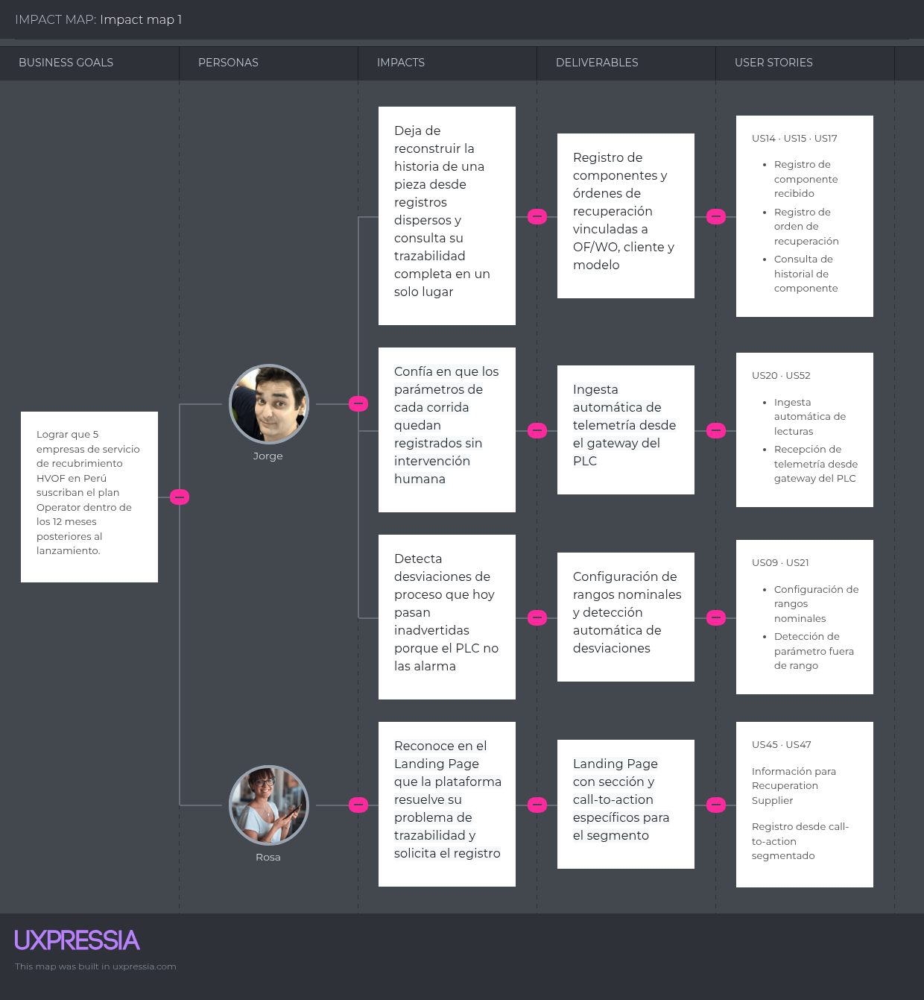{width=80%}

### Business Goal 2 — Evidencia de calidad aceptada por el cliente

> **Lograr que el 80 % de las órdenes de recuperación entregadas por los clientes activos cuenten con un certificado de calidad emitido desde EdgeWatch dentro de los seis meses posteriores a su incorporación a la plataforma.**

| Actor | Impact | Deliverable | User Stories |
|---|---|---|---|
| Jorge Salinas  | Emite la evidencia de calidad en minutos, a partir de los datos ya registrados, en lugar de armarla a mano | Emisión de certificado de calidad por orden de recuperación | Como ingeniero de calidad, deseo emitir el certificado de calidad de una orden de recuperación a partir de las sesiones registradas, para entregar evidencia documentada al cliente (US35). Como supervisor de operación, deseo cerrar la orden de recuperación y marcar el componente como entregado, para habilitar la emisión del certificado y el seguimiento en campo (US18). |
| Jorge Salinas  | Responde a una auditoría del cliente con evidencia exportable en lugar de con registros en papel | Exportación de historial de sesiones y certificados por periodo | Como ingeniero de calidad, deseo exportar el historial de sesiones y certificados de un periodo en formato CSV o PDF, para presentarlo durante una auditoría del cliente (US37). Como supervisor de operación, deseo generar el reporte de una sesión con el resumen de lecturas, desviaciones y fallas, para revisar el resultado de la corrida (US36). |
| Rosa Miranda | Acepta el certificado de EdgeWatch como respaldo formal del trabajo del proveedor | Portal de consulta de certificados para el cliente, con cumplimiento por parámetro y sin exposición de valores crudos | Como ingeniera de confiabilidad, deseo consultar el certificado de calidad de un componente entregado por mi proveedor, para verificar que fue recubierto dentro de tolerancia (US41). |

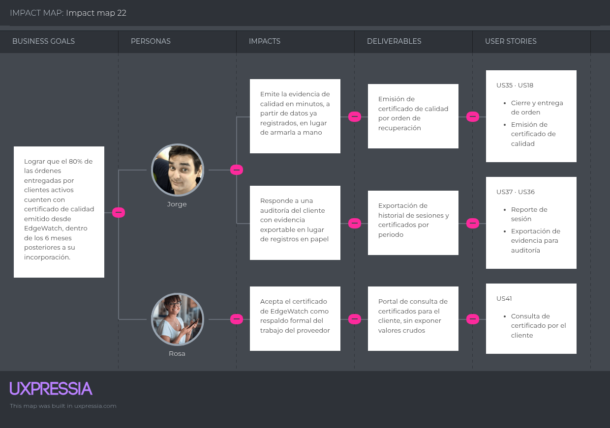{width=80%}

### Business Goal 3 — Reducción del tiempo de diagnóstico de fallas

> **Reducir en al menos 40 % el tiempo promedio entre la detención de una celda HVOF y la identificación de la causa probable de la falla, en los clientes del plan Operator, dentro de los nueve meses posteriores a su incorporación.**

| Actor | Impact | Deliverable | User Stories |
|---|---|---|---|
| Jorge Salinas | Recibe el caso de falla ya abierto con sus síntomas, en lugar de reconstruirlo desde los registros del PLC | Apertura automática de casos de falla a partir de indicadores del PLC | Como supervisor de mantenimiento de máquina, deseo que el sistema abra un caso de falla cuando un tag clasificado como indicador de falla se active durante una sesión, para no depender de que el operador lo reporte (US25). |
| Jorge Salinas | Sabe qué parte de la celda revisar antes de ir a la máquina | Diagnóstico asistido por reglas causa-efecto con identificación de parte sospechosa | Como supervisor de mantenimiento de máquina, deseo que el sistema aplique el catálogo de reglas causa-efecto al caso de falla abierto, para obtener una causa probable y la parte sospechosa (US26). Como supervisor de mantenimiento de máquina, deseo cargar el archivo de tags del PLC de una celda, para que el sistema proponga a qué parte y parámetro corresponde cada tag (US10). |
| Jorge Salinas | Registra la causa raíz confirmada para que el conocimiento no se pierda cuando cambie el personal | Confirmación de causa raíz y catálogo de reglas editable | Como supervisor de mantenimiento de máquina, deseo confirmar o corregir la causa raíz y registrar la acción correctiva de un caso de falla, para que el conocimiento quede documentado en el sistema (US27). Como ingeniero de calidad, deseo crear, editar y desactivar reglas causa-efecto, para adaptar el diagnóstico a cada celda (US28). |
| Jorge Salinas | Interviene una parte antes de que provoque una parada mayor | Detección de patrones recurrentes y alertas críticas | Como supervisor de mantenimiento de máquina, deseo que el sistema identifique cuando una misma parte acumula fallas del mismo tipo dentro de un periodo, para anticipar un problema mayor (US29). Como supervisor de mantenimiento de máquina, deseo recibir una alerta cuando se abra un caso de falla crítica o se detecte un patrón recurrente, para intervenir oportunamente (US32). |

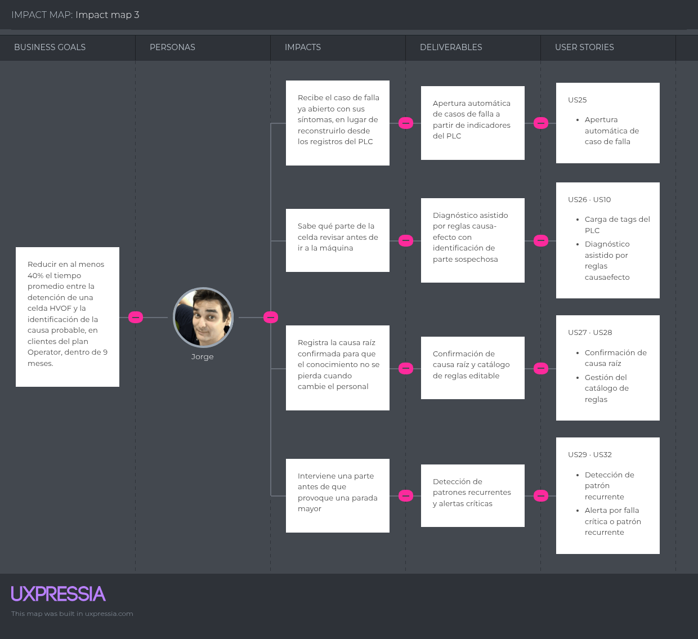{width=80%}

### Business Goal 4 — Adopción del segmento Asset Owner

> **Lograr que tres empresas mineras suscriban el plan Asset Owner y registren el retorno de campo de al menos el 60 % de sus componentes recuperados dentro de los dieciocho meses posteriores al lanzamiento.**

| Actor | Impact | Deliverable | User Stories |
|---|---|---|---|
| Rosa Miranda | Registra el retorno de cada componente en la plataforma en lugar de en una hoja de cálculo propia | Registro de retorno de campo con evaluación automática contra el PCR | Como ingeniera de confiabilidad, deseo registrar el retorno de un componente indicando el horómetro alcanzado y el motivo, para que el sistema evalúe si alcanzó su PCR (US40). |
| Rosa Miranda | Ve en una sola vista todos los componentes recuperados de la mina, sin importar qué proveedor los trabajó | Vista consolidada multi-proveedor de componentes recuperados | Como analista de compras, deseo consultar en una sola vista todos los componentes recuperados de mi organización con su proveedor, estado y fecha de entrega, para eliminar el cruce manual de información (US39). |
| Rosa Miranda | Sustenta la renovación o el cambio de un proveedor con datos de cumplimiento de PCR en lugar de con percepción | Reporte de cumplimiento de PCR agrupado por proveedor, modelo y tipo | Como ingeniera de confiabilidad, deseo consultar la tasa de cumplimiento de PCR agrupada por proveedor, modelo de máquina y tipo de componente, para sustentar la renovación o cambio de contratos con datos (US42). |
| Jorge Salinas | Analiza la sesión de origen de cada falla prematura reportada por la mina, en lugar de enterarse por un reclamo sin datos | Correlación automática de falla prematura con la sesión de rociado original | Como ingeniero de calidad, deseo que al registrarse una falla prematura el sistema me presente la sesión de rociado original del componente, para determinar si el origen estuvo en el recubrimiento (US43). |
| Jorge Salinas | Reconoce en el Landing Page el valor de la vista consolidada y solicita el registro | Landing Page con sección y call-to-action para Asset Owner | Como visitante del segmento Asset Owner, deseo acceder a la información específica para empresas propietarias de activos, para identificar si la propuesta responde a mis necesidades (US46). |

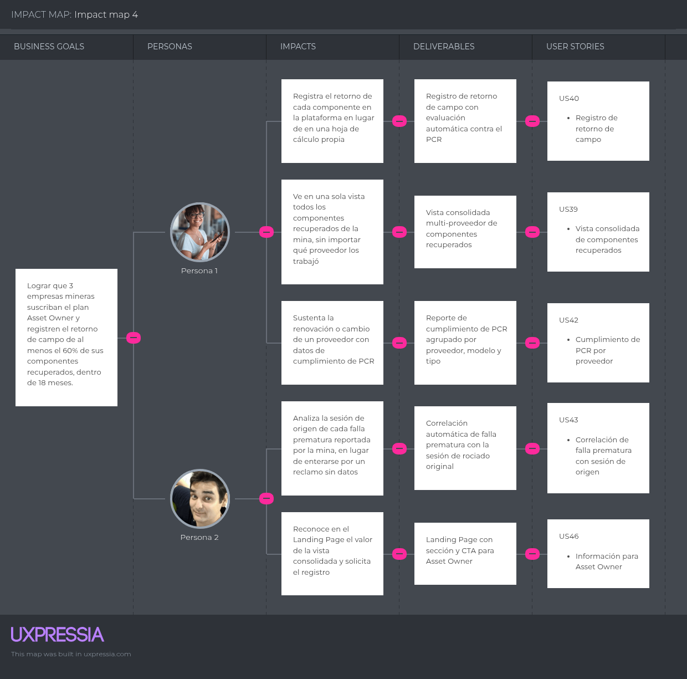{width=80%}

### Síntesis

Los cuatro Business Goals se refuerzan entre sí. BG1 y BG4 miden la adopción de cada segmento; BG2 y BG3 miden el valor que cada segmento obtiene una vez adoptada la plataforma, y son a la vez los mecanismos que sostienen la renovación de las suscripciones. Las User Stories referenciadas en los cuatro mapas constituyen el núcleo del Product Backlog de la sección 3.3 y explican por qué encabezan su priorización.


## 3.3. Product Backlog

El Product Backlog reúne las 52 User Stories y 18 Technical Stories de la sección 3.1, estimadas y priorizadas. La estimación se realizó en Story Points mediante Planning Poker con la escala 1 / 2 / 3 / 5 / 8, tomando como referencia la historia US23 (finalización o aborto de sesión, 2 puntos) como unidad de comparación. La priorización responde al valor para el negocio y a los compromisos de entrega del curso, según los siguientes criterios:

1. **Landing Page primero.** Las historias del sitio web estático (E10) y su servicio externo asociado (TS18) encabezan el backlog porque constituyen el canal de captación de ambos segmentos y su primera versión debe estar desplegada en la entrega AV1.
2. **Cadena de valor core.** A continuación se ordenan las historias que permiten demostrar el flujo principal del negocio de extremo a extremo: registrar un componente y su orden de recuperación, configurar la celda, iniciar una sesión, recibir telemetría y detectar desviaciones. Sin esta cadena, ninguna otra funcionalidad tiene sentido para el usuario.
3. **Diferenciadores.** Siguen el mapeo automático de tags, el diagnóstico de fallas asistido, el certificado de calidad y el análisis de cumplimiento PCR para el Asset Owner, que sustentan las hipótesis H-05, H-07 y H-08 y el modelo de suscripción de ambos segmentos.
4. **Soporte.** Las alertas, la gestión de identidad y la facturación se ubican al final: son necesarias para operar la plataforma, pero no generan valor por sí mismas. Colocar autenticación o suscripciones al inicio del backlog sería un error de priorización, dado que el usuario no paga por iniciar sesión sino por trazar su proceso.

**Total estimado:** 271 Story Points.

Herramienta: Trello.  
URL pública del board: <https://trello.com/invite/b/6aa234c58be8ea8121c19b01/ATTIe3d8df7c2304b434249a2328489667aeE6F8F69E/edgewatch-product-backlog>

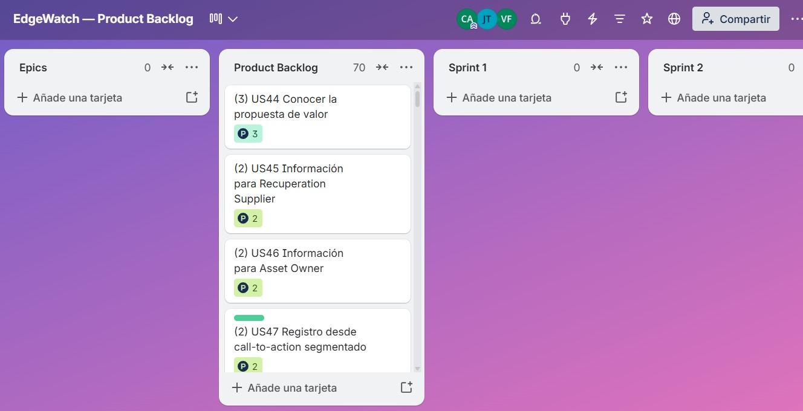{width=80%}

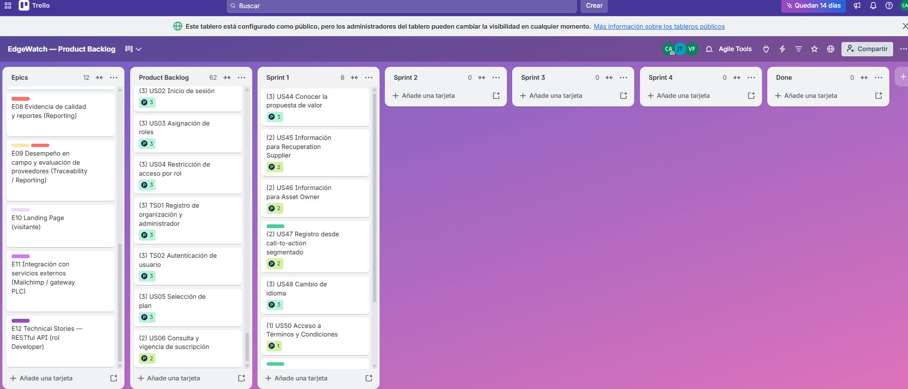{width=80%}

| # Orden | User Story Id | Título | Descripción | Story Points (1 / 2 / 3 / 5 / 8) |
|---|---|---|---|---|
| 1 | US44 | Conocer la propuesta de valor | Como visitante, deseo conocer el problema que resuelve EdgeWatch y sus beneficios desde la página principal, para decidir si la solución es relevante para mi organización. | 3 |
| 2 | US45 | Información para Recuperation Supplier | Como visitante del segmento Recuperation Supplier, deseo acceder a la información específica para empresas que operan procesos HVOF, para identificar si la propuesta responde a mis necesidades. | 2 |
| 3 | US46 | Información para Asset Owner | Como visitante del segmento Asset Owner, deseo acceder a la información específica para empresas propietarias de activos, para identificar si la propuesta responde a mis necesidades. | 2 |
| 4 | US47 | Registro desde call-to-action segmentado | Como visitante, deseo iniciar el registro desde el call-to-action de mi segmento, para llegar directamente a la vista de registro correspondiente en la Web Application. | 2 |
| 5 | US48 | Cambio de idioma | Como visitante, deseo cambiar el idioma del Landing Page entre inglés y español, para leer el contenido en el idioma de mi preferencia. | 3 |
| 6 | US50 | Acceso a Términos y Condiciones | Como visitante, deseo acceder a los Términos y Condiciones del servicio desde el pie de página, para conocer las reglas de uso y el tratamiento de la información antes de registrarme. | 1 |
| 7 | US49 | Suscripción al newsletter | Como visitante, deseo suscribirme al newsletter de WebRunners con mi correo electrónico, para recibir novedades sobre EdgeWatch y el sector. | 3 |
| 8 | TS18 | Suscripción al newsletter vía Mailchimp | Como developer, deseo consumir el endpoint POST /api/v1/newsletter/subscriptions, para registrar un correo en la audiencia de Mailchimp desde el Landing Page. | 3 |
| 9 | US13 | Registro de cliente | Como supervisor de operación, deseo registrar los clientes de mi organización con su razón social, RUC y sede, para vincular cada componente a su propietario. | 2 |
| 10 | US14 | Registro de componente recibido | Como operador HVOF, deseo registrar un componente recibido con su número de serie, part number, tipo, modelo de máquina y cliente, para identificarlo durante todo el proceso. | 3 |
| 11 | US15 | Registro de orden de recuperación | Como supervisor de operación, deseo registrar la orden de recuperación con su OF y WO, horómetro de ingreso, peso y lote de polvo, para trazar el trabajo realizado sobre el componente. | 5 |
| 12 | US16 | Definición de PCR objetivo | Como ingeniero de calidad, deseo definir el PCR objetivo en horas por tipo y modelo de componente, para contar con el estándar contra el cual se evaluará el desempeño en campo. | 3 |
| 13 | TS07 | Registro de componente | Como developer, deseo consumir el endpoint POST /api/v1/components, para registrar un componente recibido del cliente. | 3 |
| 14 | TS08 | Registro de orden de recuperación | Como developer, deseo consumir el endpoint POST /api/v1/recuperations, para crear la orden de recuperación con su OF y WO vinculada a un componente. | 3 |
| 15 | US07 | Registro de celda HVOF | Como supervisor de mantenimiento de máquina, deseo registrar una celda HVOF con su código, fabricante y configuración del PLC, para que las sesiones y fallas se asocien a un equipo identificado. | 3 |
| 16 | US08 | Registro de partes de la celda | Como supervisor de mantenimiento de máquina, deseo registrar las partes que componen una celda (alimentador de polvo, tolva, spindle, ejes, colector de polvo, entre otras), para que el diagnóstico pueda atribuir fallas a una parte específica. | 3 |
| 17 | US09 | Configuración de rangos nominales | Como ingeniero de calidad, deseo configurar los rangos nominales de cada parámetro de proceso por celda, para que el sistema detecte desviaciones automáticamente. | 3 |
| 18 | TS03 | Registro de celda HVOF | Como developer, deseo consumir el endpoint POST /api/v1/hvof-cells, para registrar una celda con su configuración de PLC. | 3 |
| 19 | TS04 | Configuración de rangos nominales | Como developer, deseo consumir el endpoint PUT /api/v1/hvof-cells/{cellId}/nominal-ranges, para establecer los rangos nominales por parámetro de una celda. | 3 |
| 20 | US19 | Inicio de sesión de rociado | Como operador HVOF, deseo iniciar una sesión de rociado seleccionando la celda y la orden de recuperación, para que las lecturas del proceso se asocien al componente correcto. | 3 |
| 21 | US20 | Ingesta automática de lecturas | Como supervisor de operación, deseo que las lecturas del proceso lleguen automáticamente desde el gateway del PLC durante la sesión, para no depender de registros manuales. | 8 |
| 22 | US21 | Detección de parámetro fuera de rango | Como ingeniero de calidad, deseo que el sistema marque automáticamente cada lectura que salga del rango nominal de la celda, para identificar desviaciones sin supervisión manual. | 5 |
| 23 | US22 | Visualización de lecturas en vivo | Como operador HVOF, deseo ver los valores actuales de los parámetros durante la sesión, para reaccionar ante una desviación mientras la corrida está en curso. | 5 |
| 24 | US23 | Finalización o aborto de sesión | Como operador HVOF, deseo completar o abortar una sesión indicando el motivo, para dejar constancia del resultado de la corrida. | 2 |
| 25 | US24 | Historial de sesiones por celda | Como supervisor de operación, deseo consultar el historial de sesiones de una celda filtrando por fecha y orden de recuperación, para revisar corridas pasadas. | 3 |
| 26 | TS09 | Inicio de sesión de rociado | Como developer, deseo consumir el endpoint POST /api/v1/spray-sessions, para iniciar una sesión vinculada a una celda y una orden de recuperación. | 3 |
| 27 | TS10 | Ingesta de lecturas de telemetría | Como developer, deseo consumir el endpoint POST /api/v1/spray-sessions/{sessionId}/readings, para enviar lotes de lecturas del PLC a una sesión activa. | 8 |
| 28 | TS11 | Consulta de lecturas de una sesión | Como developer, deseo consumir el endpoint GET /api/v1/spray-sessions/{sessionId}/readings, para obtener las lecturas de una sesión y mostrarlas en la vista de monitoreo. | 3 |
| 29 | US52 | Recepción de telemetría desde gateway del PLC | Como supervisor de operación, deseo que la plataforma reciba la telemetría desde un gateway externo conectado al PLC de la celda, para que el registro del proceso no dependa de intervención humana. | 5 |
| 30 | US10 | Carga de tags del PLC | Como supervisor de mantenimiento de máquina, deseo cargar el archivo de tags del PLC de una celda (CSV o JSON), para que el sistema proponga a qué parte y parámetro corresponde cada tag. | 8 |
| 31 | US11 | Confirmación de mapeo de tags | Como supervisor de mantenimiento de máquina, deseo confirmar o corregir el mapeo propuesto para cada tag, para asegurar que las fallas se atribuyan a la parte correcta. | 5 |
| 32 | US12 | Cambio de estado de celda | Como supervisor de mantenimiento de máquina, deseo cambiar el estado de una celda (activa, en mantenimiento, fuera de servicio), para impedir que se inicien sesiones en un equipo no disponible. | 2 |
| 33 | TS05 | Importación de tags del PLC | Como developer, deseo consumir el endpoint POST /api/v1/hvof-cells/{cellId}/tag-imports, para cargar el archivo de tags y obtener las propuestas de mapeo. | 8 |
| 34 | TS06 | Confirmación de mapeo de tag | Como developer, deseo consumir el endpoint PUT /api/v1/hvof-cells/{cellId}/tag-mappings/{tagId}, para confirmar o corregir el mapeo de un tag. | 3 |
| 35 | US25 | Apertura automática de caso de falla | Como supervisor de mantenimiento de máquina, deseo que el sistema abra un caso de falla cuando un tag clasificado como indicador de falla se active durante una sesión, para no depender de que el operador lo reporte. | 8 |
| 36 | US26 | Diagnóstico asistido por reglas causa-efecto | Como supervisor de mantenimiento de máquina, deseo que el sistema aplique el catálogo de reglas causa-efecto al caso de falla abierto, para obtener una causa probable y la parte sospechosa. | 8 |
| 37 | US28 | Gestión del catálogo de reglas | Como ingeniero de calidad, deseo crear, editar y desactivar reglas causa-efecto indicando parámetro disparador, condición, causa probable y parte sospechosa, para adaptar el diagnóstico a cada celda. | 5 |
| 38 | US27 | Confirmación de causa raíz | Como supervisor de mantenimiento de máquina, deseo confirmar o corregir la causa raíz y registrar la acción correctiva de un caso de falla, para que el conocimiento quede documentado en el sistema. | 3 |
| 39 | US30 | Consulta de casos de falla | Como supervisor de mantenimiento de máquina, deseo consultar los casos de falla filtrando por celda, parte, tipo y estado, para dar seguimiento a los pendientes. | 3 |
| 40 | US29 | Detección de patrón recurrente | Como supervisor de mantenimiento de máquina, deseo que el sistema identifique cuando una misma parte acumula fallas del mismo tipo dentro de un periodo, para anticipar un problema mayor. | 5 |
| 41 | TS12 | Consulta de casos de falla | Como developer, deseo consumir el endpoint GET /api/v1/fault-cases, para listar los casos de falla con filtros de celda, parte, tipo y estado. | 3 |
| 42 | TS13 | Confirmación de causa raíz | Como developer, deseo consumir el endpoint PATCH /api/v1/fault-cases/{faultCaseId}/root-cause, para registrar la causa raíz confirmada y la acción correctiva. | 2 |
| 43 | US18 | Cierre y entrega de orden | Como supervisor de operación, deseo cerrar la orden de recuperación y marcar el componente como entregado, para habilitar la emisión del certificado y el seguimiento en campo. | 3 |
| 44 | US35 | Emisión de certificado de calidad | Como ingeniero de calidad, deseo emitir el certificado de calidad de una orden de recuperación a partir de las sesiones registradas, para entregar evidencia documentada al cliente. | 8 |
| 45 | US36 | Reporte de sesión | Como supervisor de operación, deseo generar el reporte de una sesión con el resumen de lecturas, desviaciones y fallas, para revisar el resultado de la corrida. | 3 |
| 46 | US17 | Consulta de historial de componente | Como ingeniero de calidad, deseo consultar el historial completo de un componente por su número de serie, OF o WO, para responder ante un cuestionamiento del cliente. | 5 |
| 47 | US37 | Exportación de evidencia para auditoría | Como ingeniero de calidad, deseo exportar el historial de sesiones y certificados de un periodo en formato CSV o PDF, para presentarlo durante una auditoría del cliente. | 5 |
| 48 | US38 | Reporte de frecuencia de fallas | Como supervisor de mantenimiento de máquina, deseo consultar la frecuencia de fallas por celda y por parte en un periodo, para priorizar las intervenciones. | 3 |
| 49 | TS14 | Emisión de certificado de calidad | Como developer, deseo consumir el endpoint POST /api/v1/recuperations/{recuperationId}/quality-certificate, para emitir el certificado de una orden cerrada. | 5 |
| 50 | US39 | Vista consolidada de componentes recuperados | Como analista de compras, deseo consultar en una sola vista todos los componentes recuperados de mi organización con su proveedor, estado y fecha de entrega, para eliminar el cruce manual de información. | 5 |
| 51 | US40 | Registro de retorno de campo | Como ingeniero de confiabilidad, deseo registrar el retorno de un componente indicando el horómetro alcanzado y el motivo, para que el sistema evalúe si alcanzó su PCR. | 5 |
| 52 | US41 | Consulta de certificado por el cliente | Como ingeniero de confiabilidad, deseo consultar el certificado de calidad de un componente entregado por mi proveedor, para verificar que fue recubierto dentro de tolerancia. | 3 |
| 53 | US42 | Cumplimiento de PCR por proveedor | Como ingeniero de confiabilidad, deseo consultar la tasa de cumplimiento de PCR agrupada por proveedor, modelo de máquina y tipo de componente, para sustentar la renovación o cambio de contratos con datos. | 8 |
| 54 | US43 | Correlación de falla prematura con sesión de origen | Como ingeniero de calidad, deseo que al registrarse una falla prematura el sistema me presente la sesión de rociado original del componente, para determinar si el origen estuvo en el recubrimiento. | 5 |
| 55 | TS15 | Registro de retorno de campo | Como developer, deseo consumir el endpoint POST /api/v1/components/{componentId}/field-returns, para registrar el retorno de un componente y su evaluación contra el PCR. | 3 |
| 56 | TS16 | Reporte de cumplimiento PCR | Como developer, deseo consumir el endpoint GET /api/v1/reports/pcr-compliance, para obtener la tasa de cumplimiento agrupada por proveedor, modelo o tipo de componente. | 5 |
| 57 | US31 | Alerta por parámetro fuera de rango | Como operador HVOF, deseo recibir una alerta en la plataforma cuando un parámetro salga de su rango nominal, para actuar mientras la corrida está en curso. | 5 |
| 58 | US32 | Alerta por falla crítica o patrón recurrente | Como supervisor de mantenimiento de máquina, deseo recibir una alerta cuando se abra un caso de falla crítica o se detecte un patrón recurrente, para intervenir oportunamente. | 3 |
| 59 | US33 | Preferencias de notificación | Como usuario de la plataforma, deseo configurar qué tipos de alerta recibo y por qué canal, para recibir únicamente lo relevante para mi rol. | 3 |
| 60 | US34 | Atención de alertas | Como usuario de la plataforma, deseo marcar una alerta como atendida, para distinguir las pendientes de las ya revisadas. | 2 |
| 61 | US51 | Entrega de alertas por correo electrónico | Como supervisor de mantenimiento de máquina, deseo recibir por correo electrónico las alertas críticas mediante el servicio externo Mailchimp, para enterarme sin estar frente a la plataforma. | 5 |
| 62 | TS17 | Consulta de alertas del usuario | Como developer, deseo consumir el endpoint GET /api/v1/alerts, para obtener las alertas dirigidas al usuario autenticado y su estado. | 3 |
| 63 | US01 | Registro de organización | Como administrador de una organización, deseo registrar mi organización indicando su tipo (Recuperation Supplier o Asset Owner), para habilitar el acceso de mi equipo a la plataforma. | 3 |
| 64 | US02 | Inicio de sesión | Como usuario registrado, deseo iniciar sesión con mis credenciales, para acceder a las funciones que corresponden a mi rol. | 3 |
| 65 | US03 | Asignación de roles | Como administrador de organización, deseo asignar roles a los usuarios de mi organización, para que cada uno acceda solo a las funciones que le corresponden. | 3 |
| 66 | US04 | Restricción de acceso por rol | Como administrador de organización, deseo que las funciones de la plataforma se restrinjan según el rol del usuario, para proteger la información de la organización. | 3 |
| 67 | TS01 | Registro de organización y administrador | Como developer, deseo consumir el endpoint POST /api/v1/authentication/sign-up, para registrar una organización y su usuario administrador desde la Web Application. | 3 |
| 68 | TS02 | Autenticación de usuario | Como developer, deseo consumir el endpoint POST /api/v1/authentication/sign-in, para obtener el token de acceso que autoriza las demás peticiones. | 3 |
| 69 | US05 | Selección de plan | Como administrador de organización, deseo seleccionar el plan correspondiente a mi tipo de organización (Operator o Asset Owner), para activar las capacidades de la plataforma. | 3 |
| 70 | US06 | Consulta y vigencia de suscripción | Como administrador de organización, deseo consultar el estado y la vigencia de mi suscripción, para anticipar su renovación. | 2 |


# Capítulo IV: Product Design

## 4.1. Style Guidelines.

### 4.1.1. General Style Guidelines.

**Identidad de marca**

| Atributo | Definición |
|---|---|
| Nombre de producto | EdgeWatch |
| Nombre de la startup | WebRunners |
| Tagline | *"El dato de su proceso, convertido en trazabilidad y diagnóstico."* |
| Personalidad de marca | Confiable · Preciso · Claro · Técnico sin ser frío |
| Territorio visual | Industrial-tecnológico: se apoya en la estética de sala de control y tablero de proceso, no en la estética "startup SaaS" genérica |

**Logotipo**

El logotipo combina un isotipo (aguja de medición/gauge que traza un arco, en referencia a la lectura continua de parámetros de proceso) con el logotype "EdgeWatch" en tipografía de marca. Reglas de uso:

| Regla | Especificación |
|---|---|
| Área de resguardo | Espacio libre mínimo alrededor del isotipo equivalente a la altura de la "E" del logotype |
| Tamaño mínimo digital | 24 px de alto |
| Versiones | Positiva (isotipo + texto en Navy `#0B2545` sobre fondo claro), negativa (blanco sobre fondo Navy o fotografía oscura), monocromática (para impresión de certificados en blanco y negro) |
| Usos no permitidos | No rotar, no aplicar degradados ajenos a la paleta, no distorsionar la proporción, no ubicar sobre fondos con contraste insuficiente (ver tabla de contraste en 4.1.2) |

**Paleta de colores**

La paleta reutiliza deliberadamente los colores ya empleados en el árbol de problemas del Capítulo I (sección 1.2.1) para los estados de causa/efecto, de modo que el mismo código cromático que se usó para diagnosticar el problema se convierte en el sistema de estados del producto que lo resuelve.

| Rol | Hex | Uso |
|---|---|---|
| Primario — Industrial Navy | `#0B2545` | Header, navegación, fondos de secciones destacadas, texto de marca |
| Primario oscuro | `#071A33` | Footer, secciones de máximo contraste |
| Secundario — Thermal Amber | `#FF7A00` | Botón primario / CTA, acentos, hover de enlaces |
| Acento — Data Teal | `#00B4D8` | Enlaces en cuerpo de texto, series de datos en gráficos de telemetría |
| Éxito / Nominal | `#2E7D32` (tinte `#C8E6C9`) | Parámetro dentro de rango, sesión sin desviaciones |
| Advertencia / Alerta | `#FFB300` (tinte `#FFECB3`) | Desviación detectada, estado "En revisión" |
| Crítico / Falla | `#C62828` (tinte `#EF9A9A`) | Parada de equipo, parámetro fuera de tolerancia, falla prematura en campo |
| Información / En proceso | `#1565C0` (tinte `#90CAF9`) | Sesión en curso, estado neutro informativo |
| Neutro 900 (texto) | `#1B1F27` | Texto principal |
| Neutro 600 (texto secundario) | `#5B6472` | Metadatos, etiquetas, texto de apoyo |
| Neutro 200 (bordes) | `#E2E6EB` | Bordes de tarjetas, separadores, tablas |
| Neutro 50 (fondo) | `#F5F7FA` | Fondo de página, fondo de tabla alternado |

**Tipografía**

| Uso | Familia | Justificación |
|---|---|---|
| Titulares (H1–H3) | Poppins (SemiBold/Bold) | Geométrica, técnica y confiada; funciona bien en tamaños grandes del Landing Page |
| Cuerpo e interfaz | Inter (Regular/Medium) | Alta legibilidad en tamaños pequeños, óptima para tablas densas de la Web Application |
| Valores numéricos y de proceso | JetBrains Mono | Alinea dígitos en columnas de telemetría y códigos (OF, WO, tags de parámetro) |

Escala tipográfica (tamaño/interlineado en px): H1 40/48 · H2 32/40 · H3 24/32 · H4 20/28 · Body Large 18/28 · Body 16/24 · Small 14/20 · Micro 12/16.

**Iconografía**

Set de íconos de línea, grilla de 24×24 px, trazo de 2 px con puntas redondeadas (estilo consistente con librerías como Phosphor Icons, peso *regular*). Variante rellena reservada exclusivamente para indicar estado activo/seleccionado, nunca para decoración.

**Fotografía e imágenes**

Fotografía real de planta, cabina HVOF y componentes recubiertos (no stock genérico de oficinas). Tratamiento dúotono Navy `#0B2545` / Amber `#FF7A00` en imágenes de héroe, y overlay Navy al 60 % sobre fotografía de planta cuando lleva texto superpuesto, para garantizar contraste legible.

**Voz y tono**

Directa, técnica-accesible y basada en evidencia: el copy prioriza métricas concretas (tiempo de diagnóstico, % de OF con certificado emitido) frente a adjetivos vacíos ("innovador", "revolucionario"). Se conserva el ubiquitous language del dominio (OF, WO, PCR, sesión de rociado) en lugar de traducirlo o genericarlo, tanto en el Landing Page como en la Web Application, para que el vocabulario de venta sea el mismo que el vocabulario de uso.

### 4.1.2. Web Style Guidelines.

**Sistema de grid y espaciado**

| Propiedad | Valor |
|---|---|
| Columnas | 12 |
| Gutter | 24 px |
| Margen lateral | 24 px (mobile) / 64 px (desktop) |
| Ancho máximo de contenido | 1280 px |
| Unidad base de espaciado | 8 px (escala: 4·8·16·24·32·48·64·96) |

**Breakpoints**

| Nombre | Ancho | Uso principal |
|---|---|---|
| sm | 375 px | Consulta móvil de alertas (Operador, Jefe de Mantenimiento en planta) |
| md | 768 px | Tablet en taller |
| lg | 1024 px | Web Application en escritorio |
| xl | 1280 px | Landing Page y dashboards |
| xxl | 1440 px+ | Monitores de sala de control |

**Componentes**

| Componente | Especificación |
|---|---|
| Botón primario | Fondo `#FF7A00`, texto blanco, radio 6 px; hover oscurece 10 %; disabled en Neutro 200/600; estado *loading* con spinner y bloqueo de doble envío |
| Botón secundario | Borde `#0B2545` 1.5 px, fondo transparente, texto `#0B2545` |
| Badge de estado | Píldora con ícono + etiqueta, nunca solo color: **Nominal** (verde), **Alerta** (ámbar), **Crítico** (rojo), **En sesión** (azul info), **Cerrado** (gris) |
| Tarjeta (Session Card, Alert Card, KPI Card) | Radio 8 px, borde `#E2E6EB` 1 px, sombra sutil en hover, encabezado con el badge de estado |
| Formularios | Etiqueta encima del campo, texto de 16 px (evita zoom automático en iOS), validación inline en rojo crítico bajo el campo, asterisco para campos obligatorios |
| Tablas de datos | Encabezado *sticky*, filas alternadas sobre Neutro 50, columnas numéricas en JetBrains Mono alineadas a la derecha |
| Navegación | Top nav *sticky* con fondo transparente que pasa a sólido al hacer scroll (Landing Page); sidebar colapsable agrupado por módulo (Web Application) |
| Gráficos de telemetría | Línea/área con banda sombreada representando el rango nominal configurado; el trazo cambia de color (verde→ámbar→rojo) al cruzar el umbral |

**Accesibilidad**

Cumplimiento WCAG 2.1 nivel AA: contraste mínimo 4.5:1 en texto de cuerpo y 3:1 en texto grande/íconos; área táctil mínima de 44×44 px; foco de teclado visible con contorno ámbar de 2 px; **el estado de un parámetro o alerta nunca se comunica solo por color**, siempre se acompaña de ícono y etiqueta textual, dado que parte de la audiencia opera en condiciones de iluminación de planta industrial y puede incluir usuarios con daltonismo.

**Motion**

Transiciones de 150–200 ms *ease-out* para hover, menús y acordeones. Las alertas críticas se muestran de forma **instantánea, sin animación de entrada**, dado que retrasar la percepción de una desviación de proceso por una transición decorativa contradice el propósito del producto. Se respeta `prefers-reduced-motion`.

## 4.2. Information Architecture.

### 4.2.1. Organization Systems.

EdgeWatch adopta un esquema **híbrido**, distinto para cada superficie porque atienden objetivos distintos:

| Superficie | Esquema de organización | Justificación |
|---|---|---|
| Landing Page | Por tema (topic-based), estructura tipo hub-and-spoke de una sola página con anclas | El visitante no conoce aún el producto; necesita recorrer Problema → Solución → Cómo funciona → Segmento propio → Contacto en un flujo lineal de persuasión |
| Web Application | Por tarea (task-based), agrupado por módulo funcional (Sesiones, Alertas, Diagnóstico, Certificados, PCR) | El usuario ya conoce el dominio y llega con una tarea concreta (ver 2.3.2 User Task Matrix); necesita llegar directo al módulo, no explorar |
| Historial de sesiones y telemetría | Cronológico, con filtro por OF/WO/cliente/equipo | Las lecturas de proceso son intrínsecamente temporales y se auditan por fecha de ejecución |
| Catálogo de reglas causa-efecto y componentes de máquina | Jerárquico (Equipo → Componente → Regla) | Refleja la estructura física real del equipo HVOF, consistente con el Ubiquitous Language |

**Mapa del sitio**

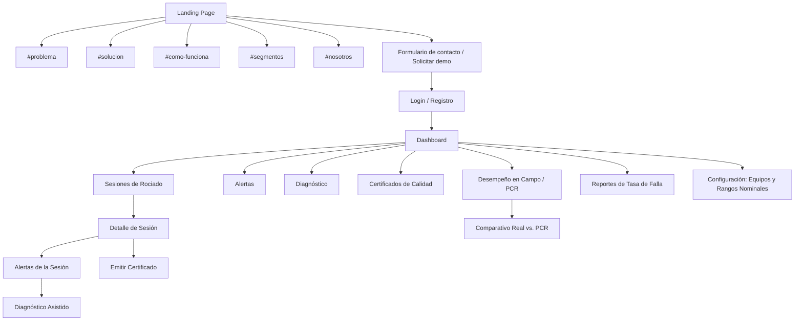
```mermaid
graph TD
LP["Landing Page"] --> LP1["#problema"]
LP --> LP2["#solucion"]
LP --> LP3["#como-funciona"]
LP --> LP4["#segmentos"]
LP --> LP5["#nosotros"]
LP --> LP6["Formulario de contacto / Solicitar demo"]

LP6 --> AUTH["Login / Registro"]
AUTH --> DASH["Dashboard"]

DASH --> SES["Sesiones de Rociado"]
DASH --> ALE["Alertas"]
DASH --> DIA["Diagnóstico"]
DASH --> CERT["Certificados de Calidad"]
DASH --> PCR["Desempeño en Campo / PCR"]
DASH --> REP["Reportes de Tasa de Falla"]
DASH --> ADM["Configuración: Equipos y Rangos Nominales"]

SES --> SESDET["Detalle de Sesión"]
SESDET --> ALEDET["Alertas de la Sesión"]
ALEDET --> DIADET["Diagnóstico Asistido"]
SESDET --> CERTGEN["Emitir Certificado"]
PCR --> PCRDET["Comparativo Real vs. PCR"]
```

### 4.2.2. Labeling Systems.

| Etiqueta en interfaz | Término de dominio | Justificación |
|---|---|---|
| Sesiones | Sesión de rociado | Término usado por Rosa y Jorge en las entrevistas; "proceso" o "trabajo" sería ambiguo |
| OF | Orden de Fabricación | Se mantiene el acrónimo tal como lo usa la organización cliente, no se expande en la interfaz cotidiana |
| WO | Work Order / Orden de Trabajo | Idem; convive con OF porque ambos códigos son consultados en simultáneo |
| Alertas | Desviación de parámetro / Falla de equipo | "Notificaciones" se descarta por ser un término genérico de producto SaaS, no del dominio |
| Diagnóstico | Componente de máquina sospechoso | Se prioriza el resultado ("qué componente mirar") sobre el mecanismo ("regla causa-efecto") en la etiqueta visible al usuario |
| Certificado de Calidad | Evidencia documentada de proceso dentro de tolerancia | Coincide textualmente con lo que Rosa debe "sustentar ante el cliente" (Journey Map 1) |
| PCR | Planned Component Replacement | Se mantiene en inglés/acrónimo porque así lo usa la industria minera peruana en los contratos |
| Rangos Nominales | Umbral por parámetro y equipo | Evita el término genérico "configuración" |

### 4.2.3. SEO Tags and Meta Tags

```html
<title>EdgeWatch | Trazabilidad y diagnóstico de procesos HVOF en tiempo real</title>
<meta name="description" content="Plataforma que convierte la telemetría de su cabina HVOF en trazabilidad OF/WO, alertas en tiempo real, diagnóstico por componente y evidencia de calidad para sus clientes mineros.">
<meta name="keywords" content="monitoreo HVOF, trazabilidad recubrimiento térmico, software mantenimiento minero, PCR componentes, diagnóstico de fallas industrial, certificado de calidad recubrimiento">
<link rel="canonical" href="https://edgewatch.pe/">

<meta property="og:type" content="website">
<meta property="og:site_name" content="EdgeWatch">
<meta property="og:title" content="EdgeWatch | Trazabilidad y diagnóstico de procesos HVOF en tiempo real">
<meta property="og:description" content="De la telemetría del PLC a la evidencia de calidad: trazabilidad, alertas y diagnóstico para servicios de recubrimiento HVOF.">
<meta property="og:image" content="https://edgewatch.pe/assets/og/edgewatch-cover.jpg">
<meta property="og:locale" content="es_PE">

<meta name="twitter:card" content="summary_large_image">
<meta name="twitter:title" content="EdgeWatch | Trazabilidad y diagnóstico HVOF">
<meta name="twitter:description" content="Convierta la telemetría de su cabina HVOF en trazabilidad, alertas y diagnóstico accionable.">

<script type="application/ld+json">
{
  "@context": "https://schema.org",
  "@type": "SoftwareApplication",
  "name": "EdgeWatch",
  "applicationCategory": "BusinessApplication",
  "operatingSystem": "Web",
  "offers": {
    "@type": "Offer",
    "priceCurrency": "PEN",
    "price": "Consultar"
  },
  "provider": {
    "@type": "Organization",
    "name": "WebRunners"
  }
}
</script>
```

Cada ancla de sección (`#problema`, `#solucion`, `#segmentos`) se refleja como *heading* semántico (`h2`) para reforzar la indexación temática, y las imágenes del héroe y de segmentos incluyen atributo `alt` descriptivo (p. ej. `alt="Cabina de recubrimiento HVOF con sensores conectados a EdgeWatch"`) en lugar de texto vacío.

### 4.2.4. Searching Systems.

| Superficie | Sistema de búsqueda | Detalle |
|---|---|---|
| Landing Page | No aplica | Sitio de una sola página con navegación por anclas; el volumen de contenido no justifica un buscador interno |
| Web Application — Sesiones/OF/WO | Búsqueda con autocompletado | Campo único que resuelve por código de OF, código de WO, cliente o tag de equipo, con sugerencias mientras se escribe |
| Web Application — Historial | Filtros facetados combinables | Estado (Nominal / Alerta / Crítico / Cerrado), rango de fechas, cliente, modelo de componente, equipo |
| Web Application — Catálogo de fallas | Filtro jerárquico | Por equipo → componente de máquina → código de falla |
| General | Filtros guardados | El usuario recurrente (Rosa, Jorge) puede guardar una combinación de filtros usada con frecuencia (p. ej. "Mis OF abiertas") |

### 4.2.5. Navigation Systems.

| Tipo | Ubicación | Contenido |
|---|---|---|
| Global | Top nav del Landing Page | Producto · Cómo funciona · Segmentos · Nosotros · **Solicitar demo** (CTA destacado) |
| Global | Sidebar de la Web Application | Dashboard · Sesiones · Alertas · Diagnóstico · Certificados · PCR · Reportes · Configuración, agrupados por frecuencia de uso según la User Task Matrix (2.3.2) |
| Local / contextual | Breadcrumb dentro de un módulo | `Cliente > OF > WO > Sesión`, permite retroceder sin perder el contexto del caso que se está resolviendo |
| Contextual | Panel de alerta activa | Enlace directo "Ver diagnóstico sugerido" que salta del módulo de Alertas al de Diagnóstico sin pasar por el dashboard |
| Suplementaria | Footer del Landing Page | Mapa de enlaces, política de privacidad y confidencialidad de datos de proceso (mitigación de amenaza descrita en 2.1.2), datos de contacto, enlaces a redes |
| De cortesía | Ambas superficies | Botón "volver arriba" en el Landing Page; acceso a ayuda contextual (?) junto a campos técnicos poco frecuentes en la Web Application |

## 4.3. Landing Page UI Design.

### 4.3.1. Landing Page Wireframe.

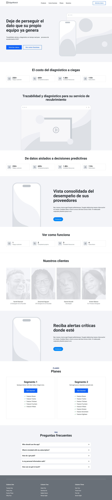{width=80%}

### 4.3.2. Landing Page Mock-up.

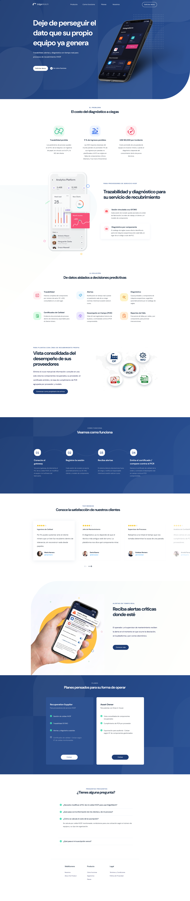{width=80%}

## 4.4. Web Applications UX/UI Design.

### 4.4.1. Web Applications Wireframes.

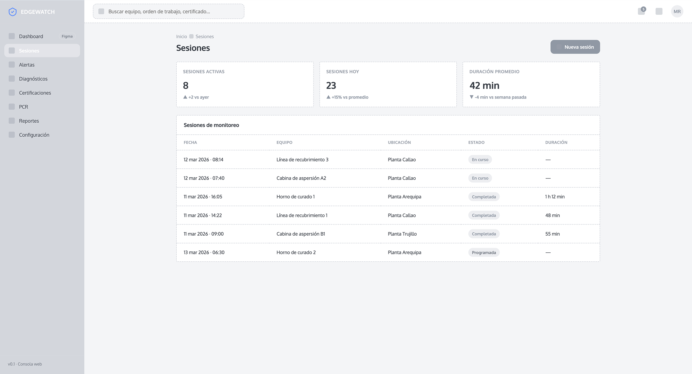{width=80%}

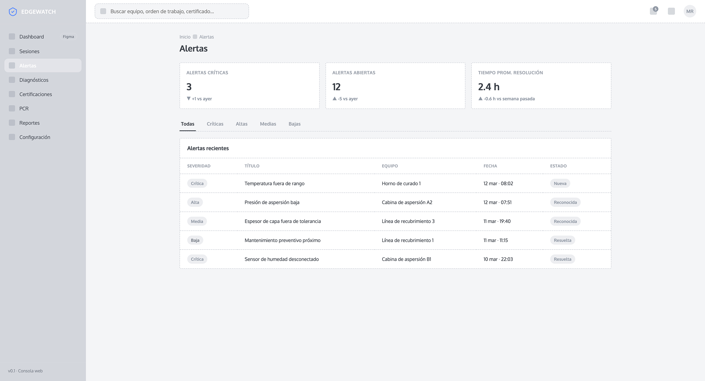{width=80%}

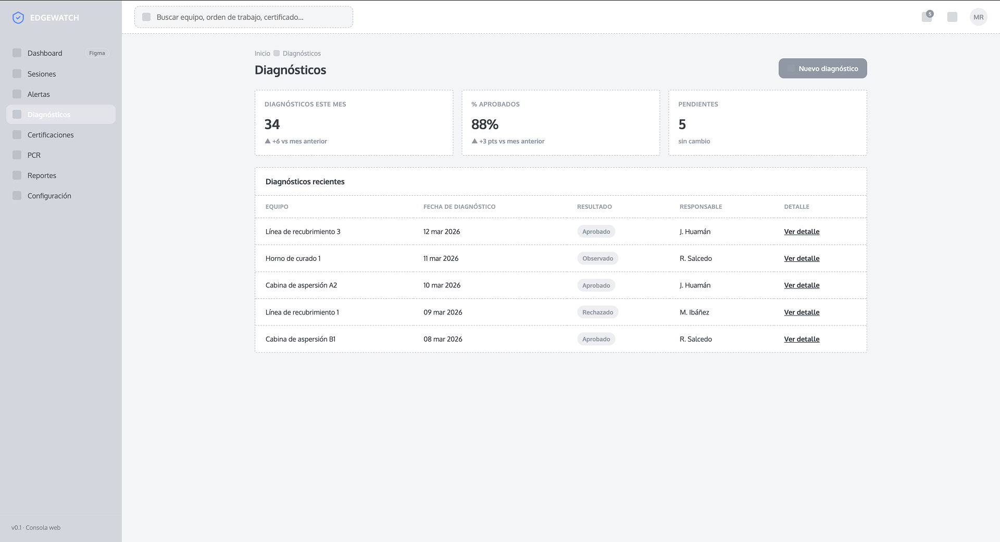{width=80%}

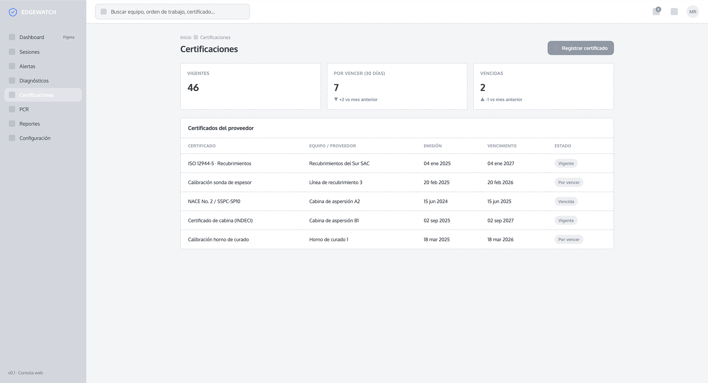{width=80%}

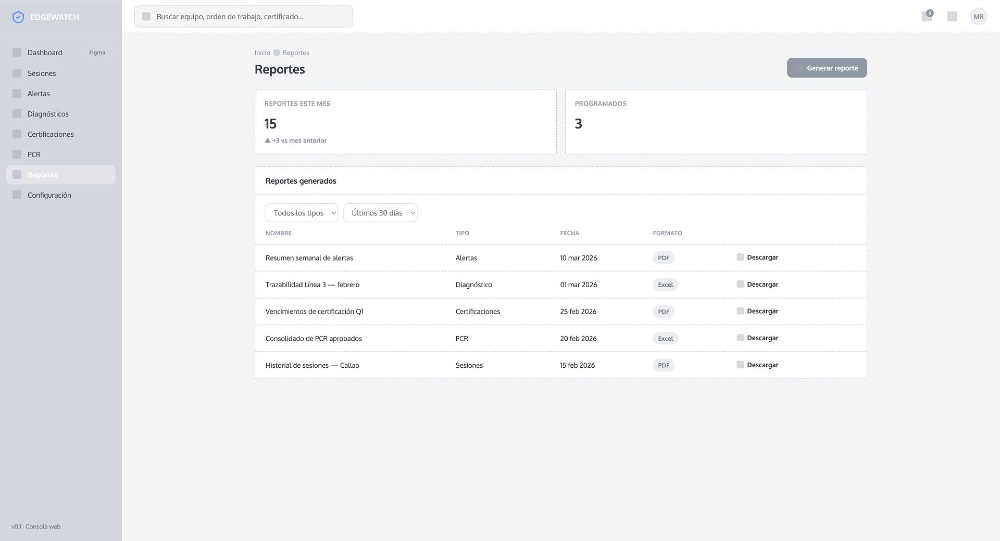{width=80%}

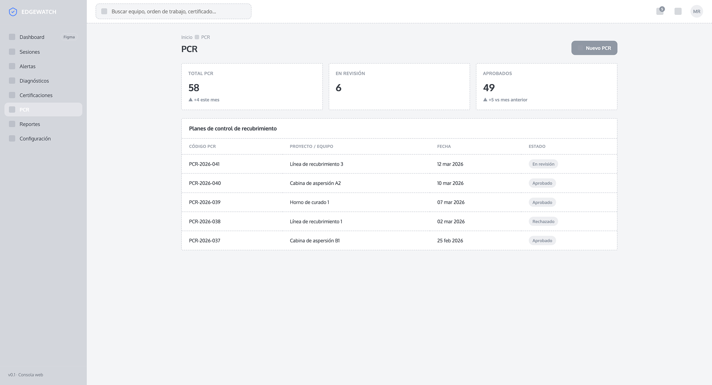{width=80%}

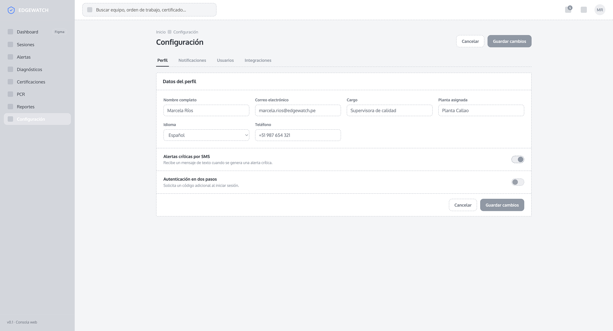{width=80%}

### 4.4.2. Web Applications Wireflow Diagrams.
**A. Onboarding y acceso**

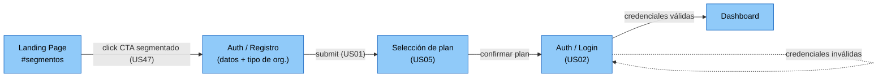
```mermaid
flowchart LR
classDef pantalla fill:#90CAF9,stroke:#1565C0,color:#000000
classDef accion fill:#FFECB3,stroke:#FF7A00,color:#000000

LP["Landing Page\n#segmentos"]:::pantalla -->|"click CTA segmentado (US47)"| REG["Auth / Registro\n(datos + tipo de org.)"]:::pantalla
REG -->|"submit (US01)"| PLAN["Selección de plan\n(US05)"]:::pantalla
PLAN -->|"confirmar plan"| LOGIN["Auth / Login\n(US02)"]:::pantalla
LOGIN -->|"credenciales válidas"| DASH["Dashboard"]:::pantalla
LOGIN -.->|"credenciales inválidas"| LOGIN
```

**B. Cadena de valor core: de la celda a la sesión de rociado**

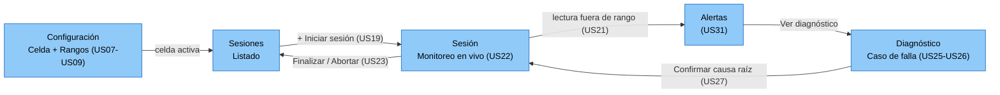
```mermaid
flowchart LR
classDef pantalla fill:#90CAF9,stroke:#1565C0,color:#000000

CONF["Configuración\nCelda + Rangos (US07-US09)"]:::pantalla -->|"celda activa"| SESLIST["Sesiones\nListado"]:::pantalla
SESLIST -->|"+ Iniciar sesión (US19)"| SESMON["Sesión\nMonitoreo en vivo (US22)"]:::pantalla
SESMON -->|"lectura fuera de rango (US21)"| ALERTA["Alertas\n(US31)"]:::pantalla
ALERTA -->|"Ver diagnóstico"| DIAG["Diagnóstico\nCaso de falla (US25-US26)"]:::pantalla
DIAG -->|"Confirmar causa raíz (US27)"| SESMON
SESMON -->|"Finalizar / Abortar (US23)"| SESLIST
```

**C. Evidencia y trazabilidad**

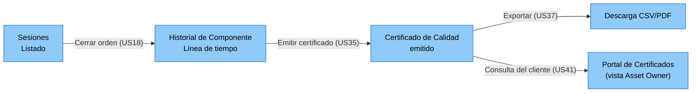
```mermaid
flowchart LR
classDef pantalla fill:#90CAF9,stroke:#1565C0,color:#000000

SESLIST2["Sesiones\nListado"]:::pantalla -->|"Cerrar orden (US18)"| HIST["Historial de Componente\nLínea de tiempo"]:::pantalla
HIST -->|"Emitir certificado (US35)"| CERT["Certificado de Calidad\nemitido"]:::pantalla
CERT -->|"Exportar (US37)"| EXP["Descarga CSV/PDF"]:::pantalla
CERT -->|"Consulta del cliente (US41)"| PORTAL["Portal de Certificados\n(vista Asset Owner)"]:::pantalla
```

**D. Desempeño en campo (Asset Owner)**

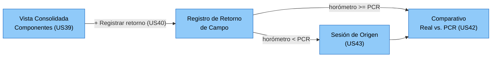
```mermaid
flowchart LR
classDef pantalla fill:#90CAF9,stroke:#1565C0,color:#000000

CONSOL["Vista Consolidada\nComponentes (US39)"]:::pantalla -->|"+ Registrar retorno (US40)"| RETORNO["Registro de Retorno\nde Campo"]:::pantalla
RETORNO -->|"horómetro < PCR"| ORIGEN["Sesión de Origen\n(US43)"]:::pantalla
RETORNO -->|"horómetro >= PCR"| PCRCOMP["Comparativo\nReal vs. PCR (US42)"]:::pantalla
ORIGEN --> PCRCOMP
```

### 4.4.3. Web Applications Mock-ups.

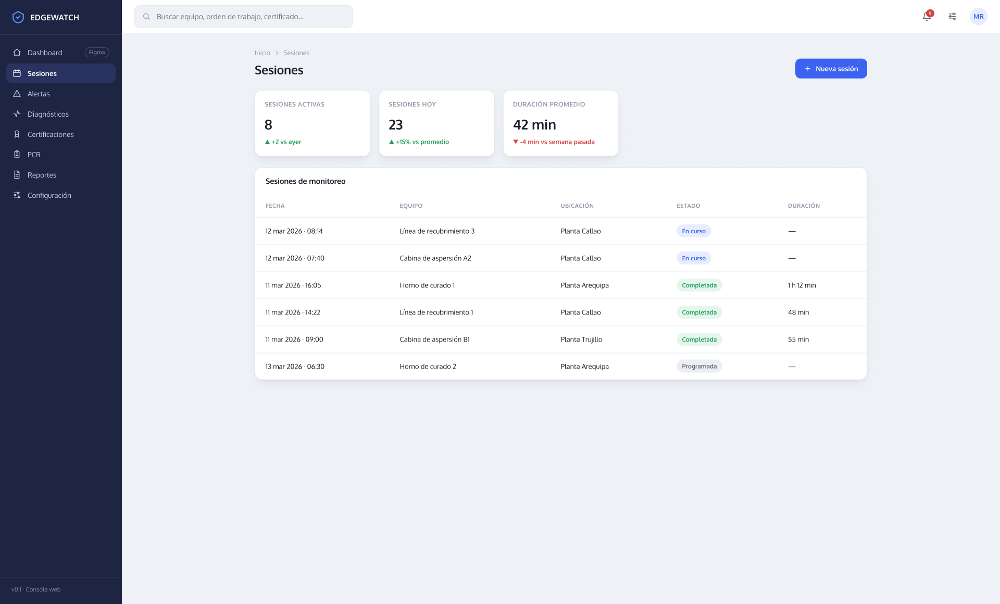{width=80%}

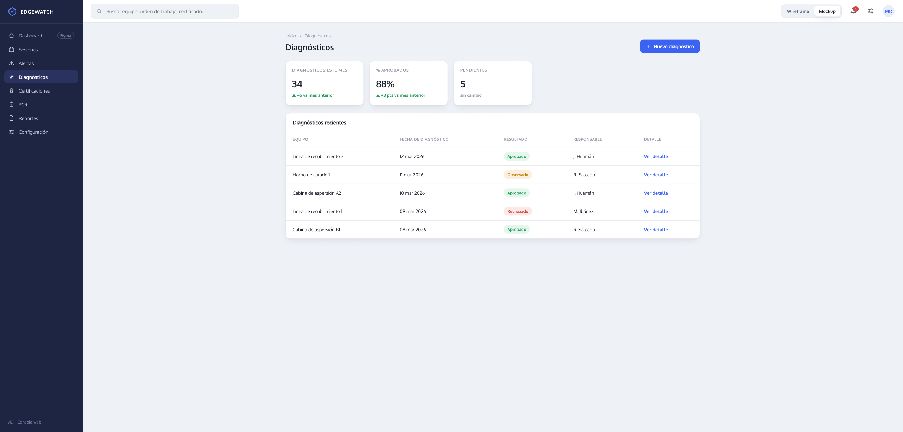{width=80%}

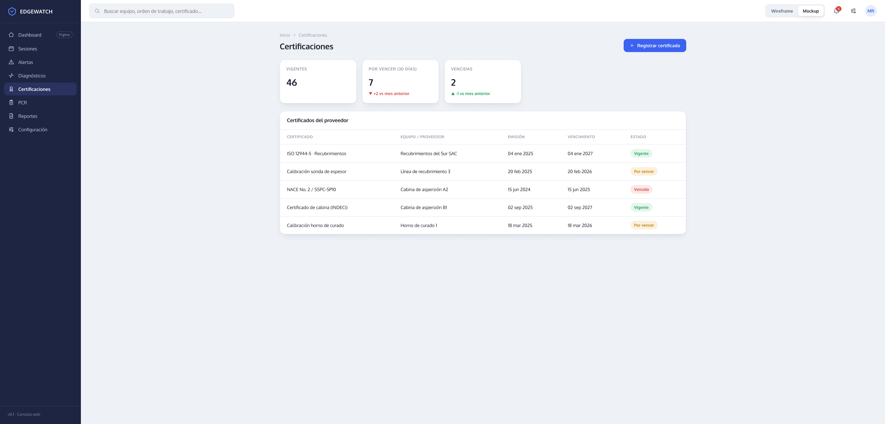{width=80%}

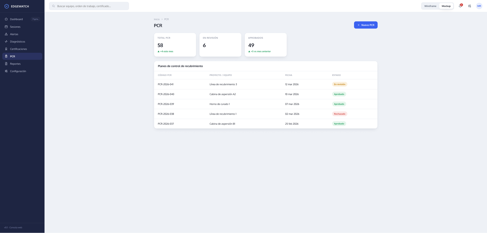{width=80%}

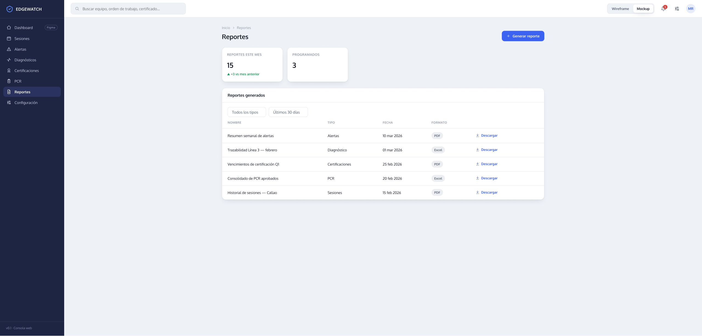{width=80%}

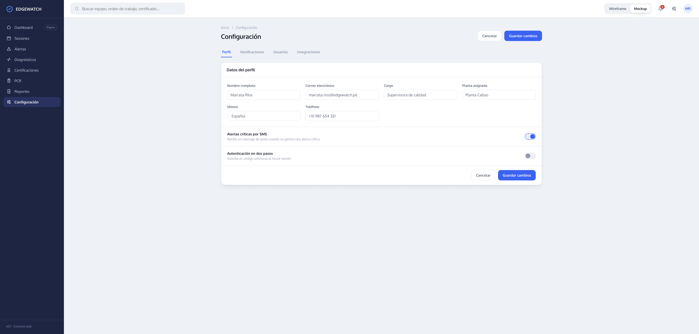{width=80%}

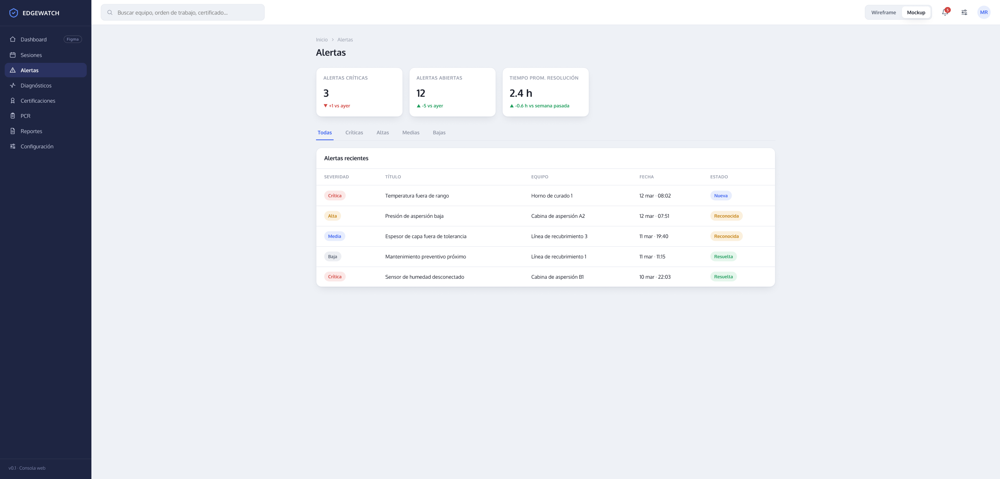{width=80%}

### 4.4.4. Web Applications User Flow Diagrams.
**Flujo 1 — Rosa Miranda (Ingeniero de Calidad): sustentar ante el cliente minero que un lote fue recubierto dentro de tolerancias** *(Journey Map 1, 2.3.3)*

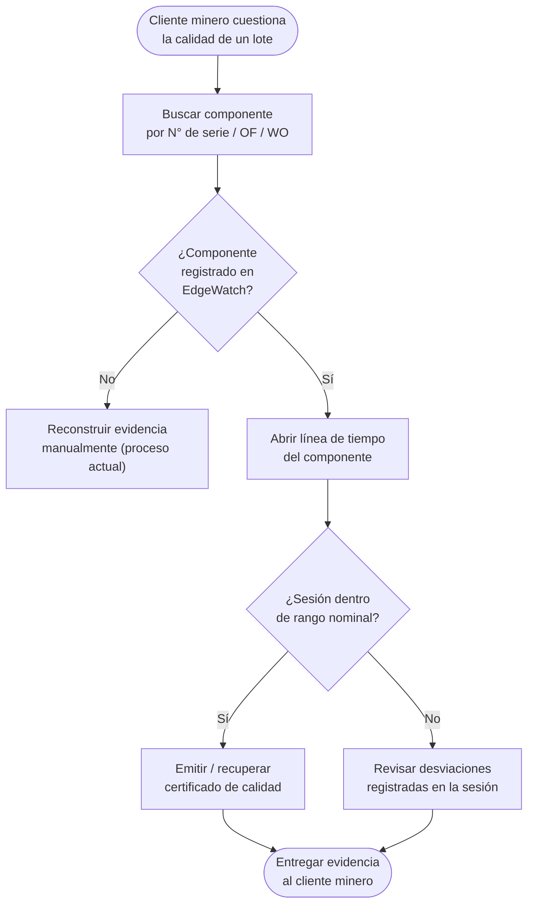
```mermaid
flowchart TD
Start(["Cliente minero cuestiona\nla calidad de un lote"]) --> Buscar["Buscar componente\npor N° de serie / OF / WO"]
Buscar --> Existe{"¿Componente\nregistrado en\nEdgeWatch?"}
Existe -- "No" --> Manual["Reconstruir evidencia\nmanualmente (proceso actual)"]
Existe -- "Sí" --> Timeline["Abrir línea de tiempo\ndel componente"]
Timeline --> Dentro{"¿Sesión dentro\nde rango nominal?"}
Dentro -- "Sí" --> Certificado["Emitir / recuperar\ncertificado de calidad"]
Dentro -- "No" --> Revisar["Revisar desviaciones\nregistradas en la sesión"]
Certificado --> Entregar(["Entregar evidencia\nal cliente minero"])
Revisar --> Entregar
```

**Flujo 2 — Jorge Salinas (Jefe de Mantenimiento): diagnosticar una parada no programada** *(Journey Map 2, 2.3.3)*

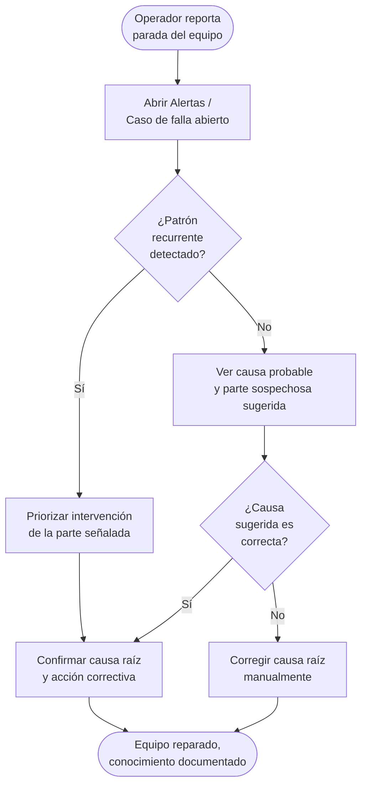
```mermaid
flowchart TD
Start(["Operador reporta\nparada del equipo"]) --> Alerta["Abrir Alertas /\nCaso de falla abierto"]
Alerta --> Recurrente{"¿Patrón\nrecurrente\ndetectado?"}
Recurrente -- "Sí" --> Priorizar["Priorizar intervención\nde la parte señalada"]
Recurrente -- "No" --> Ver["Ver causa probable\ny parte sospechosa sugerida"]
Ver --> Correcta{"¿Causa\nsugerida es\ncorrecta?"}
Correcta -- "Sí" --> Confirmar["Confirmar causa raíz\ny acción correctiva"]
Correcta -- "No" --> Corregir["Corregir causa raíz\nmanualmente"]
Priorizar --> Confirmar
Confirmar --> Fin(["Equipo reparado,\nconocimiento documentado"])
Corregir --> Fin
```

**Flujo 3 — Operador HVOF: iniciar y monitorear una sesión de rociado**

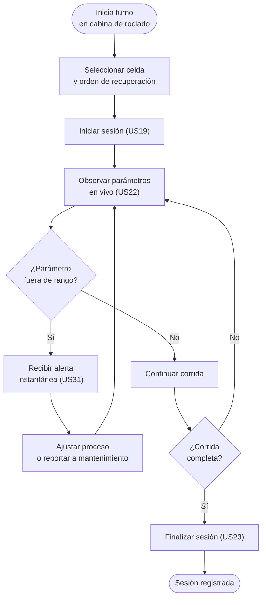
```mermaid
flowchart TD
Start(["Inicia turno\nen cabina de rociado"]) --> Seleccion["Seleccionar celda\ny orden de recuperación"]
Seleccion --> Iniciar["Iniciar sesión (US19)"]
Iniciar --> Monitorear["Observar parámetros\nen vivo (US22)"]
Monitorear --> Desviacion{"¿Parámetro\nfuera de rango?"}
Desviacion -- "Sí" --> Alertado["Recibir alerta\ninstantánea (US31)"]
Alertado --> Ajustar["Ajustar proceso\no reportar a mantenimiento"]
Ajustar --> Monitorear
Desviacion -- "No" --> Continuar["Continuar corrida"]
Continuar --> Termino{"¿Corrida\ncompleta?"}
Termino -- "No" --> Monitorear
Termino -- "Sí" --> Finalizar["Finalizar sesión (US23)"]
Finalizar --> Fin(["Sesión registrada"])
```

**Flujo 4 — Ingeniero de Confiabilidad (Asset Owner): evaluar cumplimiento de PCR de un proveedor**

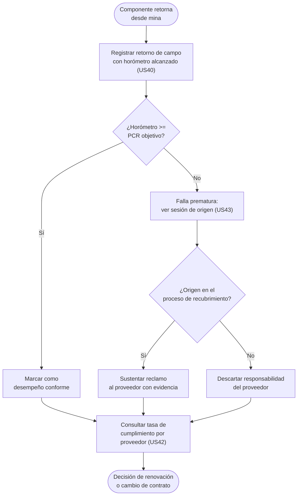
```mermaid
flowchart TD
Start(["Componente retorna\ndesde mina"]) --> Registrar["Registrar retorno de campo\ncon horómetro alcanzado (US40)"]
Registrar --> Cumple{"¿Horómetro >=\nPCR objetivo?"}
Cumple -- "Sí" --> OK["Marcar como\ndesempeño conforme"]
Cumple -- "No" --> Prematura["Falla prematura:\nver sesión de origen (US43)"]
Prematura --> Origen{"¿Origen en el\nproceso de recubrimiento?"}
Origen -- "Sí" --> Reclamo["Sustentar reclamo\nal proveedor con evidencia"]
Origen -- "No" --> Descartar["Descartar responsabilidad\ndel proveedor"]
OK --> Reporte["Consultar tasa de\ncumplimiento por proveedor (US42)"]
Reclamo --> Reporte
Descartar --> Reporte
Reporte --> Fin(["Decisión de renovación\no cambio de contrato"])
```

## 4.5. Web Applications Prototyping.

## 4.6. Domain-Driven Software Architecture.

### 4.6.1. Design-Level Event Storming.

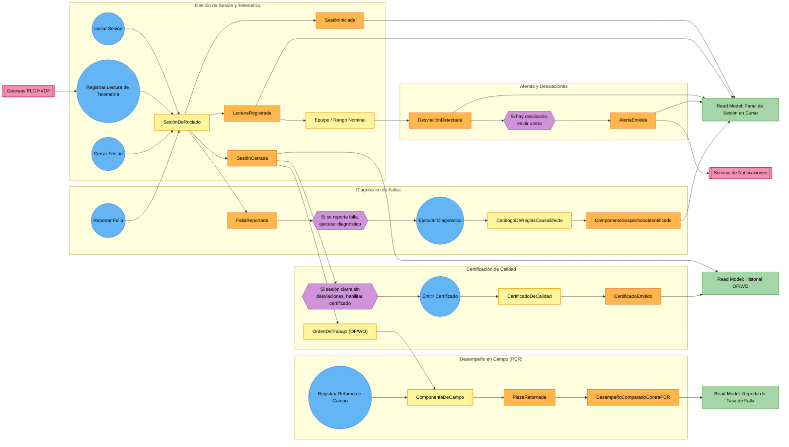
```mermaid
flowchart LR
classDef comando fill:#64B5F6,stroke:#1565C0,color:#000000
classDef evento fill:#FFB74D,stroke:#E65100,color:#000000
classDef agregado fill:#FFF59D,stroke:#F9A825,stroke-width:2px,color:#000000
classDef politica fill:#CE93D8,stroke:#6A1B9A,color:#000000
classDef externo fill:#F48FB1,stroke:#AD1457,color:#000000
classDef readmodel fill:#A5D6A7,stroke:#2E7D32,color:#000000

EXT1[["Gateway PLC HVOF"]]:::externo
EXT2[["Servicio de Notificaciones"]]:::externo

subgraph BC1["Gestión de Sesión y Telemetría"]
  CMD1(("Iniciar Sesión")):::comando
  CMD2(("Registrar Lectura de Telemetría")):::comando
  AGG1["SesiónDeRociado"]:::agregado
  AGG2["Equipo / Rango Nominal"]:::agregado
  EV1["SesiónIniciada"]:::evento
  EV2["LecturaRegistrada"]:::evento
  CMD4(("Cerrar Sesión")):::comando
  EV5["SesiónCerrada"]:::evento
end

subgraph BC2["Alertas y Desviaciones"]
  EV3["DesviaciónDetectada"]:::evento
  POL1{{"Si hay desviación,\nemitir alerta"}}:::politica
  EV4["AlertaEmitida"]:::evento
end

subgraph BC3["Diagnóstico de Fallas"]
  CMD5(("Reportar Falla")):::comando
  EV6["FallaReportada"]:::evento
  POL3{{"Si se reporta falla,\nejecutar diagnóstico"}}:::politica
  CMD6(("Ejecutar Diagnóstico")):::comando
  AGG3["CatálogoDeReglasCausaEfecto"]:::agregado
  EV7["ComponenteSospechosoIdentificado"]:::evento
end

subgraph BC4["Certificación de Calidad"]
  POL2{{"Si sesión cierra sin\ndesviaciones, habilitar certificado"}}:::politica
  CMD7(("Emitir Certificado")):::comando
  AGG4["OrdenDeTrabajo (OF/WO)"]:::agregado
  AGG5["CertificadoDeCalidad"]:::agregado
  EV8["CertificadoEmitido"]:::evento
end

subgraph BC5["Desempeño en Campo (PCR)"]
  CMD8(("Registrar Retorno de Campo")):::comando
  AGG6["ComponenteDeCampo"]:::agregado
  EV9["PiezaRetornada"]:::evento
  EV10["DesempeñoComparadoContraPCR"]:::evento
end

RM1["Read Model: Panel de Sesión en Curso"]:::readmodel
RM2["Read Model: Historial OF/WO"]:::readmodel
RM3["Read Model: Reporte de Tasa de Falla"]:::readmodel

EXT1 --> CMD2
CMD1 --> AGG1 --> EV1
CMD2 --> AGG1 --> EV2
EV2 --> AGG2 --> EV3
EV3 --> POL1 --> EV4 --> EXT2
EV1 --> RM1
EV2 --> RM1
EV3 --> RM1
EV4 --> RM1

CMD4 --> AGG1 --> EV5 --> POL2 --> CMD7
EV5 --> AGG4
CMD7 --> AGG5 --> EV8
EV5 --> RM2
EV8 --> RM2

CMD5 --> AGG1 --> EV6 --> POL3 --> CMD6
CMD6 --> AGG3 --> EV7
EV7 --> RM1

CMD8 --> AGG6 --> EV9 --> EV10 --> RM3
AGG4 --> AGG6
```

### 4.6.2. Software Architecture Context Diagram.

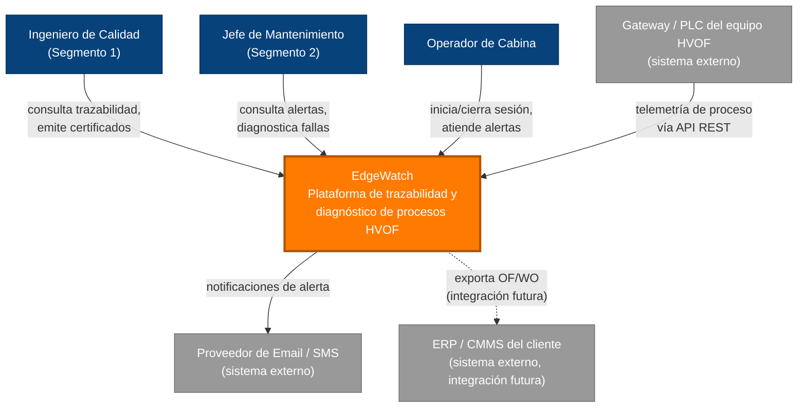
```mermaid
flowchart TB
classDef person fill:#08427B,stroke:#052E56,color:#FFFFFF
classDef systemFocus fill:#FF7A00,stroke:#B35400,color:#FFFFFF,stroke-width:3px
classDef external fill:#999999,stroke:#6B6B6B,color:#FFFFFF

Rosa["Ingeniero de Calidad\n(Segmento 1)"]:::person
Jorge["Jefe de Mantenimiento\n(Segmento 2)"]:::person
Operador["Operador de Cabina"]:::person

EdgeWatch["EdgeWatch\nPlataforma de trazabilidad y\ndiagnóstico de procesos HVOF"]:::systemFocus

PLC["Gateway / PLC del equipo HVOF\n(sistema externo)"]:::external
ERP["ERP / CMMS del cliente\n(sistema externo, integración futura)"]:::external
Notif["Proveedor de Email / SMS\n(sistema externo)"]:::external

Rosa -->|"consulta trazabilidad,\nemite certificados"| EdgeWatch
Jorge -->|"consulta alertas,\ndiagnostica fallas"| EdgeWatch
Operador -->|"inicia/cierra sesión,\natiende alertas"| EdgeWatch

PLC -->|"telemetría de proceso\nvía API REST"| EdgeWatch
EdgeWatch -->|"notificaciones de alerta"| Notif
EdgeWatch -.->|"exporta OF/WO\n(integración futura)"| ERP
```

### 4.6.3. Software Architecture Container Diagrams.

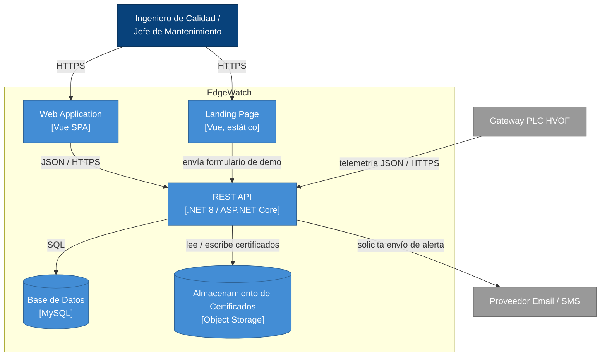
```mermaid
flowchart TB
classDef container fill:#438DD5,stroke:#2E6295,color:#FFFFFF
classDef external fill:#999999,stroke:#6B6B6B,color:#FFFFFF
classDef person fill:#08427B,stroke:#052E56,color:#FFFFFF

Usuario["Ingeniero de Calidad /\nJefe de Mantenimiento"]:::person

subgraph EW["EdgeWatch"]
  LP["Landing Page\n[Vue, estático]"]:::container
  SPA["Web Application\n[Vue SPA]"]:::container
  API["REST API\n[.NET 8 / ASP.NET Core]"]:::container
  DB[("Base de Datos\n[MySQL]")]:::container
  FILES[("Almacenamiento de Certificados\n[Object Storage]")]:::container
end

PLC["Gateway PLC HVOF"]:::external
EMAILSMS["Proveedor Email / SMS"]:::external

Usuario -->|"HTTPS"| LP
Usuario -->|"HTTPS"| SPA
SPA -->|"JSON / HTTPS"| API
LP -->|"envía formulario de demo"| API
API -->|"SQL"| DB
API -->|"lee / escribe certificados"| FILES
PLC -->|"telemetría JSON / HTTPS"| API
API -->|"solicita envío de alerta"| EMAILSMS
```

El sistema se implementa como una única REST API modular en lugar de microservicios separados: la ingesta de telemetría y el envío de notificaciones son módulos internos de ese mismo contenedor (ver componentes en 4.6.4), no servicios desplegables aparte, lo que simplifica la operación al reducir el despliegue a un solo backend.

### 4.6.4. Software Architecture Components Diagrams.

Detalle de componentes internos del contenedor **REST API**, responsable de la lógica de negocio central.

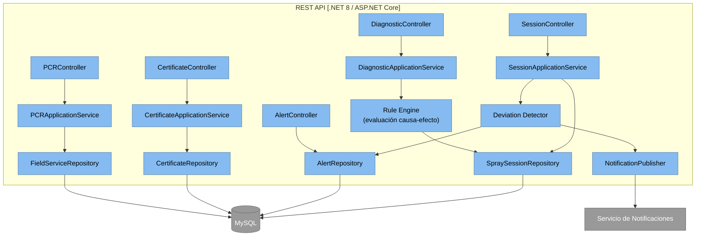
```mermaid
flowchart TB
classDef component fill:#85BBF0,stroke:#5D82A8,color:#000000
classDef external fill:#999999,stroke:#6B6B6B,color:#FFFFFF

subgraph API["REST API [.NET 8 / ASP.NET Core]"]
  SessionCtrl["SessionController"]:::component
  AlertCtrl["AlertController"]:::component
  DiagCtrl["DiagnosticController"]:::component
  CertCtrl["CertificateController"]:::component
  PCRCtrl["PCRController"]:::component

  SessionApp["SessionApplicationService"]:::component
  DiagApp["DiagnosticApplicationService"]:::component
  CertApp["CertificateApplicationService"]:::component
  PCRApp["PCRApplicationService"]:::component

  RuleEngine["Rule Engine\n(evaluación causa-efecto)"]:::component
  DeviationDetector["Deviation Detector"]:::component

  SessionRepo["SpraySessionRepository"]:::component
  AlertRepo["AlertRepository"]:::component
  CertRepo["CertificateRepository"]:::component
  PCRRepo["FieldServiceRepository"]:::component

  NotifPublisher["NotificationPublisher"]:::component
end

DB[("MySQL")]:::external
NOTIF["Servicio de Notificaciones"]:::external

SessionCtrl --> SessionApp --> SessionRepo --> DB
SessionApp --> DeviationDetector --> AlertRepo --> DB
DeviationDetector --> NotifPublisher --> NOTIF
AlertCtrl --> AlertRepo
DiagCtrl --> DiagApp --> RuleEngine
RuleEngine --> SessionRepo
CertCtrl --> CertApp --> CertRepo --> DB
PCRCtrl --> PCRApp --> PCRRepo --> DB
```

## 4.7. Software Object-Oriented Design.

### 4.7.1. Class Diagrams.

El diagrama de clases traduce los agregados del Event Storming (4.6.1) al modelo de objetos que sustentará la implementación en el Capítulo V.
Debido a la complejidad del sistema, a la cantidad de Bounded Contexts definidos y a la cantidad de clases por capa de Domain-Driven Design, se muestra el diagrama de clases subdividido para una mejor visualización.

#### Equipment

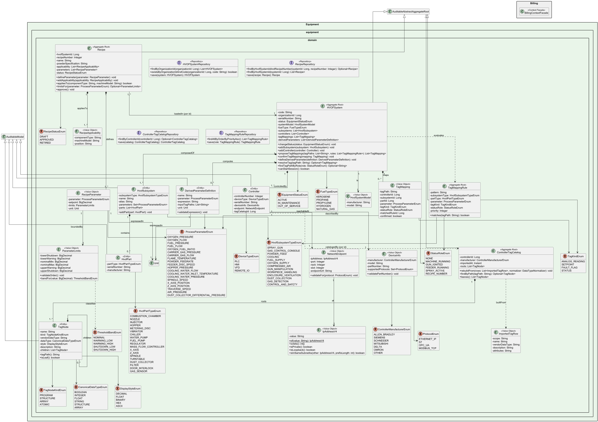
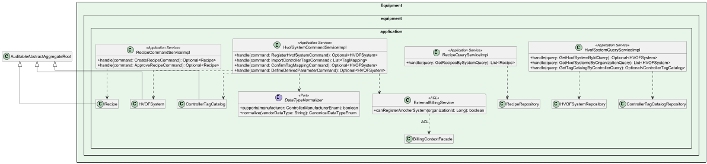
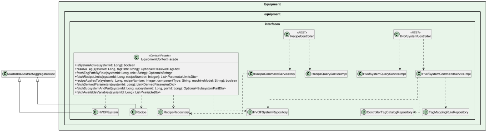
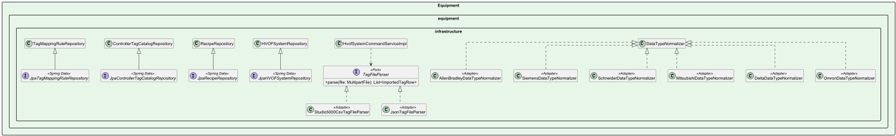

#### FaultDiagnosis
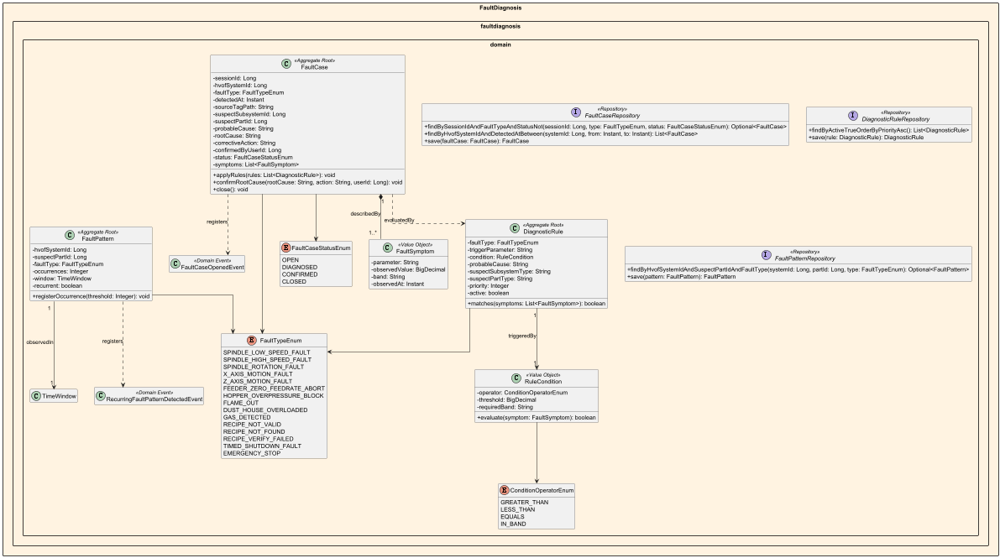
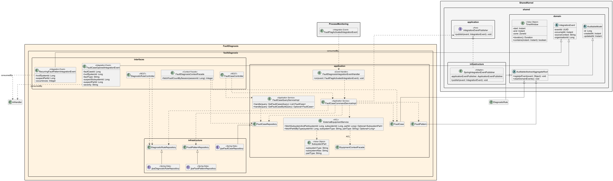
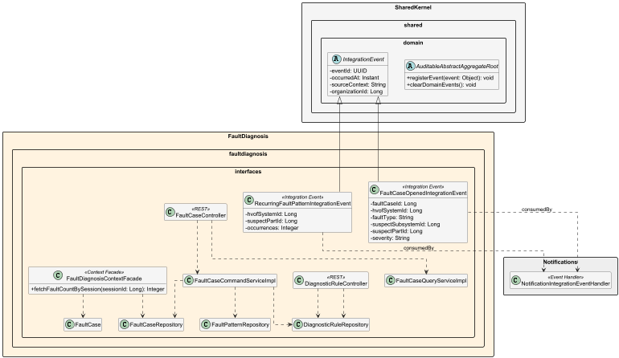
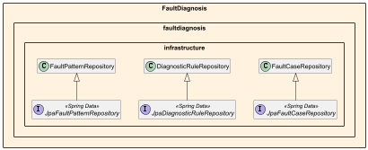

#### ProcessMonitoring
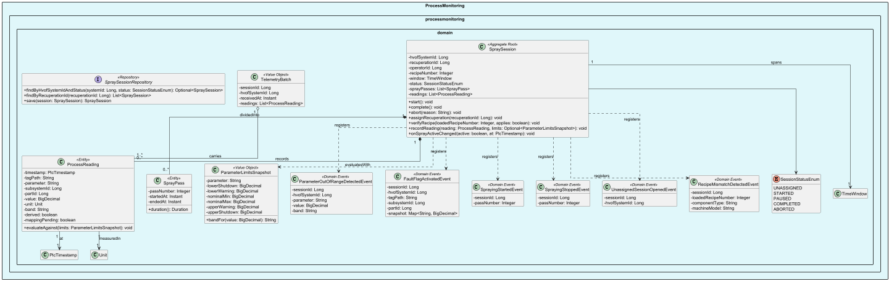
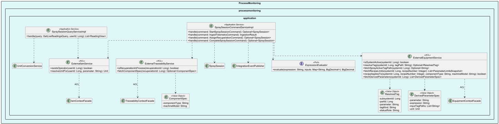
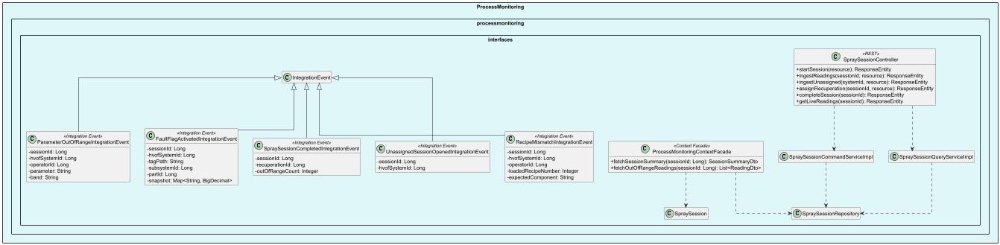
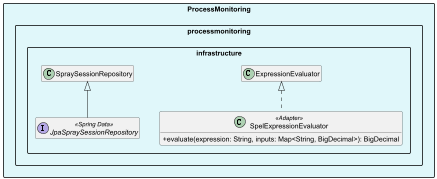

#### Traceability

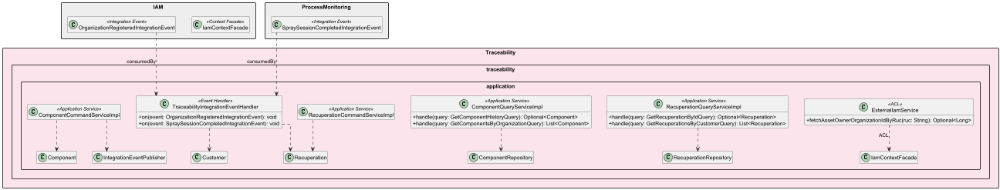
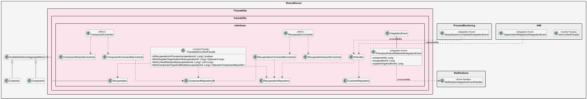
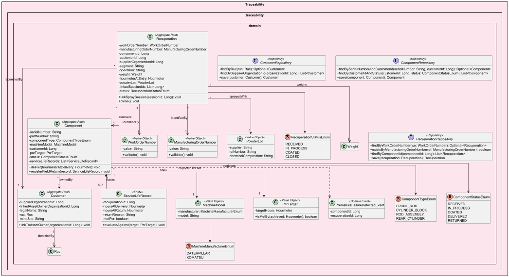

#### Reporting
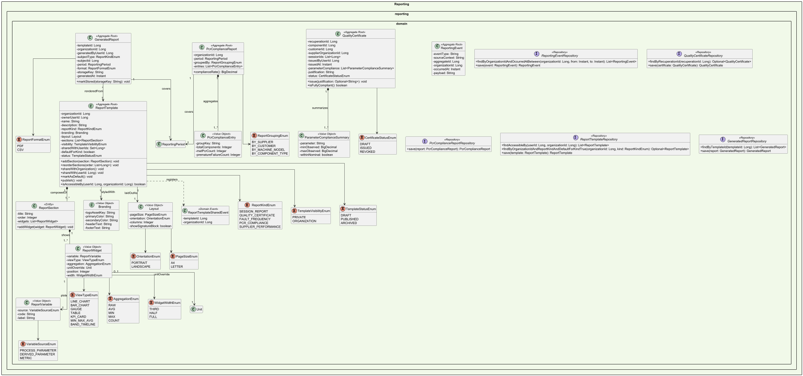
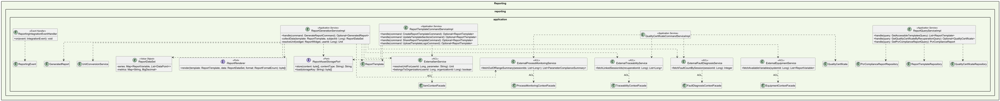
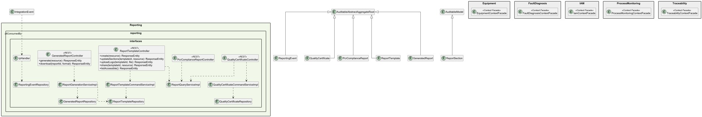
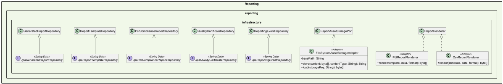

#### Notifications
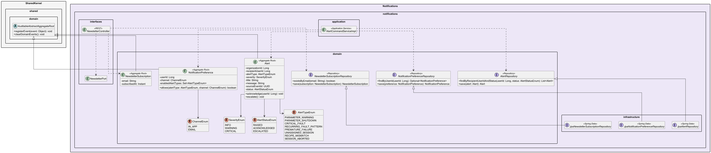
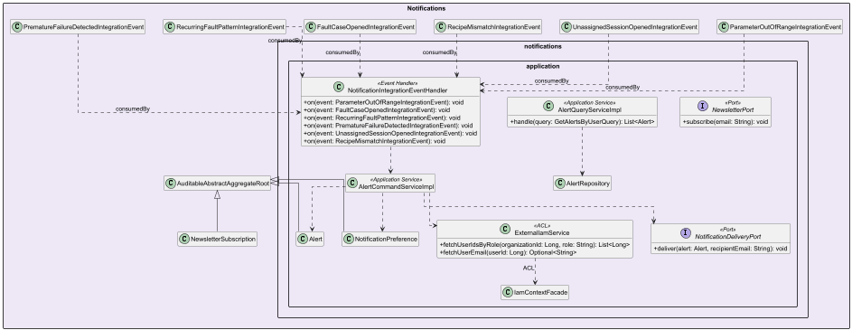
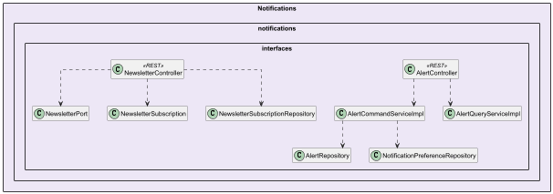
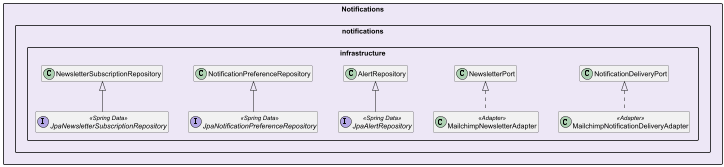

#### Billing
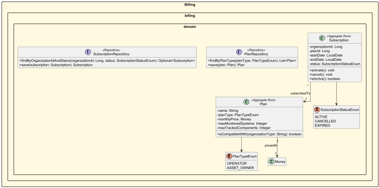
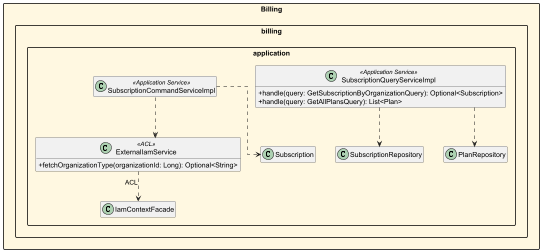
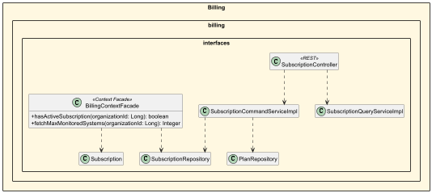
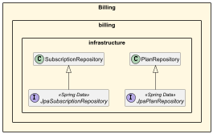

#### IAM
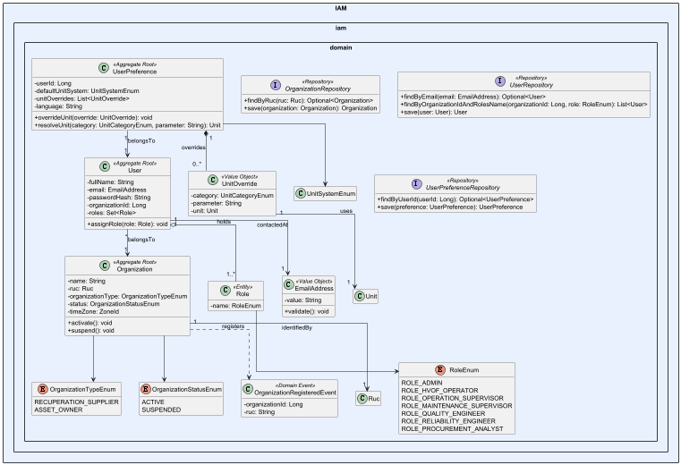
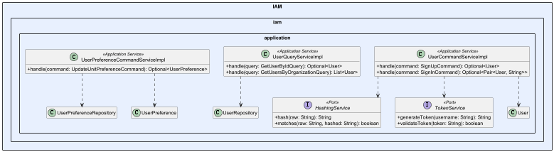
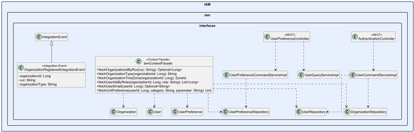
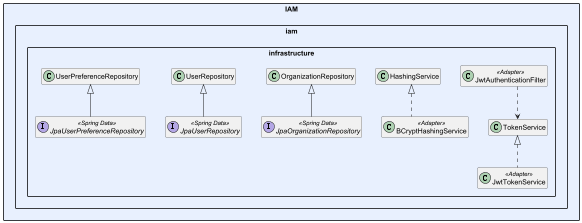

#### Shared
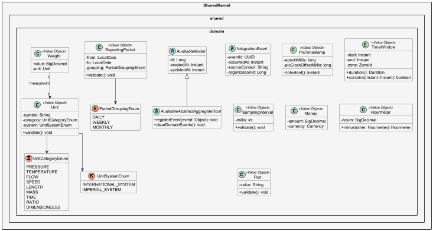
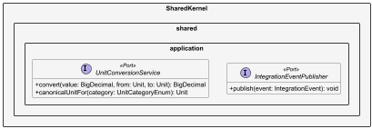
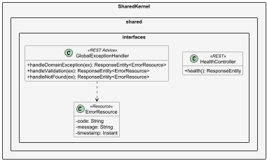
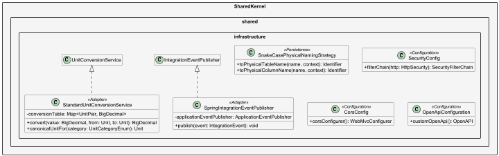


## 4.8. Database Design.

### 4.8.1. Database Diagrams.

El modelo relacional se despliega sobre MySQL y refleja de forma directa el diagrama de clases de 4.7.1, con tablas puente derivadas de las relaciones muchos-a-muchos implícitas en el dominio.

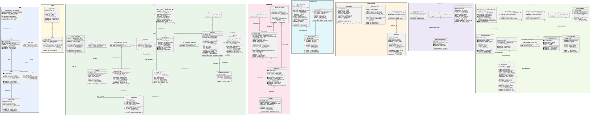

Para una mejor visualizacion, redimirse a los archivos individuales. 

# Capítulo V: Product Implementation, Validation & Deployment
## 5.1. Software Configuration Management.

La configuración de EdgeWatch se organiza alrededor de los contenedores definidos en el diagrama de arquitectura (4.6.3): Landing Page y Web Application en Vue, hosteadas en Firebase Hosting, y una única REST API en C# / ASP.NET Core que concentra la ingesta de telemetría y el envío de notificaciones como módulos internos, respaldada por una base de datos MySQL.  Esta sección documenta el entorno de desarrollo, el control de versiones, las convenciones de código y el esquema de despliegue que sostienen la implementación descrita en 5.2.

### 5.1.1. Software Development Environment Configuration.

**Herramientas y versiones**

| Componente | Herramienta | Versión |
|---|---|---|
| Backend (REST API) | .NET SDK | 8.0 LTS |
| Backend | ASP.NET Core | 8.0 |
| Backend | Entity Framework Core + Pomelo.EntityFrameworkCore.MySql | 8.0.x |
| Frontend (Landing Page, Web Application) | HTML/CSS3/JavaScript / Node JS | 20 LTS |
| Frontend | Vue | 3.5.x (build global vía CDN, sin compilador de SFC) |
| Frontend | Firebase CLI | 13.x |
| Base de datos | MySQL Server (Community) | 8.0.x |
| IDE backend | Visual Studio 2022 / JetBrains Rider | — |
| IDE frontend | Visual Studio Code + extensión ESLint / JetBrains WebStorm | — |
| Cliente de API | Postman | — |
| Cliente de base de datos | MySQL Workbench | — |

**Orquestación local**

Cada integrante instala MySQL Server de forma nativa en su máquina (o usa una instancia de desarrollo en Azure Database for MySQL, ver 5.1.4) y ejecuta el backend directamente con `dotnet watch run`. El frontend se sirve aparte con `npm start`, ya que en producción no corre como proceso propio sino en Firebase Hosting (ver 5.1.4).

```mermaid
flowchart LR
classDef svc fill:#438DD5,stroke:#2E6295,color:#FFFFFF
classDef db fill:#2E7D32,stroke:#1B5E20,color:#FFFFFF

DEV["Máquina del desarrollador"] --> RUN["dotnet watch run\n(perfil Development)"]
RUN --> API["REST API\n:8080"]:::svc
API --> MYSQL[("MySQL Server\n:3306, instalación nativa")]:::db
FE["npm start (node server.js)\n(Landing Page / Web App)\n:3000"] -->|"fetch /api"| API
```

**Gestión de configuración y secretos**

| Mecanismo | Uso |
|---|---|
| `appsettings.json` + `appsettings.{Environment}.json` (`Development`, `Staging`, `Production`) | Configuración por entorno del backend (cadena de conexión a MySQL, niveles de log, credenciales de Mailchimp/proveedor de email) |
| `dotnet user-secrets` | Secretos del backend en desarrollo local (cadena de conexión real, API key de Mailchimp), fuera del control de versiones y sin depender de un archivo `.env` |
| `config.js` por entorno (plantilla `config.example.js` versionada) | Define `window.APP_CONFIG` con la URL base de la API y flags de features; se carga con `<script src="config.js">` antes de `app.js`. No contiene secretos: el frontend no tiene paso de build ni acceso a variables de entorno del sistema operativo |
| `firebase.json` / `.firebaserc` (versionados) | Configuración de *hosting* de Firebase: directorio público, *rewrites* de SPA para la Web Application, proyecto por entorno (`edgewatch-staging`, `edgewatch-prod`) |
| Application Settings de Azure App Service | Variables de entorno de producción (cadena de conexión, credenciales), inyectadas por el pipeline sin quedar escritas en `appsettings.Production.json` |
| GitHub Actions Secrets | Credenciales inyectadas en CI/CD (ver 5.1.4): cadena de conexión de producción, clave de cuenta de servicio de Firebase, credenciales de publicación de Azure |

Ningún valor de credencial se commitea: los `appsettings.{Environment}.json` con datos reales quedan excluidos vía `.gitignore`, los secretos locales del backend viven en el almacén de `dotnet user-secrets` (fuera del repositorio) y las claves de servicio externo se inyectan solo en tiempo de ejecución, siguiendo la mitigación de exposición de datos descrita en el análisis de amenazas (2.1.2).

### 5.1.2. Source Code Management.

**Repositorios**

El proyecto se distribuye en repositorios independientes dentro de la organización de GitHub `upc-pre-202620-1asi0730-16712-wrunners`, uno por contenedor de despliegue, de modo que cada superficie pueda desplegarse y versionarse de forma autónoma:

| Repositorio | Contenido | Corresponde a |
|---|---|---|
| `edgewatch-report` | Este informe | — |
| `edgewatch-landing-page` | Sitio estático Vue (4.3, 4.4) | Landing Page |
| `edgewatch-webapp` | SPA Vue de la Web Application (4.4) | Web Application |
| `edgewatch-platform-services` | Solución .NET (`WebRunners.EdgeWatch.sln`) con un único proyecto Web API (`WebRunners.EdgeWatch.Api`), organizado internamente por feature folders (5.1.3), que concentra la ingesta de telemetría y las notificaciones como módulos junto al resto del dominio de 4.7.1 | REST API (incluye ingesta y notificaciones) |

**Estrategia de ramas**

Se adopta Gitflow simplificado, la misma convención ya usada en `edgewatch-report` (ramas `feature/*` fusionadas a `develop`, y `develop` a `main`), replicada en los repositorios de código:

```mermaid
flowchart LR
classDef rama fill:#90CAF9,stroke:#1565C0,color:#000000
classDef prod fill:#C62828,stroke:#8E0000,color:#FFFFFF

MAIN["main\n(producción, taggeado por versión)"]:::prod
DEVELOP["develop\n(integración continua)"]:::rama
FEATURE["feature/US19-inicio-sesion-rociado"]:::rama
RELEASE["release/1.2.0"]:::rama
HOTFIX["hotfix/fix-calculo-pcr"]:::rama

FEATURE -->|"Pull Request + review"| DEVELOP
DEVELOP -->|"fin de sprint"| RELEASE
RELEASE -->|"QA aprobado"| MAIN
MAIN -->|"bug crítico en producción"| HOTFIX
HOTFIX --> MAIN
HOTFIX --> DEVELOP
```

| Rama | Propósito | Regla |
|---|---|---|
| `main` | Código en producción | Solo recibe merges desde `release/*` o `hotfix/*`; cada merge se etiqueta con SemVer (`vMAJOR.MINOR.PATCH`) |
| `develop` | Integración de features del sprint en curso | Rama por defecto para nuevas `feature/*`; debe mantenerse siempre desplegable a *staging* |
| `feature/<US o TS-id>-<slug>` | Una historia de usuario o técnica del Product Backlog (3.3) | Nace de `develop`, se elimina al fusionarse; el id (p. ej. `US19`, `TS10`) trazabiliza el commit al backlog |
| `release/<version>` | Estabilización previa a producción | Solo admite correcciones menores, no nuevas features |
| `hotfix/<slug>` | Corrección urgente sobre `main` | Se fusiona a `main` y a `develop` simultáneamente |

**Convención de commits y Pull Requests**

Se usa Conventional Commits, ya aplicado en el historial de este informe (`feat(chapter-iii): ...`, `docs: ...`): `<tipo>(<alcance>): <descripción>`, con tipos `feat`, `fix`, `refactor`, `test`, `docs`, `chore`. Toda Pull Request hacia `develop` referencia el id de la User Story o Technical Story (p. ej. `Closes US19`), requiere al menos una aprobación de otro integrante y que la GitHub Action de build/test (5.1.4) pase en verde antes del merge, que se realiza en modalidad *squash* para mantener el historial de `develop` legible por historia.

### 5.1.3. Source Code Style Guide & Conventions.

**Backend (C# / ASP.NET Core)**

| Aspecto | Convención |
|---|---|
| Guía base | Microsoft C# Coding Conventions, forzadas con `.editorconfig` compartido entre proyectos y verificadas en el build con `dotnet format --verify-no-changes` |
| Organización de namespaces | *Feature folders* alineados a los bounded contexts del Event Storming (4.6.1): `WebRunners.EdgeWatch.Sessions`, `.Alerts`, `.Diagnostics`, `.Certificates`, `.Pcr` |
| Arquitectura por módulo | Capas `Api` (controllers, DTOs) → `Application` (application services, casos de uso) → `Domain` (entidades, value objects, reglas) → `Infrastructure` (repositorios EF Core, clientes externos), reflejando el diagrama de componentes de 4.6.4 |
| Nomenclatura de clases | PascalCase, coincide con el Ubiquitous Language (2.5) y el diagrama de clases (4.7.1): `SpraySession`, `FaultCase`, `NominalRange`, `QualityCertificate`, nunca sinónimos genéricos como `Record` o `Item` |
| Acceso a datos | Entity Framework Core con proveedor Pomelo.EntityFrameworkCore.MySql; migraciones versionadas con `dotnet ef migrations` |
| Inyección de dependencias | Contenedor de DI nativo de ASP.NET Core (`builder.Services.AddScoped<...>()`), sin contenedores de terceros |
| Pruebas | xUnit + Moq para unitarias; para integración de repositorios se usa una base de datos MySQL de pruebas dedicada (esquema `edgewatch_test`, referenciada por una cadena de conexión propia en CI). |
| Documentación de API | Swashbuckle (Swagger/OpenAPI); cada endpoint del Product Backlog (p. ej. `POST /api/v1/spray-sessions`) queda documentado en Swagger UI |

**Frontend (Vue / JavaScript, sin build)**

El frontend no usa bundler ni compilador de Single File Components: Vue 3 se carga como build global vía CDN (`<script src="https://unpkg.com/vue@3/dist/vue.global.js">`), igual que Vue Router para la Web Application, y todo el código de la aplicación es JavaScript plano cargado como módulos ES nativos del navegador (`<script type="module" src="app.js">`), sin paso de transpilación. `npm` se usa únicamente para instalar Express y ejecutar `server.js`, el archivo que sirve los estáticos.

| Aspecto | Convención |
|---|---|
| Guía base | Vue Style Guide oficial (equipo core de Vue), en las reglas aplicables a proyectos sin SFC; ESLint (`eslint-plugin-vue` en modo *flat/essential*) y Prettier para el JavaScript, ejecutados como pre-commit hook con Husky |
| Organización de archivos | `js/core/` (helper de fetch, guards de navegación), `js/shared/` (componentes de 4.1.2: Session Card, Alert Card, Badge de estado), `js/features/sessions/`, `js/features/alerts/`, `js/features/diagnostics/`, `js/features/certificates/`, `js/features/pcr/`, cada uno como módulo ES que exporta un objeto de componente Vue |
| Componentes | `Vue.defineComponent({ ... })` por archivo, registrado en la instancia creada con `Vue.createApp()`; plantillas como *template strings* o como `<template id="...">` en el propio HTML (in-DOM templates), sin `.vue` ni compilador. Estado local reactivo con `Vue.ref` / `Vue.computed` (telemetría en vivo de la Pantalla 3, sección 4.4.1) |
| Estado global | Módulo `store.js` propio basado en `Vue.reactive()`, expuesto como singleton importado por los módulos que lo necesitan; se evita añadir una librería adicional de estado dado el enfoque minimalista sin build |
| Estilos | CSS plano (no SCSS, al no haber paso de compilación) con variables nativas `:root { --color-primary: #0B2545; --color-warning: #FFB300; ... }` generadas a partir de los tokens de 4.1.1/4.1.2, sin colores *hardcodeados* fuera de ese archivo |
| Estado remoto | Módulo `api.js` con funciones sobre `fetch` nativo del navegador que agregan el header de autenticación (JWT) y centralizan el manejo de errores; enrutamiento de la Web Application con Vue Router (build global vía CDN) |
| Pruebas | Jest + @vue/test-utils para unitarias de componentes (ambos corren sobre Node sin necesitar bundler); Cypress para *end-to-end* de los flujos críticos (4.4.4): inicio de sesión de rociado, emisión de certificado |

**Base de datos y API**

Tablas y columnas en `snake_case`, nombradas de forma idéntica al diagrama entidad-relación (4.8.1); recursos REST en sustantivos plurales y versión de ruta explícita (`/api/v1/...`), consistentes con los endpoints ya definidos en el Product Backlog (3.3).

### 5.1.4. Software Deployment Configuration.

**Entornos**

| Entorno | Propósito | Se actualiza |
|---|---|---|
| Local | Desarrollo individual (5.1.1) | En cada máquina, bajo demanda |
| Staging | QA y demo interna al final de cada sprint | Automáticamente al hacer merge a `develop` |
| Producción | Entorno visible para clientes / sustentación | Automáticamente al hacer merge a `main` (tras `release/*`) |

**Infraestructura por contenedor lógico**

| Contenedor | Plataforma de despliegue | Empaquetado |
|---|---|---|
| Landing Page (Vue, JS plano) | Firebase Hosting (proyecto `edgewatch-landing`) | Sin build: `firebase deploy --only hosting` publica directamente los archivos estáticos (`index.html`, `js/`, `css/`) al CDN de Firebase |
| Web Application (Vue SPA, JS plano) | Firebase Hosting (proyecto `edgewatch-webapp`, sitio independiente) | Sin build: `firebase deploy --only hosting`, con *rewrite* `"source": "**", "destination": "/index.html"` en `firebase.json` para las rutas de Vue Router |
| REST API (ASP.NET Core, incluye ingesta y notificaciones) | Azure App Service (Linux, plan Basic/B1) | Despliegue nativo de código, **sin contenedor**: `dotnet publish` genera el artefacto y GitHub Actions lo sube con `azure/webapps-deploy@v3` |
| MySQL | Azure Database for MySQL – Flexible Server | Instancia gestionada con backups automáticos diarios |
| Almacenamiento de certificados | Azure Blob Storage | Acceso vía SDK `Azure.Storage.Blobs` desde `CertificateApplicationService` (4.6.4) |

El servidor NodeJS descrito en 5.1.1 se usa solo en desarrollo local: en producción, Firebase Hosting sirve los mismos archivos estáticos directamente desde su CDN, sin un proceso Node corriendo. El backend tampoco corre en contenedor en ningún entorno: Azure App Service ejecuta el artefacto de `dotnet publish` de forma nativa. Esta combinación consolida el backend en un solo proveedor cloud (Azure), coherente con el Business Assumption de operar sin costos de licenciamiento que comprometan el margen (1.2.2.2).

**Pipeline de CI/CD (GitHub Actions)**

```mermaid
flowchart LR
classDef stage fill:#90CAF9,stroke:#1565C0,color:#000000
classDef gate fill:#FFB300,stroke:#E65100,color:#000000
classDef deploy fill:#2E7D32,stroke:#1B5E20,color:#FFFFFF

PUSH["Push / PR a develop o main"] --> LINT["Lint\n(ESLint / dotnet format)"]:::stage
LINT --> BUILD["Instalar / compilar\n(npm install / dotnet build)"]:::stage
BUILD --> TEST["Tests\n(Jest-Cypress / xUnit contra MySQL de pruebas)"]:::stage
TEST --> GATE{"¿Todo en verde?"}:::gate
GATE -- "No" --> FAIL["PR bloqueada"]
GATE -- "Sí, PR a develop" --> STAGING["Deploy automático\na Staging"]:::deploy
GATE -- "Sí, merge a main (frontend)" --> DEPLOYFE["firebase deploy\n--only hosting"]:::deploy
GATE -- "Sí, merge a main (backend)" --> PUBLISH["dotnet publish"]:::stage
PUBLISH --> PROD["azure/webapps-deploy\na Azure App Service"]:::deploy
```

Cada repositorio de servicio incluye su propio workflow (`.github/workflows/ci.yml`), y las credenciales de despliegue (clave de cuenta de servicio de Firebase, perfil de publicación de Azure, cadena de conexión de MySQL) se gestionan como GitHub Actions Secrets a nivel de repositorio, nunca en archivos versionados, conforme a lo indicado en 5.1.1.

## 5.2. Landing Page, Services & Applications Implementation.
### 5.2.1. Sprint 1

En este Sprint el equipo se enfocó en construir y desplegar la primera versión del Landing Page de EdgeWatch, cumpliendo con lo exigido para la entrega AV1. El alcance del Sprint corresponde a las historias que encabezan el Product Backlog (3.3): las historias de usuario del sitio web estático (E10) y la historia técnica de integración con el servicio externo de newsletter (TS18), dado que constituyen el canal de captación de los segmentos Recuperation Supplier y Asset Owner y deben estar disponibles antes que cualquier otra funcionalidad de la plataforma.

#### 5.2.1.1. Sprint Planning 1.

Resumen de la reunión de Sprint Planning realizada por el equipo al inicio del ciclo de vida del proyecto.

| Sprint # | Sprint 1 |
|---|---|
| **Sprint Planning Background** | |
| Fecha | 2026-09-13 |
| Hora | 8:00 PM |
| Lugar | Reunión virtual vía Google Meet |
| Preparado por | Navarro Aldoradin, Carolina Celeste |
| Asistentes (a la reunión de planning) | Navarro Aldoradin, Carolina Celeste / Alvarez Falen, Esteban Valentino / Catacora Tupa, Jhon Deyner / Vasquez Laos, Sebastian Andrews / Yopla Romero, Jonathan Alberto |
| **Resumen del Sprint n-1 Review** | No aplica. Es el primer Sprint. |
| **Resumen de la Retrospectiva del Sprint n-1** | No aplica. Al ser el primer Sprint, el equipo no cuenta con una retrospectiva previa. |
| **Sprint Goal & User Stories** | |
| Sprint 1 Goal | Nuestro enfoque está en ofrecer a los visitantes de ambos segmentos objetivo (Recuperation Supplier y Asset Owner) un primer punto de contacto claro con la propuesta de valor de EdgeWatch. Creemos que esto entrega confianza inicial y facilidad para decidir si la solución es relevante, a los visitantes del Landing Page. Esto se confirmará cuando un visitante pueda conocer la propuesta de valor, acceder a la información de su segmento, suscribirse al newsletter y llegar desde el call-to-action correspondiente hasta la vista de registro de la Web Application. |
| Sprint 1 Velocity | 19 Story Points |
| Suma de Story Points | 19 Story Points |

**Historias de usuario incluidas en el Sprint 1**

| # Orden | User Story Id | Título | Story Points |
|---|---|---|---|
| 1 | US44 | Conocer la propuesta de valor | 3 |
| 2 | US45 | Información para Recuperation Supplier | 2 |
| 3 | US46 | Información para Asset Owner | 2 |
| 4 | US47 | Registro desde call-to-action segmentado | 2 |
| 5 | US48 | Cambio de idioma | 3 |
| 6 | US50 | Acceso a Términos y Condiciones | 1 |
| 7 | US49 | Suscripción al newsletter | 3 |
| 8 | TS18 | Suscripción al newsletter vía Mailchimp | 3 |

#### 5.2.1.2. Aspect Leaders and Collaborators.

Para garantizar una ejecución estructurada y promover el liderazgo compartido en concordancia con el **ABET Student Outcome 5**, el equipo WebRunners definió una distribución matricial de roles y áreas de responsabilidad (aspects) para el proyecto y el Sprint 1. Bajo este enfoque, cada aspecto técnico, metodológico y de aseguramiento de calidad cuenta con un **Líder (Aspect Leader)** responsable de coordinar las actividades, velar por las buenas prácticas y asegurar el cumplimiento de los objetivos planteados, junto con **Colaboradores (Collaborators)** que participan activamente en la implementación, revisión por pares y validación cruzada.

A continuación, se detalla la asignación de roles, responsabilidades, líderes y colaboradores:

| Aspecto / Rol | Descripción de Responsabilidades | Líder (Aspect Leader) | Colaboradores (Collaborators) |
|---|---|---|---|
| **Product Owner & Gestión de Requisitos** | Definición y refinamiento del Product Backlog y Sprint Backlog, especificación de historias de usuario con criterios de aceptación Gherkin y priorización del alcance de cara a los segmentos Recuperation Supplier y Asset Owner. | Navarro Aldoradin, Carolina Celeste | Alvarez Falen, Esteban Valentino<br>Catacora Tupa, Jhon Deyner |
| **Scrum Master & Gestión Ágil** | Facilitación y conducción de las ceremonias Scrum (Planning, Daily Stand-ups, Review y Retrospectiva), remoción de impedimentos operativos y monitoreo de la velocidad del equipo (19 Story Points planificados para el Sprint 1). | Navarro Aldoradin, Carolina Celeste | Vasquez Laos, Sebastian Andrews<br>Yopla Romero, Jonathan Alberto |
| **Desarrollo Frontend & UI/UX** | Diseño e implementación de la interfaz del Landing Page (Vue 3, HTML5 semántico, CSS3 moderno), estructuración de layout responsivo multidispositivo, interactividad de componentes y sistema de internacionalización (i18n inglés/español). | Catacora Tupa, Jhon Deyner | Alvarez Falen, Esteban Valentino<br>Vasquez Laos, Sebastian Andrews |
| **Desarrollo Backend & Servicios API** | Arquitectura del servicio REST API en ASP.NET Core (.NET 8), definición de contratos y endpoints en Swagger/OpenAPI, diseño de la ingesta de telemetría y desarrollo de la integración con el servicio externo de newsletter vía Mailchimp (TS18). | Vasquez Laos, Sebastian Andrews | Navarro Aldoradin, Carolina Celeste<br>Yopla Romero, Jonathan Alberto |
| **Gestión de Base de Datos y Persistencia** | Modelado lógico y físico de la base de datos relacional en MySQL 8.0, gestión de migraciones mediante Entity Framework Core (Pomelo), aplicación de convenciones snake_case y optimización de persistencia para trazabilidad y telemetría. | Yopla Romero, Jonathan Alberto | Vasquez Laos, Sebastian Andrews<br>Navarro Aldoradin, Carolina Celeste |
| **DevOps, SCM & Despliegue Continuo** | Administración del repositorio central y flujos de trabajo en Gitflow, definición de políticas de ramas y revisión de Pull Requests, orquestación de pipelines de CI/CD con GitHub Actions y gestión de despliegues en Firebase Hosting y Azure. | Catacora Tupa, Jhon Deyner | Yopla Romero, Jonathan Alberto<br>Alvarez Falen, Esteban Valentino |
| **Aseguramiento de Calidad (QA) & Accesibilidad** | Planificación de casos de prueba funcional, verificación cross-browser y responsive, y aseguramiento de estándares de accesibilidad digital WCAG 2.1 nivel AA (roles ARIA, contraste cromático, etiquetado descriptivo y navegación por teclado). | Alvarez Falen, Esteban Valentino | Catacora Tupa, Jhon Deyner<br>Vasquez Laos, Sebastian Andrews |
| **Documentación Técnica & Trazabilidad** | Redacción y mantenimiento del Project Report según los estándares académicos de la UPC, trazabilidad de evidencias de sprint, diagramación arquitectónica en Mermaid y consolidación bibliográfica bajo normas APA. | Alvarez Falen, Esteban Valentino | Navarro Aldoradin, Carolina Celeste<br>Yopla Romero, Jonathan Alberto |

#### 5.2.1.3. Sprint Backlog 1.

El Sprint Backlog 1 desglosa las historias de usuario priorizadas en tareas técnicas específicas de desarrollo frontend, maquetación responsiva, interactividad, internacionalización, accesibilidad y despliegue para la implementación completa del Landing Page de EdgeWatch (`edgewatch-website`). Todas las tareas fueron ejecutadas de forma íntegra y desplegadas exitosamente a producción mediante flujos automatizados de GitHub Actions hacia GitHub Pages.

| UserStoryId | UserStoryTitle | Work-Item/TaskId | Work-Item/Task Title | Description | Estimation | AssignedTo | Status |
|---|---|---|---|---|:---:|---|:---:|
| US44 | Conocer la propuesta de valor | TSK-LP-01 | Maquetación HTML de Hero, Problem y Solution | Estructuración semántica HTML5 del header, banner principal, tarjetas del problema y propuesta de valor de EdgeWatch. | 4h | Jhon Deyner Catacora Tupa | Completed |
| US44 | Conocer la propuesta de valor | TSK-LP-02 | Estilos CSS responsivos para Hero y Propuesta | Implementación de estilos CSS modulares, variables cromáticas, tipografía y adaptabilidad para desktop, tablet y mobile. | 3h | Jhon Deyner Catacora Tupa | Completed |
| US44 | Conocer la propuesta de valor | TSK-LP-03 | Integración de assets multimedia y video de producto | Incorporación y optimización de imágenes SVG, infografías del proceso y contenedor responsivo para el video About the Product. | 2h | Jhon Deyner Catacora Tupa | Completed |
| US45 | Información para Recuperation Supplier | TSK-LP-04 | Maquetación HTML de sección Recuperation Supplier | Construcción del bloque informativo enfocado en empresas de recubrimiento HVOF, destacando trazabilidad, certificación y diagnóstico. | 3h | Jhon Deyner Catacora Tupa | Completed |
| US45 | Información para Recuperation Supplier | TSK-LP-05 | Estilos y layout visual para Recuperation Supplier | Diseño de tarjetas de impacto, iconografía técnica y estilos visuales adaptables para el segmento proveedor. | 2h | Jhon Deyner Catacora Tupa | Completed |
| US46 | Información para Asset Owner | TSK-LP-06 | Maquetación HTML de sección Asset Owner | Estructuración del contenido dirigido a plantas industriales mineras, enfocado en el cumplimiento de PCR y mitigación de downtime. | 3h | Jhon Deyner Catacora Tupa | Completed |
| US46 | Información para Asset Owner | TSK-LP-07 | Estilos CSS y diseño responsivo para Asset Owner | Aplicación de reglas CSS, diseño en rejilla (grid) y disposición adaptable de métricas de confiabilidad para clientes mineros. | 2h | Jhon Deyner Catacora Tupa | Completed |
| US47 | Registro desde call-to-action segmentado | TSK-LP-08 | Implementación de botones Call-to-Action segmentados | Creación de botones de acción en navbar, hero y secciones de segmento con redirección parametrizada para registro. | 2h | Jhon Deyner Catacora Tupa | Completed |
| US47 | Registro desde call-to-action segmentado | TSK-LP-09 | Componente modal interactivo de solicitud de demo | Desarrollo del modal emergente en JavaScript para capturar datos de contacto, validación de inputs y cierre accesible. | 4h | Jhon Deyner Catacora Tupa | Completed |
| US48 | Cambio de idioma | TSK-LP-10 | Creación de diccionarios de traducción (ES / EN) | Elaboración de diccionarios estructurados con todos los textos, títulos y etiquetas del Landing Page en español e inglés. | 4h | Jhon Deyner Catacora Tupa | Completed |
| US48 | Cambio de idioma | TSK-LP-11 | Motor de internacionalización (i18n engine) | Implementación del script en JavaScript plano para conmutación dinámica del DOM según `data-i18n` y persistencia en LocalStorage. | 4h | Jhon Deyner Catacora Tupa | Completed |
| US48 | Cambio de idioma | TSK-LP-12 | Conmutador visual de idioma (Language Switcher) | Integración de botones interactivos de selección EN/ES en el header de escritorio y menú drawer móvil con estados activos. | 2h | Jhon Deyner Catacora Tupa | Completed |

#### 5.2.1.4. Development Evidence for Sprint Review.

A continuación, se presenta el registro consolidado de la evidencia de desarrollo durante el Sprint 1 correspondiente a la implementación completa del Landing Page en el repositorio [`edgewatch-website`](https://github.com/upc-pre-202620-1asi0730-16712-wrunners/edgewatch-website). La tabla detalla cada commit realizado bajo el estándar Conventional Commits, la rama de origen según el modelo Gitflow simplificado, el identificador hash, el mensaje de commit, el resumen de las modificaciones implementadas y la fecha de registro:

| Repository | Branch | CommitId | Commit Message | Commit MessageBody (resumen) | Committed on |
|---|---|---|---|---|:---:|
| edgewatch-website | feature/scafolding-setup | 218d95e | chore: first commit | Inicialización del repositorio y estructura básica de directorios. | 2026-09-10 |
| edgewatch-website | feature/scaffolding-setup | 0f7b5fa | chore: initial scaffolding | Configuración base del proyecto web con index.html y directorios de soporte. | 2026-09-10 |
| edgewatch-website | feature/landing-page | bef49c4 | chore: add landing page image assets | Carga y optimización de recursos gráficos, imágenes del producto y logos. | 2026-09-12 |
| edgewatch-website | feature/landing-page | 6559637 | style: add landing page stylesheet | Hoja de estilos CSS3 global con variables de diseño, layout y tipografía. | 2026-09-12 |
| edgewatch-website | feature/landing-page | fa2b508 | feat: update page metadata for landing page | Configuración de metaetiquetas SEO, Open Graph y viewport adaptable. | 2026-09-12 |
| edgewatch-website | feature/landing-page | fa92fb5 | feat: add site header and navigation | Construcción de navbar adaptable con menú hamburguesa para dispositivos móviles. | 2026-09-12 |
| edgewatch-website | feature/landing-page | b033e01 | feat: add hero section | Maquetación del banner principal con propuesta de valor y botones CTA primarios. | 2026-09-12 |
| edgewatch-website | feature/landing-page | 9fcfbef | feat: add problem section | Bloque estructurado con las tarjetas del costo y problemática de diagnóstico. | 2026-09-12 |
| edgewatch-website | feature/landing-page | 4a5d2c6 | feat: add HVOF provider section | Sección dedicada al segmento Recuperation Supplier y trazabilidad de lotes. | 2026-09-12 |
| edgewatch-website | feature/landing-page | 67e0d0b | feat: add solution section | Presentación interactiva de las capacidades centrales de la plataforma EdgeWatch. | 2026-09-12 |
| edgewatch-website | feature/landing-page | 86e0552 | feat: add plant/asset owner section | Sección enfocada en el segmento Asset Owner, confiabilidad y cumplimiento PCR. | 2026-09-12 |
| edgewatch-website | feature/landing-page | 91f71db | feat: add how-it-works section | Sección paso a paso del flujo de captura de telemetría y diagnóstico. | 2026-09-12 |
| edgewatch-website | feature/landing-page | 77b5656 | feat: add testimonials section | Carrusel de testimonios y validación social con clientes de la industria. | 2026-09-12 |
| edgewatch-website | feature/landing-page | 1e51489 | feat: add real-time alerts section | Bloque explicativo del sistema de alertas en tiempo real y componentes críticos. | 2026-09-12 |
| edgewatch-website | feature/landing-page | 69e3e3b | feat: add plans section | Tabla comparativa de planes de suscripción mensual según volumen de celdas. | 2026-09-12 |
| edgewatch-website | feature/landing-page | fff6dda | feat: add FAQ section | Componente interactivo tipo acordeón con preguntas y respuestas frecuentes. | 2026-09-12 |
| edgewatch-website | feature/landing-page | 6204245 | feat: add site footer | Pie de página con formulario de newsletter, enlaces a redes y aviso legal. | 2026-09-12 |
| edgewatch-website | feature/landing-page | d1374ba | feat: add demo request modal | Modal emergente con formulario de contacto y solicitud de demostración. | 2026-09-12 |
| edgewatch-website | feature/landing-page | 5138ba5 | feat: wire up landing page interactivity | Scripts JavaScript nativos para animaciones, control de modales y toggles. | 2026-09-12 |
| edgewatch-website | develop | 3f5b837 | Merge pull request #1 from feature/landing-page | Fusión formal de la rama de maquetación e interactividad en la rama develop. | 2026-09-12 |
| edgewatch-website | feature/internatiolization | 3aee66f | feat: add i18n translation dictionaries for en/es | Definición de diccionarios de internacionalización estructurados (inglés/español). | 2026-09-12 |
| edgewatch-website | feature/internatiolization | 32055b1 | feat: add i18n engine to apply language and persist preference | Motor de traducción en JavaScript y guardado de idioma en LocalStorage. | 2026-09-12 |
| edgewatch-website | feature/internatiolization | 8cef94b | style: add language switcher UI styles | Reglas de estilo visual y animación para botones de selección de idioma. | 2026-09-12 |
| edgewatch-website | feature/internatiolization | d900b26 | feat: internationalize landing page markup | Integración de atributos data-i18n en todas las etiquetas del documento HTML. | 2026-09-12 |
| edgewatch-website | feature/internatiolization | 9ea9f47 | feat: internationalize plans section markup | Internacionalización de términos específicos de precios y planes comerciales. | 2026-09-12 |
| edgewatch-website | feature/internatiolization | a32a08d | feat: localize demo modal submit feedback | Respuestas dinámicas traducibles para el envío de solicitud de demostración. | 2026-09-12 |
| edgewatch-website | develop | 4090337 | Merge pull request #2 from feature/internatiolization | Integración de soporte bilingüe en develop tras aprobación de pull request. | 2026-09-12 |
| edgewatch-website | feature/accessibility | 22a0929 | fix: translate missing Spanish "About the Product" footer link | Corrección de traducción faltante en enlace del producto en el footer. | 2026-09-13 |
| edgewatch-website | feature/accessibility | fd76769 | feat: add global accessibility CSS utilities | Utilidades CSS para visibilidad de foco de teclado y cumplimiento WCAG. | 2026-09-13 |
| edgewatch-website | feature/accessibility | aed7e66 | feat: add skip link and landmark roles/headings for screen readers | Enlaces directos al contenido principal e hitos semánticos ARIA en layout. | 2026-09-13 |
| edgewatch-website | feature/accessibility | 09b1dc4 | feat: make primary/mobile navigation and language switcher accessible | Soporte de navegación por teclado y etiquetas accesibles en menú principal. | 2026-09-13 |
| edgewatch-website | feature/accessibility | 8961e83 | feat: make FAQ accordion screen-reader and keyboard accessible | Control de teclado (Enter/Espacio) y aria-expanded en acordeón de FAQs. | 2026-09-13 |
| edgewatch-website | feature/accessibility | 91c1017 | feat: make testimonials carousel screen-reader accessible | Roles de carrusel accesible y compatibilidad completa con lectores de pantalla. | 2026-09-13 |
| edgewatch-website | feature/accessibility | 421c082 | feat: make demo request modal accessible | Atributos role="dialog", aria-modal="true" y gestión de foco en modal de demo. | 2026-09-13 |
| edgewatch-website | feature/accessibility | cf5d263 | feat: hide remaining decorative icons and glyphs from assistive tech | Aplicación de aria-hidden="true" en iconos ornamentales para evitar ruido auditivo. | 2026-09-13 |
| edgewatch-website | develop | 7cade60 | Merge pull request #3 from feature/accessibility | Fusión de mejoras de accesibilidad digital WCAG 2.1 nivel AA en develop. | 2026-09-13 |
| edgewatch-website | main | 4dbdc9e | Release v1.0.0 | Etiquetado y publicación de la primera versión estable de producción. | 2026-09-13 |
| edgewatch-website | develop | c67a1a1 | Merge branch 'main' into develop | Sincronización de develop con el tag de producción v1.0.0. | 2026-09-13 |

#### 5.2.1.5. Execution Evidence for Sprint Review.

A continuación, se documenta la evidencia de ejecución del Landing Page implementado y desplegado para el Sprint 1, validando el cumplimiento de cada una de las historias de usuario mediante las funcionalidades e interfaces visibles en producción:

| ID | User Story | Evidencia en Landing Page |
|:---:|---|---|
| **US44** | Conocer la propuesta de valor | Visualización de la **Hero Section** con el titular de impacto (*"Stop chasing the data that your own team already generates"*), subtítulo explicativo enfocado en procesos térmicos HVOF, botones de llamada a la acción (*Request demo* y *See how it works*), visual del producto y despliegue de las secciones **The Problem** y **The Solution** con tarjetas explicativas de valor. |
| **US45** | Información para Recuperation Supplier | Despliegue de la sección dedicada **Recuperation Providers**, detallando los dolores operativos resueltos: trazabilidad de parámetros de rociado vinculados a órdenes de trabajo (OF/WO), detección de desvíos en cabina y emisión de respaldo documental para clientes mineros. |
| **US46** | Información para Asset Owner | Presentación de la sección orientada a **Mining & Industrial Plants**, resaltando la mitigación del costo de paradas no programadas, visibilidad consolidada de componentes recubiertos y monitoreo del cumplimiento de vida útil en campo contra el PCR (*Planned Component Replacement*). |
| **US47** | Registro desde call-to-action segmentado | Integración de botones **Call-to-Action (CTA)** en la barra de navegación, hero banner y tabla de planes. Al interactuar, se despliega el **Modal de Solicitud de Demostración** con formulario accesible de contacto para derivar al usuario al registro según su perfil de organización. |
| **US48** | Cambio de idioma | Funcionamiento del componente interactivo **Language Switcher** en navbar superior y menú móvil (EN/ES). La activación conmuta de forma instantánea todo el DOM mediante el motor i18n sin refrescar la ventana y persiste la preferencia de idioma del visitante en `localStorage`. |

#### 5.2.1.6. Services Documentation Evidence for Sprint Review.
Durante el Sprint 1 no se trabajaron endpoints documentados, ya que el alcance se centró exclusivamente enel desarrollo del Landing Page. La documentación OpenAPI comenzará en el Sprint 2.

#### 5.2.1.7. Software Deployment Evidence for Sprint Review.
Durante el Sprint 1, se realizó el despliegue de la landing page del proyecto utilizando **GitHub Pages**.
**Repositorio**: edgewatch-website
**URL de producción**: https://upc-pre-202620-1asi0730-16712-wrunners.github.io/edgewatch-website/
**Rama desplegada**: main

#### 5.2.1.8. Team Collaboration Insights during Sprint.

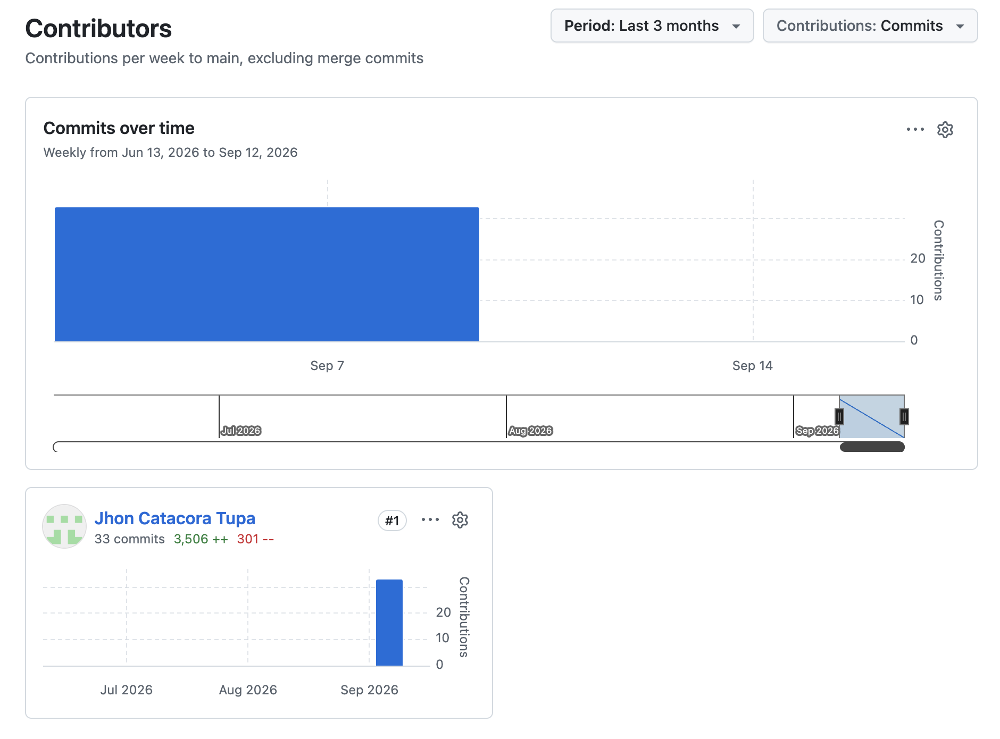

## 5.3. Validation Interviews.
### 5.3.1. Diseño de Entrevistas.
### 5.3.2. Registro de Entrevistas.
### 5.3.3. Evaluaciones según heurísticas.
## 5.4. Video About-the-Product.
# Conclusiones

## Conclusiones

1. EdgeWatch responde a una problemática real del sector industrial: la falta de trazabilidad, monitoreo y análisis oportuno de los procesos de recubrimiento HVOF.

2. La investigación realizada permitió identificar que la información del proceso se encuentra dispersa entre registros manuales, archivos locales y diferentes sistemas, lo que dificulta el seguimiento de las órdenes de trabajo y la generación de evidencias de calidad.

3. El análisis de usuarios permitió reconocer las necesidades principales de los Ingenieros de Calidad, Supervisores de Mantenimiento y Operadores. Mientras unos requieren respaldar la calidad del servicio, otros necesitan detectar desviaciones y diagnosticar fallas con mayor rapidez.

4. La aplicación de Lean UX, entrevistas, User Personas, Journey Mapping, Event Storming e Impact Mapping permitió transformar las necesidades identificadas en requerimientos y funcionalidades concretas para la solución.

5. La propuesta integra funcionalidades importantes como la ingesta de telemetría, el monitoreo de parámetros, las alertas en tiempo real, el diagnóstico asistido, la generación de certificados y el seguimiento del desempeño de los componentes frente al PCR.

6. Los diagramas de arquitectura, clases y base de datos contribuyeron a representar de manera ordenada la estructura y el funcionamiento esperado del sistema, sirviendo como base para una futura implementación.

7. El uso de GitHub, ramas, commits y pull requests facilitó la organización del trabajo colaborativo, la integración de los aportes individuales y el control de versiones del informe.

8. EdgeWatch tiene el potencial de reducir los tiempos de diagnóstico, mejorar la toma de decisiones y fortalecer la relación entre los proveedores de recubrimiento y sus clientes mediante información confiable y consultable.

9. Para validar completamente la propuesta, será necesario implementar un prototipo funcional y realizar pruebas con datos reales y usuarios del sector industrial.

10. En conclusión, el proyecto establece una base sólida para una plataforma especializada en la trazabilidad y monitoreo de procesos HVOF, alineando las necesidades del negocio, los usuarios y la solución tecnológica propuesta.

## Conclusiones y recomendaciones.
## Video About-the-Team.

# Bibliografía
- AMS. (2025, 21 de marzo). *Planned Component Replacements (PCR) by AMS*. https://amseam.com/pcr/

- Automation World. (2025). *How to solve the hidden risks of paper manufacturing on the factory floor*. https://www.automationworld.com/control/article/55378030/how-to-solve-the-hidden-risks-of-paper-manufacturing-on-the-factory-floor

- Bourgau, P. (2022, March 29). *Step by Step Guide to run your Big Picture Event Storming*. Event Storming Journal. https://www.eventstormingjournal.com/big%20picture/step-by-step-guide-to-run-your-big-picture-event-storming/

- Caterpillar. (2017). *The benefits of following a robust demand planning process for parts* [Documento corporativo]. https://s7d2.scene7.com/is/content/Caterpillar/CM20171106-41515-36760

- CooperAcción. (2025). *Minería en cifras: Concesiones y titulares mineros en el Perú*. CooperAcción. https://cooperaccion.org.pe/

- Dmroeder. (s.f.). *pylogix: Read/write data from Allen Bradley Compact/Control Logix PLCs* [Repositorio de software]. GitHub. https://github.com/dmroeder/pylogix

- Energiminas. (2025). *Aporte y proyección de los proveedores mineros al PBI nacional hacia 2030*. Revista Energiminas. https://energiminas.com/

- Evans, E. (2003). *Domain-driven design: Tackling complexity in the heart of software*. Addison-Wesley.

- Fowler, M. (2006). *Ubiquitous language*. https://martinfowler.com/bliki/UbiquitousLanguage.html

- Gordon England. (s.f.). *Glossary of thermal spray and surface engineering terms*. https://www.gordonengland.co.uk/glossary.htm

- Innovapptive. (2024, 26 de febrero). *Overcoming equipment maintenance challenges in mining industry*. https://www.innovapptive.com/blog/overcoming-equipment-maintenance-challenges-in-mining-industry

- International Society of Automation. (2016). *ANSI/ISA-18.2-2016: Management of alarm systems for the process industries*. ISA.

- Khan, M. N., Shah, S., & Shamim, T. (2019). *Investigation of operating parameters on high-velocity oxyfuel thermal spray coating quality for aerospace applications*. The International Journal of Advanced Manufacturing Technology, 103, 2677–2690. https://doi.org/10.1007/s00170-019-03696-0

- Malamousi, K., Delibasis, K., & Kamnis, S. (2024). *Real-time thermal spray process monitoring using convolution neural network deep learning architectures*. Journal of Thermal Spray Technology, 33(1), 17–32. https://doi.org/10.1007/s11666-024-01713-7

- Mauer, G. (2022). *Process diagnostics and control in thermal spray*. Journal of Thermal Spray Technology, 31(4), 818–828.

- Ministerio de Energía y Minas. (2026). *Boletín Estadístico Minero: Balance anual 2025*. [Citado en Revista Tecnología Minera]. https://tecnologiaminera.com/noticia/minem-peru-alcanza-us-62848-millones-en-exportaciones-en-2025-1774388279

- ODVA. (2015). *The Common Industrial Protocol (CIP) and the family of CIP networks* (PUB00123R1). https://www.odva.org/wp-content/uploads/2020/06/PUB00123R1_Common-Industrial_Protocol_and_Family_of_CIP_Networks.pdf

- ODVA. (2020). *EtherNet/IP quick start for vendors handbook* (PUB00213R0). https://www.odva.org/wp-content/uploads/2020/05/PUB00213R0_EtherNetIP_Developers_Guide.pdf

- Oerlikon Metco. (2025). *Thermal spray process parameters*. https://www.oerlikon.com/metco/en/solutions-technologies/what-is-thermal-spray/thermal-spray-process-parameters/

- Rockwell Automation. (2019). *Logix 5000 controllers data access: Programming manual* (Publicación 1756-PM020F-EN-P). https://literature.rockwellautomation.com/idc/groups/literature/documents/pm/1756-pm020_-en-p.pdf

- Rockwell Automation. (2025). *Logix 5000 controllers design considerations: Reference manual* (Publicación 1756-RM094N-EN-P). https://literature.rockwellautomation.com/idc/groups/literature/documents/rm/1756-rm094_-en-p.pdf

- Siemens. (2022). *The true cost of downtime 2022*. https://assets.new.siemens.com/siemens/assets/api/uuid:3d606495-dbe0-43e4-80b1-d04e27ada920/dics-b10153-00-7600truecostofdowntime2022-144.pdf

- Springer Nature. (2025). *Outlook of Industry 4.0 integrated technologies in thermal spray processes and applications*. Journal of Thermal Spray Technology. https://doi.org/10.1007/s11666-025-02096-z

- Yokogawa. (s.f.). *Implementing alarm management per the ANSI/ISA-18.2 standard*. https://www.yokogawa.com/us/library/resources/media-publications/implementing-alarm-management-per-the-ansi-isa-182-standard-control-engineering/

# Anexos
